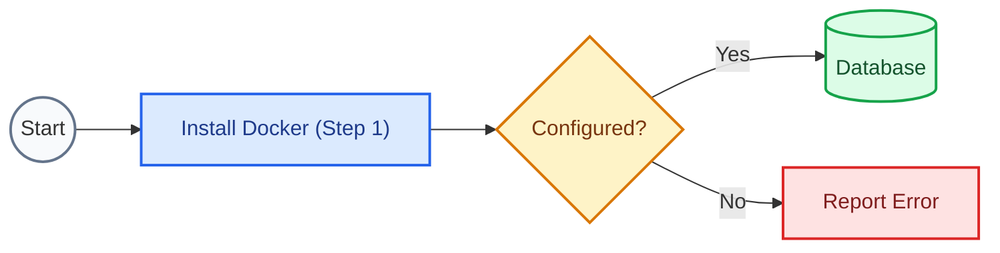
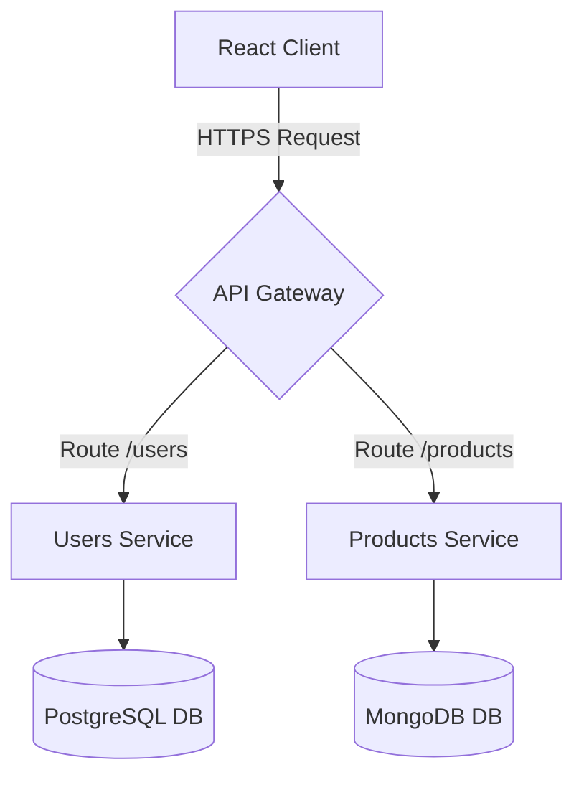
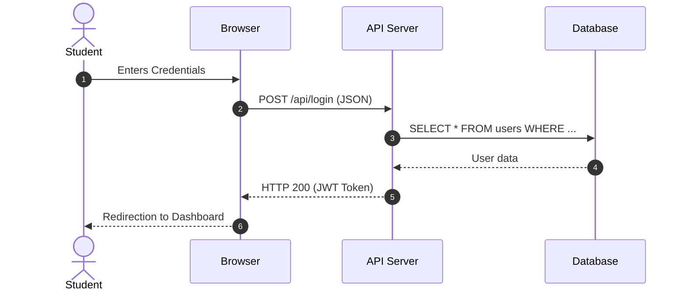
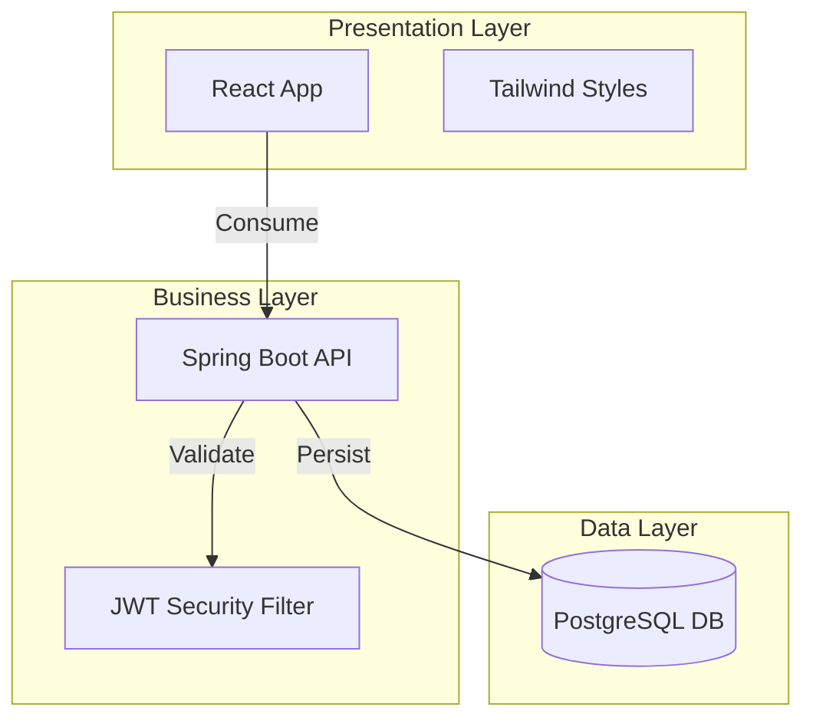

# Guide for Mermaid and SVG Diagram Generation in Docusaurus

This skill provides structured guidelines and templates to generate logical, architectural, and flow diagrams using Mermaid in a Docusaurus-compatible and visually premium way.

---

## 1. General Syntax Rules and Error Avoidance

To prevent compilation failures in the Mermaid renderer:
1. **Avoid Special Characters Without Quotes**: If a node's text contains parentheses, brackets, quotes, or punctuation marks, it **must** be enclosed in double quotes:
   * ❌ *Incorrect:* `A[Step 1 (Initial)]`
   *   *Correct:* `A["Step 1 (Initial)"]`
2. **Unique Node Definition**: Declare the node type (shape) the first time it appears, and use only the node ID in subsequent steps:
   *   *Correct:*
     ```mermaid
     graph LR
         A[My Node] --> B(Other Node)
         A --> B
     ```
3. **Direction**:
   * Use `graph TD` (Top-Down) for hierarchy diagrams, decision trees, and vertical flows.
   * Use `graph LR` (Left-to-Right) for timelines, request-response lifecycles, and CI/CD pipelines.

---

## 2. Color Palette and Visual Styles (Alignment with Icesi)

Use the following styles to style your nodes. You can declare them at the end of the diagram using `style` for individual nodes or `classDef` for groups:

| Style / Purpose | Background Color (Fill) | Border Color (Stroke) | Text Color |
| :--- | :--- | :--- | :--- |
| **Start / End / Base States** | `#f8fafc` (Slate 50) | `#64748b` (Slate 500) | `#0f172a` |
| **Information / Processes** | `#dbeafe` (Blue 100) | `#2563eb` (Blue 600) | `#1e3a8a` |
| **Successful Actions / Databases** | `#dcfce7` (Green 100) | `#16a34a` (Green 600) | `#14532d` |
| **Precautions / Warnings** | `#fef3c7` (Amber 100) | `#d97706` (Amber 600) | `#78350f` |
| **Errors / Critical Actions** | `#fee2e2` (Red 100) | `#dc2626` (Red 600) | `#7f1d1d` |

#### Example of Integrated Style Declaration:


---

## 3. Common Diagram Types

### A. Flowchart
Ideal for explaining conditionals, decision-making, and logical flows in code or deployment.


### B. Sequence Diagram
Useful for detailing the order of calls and message exchanges between systems (e.g., OAuth2 authentication or MVC flow).


### C. Block Architecture Diagram (Subgraphs)
For grouping containers, microservices, or organizing layers (Frontend, Backend, Data).

