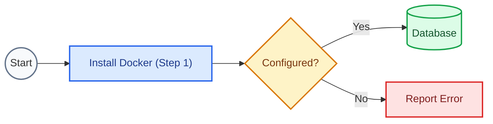
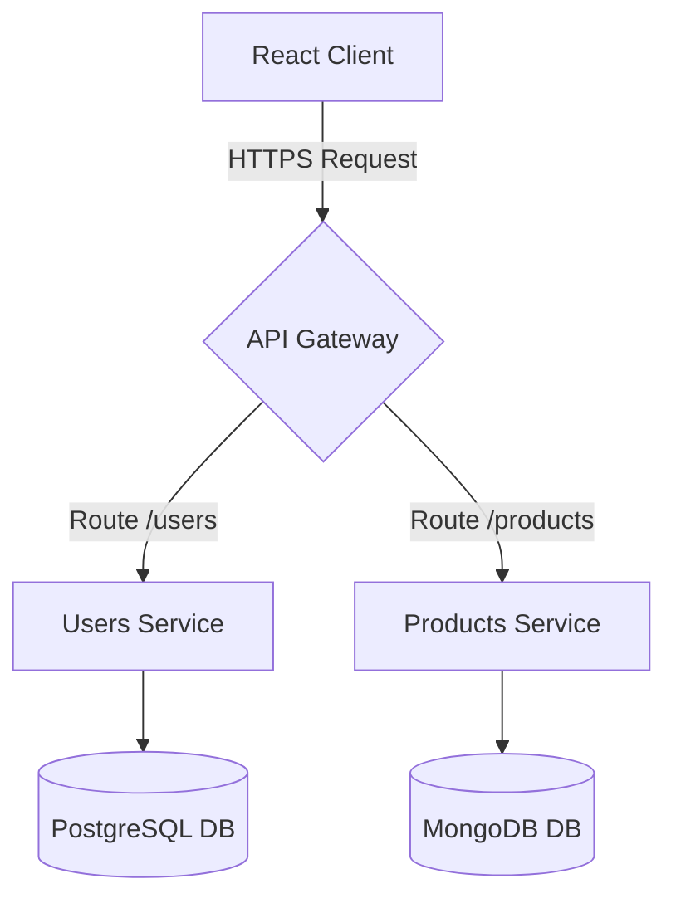
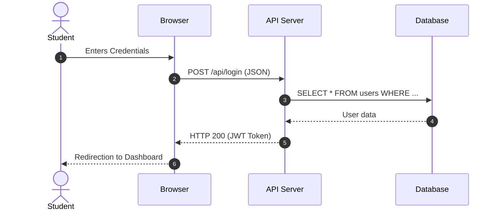
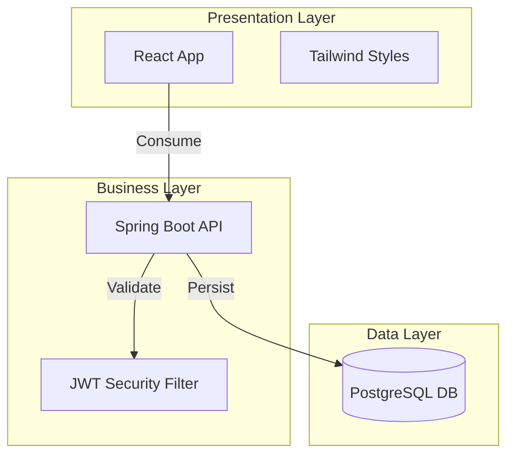

# Spec: Update Plan for DocuKelo Project

This spec outlines the tasks required to update the DocuKelo documentation project. A subsequent model run will execute these changes.

---

## Task 1: Reorganization of Static Assets (`static/img` and `static/files`)

### Goal
Reorganize all course-specific images and downloadable files under a folder structure that mirrors the `docs/` structure. Global theme files (like `favicon.ico`, `logo.svg`, Docusaurus default images, and undraw SVGs) should remain at the root of `static/img/`.

### Directory Mapping
For each course folder in `docs/`:
- `computacion-2`
- `computacion-3`
- `desarrollo-entornos-digitales-web`
- `disenando-con-algoritmos`
- `flutter`
- `testing`

We will create corresponding subdirectories in:
- `static/img/<course>/`
- `static/files/<course>/`

### Migration Rules
1. Scan all markdown/MDX files under `docs/` to find references to static files (under `/img/` and `/files/`).
2. Move each file/image from the root directory into the respective course directory.
3. If a file/image is referenced in multiple courses, copy it to each course's directory.
4. If a file/image is not referenced anywhere, move it to a default directory matching its name or context (e.g., files with `Compu2` to `computacion-2`).
5. Keep global/theme files in the root of `static/img/` (e.g., `favicon.ico`, `logo.svg`, `docusaurus.png`, `docusaurus-social-card.jpg`, `undraw_*.svg`).
6. Update all markdown references in `docs/` files to match the new paths.

### Migration Script (Python)
Save this script as `agents/migrate_static.py` and run it to perform the migration automatically:

```python
import os
import re
import shutil

# Root directory (parent of agents/)
ROOT_DIR = os.path.dirname(os.path.dirname(os.path.abspath(__file__)))

COURSES = [
    "computacion-2",
    "computacion-3",
    "desarrollo-entornos-digitales-web",
    "disenando-con-algoritmos",
    "flutter",
    "testing"
]

def migrate():
    # 1. Create target directories
    for course in COURSES:
        os.makedirs(os.path.join(ROOT_DIR, "static", "img", course), exist_ok=True)
        os.makedirs(os.path.join(ROOT_DIR, "static", "files", course), exist_ok=True)
    
    global_assets = {
        "favicon.ico",
        "logo.svg",
        "docusaurus.png",
        "docusaurus-social-card.jpg",
        "undraw_docusaurus_mountain.svg",
        "undraw_docusaurus_react.svg",
        "undraw_docusaurus_tree.svg"
    }

    docs_dir = os.path.join(ROOT_DIR, "docs")
    img_refs = {}
    file_refs = {}

    img_pattern = re.compile(r'/img/([^"\)\s>]+)')
    file_pattern = re.compile(r'/files/([^"\)\s>]+)')

    # Scan for references
    for root, dirs, files in os.walk(docs_dir):
        relative_path = os.path.relpath(root, docs_dir)
        if relative_path == ".":
            continue
        course_name = relative_path.split(os.sep)[0]
        if course_name not in COURSES:
            continue

        for file in files:
            if file.endswith((".md", ".mdx")):
                file_path = os.path.join(root, file)
                with open(file_path, "r", encoding="utf-8") as f:
                    content = f.read()
                
                for img in img_pattern.findall(content):
                    img_refs.setdefault(img, set()).add(course_name)
                
                for f_ref in file_pattern.findall(content):
                    file_refs.setdefault(f_ref, set()).add(course_name)

    # Move images
    static_img_dir = os.path.join(ROOT_DIR, "static", "img")
    for img_file in os.listdir(static_img_dir):
        if img_file in global_assets:
            continue
        src_path = os.path.join(static_img_dir, img_file)
        if os.path.isdir(src_path):
            continue

        courses_referencing = img_refs.get(img_file, set())
        if not courses_referencing:
            courses_referencing = {"computacion-2"} # default fallback

        for course in courses_referencing:
            dest_path = os.path.join(static_img_dir, course, img_file)
            shutil.copy2(src_path, dest_path)
            print(f"Copied image {img_file} -> static/img/{course}/")
        os.remove(src_path)

    # Move files
    static_files_dir = os.path.join(ROOT_DIR, "static", "files")
    for file_item in os.listdir(static_files_dir):
        src_path = os.path.join(static_files_dir, file_item)
        if os.path.isdir(src_path):
            continue

        courses_referencing = file_refs.get(file_item, set())
        if not courses_referencing:
            if "Compu2" in file_item:
                courses_referencing = {"computacion-2"}
            else:
                courses_referencing = {"computacion-2"}

        for course in courses_referencing:
            dest_path = os.path.join(static_files_dir, course, file_item)
            shutil.copy2(src_path, dest_path)
            print(f"Copied file {file_item} -> static/files/{course}/")
        os.remove(src_path)

    # Update references in docs
    for root, dirs, files in os.walk(docs_dir):
        relative_path = os.path.relpath(root, docs_dir)
        if relative_path == ".":
            continue
        course_name = relative_path.split(os.sep)[0]
        if course_name not in COURSES:
            continue

        for file in files:
            if file.endswith((".md", ".mdx")):
                file_path = os.path.join(root, file)
                with open(file_path, "r", encoding="utf-8") as f:
                    content = f.read()

                def replace_img(match):
                    full_match = match.group(0)
                    img_name = match.group(1)
                    if img_name in global_assets:
                        return full_match
                    dest_file_path = os.path.join(static_img_dir, course_name, img_name)
                    if os.path.exists(dest_file_path):
                        return f"/img/{course_name}/{img_name}"
                    return full_match

                updated_content = img_pattern.sub(replace_img, content)

                def replace_file(match):
                    full_match = match.group(0)
                    file_name = match.group(1)
                    dest_file_path = os.path.join(static_files_dir, course_name, file_name)
                    if os.path.exists(dest_file_path):
                        return f"/files/{course_name}/{file_name}"
                    return full_match

                updated_content = file_pattern.sub(replace_file, updated_content)

                if updated_content != content:
                    with open(file_path, "w", encoding="utf-8") as f:
                        f.write(updated_content)
                    print(f"Updated references in {file_path}")

if __name__ == "__main__":
    migrate()
```

---

## Task 2: Translation of Skills and Memory into English

All existing agent guidelines and skill instruction files must be translated to English and overwrite the original files.

### 1. File: `agents/memory/docusaurus-guidelines.md`
Overwrite with the following English translation:

```markdown
# Rules and Guidelines for Documentation Generation (DocuKelo)

This file serves as a memory and development guide for any AI Agent or editor generating new content in this Docusaurus repository.

---

## 1. Course Folder Structure
Documentation is organized by thematic folders corresponding to the courses:
- `docs/computacion-3/semana-X/`: Weekly step-by-step guides on architecture, docker, and backend.
- `docs/disenando-con-algoritmos/semana-X/`: UI/UX design and layout guides with Tailwind CSS.

Each weekly folder must contain a `_category_.json` file with the following basic format:
```json
{
  "label": "Week X: Topic Name",
  "position": X,
  "link": {
    "type": "generated-index",
    "description": "General description of the topics and labs for this week."
  }
}
```

---

## 2. Globally Available MDX Components
It is not necessary to import these components in `.mdx` files as they are mapped in `src/theme/MDXComponents.js`.

### Timeline for Step-by-Step Guides
Ideal for labs and step-by-step guides:
```mdx
<StepByStep>
  <Step number="1" title="First Step">
    Detailed instructions for step 1.
  </Step>
  <Step number="2" title="Second Step">
    Detailed instructions for step 2.
  </Step>
</StepByStep>
```

### Resource Card Grids
Useful for showing shortcuts, syllabus, or web references:
```mdx
<CardGrid cols={2}>
  <Card 
    title="Title" 
    description="Brief description of the resource" 
    link="https://example.com" 
  />
</CardGrid>
```

### Simulated Browser Container (Browser)
To show screenshots or interactive interfaces:
```mdx
<BrowserWindow url="http://localhost:3000">
  <h3>Content inside the simulated window</h3>
</BrowserWindow>
```

Or using the embedded iframe:
```mdx
<IframeWindow url="https://react.dev" />
```

### Native Tabs (Tabs & TabItem)
To show configurations by operating system or language:
```mdx
<Tabs>
  <TabItem value="win" label="Windows" default>
    Commands for Windows.
  </TabItem>
  <TabItem value="mac" label="macOS">
    Commands for macOS.
  </TabItem>
</Tabs>
```

---

## 3. Diagram Style Guide (Mermaid)
Natively configured with support for light and dark themes.
* Use `graph TD` or `graph LR`.
* Use built-in styles to highlight critical states or flows:
  `style NodeID fill:#dbeafe,stroke:#2563eb,stroke-width:2px` (Blue/Info)
  `style NodeID fill:#dcfce7,stroke:#16a34a,stroke-width:2px` (Green/Success)
  `style NodeID fill:#fef3c7,stroke:#d97706,stroke-width:2px` (Yellow/Warning)

---

## 4. Code Block Style and Admonitions
* Always specify the filename in the header with `title="name.ext"`.
* Use line highlighting: `{1, 5-8}`.
* Show line numbers if the file is long with `showLineNumbers`.
* Use admonitions to warn students:
  `:::tip` (Useful tip)
  `:::info` (Relevant information)
  `:::warning` (Warning)
  `:::danger` (Common error alert)

---

## 5. Prohibition of Icons and Emojis in the UI
* **Strict Rule**: Emojis or other graphic special characters are not allowed in the application interface, such as homepage cards, buttons, main headers of guides, or component titles.
* The interface must maintain a clean, professional aesthetic based solely on typography and Infima CSS. However, standard typographic characters like text arrows (`&rarr;` or `→`) can be used when necessary.
```

### 2. File: `agents/skills/documentation_auditor/SKILL.md`
Overwrite with the following English translation:

```markdown
---
name: documentation-auditor
description: Auditor and improver for academic documentation, evaluating clarity, step-by-step guidance, visual diagram inclusion, code metadata compliance, and structural consistency.
---

# Documentation Auditing and Improvement Proposal Skill (DocuKelo)

This skill enables the agent to critically analyze existing documentation files in this project, detect pedagogical deficiencies, and propose structured improvement plans before editing the content.

---

## 1. Quality Evaluation Criteria (What to Analyze)

When inspecting a course document, the agent must evaluate the following aspects:

### A. Clarity and Pedagogical Structure
* Does the main topic have an initial conceptual explanation that justifies its use?
* Are there loose code snippets without indicating the target path?
* Are difficult concepts explained with analogies or practical breakdowns instead of excessive jargon?
* **Mandatory Diagram Explanation**: Whenever a diagram (Mermaid, SVG, or image) is included, the purpose and technical explanation of each key component illustrated must be detailed immediately below (e.g., in security, define the function of filters, the manager, and the context). Simply rendering the graphic is not enough.
* **Two-Layer Structure**: Documents must be clearly separated into two major blocks:
  1. **Concepts and Theoretical Foundations**: Dedicated to explaining architecture, data flows, and theoretical components supported by diagrams.
  2. **Practical Guide (Step-by-Step)**: Dedicated to the lab or sequential development of the code using MDX components.

### B. Visual Elements and Diagramming (Mermaid)
* Does the topic involve complex data flows, middleware, security, client-server interactions, or database architectures?
* **Rule**: If the answer is yes, the document **must** include at least one Mermaid diagram (sequence or flow) at the beginning of the topic to illustrate the background behavior.
* **Dark Mode Visibility (Contrast)**: Ensure that all Mermaid diagrams and SVG graphics display clearly in both the light and dark themes of Docusaurus.
  * In `docusaurus.config.js`, the `mermaid.theme.dark` property must be set to `'dark'` to automatically render light lines and text in dark mode.
  * When using custom styles (`style` or `classDef` in Mermaid), avoid direct black or dark blue text or lines without a light background container, as they will get lost against the dark background of the site.

### C. Practical Guide Structure (MDX)
* Are tutorials organized with flat numbered lists?
* **Rule**: Replace numbered lab lists with the global `<StepByStep>` and `<Step>` components.
* Do code blocks display the filename in the header?
* **Rule**: Every code snippet must include `title="path/name.ext"` and `showLineNumbers` (if it has more than 10 lines).
* **Rich Comments in Code**: Code snippets must be heavily and detailedly commented line by line (or on most significant lines) to guide the student on what each parameter, annotation, or instruction does. Do not omit or simplify the explanatory comments included.

### D. Theme Consistency and Icon Prohibition
* Does the document contain emojis or icons in titles, buttons, or cards?
* **Rule**: Remove them. Only clean typography, colors from the Icesi palette, and native admonitions (`:::info`, `:::tip`, etc.) are allowed.

---

## 2. Auditor Agent Workflow

When the user requests to audit or improve a topic:

1. **Reading and Diagnosis**: Read the entire file. Create a list of detected deficiencies based on the criteria above.
2. **Plan Proposal**: Before rewriting the file, propose the diagrams and changes to be made to the user (e.g., Mermaid structure, components to be used).
3. **Application**: Apply the modifications to the `.md` or `.mdx` file using the globally registered components in `src/theme/MDXComponents.js`.
4. **Build Validation**: Run `npm run build` to ensure that the MDX restructuring and Mermaid diagrams have no compilation errors or broken links.
```

### 3. File: `agents/skills/docusaurus_content_researcher/SKILL.md`
Overwrite with the following English translation:

```markdown
---
name: docusaurus-content-researcher
description: Research and write course documentation in DocuKelo, identifying teaching styles (procedural step-by-step vs. conceptual design UI/UX), collecting web information, and preserving the student-centric tone.
---

# Academic Content Research and Generation Skill (DocuKelo)

This skill enables the agent to research the existing structure of subjects at Universidad Icesi, collect updated technical information from the web, and generate content consistent with the teacher's preferred teaching style and the course's current pedagogical tone.

---

## 1. Tone, Voice, and Writing Style Guide (DocuKelo Tone Guide)

When drafting any guide or documentation in this project, the agent **must** rigorously match the pedagogical tone of current documents. Based on the analysis of files in `docs/`, here are the characteristics of the tone:

* **Didactic, Empathetic, and Student-Centric**: The writing must not be cold or merely academic. It should be conversational, understanding, and oriented towards facilitating progressive learning (e.g., *"Before diving into containers, it is helpful to first understand..."* or *"To keep the example simple..."*).
* **Technical Hybrid (Professional Spanglish)**: Use common industry technical terms in their original English (such as *host*, *guest*, *multi-stage build*, *hotfix*, *pull request*, *mock*, *middleware*) but integrated naturally within fluid Spanish explanations. Do not try to translate terms that in the real world are used in English.
* **Pragmatic and Realistic (Real-World Warnings)**: Include warnings, disclaimers, and notes of professional realism. If a tool is complex to configure or not necessary for the scope of a school lab, clarify it explicitly (e.g., *"...although for small-to-medium scale exercises it is not necessary to overcomplicate with these tools"*).
* **Strict Prohibition of Icons and Emojis**: Do not use emojis or other special graphical characters in interfaces, cards, buttons, titles, or body text. The design must remain sober and focused purely on typography and Infima CSS.
* **Readability and Scannability**:
  - Avoid long blocks of uninterrupted text. Break them into paragraphs of 3 to 4 lines.
  - Use lists with bold titles for key concept explanations (e.g., `- **Isolation:** Each container is independent...`).
  - Use **comparative tables** of two or three columns to contrast technologies or approaches (e.g., Git Flow vs Git Trunk).
  - Limit image sizes using the HTML `width` attribute (e.g., ``) to prevent visual overflow in Docusaurus.

---

## 2. Research and Curricular Alignment

The agent **must** perform the following research steps before writing any content:

### Step A: Course History Analysis (Alignment)
1. **Previous Folders Review**: The agent must list and read the guides of previous weeks (e.g., if drafting Week 4, inspect weeks 1, 2, and 3).
2. **Technological Continuity**: Ensure the new content continues with the same stack of technologies and dependencies shown previously, unless the topic explicitly requires introducing a new one.
3. **Name Consistency**: Keep the names of projects, directories, and base configurations consistent with what students already configured in previous weeks.

### Step B: Web Information Gathering (Web Search)
1. **Search in Official Sources**: Use the search engine to retrieve the latest and most accurate information directly from the official documentation of the corresponding technology (e.g., Docker, Spring, React, Tailwind CSS, NestJS, or Next.js docs).
2. **Avoid Deprecated Commands**: Confirm that recommended console commands are for modern and stable versions (e.g., prefer `docker compose` over the old and deprecated `docker-compose`).
3. **Content Synthesis**: Do not copy and paste generic information. Filter the retrieved information from the web to adapt it strictly to the academic level of the students in the course.

---

## 3. Content Styles and Two-Block Structure

All extensive technical documents and guides (especially labs and architecture topics) must be divided into two consecutive sections:

1. **Conceptual Foundations (Theory and Flow)**:
   - Explanation of the architecture of the component or middleware.
   - Mandatory inclusion of diagrams (Mermaid, SVG) if there are data flows or requests.
   - **Mandatory Diagram Explanation**: Immediately below the graph, detail in dedicated paragraphs what each key component of the diagram does (e.g., define the role of filters, managers, and context in security).
2. **Practical Development Guide (Implementation)**:
   - Numbered and interactive steps for the lab or workshop.

Identify which course the request belongs to and apply its preferred style within the practical block:

### A. "Step-by-Step" Style (Procedural) - E.g.: *Computación en Internet 2 / 3*
* **Practical Structure**:
  - `<StepByStep>` component and multiple numbered `<Step>` components to guide the practical lab.
  - Code blocks with the metadata `title="path/to/file.ext"`, `showLineNumbers` enabled, and with rich explanatory comments in most of their key lines.
  - `<Tabs>` / `<TabItem>` components for dependency commands (Maven vs Gradle) or console commands (OS).
  - Admonitions `:::tip` or `:::warning` to warn about common configurations or errors.

### B. "Design and Conceptual" Style (UI/UX) - E.g.: *Diseñando con Algoritmos*
* **Practical Structure**:
  - Explanation of interface, design, or layout principles.
  - `<CardGrid>` with `<Card>` grids to compile links to external articles, UI tools, or base repositories.
  - Visual simulators with the `<BrowserWindow>` or `<IframeWindow>` component to show how an interface should look or interact.
  - Practical examples and structured HTML code snippets using Tailwind CSS utility classes.
  - Reflective questions and dynamic group review activities for the workshop.

---

## 4. Technical Workflow to Generate Content

1. **Research**: Read the directory structure of the corresponding course, its existing guides, and search the web.
2. **Create Category**: If it is a new week, create `_category_.json` specifying the order and description.
3. **Create MDX File**: Write the content in fluent Spanish (es), using the globally registered components in `src/theme/MDXComponents.js`.
4. **Verify Compilation**: Run `npm run build` locally to ensure there are no JSX syntax errors or broken links before delivering the result to the user.
```

### 4. File: `agents/skills/docusaurus_mermaid_svg/SKILL.md`
Overwrite with the following English translation:

```markdown
---
name: docusaurus-mermaid-svg
description: Guidelines and rules to generate stunning, brand-compliant, clear flowcharts, sequence diagrams, and block SVGs in Docusaurus using Mermaid.
---

# Guide for Mermaid and SVG Diagram Generation in Docusaurus

This skill provides structured guidelines and templates to generate logical, architectural, and flow diagrams using Mermaid in a Docusaurus-compatible and visually premium way.

---

## 1. General Syntax Rules and Error Avoidance

To prevent compilation failures in the Mermaid renderer:
1. **Avoid Special Characters Without Quotes**: If a node's text contains parentheses, brackets, quotes, or punctuation marks, it **must** be enclosed in double quotes:
   * ❌ *Incorrect:* `A[Step 1 (Initial)]`
   *   *Correct:* `A["Step 1 (Initial)"]`
2. **Unique Node Definition**: Declare the node type (shape) the first time it appears, and use only the node ID in subsequent steps:
   *   *Correct:*
     ```mermaid
     graph LR
         A[My Node] --> B(Other Node)
         A --> B
     ```
3. **Direction**:
   * Use `graph TD` (Top-Down) for hierarchy diagrams, decision trees, and vertical flows.
   * Use `graph LR` (Left-to-Right) for timelines, request-response lifecycles, and CI/CD pipelines.

---

## 2. Color Palette and Visual Styles (Alignment with Icesi)

Use the following styles to style your nodes. You can declare them at the end of the diagram using `style` for individual nodes or `classDef` for groups:

| Style / Purpose | Background Color (Fill) | Border Color (Stroke) | Text Color |
| :--- | :--- | :--- | :--- |
| **Start / End / Base States** | `#f8fafc` (Slate 50) | `#64748b` (Slate 500) | `#0f172a` |
| **Information / Processes** | `#dbeafe` (Blue 100) | `#2563eb` (Blue 600) | `#1e3a8a` |
| **Successful Actions / Databases** | `#dcfce7` (Green 100) | `#16a34a` (Green 600) | `#14532d` |
| **Precautions / Warnings** | `#fef3c7` (Amber 100) | `#d97706` (Amber 600) | `#78350f` |
| **Errors / Critical Actions** | `#fee2e2` (Red 100) | `#dc2626` (Red 600) | `#7f1d1d` |

#### Example of Integrated Style Declaration:


---

## 3. Common Diagram Types

### A. Flowchart
Ideal for explaining conditionals, decision-making, and logical flows in code or deployment.


### B. Sequence Diagram
Useful for detailing the order of calls and message exchanges between systems (e.g., OAuth2 authentication or MVC flow).


### C. Block Architecture Diagram (Subgraphs)
For grouping containers, microservices, or organizing layers (Frontend, Backend, Data).

```

---

## Task 3: Entrypoint Index File `agents/AGENTS.md`

### Goal
Create `agents/AGENTS.md` in English as an index pointing to all memory and skill files.

### File Content:
```markdown
# Agent System Entrypoint

Welcome to the DocuKelo Agent System repository configuration. This directory contains instructions, custom skills, and shared memory configurations that define and guide the behavior of AI coding agents collaborating on this project.

## Directory Index

* **Memory**
  * [Docusaurus Guidelines](file:///C:/Users/GlobE/Desktop/Docencia Icesi/docukelo-icesi/agents/memory/docusaurus-guidelines.md): General rules, code formatting guidelines, available MDX components, and UX constraints.
* **Skills**
  * [Documentation Auditor](file:///C:/Users/GlobE/Desktop/Docencia Icesi/docukelo-icesi/agents/skills/documentation_auditor/SKILL.md): Guides agents on how to review and identify improvements in educational content.
  * [Docusaurus Content Researcher](file:///C:/Users/GlobE/Desktop/Docencia Icesi/docukelo-icesi/agents/skills/docusaurus_content_researcher/SKILL.md): Guides agents on tone, pedagogical structure, and curricular alignment.
  * [Docusaurus Mermaid SVG](file:///C:/Users/GlobE/Desktop/Docencia Icesi/docukelo-icesi/agents/skills/docusaurus_mermaid_svg/SKILL.md): Visual design rules and Mermaid templates for flowcharts, sequence diagrams, and block diagrams.
```

---

## Verification Plan

### Automated Build Check
To verify everything is working and there are no broken links, run:
```bash
npm run build
```

### Manual Verification
1. Verify that `static/img` and `static/files` have the correct subdirectory structures and that original root files (except global/theme files) have been successfully deleted.
2. Open several markdown files in `docs/computacion-2/`, `docs/computacion-3/`, etc. and confirm that images/files render correctly and use the new course-specific paths (e.g. `/img/computacion-2/servlet.png`).
3. Verify that all 4 files under `agents/memory` and `agents/skills` are fully translated to English.
4. Verify that `agents/AGENTS.md` exists and contains correct clickable links to all guidelines and skills.
