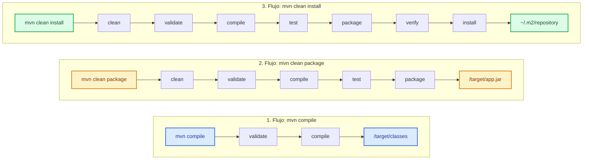

# Apache Maven: Gestión y Ciclo de Vida

**Apache Maven** es una herramienta fundamental en el ecosistema Java utilizada para la gestión, automatización de construcción (*build automation*) y administración de dependencias de proyectos de software. 

A diferencia de compilar manualmente con el comando `javac` o gestionar manualmente archivos JAR, Maven introduce un modelo de objeto de proyecto (**POM**, definido en el archivo `pom.xml`) que estandariza la estructura del proyecto y automatiza las fases de compilación, pruebas y empaquetado.

---

## 1. Instalación de Apache Maven

Para utilizar Maven en tu entorno local, asegúrate de contar primero con una instalación activa del **Java Development Kit (JDK)**.

<Tabs>
  <TabItem value="win" label="Windows (Scoop / Choco / Manual)" default>

### Opción A: Mediante gestores de paquetes (Recomendado)
Si utilizas **Scoop** o **Chocolatey** en PowerShell:
```powershell
# Usando Scoop
scoop install maven

# Usando Chocolatey
choco install maven
```

### Opción B: Instalación Manual
1. Descarga el archivo ZIP binario desde la página oficial de [Apache Maven](https://maven.apache.org/download.cgi).
2. Extrae el contenido en una ruta de tu sistema (por ejemplo, `C:\Program Files\apache-maven-3.9.x`).
3. Agrega la variable de entorno de sistema `MAVEN_HOME` o `M2_HOME` apuntando a dicho directorio.
4. Añade la ruta `C:\Program Files\apache-maven-3.9.x\bin` a la variable de entorno `PATH`.
5. Verifica la instalación en una nueva terminal ejecutando:
   ```cmd
   mvn -version
   ```

  </TabItem>
  <TabItem value="mac" label="macOS (Homebrew)">

### Instalación con Homebrew
En macOS, la forma más sencilla es usar **Homebrew**:
```bash
brew install maven
```

Verifica la instalación ejecutando:
```bash
mvn -version
```

  </TabItem>
  <TabItem value="linux" label="Linux (APT / DNF)">

### Instalación en Debian/Ubuntu
```bash
sudo apt update
sudo apt install maven -y
```

### Instalación en Fedora/RHEL
```bash
sudo dnf install maven -y
```

Verifica la instalación ejecutando:
```bash
mvn -version
```

  </TabItem>
</Tabs>

---

## 2. El Ciclo de Vida de Maven (Maven Lifecycle)

El ciclo de vida por defecto de Maven (*default lifecycle*) ejecuta una serie de fases secuenciales estrictas. Cuando ejecutas un comando indicando una fase determinada, Maven ejecutará automáticamente todas las fases previas en orden:

$$ \text{validate} \rightarrow \mathbf{compile} \rightarrow \text{test} \rightarrow \mathbf{package} \rightarrow \text{verify} \rightarrow \mathbf{install} \rightarrow \text{deploy} $$

### Fases Principales Explicadas:

* **`validate`**: Verifica que el proyecto esté correcto y que toda la información necesaria esté disponible (por ejemplo, que el `pom.xml` sea válido).
* **`compile`**: Compila el código fuente del proyecto (archivos `.java`) y los convierte en bytecode (`.class`). Se ubican en el directorio `target/classes`.
* **`test`**: Ejecuta las pruebas unitarias (usando frameworks como JUnit o TestNG) sobre el código compilado.
* **`package`**: Toma el código compilado y lo empaqueta en su formato de distribución (como un archivo `.jar` o `.war`), ubicándolo en el directorio `target/`.
* **`verify`**: Ejecuta verificaciones adicionales sobre los paquetes para asegurar que se cumplan los criterios de calidad.
* **`install`**: Instala el paquete empaquetado en el repositorio local de Maven (ubicado en `~/.m2/repository`), permitiendo que otros proyectos locales lo usen como dependencia.
* **`deploy`**: Copia el paquete final a un repositorio remoto (como Nexus o JFrog Artifactory) para compartirlo con otros desarrolladores o equipos.

---

## 3. Comparativa: `mvn compile` vs `mvn clean package` vs `mvn clean install`

Es muy común anteponer el comando `clean` (por ejemplo, `mvn clean package`). La fase `clean` pertenece al ciclo de vida de limpieza de Maven y se encarga de eliminar la carpeta `target/` con las compilaciones anteriores para asegurar un build limpio desde cero.

### Diagrama de Secuencia y Diferencias (Mermaid SVG)



### Tabla Comparativa Directa

| Command | What it executes | Main Output Location | Best Use Case |
| :--- | :--- | :--- | :--- |
| **`mvn compile`** | `validate` $\rightarrow$ `compile` | Target directory (`/target/classes`) | Quick syntax check and local testing. |
| **`mvn clean package`** | Deletes old build $\rightarrow$ `validate` $\rightarrow$ `compile` $\rightarrow$ `test` $\rightarrow$ `package` | Target directory (`/target/app.jar`) | Creating a production-ready file for a standalone app. |
| **`mvn clean install`** | Deletes old build $\rightarrow$ executes all phases up to `install` | Local M2 repository (`~/.m2/repository`) | Building multi-module projects where other local apps rely on this code. |

---

## 4. Estructura Estándar de un Proyecto Maven

Maven promueve el principio de *Convención sobre Configuración*. Un proyecto estándar sigue esta estructura de carpetas:

```text
mi-proyecto/
├── pom.xml
└── src/
    ├── main/
    │   ├── java/         # Código fuente de la aplicación (.java)
    │   └── resources/    # Archivos de configuración (application.properties, etc.)
    └── test/
        ├── java/         # Pruebas unitarias (.java)
        └── resources/    # Archivos de prueba
```
