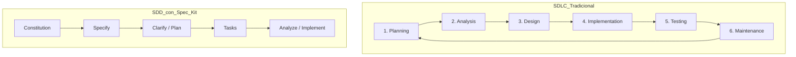

# Spec-driven Development (SDD)

## Introducción

El **Spec-driven Development (SDD)** o **Desarrollo Basado en Especificaciones** es una metodología que sitúa la definición precisa y estructurada de los requisitos en el centro del proceso de construcción de software. A diferencia de enfoques donde la documentación es un subproducto, en SDD la especificación es el motor.

En el contexto actual, donde los **Modelos de Lenguaje de Gran Tamaño (LLMs)** y los agentes de IA están transformando la programación, el SDD cobra una relevancia vital: proporciona el **contexto de verdad** necesario para que la IA genere código coherente, funcional y alineado con los objetivos del negocio, reduciendo alucinaciones y deuda técnica.

## SDD vs SDLC (Software Development Life Cycle)

El ciclo de vida de desarrollo de software tradicional (**SDLC**) suele visualizarse como un proceso circular y continuo. Según el estándar de la industria, se compone de seis etapas críticas:

1. Planning (Planificación)
2. Analysis (Análisis)
3. Design (Diseño)
4. Implementation (Implementación)
5. Testing & Integration (Pruebas e Integración)
6. Maintenance (Mantenimiento)

El SDD propone un refinamiento más agresivo e iterativo en las fases iniciales (1 a 3) antes de proceder a la ejecución, asegurando que la **intención** quede perfectamente documentada.

### Comparativa de flujos



## Los pasos del SDD en GitHub Spec Kit

El **GitHub Spec Kit** estructura este proceso en fases claras para eliminar ambigüedad y maximizar efectividad:

- **Constitution**: define el *por qué* y el *quién*. Establece principios, tono y límites del proyecto.
- **Specify**: crea la especificación técnica detallada; define el *qué* se construirá.
- **Clarify**: fase interactiva (a menudo con LLMs) para resolver dudas y lagunas lógicas.
- **Plan**: desglose arquitectónico de cómo abordar la solución técnica.
- **Tasks**: conversión del plan en unidades de trabajo atómicas y accionables.
- **Analyze**: evaluación crítica de viabilidad y riesgos antes de ejecutar.
- **Implement**: codificación guiada estrictamente por tareas y especificaciones previas.

## Spec-driven Development - Integración con LLMs

El SDD es un enfoque **AI-native**. Al usar archivos Markdown estructurados, permite que los LLMs:

- **Entiendan el contexto global**: gracias a `constitution.md`, la IA conoce restricciones de estilo, arquitectura y valores.
- **Generen código preciso**: con especificaciones claras, herramientas como Copilot o agentes autónomos producen PRs con mínimas correcciones.
- **Validen automáticamente**: en la fase de *clarify*, pueden detectar contradicciones lógicas antes de implementar.

## Instalación de GitHub Spec Kit

### Requisito previo: instalación de `uv`

Antes de instalar Spec Kit, se requiere `uv`.

**¿Qué es `uv`?**  
Es un administrador de paquetes y herramientas de Python, muy rápido (escrito en Rust), para gestionar entornos y dependencias de forma más eficiente que `pip`.

Puedes instalarlo de varias formas:

1. **Script oficial (recomendado)**

```bash
# En macOS y Linux
curl -LsSf https://astral.sh/uv/install.sh | sh

# En Windows (PowerShell)
powershell -c "irm https://astral.sh/uv/install.ps1 | iex"
```

2. **Usando pip** (si ya tienes Python instalado)

```bash
pip install uv
```

### Instalación del kit

Una vez instalado `uv`, instala la versión `0.8.4` de GitHub Spec Kit:

```bash
# Instalación de la herramienta
uv tool install specify-cli --from git+https://github.com/github/spec-kit.git@v0.8.4

# Inicialización de un nuevo proyecto
specify init my-project
```

## Anatomía de un proyecto Spec-driven

Al ejecutar `specify init`, el kit genera una estructura de directorios y archivos que actúa como base de conocimiento del proyecto.

### 1. Archivo maestro: `constitution.md`

Es el documento más importante. Define identidad del proyecto y comportamiento esperado:

- **User Personas**: para quién se construye.
- **Tech Stack**: restricciones tecnológicas claras.
- **Guías de estilo**: convenciones de código e interfaz.
- **Principios de diseño**: valores no negociables (p. ej., seguridad por defecto, rendimiento móvil primero).

### 2. Directorios de fase (`specs/`, `plans/`, `tasks/`)

- **specs/**: contiene especificaciones de funcionalidades.
- **plans/**: estrategia técnica derivada de la spec.
- **tasks/**: tareas verificables y accionables.

Plantillas frecuentes en el kit:

- **User Stories**
- **Technical Constraints**
- **Success Metrics**

### 3. Flujo de trabajo del kit

1. Escribir la **Spec**.
2. Generar el **Plan**.
3. Desglosar en **Tasks** (checklist verificable).

## Importancia de cada paso

| Paso | Objetivo principal | Problema que evita |
|---|---|---|
| Constitution | Alineación total del equipo y la IA | Inconsistencias arquitectónicas y discusiones interminables |
| Specify | Claridad absoluta sobre el alcance | Scope creep y requisitos malentendidos |
| Clarify | Resolución de ambigüedades | Implementar soluciones para problemas inexistentes |
| Plan | Definición de estrategia técnica | Codificar de forma reactiva sin visión sistémica |
| Tasks | Fragmentación del trabajo | Bloqueo por tareas demasiado complejas o ambiguas |
| Implement | Ejecución eficiente y enfocada | Retrabajo por falta de contexto o errores lógicos básicos |

## Referencias

- GitHub Spec Kit Docs: https://github.com/github/spec-kit
- Community Extensions: https://github.com/github/spec-kit#-community-extensions
- Teoría Spec Driven Development: https://scrummanager.com/community/spec-driven-development-qu-es-de-dnde-viene-y-por-qu-importa