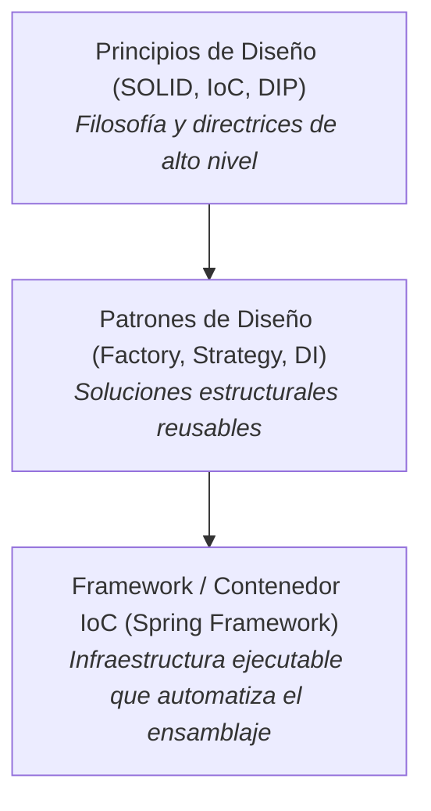
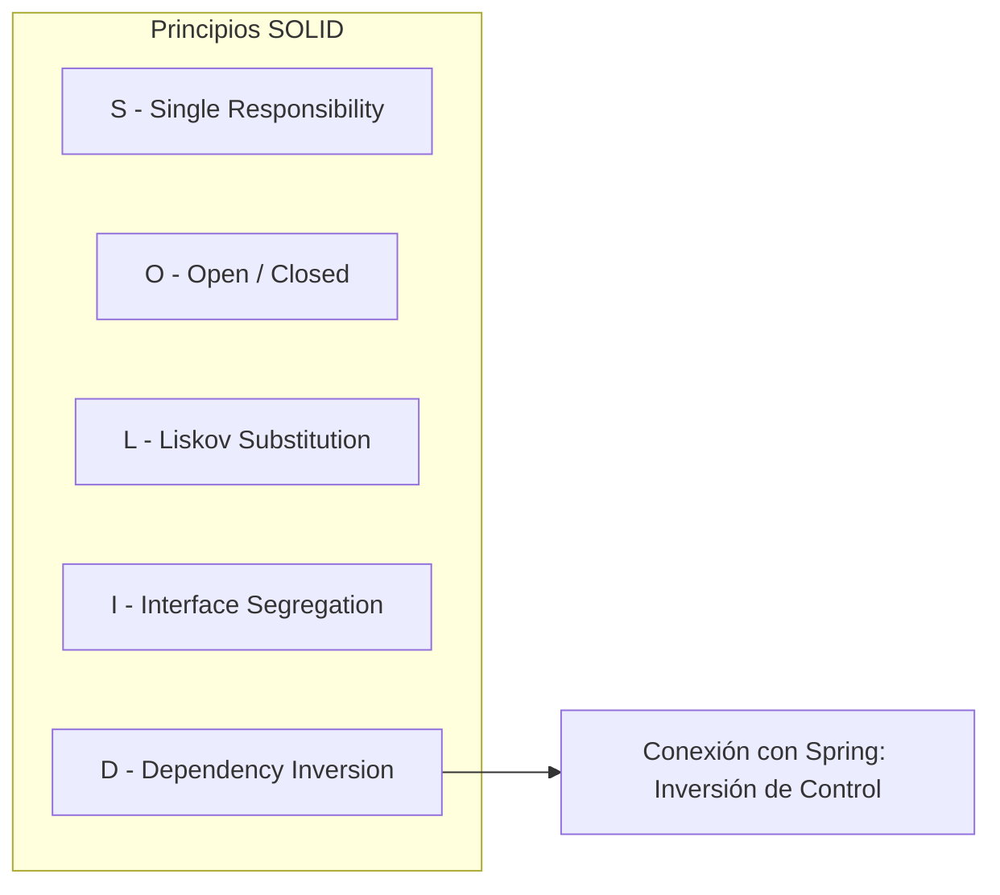
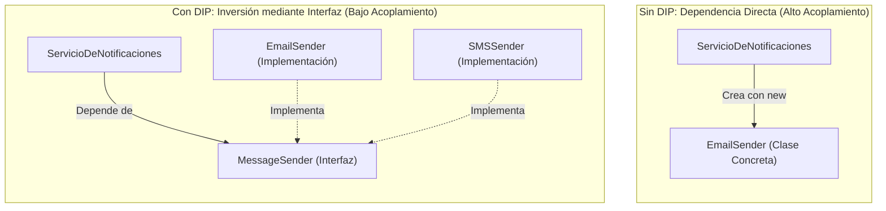
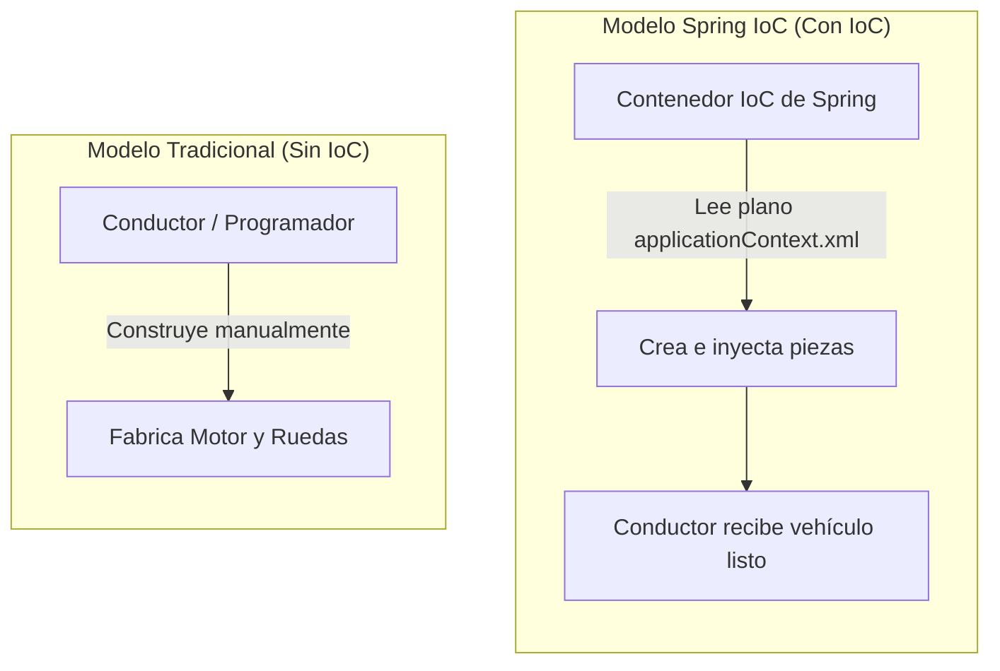
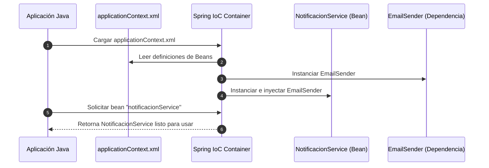

# Principios, Patrones y la Inyección de Dependencias

Para comprender la arquitectura de **Spring Framework**, es necesario primero analizar cómo se diseña el software orientado a objetos de forma limpia y mantenible. Los desarrolladores a menudo confunden términos como principios, patrones y frameworks; sin embargo, existe una jerarquía conceptual muy clara entre ellos.

En este documento exploraremos qué es un principio de diseño, desglosaremos los principios **SOLID**, aprenderemos qué es un patrón de diseño y veremos cómo Spring conecta estos conceptos mediante la **Inversión de Control (IoC)** y el **Principio de Inversión de Dependencias (DIP)**.

---

## 1. Principios de Diseño vs. Patrones de Diseño

Antes de escribir código, los arquitectos de software establecen reglas y directrices. Es fundamental diferenciar un **Principio** de un **Patrón**:

### Explicación de la Jerarquía

- **Principio de Diseño**: Es una norma o directriz de alto nivel. Indica **qué cualidad debemos buscar** en el software (por ejemplo, "las clases deben estar desacopladas"), pero **no dice cómo programarlo**. No depende de ningún lenguaje de programación.
- **Patrón de Diseño**: Es un esquema de solución probado para un problema recurrente de programación orientada a objetos. Indica **cómo estructurar las clases** para cumplir con uno o varios principios. Ejemplos: *Factory*, *Singleton*, *Strategy*.
- **Framework**: Es la herramienta de software concreta (como Spring) que implementa dichos patrones internamente para evitarnos escribir código repetitivo.

---

## 2. Los Principios SOLID

Los principios **SOLID** son un conjunto de cinco directrices creadas por Robert C. Martin ("Uncle Bob") para lograr software fácil de mantener, extender y probar.

| Sigla | Principio en Inglés | Nombre en Español | Descripción Breve |
| :---: | :--- | :--- | :--- |
| **S** | **Single Responsibility Principle (SRP)** | Principio de Responsabilidad Única | Una clase debe tener una sola razón para cambiar; solo debe cumplir una función específica. |
| **O** | **Open/Closed Principle (OCP)** | Principio de Abierto/Cerrado | Las entidades deben estar abiertas para extensión, pero cerradas para modificación. |
| **L** | **Liskov Substitution Principle (LSP)** | Principio de Sustitución de Liskov | Los objetos de una subclase deben poder reemplazar a los de la superclase sin alterar el comportamiento correcto del programa. |
| **I** | **Interface Segregation Principle (ISP)** | Principio de Segregación de Interfaces | Es mejor tener varias interfaces específicas que una sola interfaz sobrecargada de métodos no utilizados. |
| **D** | **Dependency Inversion Principle (DIP)** | Principio de Inversión de Dependencias | Los módulos de alto nivel no deben depender de módulos de bajo nivel; ambos deben depender de abstracciones. |

---

## 3. Dos Principios Clave en Spring: DIP e IoC

Spring se sustenta en la combinación de dos principios fundamentales:

### A. Dependency Inversion Principle (DIP)

El principio de Inversión de Dependencias establece dos reglas principales:
1. Las clases de alto nivel (lógica de negocio) no deben depender directamente de las clases de bajo nivel (detalles técnicos como envío de correos, conexión a base de datos, etc.). Ambos deben depender de **interfaces (abstracciones)**.
2. Las abstracciones no deben depender de los detalles; los detalles deben depender de las abstracciones.

#### Esquema Conceptual: Con vs. Sin DIP

### B. Inversion of Control (IoC)

Tradicionalmente, el programador escribe código que controla el flujo de la aplicación: decide cuándo instanciar objetos con `new`, cuándo llamar a un método y cuándo liberar memoria. 

En la **Inversión de Control (IoC)**, el control de la creación y gestión de los objetos se delega a un ente externo: el **Contenedor IoC de Spring**. El programador pasa de ser el "constructor que ensambla las piezas" a ser un "declarador de reglas" (mediante archivos XML u otros tipos de configuraciones).

#### Esquema Abstracto: La Analogía de la Fábrica de Automóviles

---

## 4. El Patrón Inyección de Dependencias (DI)

Mientras que IoC y DIP son **principios de diseño** (filosofía), la **Inyección de Dependencias (DI)** es el **patrón de diseño** concreto que los hace realidad.

La Inyección de Dependencias consiste en que un objeto no crea sus dependencias, sino que estas le son **suministradas (inyectadas)** desde el exterior en el momento de su instanciación.

### Tipos de Inyección de Dependencias mediante XML

En Spring, utilizando archivos de configuración XML, disponemos de dos formas principales para inyectar dependencias:

#### 1. Inyección por Constructor (`<constructor-arg>`)
Las dependencias necesarias se pasan como argumentos al constructor de la clase. Es el enfoque ideal para dependencias obligatorias.

#### 2. Inyección por Setter (`<property>`)
El contenedor crea el objeto utilizando su constructor por defecto (sin argumentos) y luego invoca los métodos `set...()` para asignar cada dependencia. Es adecuado para dependencias opcionales o reconfigurables.

---

## Cuestionario de Autoevaluación

<Quiz id="comp2-semana2-01-principios-patrones-quiz">
  <Question title="¿Cuál es la diferencia fundamental entre un Principio de Diseño y un Patrón de Diseño?">
    <Option>Los principios son código ejecutable y los patrones son diagramas UML.</Option>
    <Option correct>Un principio proporciona directrices abstractas de alto nivel sin implementación, mientras que un patrón sugiere una estructura concreta de clases para resolver un problema recurrente.</Option>
    <Option>Un patrón de diseño depende exclusivamente del lenguaje Java, mientras que un principio aplica solo a C++.</Option>
    <Option>Los principios solo los aplican los frameworks y los patrones solo los aplican los programadores.</Option>
  </Question>
  <Question title="En las siglas SOLID, ¿qué representa la letra 'D' y cuál es su postulado principal?">
    <Option>Dependency Injection: establece que debemos usar la anotación @Autowired en todos los atributos.</Option>
    <Option>Data Access Principle: establece que toda base de datos debe ser relacional.</Option>
    <Option correct>Dependency Inversion Principle (DIP): establece que los módulos de alto nivel deben depender de abstracciones (interfaces) y no de clases concretas de bajo nivel.</Option>
    <Option>Dynamic Interface Programming: establece que se deben usar múltiples clases abstractas en lugar de interfaces.</Option>
  </Question>
  <Question title="¿Qué significa el concepto de Inversión de Control (IoC)?">
    <Option>Que el usuario final toma el control de la interfaz gráfica de la aplicación.</Option>
    <Option correct>Que la responsabilidad de crear, configurar y gestionar el ciclo de vida de los objetos se transfiere desde el desarrollador hacia un contenedor o framework externo.</Option>
    <Option>Que el compilador de Java invierte el orden en el que se ejecutan los métodos main.</Option>
    <Option>Que los métodos setter se ejecutan antes que los constructores en todas las clases.</Option>
  </Question>
  <Question title="¿Cómo se relacionan los conceptos IoC, DIP y DI en Spring Framework?">
    <Option>IoC es un lenguaje de programación, DIP es la base de datos y DI es la vista web.</Option>
    <Option>DI es el principio general, IoC es el patrón y DIP es el framework de Spring.</Option>
    <Option correct>DIP e IoC son principios de diseño que establecen el desacoplamiento; DI es el patrón de diseño que Spring utiliza internamente como framework para concretar dicha inversión.</Option>
    <Option>No tienen relación entre sí; cada uno se utiliza en capas independientes de la aplicación.</Option>
  </Question>
  <Question title="Al configurar Inyección de Dependencias por Constructor en Spring mediante XML, ¿qué etiqueta se utiliza dentro de <bean>?">
    <Option>&lt;property name="..." ref="..." /&gt;</Option>
    <Option correct>&lt;constructor-arg ref="..." /&gt;</Option>
    <Option>&lt;inject-dependency ref="..." /&gt;</Option>
    <Option>&lt;autowire-constructor ref="..." /&gt;</Option>
  </Question>
</Quiz>
