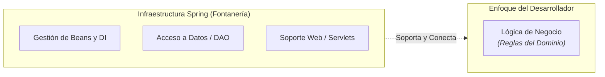
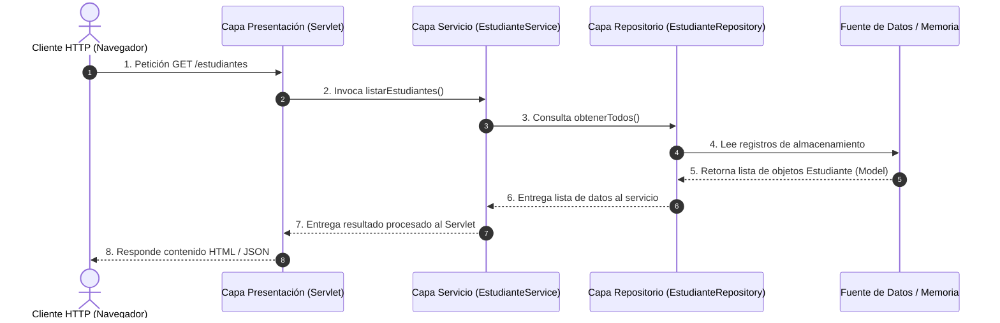

# Ecosistema Spring y Arquitectura en Capas

En el desarrollo de aplicaciones empresariales con Java, una de las mayores ventajas de utilizar **Spring Framework** es que se encarga del código de infraestructura o "fontanería" (*plumbing code*). Esto permite a los equipos de desarrollo enfocar su esfuerzo exclusivamente en la lógica del negocio.

---

## 1. El Concepto de "Fontanería" (*Plumbing Code*) en Spring

En la ingeniería de software, el término *plumbing* (fontanería) hace referencia a todo el código repetitivo de soporte que no aporta valor directo al negocio, pero que es imprescindible para que la aplicación funcione. Ejemplos de esto incluyen:

- Creación y gestión manual de instancias de objetos.
- Conexión e inyección manual de dependencias entre componentes.
- Manejo de recursos, transacciones y sesiones.
- Abstracciones para conectar con bases de datos o servicios remotos.

:::note[¿Por qué es crucial delegar la fontanería a Spring?]
Al delegar la creación y el ensamblaje de objetos a Spring mediante configuración XML, el código Java de la aplicación se mantiene limpio (*POJOs*), libre de dependencias rígidas y fácil de someter a pruebas unitarias.
:::

---

## 2. Visión General del Ecosistema de Spring

El ecosistema de Spring no es un único bloque monolítico, sino una familia interconectada de proyectos independientes y modulares construidos para resolver desafíos específicos en el ciclo de vida de una aplicación Java:

### Componentes Principales del Ecosistema

A partir de la arquitectura representada en el diagrama superior, el ecosistema se desglosa en los siguientes pilares clave:

- **Spring Boot (Cimientos)**: Es la base tecnológica que sostiene los proyectos modernos de Spring. Proporciona auto-configuración y servidores embebidos para poner en marcha aplicaciones de forma rápida sin necesidad de complejas configuraciones iniciales.
- **Spring Core**: Representa el núcleo fundamental del framework. Es el responsable de la Inversión de Control (IoC), el contenedor de beans y la inyección de dependencias mediante XML o Java.
- **Spring MVC**: Framework orientado a la capa de presentación que implementa el patrón Model-View-Controller para construir aplicaciones web estandarizadas y APIs REST.
- **Spring Persistence**: Conjunto de herramientas y abstraentes (como Spring Data / JDBC / ORM) diseñadas para simplificar la interacción y el acceso a bases de datos relacionales y no relacionales.
- **Spring Security**: Módulo dedicado a la autenticación, autorización y protección contra vulnerabilidades web comunes (CSRF, XSS, fijación de sesión).
- **Spring Cloud**: Infraestructura para el desarrollo de sistemas distribuidos y arquitecturas de microservicios (descubrimiento de servicios, gestión de configuración centralizada, enrutamiento).
- **Otros Proyectos de Spring**: Un abanico de extensiones especializadas como Spring Batch (procesamiento por lotes), Spring Integration (mensajería), Spring GraphQL, entre otros.

---

## 3. Arquitectura en Capas: Model - Repository - Service

Para garantizar la **separación de responsabilidades** (*Separation of Concerns*), una aplicación en Spring se divide jerárquicamente en capas especializadas. Cada capa tiene un propósito único y se comunica exclusivamente con su capa contigua a través de interfaces (abstracciones).

### Matriz de Responsabilidades por Capa

| Capa | Componente Clave | Responsabilidad Principal | Regla de Comunicación |
| :--- | :--- | :--- | :--- |
| **Presentación** | `Servlet` / `Controller` | Recibe las peticiones del cliente (HTTP), extrae los parámetros y delega la ejecución. | Solo invoca a la Capa de Servicio mediante su interfaz. |
| **Servicio (Business)** | `Service` | Contiene las reglas del negocio, validaciones y orquestación de operaciones. | Invoca a la Capa de Repositorio mediante interfaces abstractas. |
| **Repositorio (Data)** | `Repository` / `DAO` | Gestiona el acceso a datos (operaciones CRUD en memoria, archivos o base de datos). | Manipula y retorna objetos del Modelo de Dominio. |
| **Modelo (Domain)** | `Model` / `Entity` | Representa las entidades de información del sistema (clases POJO). | Es transportado libremente entre todas las capas. |

---

### Flujo de Información entre Capas

El siguiente diagrama ilustra el viaje de una petición web desde que llega al Servlet hasta que se consulta la información y retorna al cliente:

:::note[Principio de Aislamiento]
La Capa de Presentación jamás debe comunicarse directamente con la Capa de Repositorio o la Base de Datos. Todas las operaciones deben transitar obligatoriamente por la Capa de Servicio para garantizar que se apliquen las reglas de negocio.
:::

---

## Cuestionario de Autoevaluación

<Quiz id="comp2-semana2-02-ecosistema-modulos-quiz">
  <Question title="En el contexto de Spring Framework, ¿a qué se refiere el término 'fontanería' (plumbing code)?">
    <Option>Al código utilizado para conectar tuberías de bases de datos mediante conectores de red en C++.</Option>
    <Option correct>Al código de infraestructura repetitivo (creación de objetos, ensamble de dependencias, gestión de transacciones) que Spring automatiza para que los desarrolladores se concentren en la lógica de negocio.</Option>
    <Option>A los scripts de CSS que le dan estilo gráfico a las aplicaciones web.</Option>
    <Option>A la configuración interna del servidor web Tomcat para escuchar en el puerto 8080.</Option>
  </Question>
  <Question title="Según el diagrama del ecosistema de Spring (spring-ecosystem.png), ¿cuál es el componente que sirve como base tecnológica para simplificar la configuración y servidores embebidos?">
    <Option>Spring Cloud.</Option>
    <Option>Spring Security.</Option>
    <Option correct>Spring Boot.</Option>
    <Option>Spring MVC.</Option>
  </Question>
  <Question title="¿Cuál es el rol principal de la Capa de Servicio (Service) en la arquitectura Model-Repository-Service?">
    <Option>Almacenar las tablas de la base de datos relacional.</Option>
    <Option>Generar las respuestas en código HTML para el navegador del usuario.</Option>
    <Option correct>Contener las reglas y la lógica del negocio de la aplicación, coordinando las operaciones que interactúan con la capa de repositorio.</Option>
    <Option>Definir la estructura de atributos y getters/setters del modelo de datos.</Option>
  </Question>
  <Question title="En la Arquitectura en Capas, ¿cuál es la regla de comunicación correcta respecto a la Capa de Presentación (Servlets)?">
    <Option>La Capa de Presentación debe consultar directamente la Base de Datos sin pasar por otras capas.</Option>
    <Option correct>La Capa de Presentación solo debe comunicarse con la Capa de Servicio mediante su interfaz abstracta.</Option>
    <Option>La Capa de Presentación se encarga de definir los métodos del Repositorio.</Option>
    <Option>La Capa de Presentación debe modificar directamente los archivos XML de Spring en tiempo de ejecución.</Option>
  </Question>
</Quiz>
