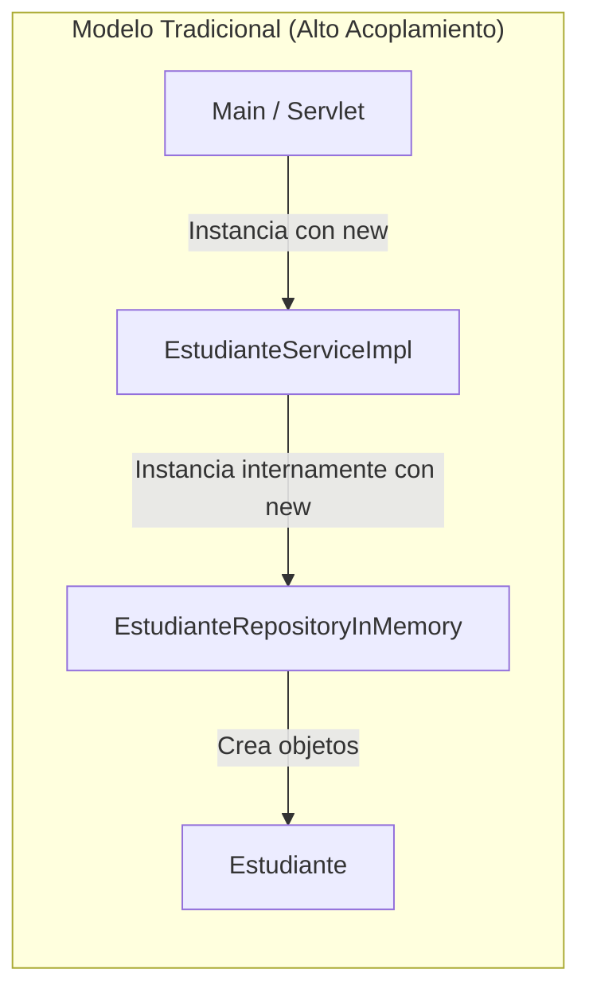
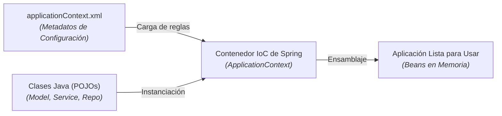

# Contenedores IoC y Configuración de Beans con XML

En los documentos anteriores exploramos los **Principios de Diseño** (SOLID, IoC, DIP) y la **Arquitectura en Capas** (Model-Repository-Service). Ahora profundizaremos en el mecanismo técnico que hace posible este ensamblaje: el **Contenedor IoC de Spring** y la definición declarativa de **Spring Beans mediante archivos XML**.

En esta guía compararemos cómo funcionaban las aplicaciones Java antes de Spring, analizaremos las diferencias entre `BeanFactory` y `ApplicationContext`, y construiremos paso a paso una aplicación completa conectada mediante XML sin utilizar ninguna anotación.

---

## 1. Funcionamiento de Proyectos Antes de Spring

En aplicaciones Java tradicionales (Java SE o Servlets puros), el desarrollador era responsable de instanciar y ensamblar manualmente todas las capas del sistema utilizando el operador `new`.



### Problemas del Enfoque Tradicional

Considérese el código de un servicio sin Spring:

```java title="src/main/java/com/example/service/EstudianteServiceImpl.java" showLineNumbers
package com.example.service;

import com.example.repository.EstudianteRepositoryInMemory;

public class EstudianteServiceImpl {

    // Acoplamiento fuerte a la clase concreta de bajo nivel
    private EstudianteRepositoryInMemory repositorio;

    public EstudianteServiceImpl() {
        // La clase controla directamente la instanciación de su dependencia
        this.repositorio = new EstudianteRepositoryInMemory();
    }
}
```

- **Alto Acoplamiento**: Si se desea cambiar `EstudianteRepositoryInMemory` por `EstudianteRepositoryDatabase`, es necesario modificar la clase `EstudianteServiceImpl` y recompilar todo el proyecto.
- **Imposibilidad de Realizar Pruebas Unitarias**: No se pueden pasar objetos simulados (*mocks*) del repositorio para probar la lógica de negocio de forma aislada.

---

## 2. El Contenedor IoC de Spring (*IoC Container*)

Spring soluciona este problema introduciendo el **Contenedor IoC** (*Inversion of Control Container*). El contenedor es el motor central del framework encargado de:

1. **Leer** los metadatos de configuración declarados en el archivo XML (`applicationContext.xml`).
2. **Instanciar** las clases POJO como **Spring Beans**.
3. **Inyectar** las dependencias requeridas entre ellos.
4. **Gestionar** su ciclo de vida y alcances (*scopes*).



### Tipos de Contenedores IoC en Spring

Spring proporciona dos interfaces principales que representan el contenedor IoC:

| Contenedor IoC | Interfaz Java | Características Principales | Recomendación de Uso |
| :--- | :--- | :--- | :--- |
| **Bean Factory** | `org.springframework.beans.factory.BeanFactory` | El contenedor más básico. Proporciona soporte fundamental para DI y *lazy loading* (crea los beans solo cuando se solicitan). | Reservado para dispositivos con memoria extremadamente limitada. |
| **Application Context** | `org.springframework.context.ApplicationContext` | Extiende de `BeanFactory`. Agrega integración con aplicaciones web, eventos, internacionalización (I18N) y *eager loading* por defecto. | **Opción estándar recomendada** para todas las aplicaciones empresariales. |

---

## 3. ¿Qué es un Spring Bean?

Un **Spring Bean** es cualquier objeto cuya instanciación, ensamblaje y ciclo de vida son administrados completamente por el **Contenedor IoC de Spring**, el cual se ejecuta dentro del proceso de la **Máquina Virtual de Java (JVM)**.

A diferencia de las clases instanciadas de forma manual con `new`, los Spring Beans coexisten dentro del contenedor como componentes vivos (representados orgánicamente como los *beans* o frijoles de Spring). El contenedor IoC en la JVM se encarga de conectar e inyectar el **Bean de Servicio** con el **Bean de Repositorio** mediante **Inyección de Dependencias (DI)**.

<div style={{textAlign: 'center', margin: '20px 0'}}>
  
</div>

### Formas de Registrar un Bean en XML

En este módulo, el registro de beans se realiza exclusivamente en el archivo `applicationContext.xml` utilizando la etiqueta `<bean>`:

```xml title="src/main/resources/applicationContext.xml" showLineNumbers
<?xml version="1.0" encoding="UTF-8"?>
<beans xmlns="http://www.springframework.org/schema/beans"
       xmlns:xsi="http://www.w3.org/2001/XMLSchema-instance"
       xsi:schemaLocation="http://www.springframework.org/schema/beans
           http://www.springframework.org/schema/beans/spring-beans.xsd">

    <!-- Definición básica de un Bean -->
    <bean id="miBean" class="com.example.MiClase" />

</beans>
```

- **`id`**: Identificador único del bean dentro del contenedor IoC (`repoBean`, `serviceBean`, `servletBean`).
- **`class`**: Nombre completamente cualificado (*fully qualified name*) de la clase Java a instanciar.

---

## 4. Inyección de Dependencias con XML en la Arquitectura por Capas

Retomando la estructura por capas (**Model - Repository - Service**) definida en el documento anterior, veremos cómo implementar e inyectar las dependencias mediante XML de dos formas: **Inyección por Constructor** e **Inyección por Setter**.

### A. Capa de Modelo (Model POJO)

```java title="src/main/java/com/example/model/Estudiante.java" showLineNumbers
package com.example.model;

public class Estudiante {

    private String id;
    private String nombre;
    private String correo;

    public Estudiante() {
    }

    public Estudiante(String id, String nombre, String correo) {
        this.id = id;
        this.nombre = nombre;
        this.correo = correo;
    }

    public String getId() {
        return id;
    }

    public void setId(String id) {
        this.id = id;
    }

    public String getNombre() {
        return nombre;
    }

    public void setNombre(String nombre) {
        this.nombre = nombre;
    }

    public String getCorreo() {
        return correo;
    }

    public void setCorreo(String correo) {
        this.correo = correo;
    }
}
```

---

### B. Capa de Repositorio (Repository)

Definimos la interfaz e implementación del repositorio:

```java title="src/main/java/com/example/repository/EstudianteRepository.java" showLineNumbers
package com.example.repository;

import com.example.model.Estudiante;
import java.util.List;

public interface EstudianteRepository {
    List<Estudiante> obtenerTodos();
    void guardar(Estudiante estudiante);
}
```

```java title="src/main/java/com/example/repository/EstudianteRepositoryInMemory.java" showLineNumbers
package com.example.repository;

import com.example.model.Estudiante;
import java.util.ArrayList;
import java.util.List;

public class EstudianteRepositoryInMemory implements EstudianteRepository {

    private final List<Estudiante> estudiantes = new ArrayList<>();

    public EstudianteRepositoryInMemory() {
        estudiantes.add(new Estudiante("1", "Ana Gómez", "ana@icesi.edu.co"));
        estudiantes.add(new Estudiante("2", "Carlos Pérez", "carlos@icesi.edu.co"));
    }

    @Override
    public List<Estudiante> obtenerTodos() {
        return new ArrayList<>(this.estudiantes);
    }

    @Override
    public void guardar(Estudiante estudiante) {
        this.estudiantes.add(estudiante);
    }
}
```

---

### C. Capa de Servicio con Inyección por Constructor (*Constructor Injection*)

La clase de servicio recibe el repositorio a través de su constructor:

```java title="src/main/java/com/example/service/EstudianteServiceImpl.java" showLineNumbers
package com.example.service;

import com.example.model.Estudiante;
import com.example.repository.EstudianteRepository;
import java.util.List;

public class EstudianteServiceImpl implements EstudianteService {

    private final EstudianteRepository estudianteRepository;

    // Dependencia requerida inyectada por constructor
    public EstudianteServiceImpl(EstudianteRepository estudianteRepository) {
        this.estudianteRepository = estudianteRepository;
    }

    @Override
    public List<Estudiante> listarEstudiantes() {
        return this.estudianteRepository.obtenerTodos();
    }

    @Override
    public void registrarEstudiante(Estudiante estudiante) {
        if (estudiante.getCorreo() == null || !estudiante.getCorreo().contains("@")) {
            throw new IllegalArgumentException("El correo electrónico no es válido");
        }
        this.estudianteRepository.guardar(estudiante);
    }
}
```

#### Declaración en `applicationContext.xml`:

```xml title="src/main/resources/applicationContext.xml" showLineNumbers
<!-- 1. Bean del Repositorio -->
<bean id="estudianteRepositoryBean" 
      class="com.example.repository.EstudianteRepositoryInMemory" />

<!-- 2. Bean del Servicio usando Inyección por Constructor -->
<bean id="estudianteServiceBean" 
      class="com.example.service.EstudianteServiceImpl">
    <constructor-arg ref="estudianteRepositoryBean" />
</bean>
```

---

### D. Capa de Servicio con Inyección por Setter (*Setter Injection*)

Alternativamente, la inyección se puede realizar definiendo métodos *setter*:

```java title="src/main/java/com/example/service/EstudianteServiceSetterImpl.java" showLineNumbers
package com.example.service;

import com.example.model.Estudiante;
import com.example.repository.EstudianteRepository;
import java.util.List;

public class EstudianteServiceSetterImpl implements EstudianteService {

    private EstudianteRepository estudianteRepository;

    public EstudianteServiceSetterImpl() {
    }

    // Setter para inyección de dependencia
    public void setEstudianteRepository(EstudianteRepository estudianteRepository) {
        this.estudianteRepository = estudianteRepository;
    }

    @Override
    public List<Estudiante> listarEstudiantes() {
        return this.estudianteRepository.obtenerTodos();
    }

    @Override
    public void registrarEstudiante(Estudiante estudiante) {
        this.estudianteRepository.guardar(estudiante);
    }
}
```

#### Declaración en `applicationContext.xml`:

```xml title="src/main/resources/applicationContext.xml" showLineNumbers
<!-- Inyección por Setter usando la propiedad 'estudianteRepository' -->
<bean id="estudianteServiceSetterBean" 
      class="com.example.service.EstudianteServiceSetterImpl">
    <property name="estudianteRepository" ref="estudianteRepositoryBean" />
</bean>
```

:::note[Diferencia clave entre constructor-arg y property]
- `<constructor-arg ref="..." />`: Se utiliza cuando la clase tiene un constructor que recibe dependencias. Garantiza inmutabilidad.
- `<property name="..." ref="..." />`: Utiliza el método setter correspondiente (`setEstudianteRepository`). Requiere un constructor por defecto sin argumentos.
:::

---

## Cuestionario de Autoevaluación

<Quiz id="comp2-semana2-03-contenedor-beans-quiz">
  <Question title="¿Cuál es el principal inconveniente de instanciar las dependencias con 'new' dentro de los constructores en Java sin Spring?">
    <Option>Que el compilador de Java genera archivos .class más pesados.</Option>
    <Option correct>Genera alto acoplamiento entre la clase cliente y la implementación concreta, impidiendo realizar pruebas unitarias con objetos simulados (mocks).</Option>
    <Option>Que las variables declaradas con 'new' se borran inmediatamente de la memoria RAM.</Option>
    <Option>Que requiere obligatoriamente importar servlets de Jakarta.</Option>
  </Question>
  <Question title="Entre 'BeanFactory' y 'ApplicationContext', ¿cuál es la recomendación estándar para aplicaciones empresariales y por qué?">
    <Option>BeanFactory, porque no requiere archivos XML.</Option>
    <Option correct>ApplicationContext, porque extiende BeanFactory agregando servicios empresariales como eventos, integración web y carga inmediata de beans.</Option>
    <Option>BeanFactory, porque es el único contenedor que admite inyección de dependencias.</Option>
    <Option>ApplicationContext, porque elimina la necesidad de usar interfaces en Java.</Option>
  </Question>
  <Question title="En el archivo applicationContext.xml, ¿cuál es la diferencia entre <constructor-arg ref='...' /> y <property name='...' ref='...' />?">
    <Option>&lt;constructor-arg&gt; crea un archivo en disco y &lt;property&gt; lo guarda en base de datos.</Option>
    <Option correct>&lt;constructor-arg&gt; inyecta dependencias a través de parámetros de un constructor, mientras que &lt;property&gt; invoca un método setter especificado.</Option>
    <Option>&lt;property&gt; solo se utiliza con anotaciones Java como @Autowired.</Option>
    <Option>Ambas etiquetas realizan exactamente lo mismo y se pueden intercambiar sin modificar la clase Java.</Option>
  </Question>
  <Question title="¿Cuál es la función del atributo class en la etiqueta <bean> dentro de applicationContext.xml?">
    <Option>Especificar la ruta física del archivo .java en el disco duro.</Option>
    <Option correct>Indicar el nombre completamente cualificado (fully qualified name) de la clase Java que el contenedor debe instanciar.</Option>
    <Option>Definir el nombre de la tabla en la base de datos SQL.</Option>
    <Option>Asignar el tipo de fuente tipográfica para la interfaz de usuario.</Option>
  </Question>
</Quiz>
