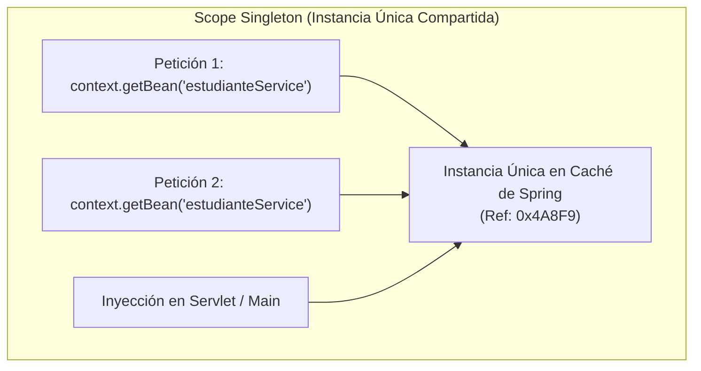
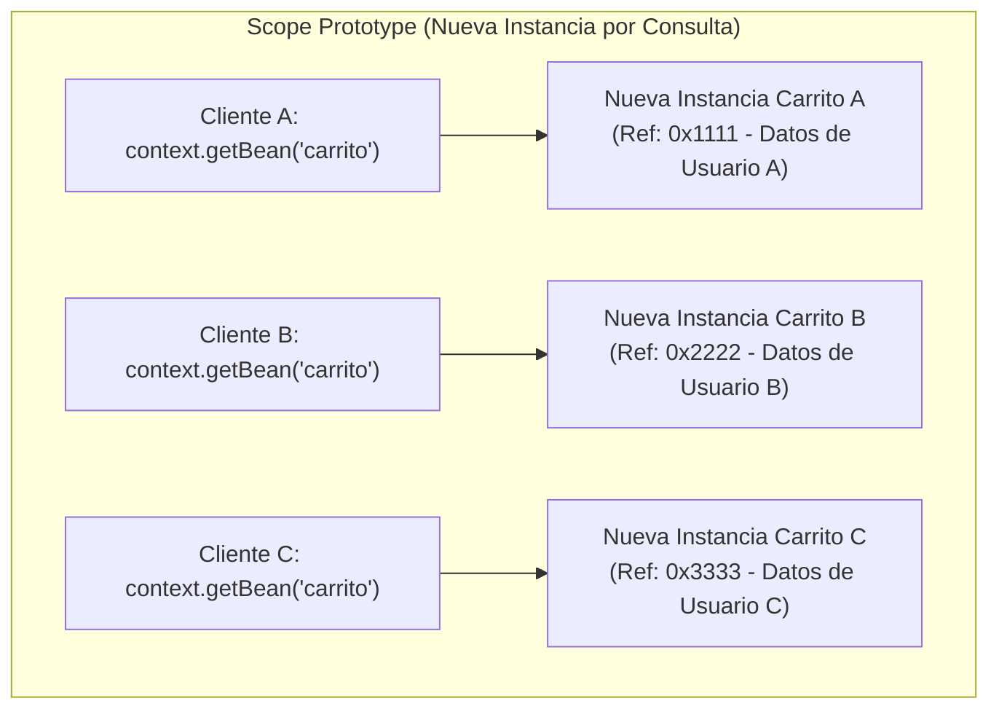
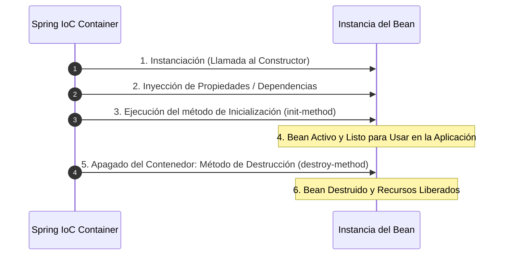

# Alcances, Ciclo de Vida del Bean y Ejecución Standalone

En el documento anterior aprendimos a definir beans en XML y conectarlos mediante Inyección de Dependencias. Ahora profundizaremos en el comportamiento interno de los beans dentro del contenedor IoC: sus **Alcances (Scopes)**, la personalización de su **Ciclo de Vida (Lifecycle)** mediante métodos de inicialización y destrucción, y cómo probar la arquitectura en una aplicación Java Standalone utilizando `ClassPathXmlApplicationContext`.

---

## 1. Alcance de los Beans (Bean Scopes) en XML

El **scope** (alcance) especifica cuántas instancias de un bean creará el contenedor IoC de Spring y cómo se compartirán esas referencias durante la ejecución.

En la configuración XML, el alcance se define con el atributo `scope="..."` en la etiqueta `<bean>`.

### A. Alcance Singleton (`scope="singleton"`)

- **Comportamiento por Defecto**: Si omitimos el atributo `scope`, Spring asigna automáticamente el alcance `singleton`.
- **Instancia Única**: El contenedor IoC crea una **sola instancia** del objeto para todo el `ApplicationContext` y la guarda en caché.
- **Uso Recomendado**: Clases sin estado mutable (*stateless*) como Servicios y Repositorios.

```xml title="src/main/resources/applicationContext.xml" showLineNumbers
<!-- Bean con alcance Singleton (Por defecto) -->
<bean id="estudianteServiceSingleton" 
      class="com.example.service.EstudianteServiceImpl" 
      scope="singleton">
    <constructor-arg ref="estudianteRepositoryBean" />
</bean>
```



---

### B. Alcance Prototype (`scope="prototype"`)

- **Instancia Nueva por Consulta**: Cada vez que la aplicación solicita el bean mediante `context.getBean()` o se inyecta en otra clase, el contenedor IoC crea un **objeto completamente nuevo e independiente**.
- **Sin Almacenamiento en Caché**: A diferencia de `singleton`, Spring no guarda en memoria la referencia del bean ni reutiliza instancias previas.

```xml title="src/main/resources/applicationContext.xml" showLineNumbers
<!-- Bean con alcance Prototype -->
<bean id="carritoComprasPrototype" 
      class="com.example.model.CarritoCompras" 
      scope="prototype" />
```



#### ¿Por qué y cuándo utilizar el Alcance Prototype?

1. **Objetos con Estado Concurrente (*Stateful Beans*)**:
   - En una aplicación web multihilo, si un bean almacena información específica de un usuario o de una transacción en sus atributos de clase (por ejemplo, los productos seleccionados en un carrito de compras o un token temporal de sesión), **usar Singleton provocaría corrupción de datos**, ya que todos los usuarios modificarían las mismas variables compartidas.
   - Con `prototype`, cada hilo u operación recibe una copia limpia sin riesgo de interferencia.

2. **Ventajas Principales**:
   - **Aislamiento Total e Inmunidad a Condiciones de Carrera (*Thread-Safety*)**: Garantiza que las modificaciones de estado en un bean no afecten a otros clientes ni hilos concurrentes.
   - **Reinicio Limpio de Estado**: Cada invocación inicia con un objeto en su estado inicial recién construido.

3. **Casos de Uso Empresariales Reales**:
   - **Carritos de compra o Formularios multipaso**: Almacenan variables temporales antes de ser procesados o guardados.
   - **Generadores de reportes o Exportadores PDF**: Acumulan buffers de datos o estados de procesamiento durante la generación de un documento único.
   - **Comandos de tarea (*Command Pattern*)**: Instancias creadas para ejecutar un trabajo específico una sola vez y desecharse.

:::warning 
Desventaja y Gestión de Memoria en Prototype
Spring es responsable de instanciar e inyectar beans Prototype, pero **no gestiona la destrucción final del objeto**. La responsabilidad de liberar la memoria de un bean Prototype recae sobre el ejecutor de la JVM (Garbage Collector) una vez que el bean deja de ser referenciado.
:::

---

### Tabla Comparativa: Singleton vs. Prototype

| Característica | Scope Singleton | Scope Prototype |
| :--- | :--- | :--- |
| **Cantidad de Instancias** | Una sola instancia por `ApplicationContext`. | Una instancia nueva en cada solicitud. |
| **Configuración XML** | `scope="singleton"` *(por defecto)* | `scope="prototype"` |
| **Uso de Memoria** | Reutiliza la misma instancia (optimiza RAM). | Instancia objetos continuamente (mayor consumo). |
| **Destrucción** | Spring gestiona el bean hasta que el contenedor se apaga. | Spring crea la instancia pero **no ejecuta su destrucción**. |

---

## 2. Ciclo de Vida del Bean (Lifecycle) con XML

El contenedor IoC gestiona el ciclo de vida del bean desde su creación hasta su eliminación de la memoria.



### Métodos de Eventos: `init-method` y `destroy-method`

En lugar de acoplar nuestras clases a interfaces del framework, Spring permite especificar métodos de inicialización y limpieza directamente en el archivo XML mediante los atributos `init-method` y `destroy-method`:

- **`init-method`**: Se ejecuta inmediatamente **después** de instanciar el bean e inyectar todas sus dependencias. Ideal para abrir conexiones o inicializar cachés.
- **`destroy-method`**: Se ejecuta **antes** de apagar el contenedor. Ideal para cerrar archivos o liberar conexiones.

#### Ejemplo en Código Java (POJO Puro):

```java title="src/main/java/com/example/repository/EstudianteRepositoryWithLifecycle.java" showLineNumbers
package com.example.repository;

public class EstudianteRepositoryWithLifecycle {

    // Método invocado al inicializar el Bean
    public void iniciarRepositorio() {
        System.out.println("-> [LIFECYCLE] Inicializando conexiön y cargando datos iniciales...");
    }

    // Método invocado al destruir el Bean
    public void limpiarRecursos() {
        System.out.println("-> [LIFECYCLE] Cerrando conexiones y liberando memoria...");
    }
}
```

#### Declaración en `applicationContext.xml`:

```xml title="src/main/resources/applicationContext.xml" showLineNumbers
<!-- Configuración de init-method y destroy-method en XML -->
<bean id="repoLifecycleBean" 
      class="com.example.repository.EstudianteRepositoryWithLifecycle"
      init-method="iniciarRepositorio"
      destroy-method="limpiarRecursos" />
```

:::note[Sintaxis de Admoniciones en Docusaurus]
Recuerda que todas las notas deben incluir el tipo de admonición con corchetes en la primera línea `:::note[Título]` y el contenido en la línea siguiente para garantizar un renderizado estético impecable.
:::

---

## 3. Ejecución Standalone con `Main.java` y `ClassPathXmlApplicationContext`

Para verificar la arquitectura por capas y la inyección de dependencias sin necesidad de desplegar un servidor web web, se utiliza una clase ejecutable `Main.java` que inicializa el `ApplicationContext` leyendo el XML desde el *classpath*.

```java title="src/main/java/com/example/Main.java" showLineNumbers
package com.example;

import com.example.model.Estudiante;
import com.example.service.EstudianteService;
import org.springframework.context.support.ClassPathXmlApplicationContext;

import java.util.List;

public class Main {

    public static void main(String[] args) {
        System.out.println("=== 1. Inicializando el Contenedor IoC de Spring ===");
        
        // Cargar el contexto desde applicationContext.xml ubicado en src/main/resources
        ClassPathXmlApplicationContext context = 
                new ClassPathXmlApplicationContext("applicationContext.xml");

        System.out.println("\n=== 2. Solicitando el Bean de Servicio ===");
        // Obtener el bean mediante su ID configurado en el XML
        EstudianteService servicio = (EstudianteService) context.getBean("estudianteServiceBean");

        System.out.println("\n=== 3. Ejecutando la Lógica de Negocio ===");
        List<Estudiante> estudiantes = servicio.listarEstudiantes();
        for (Estudiante e : estudiantes) {
            System.out.println("Estudiante registrado: " + e.getNombre() + " (" + e.getCorreo() + ")");
        }

        System.out.println("\n=== 4. Cerrando el Contenedor IoC ===");
        // Cerrar el contexto para disparar los métodos destroy-method
        context.close();
    }
}
```

### Configuración del Plugin de Ejecución en `pom.xml`

Para ejecutar la clase ejecutable `Main.java` desde la consola de comandos utilizando **Maven**, es necesario incluir el plugin `exec-maven-plugin` dentro del archivo `pom.xml`:

```xml title="pom.xml" showLineNumbers
<build>
    <plugins>
        <!-- Plugin para ejecutar clases Java Standalone desde Maven -->
        <plugin>
            <groupId>org.codehaus.mojo</groupId>
            <artifactId>exec-maven-plugin</artifactId>
            <version>3.1.0</version>
            <configuration>
                <!-- Nombre completamente cualificado de la clase con método main -->
                <mainClass>com.example.Main</mainClass>
            </configuration>
        </plugin>
    </plugins>
</build>
```

---

### Comando de Ejecución con Maven en la Consola

Una vez configurado el `pom.xml`, compila y ejecuta el proyecto Standalone desde la terminal con el comando:

```bash
mvn clean compile exec:java
```

:::tip 
¿Qué realiza este comando Maven?
1. `clean`: Elimina los archivos previamente compilados en el directorio `target/`.
2. `compile`: Compila las clases Java y copia los archivos de recursos (`applicationContext.xml`) al directorio de salida del *classpath*.
3. `exec:java`: Invoca la clase principal `com.example.Main` dentro de la JVM con todas las dependencias de Spring cargadas en el *classpath*.
:::

---

## Cuestionario de Autoevaluación

<Quiz id="comp2-semana2-04-scopes-lifecycle-quiz">
  <Question title="En el alcance 'singleton' (por defecto en Spring), ¿cuántas instancias de un bean crea el contenedor IoC?">
    <Option>Una instancia nueva por cada llamada a context.getBean().</Option>
    <Option>Una instancia por cada sesión HTTP del navegador.</Option>
    <Option correct>Una única instancia compartida durante todo el ciclo de vida del ApplicationContext.</Option>
    <Option>Tantas instancias como hilos tenga la JVM.</Option>
  </Question>
  <Question title="¿Cuál es la principal diferencia entre el alcance 'singleton' y el alcance 'prototype' en la configuración XML?">
    <Option>Singleton se configura con anotaciones y Prototype con XML.</Option>
    <Option correct>Singleton reutiliza una única instancia en memoria, mientras que Prototype genera una instancia nueva cada vez que se solicita el bean.</Option>
    <Option>Prototype borra la base de datos y Singleton la respalda.</Option>
    <Option>Singleton solo funciona en servlets y Prototype en consolas.</Option>
  </Question>
  <Question title="Al configurar los atributos init-method y destroy-method en la etiqueta <bean> de XML, ¿cuándo se ejecuta init-method?">
    <Option>Antes de ejecutar el constructor del objeto.</Option>
    <Option correct>Inmediatamente después de instanciar el objeto e inyectar todas sus dependencias.</Option>
    <Option>Al cerrar la JVM.</Option>
    <Option>Únicamente si el objeto implementa una interfaz de Spring.</Option>
  </Question>
  <Question title="¿Qué método se debe invocar sobre la instancia de ClassPathXmlApplicationContext para asegurar la ejecución de los métodos destroy-method en una aplicación Standalone?">
    <Option>context.start()</Option>
    <Option>context.refresh()</Option>
    <Option correct>context.close()</Option>
    <Option>context.destroyAll()</Option>
  </Question>
</Quiz>
