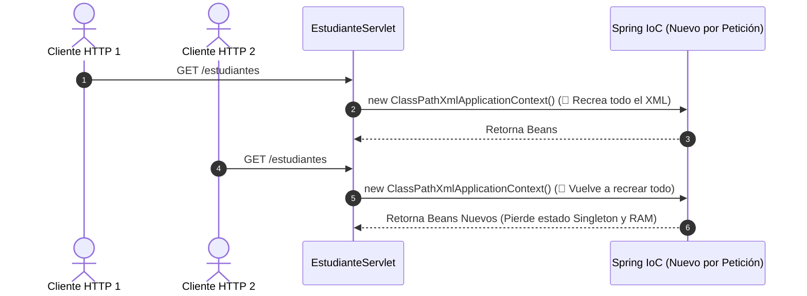

# Integración de Spring Context en Servlets Web

En los documentos anteriores aprendimos a configurar el **Contenedor IoC de Spring** mediante XML y a ejecutar aplicaciones Java Standalone con `ClassPathXmlApplicationContext`. Sin embargo, en un entorno web profesional con **Servlets** (`jakarta.servlet`), el contenedor web (como Apache Tomcat) gestiona múltiples peticiones HTTP concurrentes.

En esta guía abordaremos el problema de recrear el contexto de Spring por cada petición HTTP, implementaremos el **Patrón Singleton / Listener de Contexto (`ContextLoaderListener`)** para mantener una única instancia del `ApplicationContext` viva durante todo el ciclo de vida de la aplicación web, e inyectaremos beans de servicio en los Servlets.

---

## 1. El Problema de Cargar el ApplicationContext en un Servlet

Un error común al iniciar la integración de Spring con Servlets consiste en instanciar el `ApplicationContext` dentro del método de atención de peticiones (`doGet` o `doPost`) del Servlet.

### Ejemplo de Enfoque Incorrecto (Anti-Patrón):

```java title="src/main/java/com/example/servlet/EstudianteServletError.java" showLineNumbers
package com.example.servlet;

import com.example.service.EstudianteService;
import jakarta.servlet.ServletException;
import jakarta.servlet.annotation.WebServlet;
import jakarta.servlet.http.HttpServlet;
import jakarta.servlet.http.HttpServletRequest;
import jakarta.servlet.http.HttpServletResponse;
import org.springframework.context.ApplicationContext;
import org.springframework.context.support.ClassPathXmlApplicationContext;

import java.io.IOException;

@WebServlet("/estudiantes-error")
public class EstudianteServletError extends HttpServlet {

    @Override
    protected void doGet(HttpServletRequest req, HttpServletResponse resp) 
            throws ServletException, IOException {

        // 🔴 ANTI-PATRÓN: Cargar el XML en cada petición HTTP
        ApplicationContext context = 
                new ClassPathXmlApplicationContext("applicationContext.xml");
        
        EstudianteService servicio = 
                (EstudianteService) context.getBean("estudianteServiceBean");
        
        // ... procesar respuesta
    }
}
```



### Consecuencias de este Anti-Patrón:

1. **Destrucción del Rendimiento (Overhead de E/S)**: El servidor vuelve a leer y parsear el archivo `applicationContext.xml` desde el disco en **cada clic o petición HTTP**.
2. **Pérdida del Estado Singleton**: Los beans declarados con `scope="singleton"` dejan de ser únicos para la aplicación; se crean copias aisladas en cada petición web.
3. **Fugas de Memoria (Memory Leaks)**: El Garbage Collector se sobrecarga limpiando múltiples contenedores de Spring huérfanos.

---

## 2. La Solución: Patrón Singleton y ContextLoaderListener

Para solucionar este problema, el `ApplicationContext` de Spring debe instanciarse **una sola vez** cuando el servidor web (Tomcat) inicia la aplicación, guardarse como un atributo del contexto del servlet (`ServletContext`) y destruirse cuando la aplicación se apaga.

<div style={{textAlign: 'center', margin: '25px 0'}}>
  
</div>

### Desglose de Capas en el Servidor Web

1. **Cliente Web (Navegador)**: Envía peticiones HTTP (`GET / POST`) a través de la red hacia el puerto del servidor web (ej. `8080`).
2. **Servidor Web Apache Tomcat**: Aplicación receptora que hospeda el motor de ejecución de servlets.
3. **Motor Catalina (Servlet Engine)**: Es el componente central de Tomcat responsable de administrar las aplicaciones web desplegadas (`.war`) y encausar la petición HTTP al Servlet correspondiente.
4. **`ServletContext` (Memoria Compartida de la WebApp)**: Mapa de memoria que persiste durante todo el ciclo de vida de la aplicación web. En él coexisten:
   - Los **Servlets** (`EstudianteServlet`) que atienden las solicitudes.
   - El **Spring IoC Container** (`WebApplicationContext`), inicializado una única vez al arrancar Tomcat mediante el `ContextLoaderListener`.
5. **Spring Beans Vivos**: Los beans de Servicio y Repositorio residen en el contenedor de Spring como objetos Singleton, siendo consumidos por el Servlet sin necesidad de recrear el archivo XML.

---

## 3. Configuración en `web.xml` (Despliegue Web)

Para habilitar la carga automática del contexto de Spring en una aplicación web tradicional, configuramos el archivo `web.xml`:

```xml title="src/main/webapp/WEB-INF/web.xml" showLineNumbers
<?xml version="1.0" encoding="UTF-8"?>
<web-app xmlns="https://jakarta.ee/xml/ns/jakartaee"
         xmlns:xsi="http://www.w3.org/2001/XMLSchema-instance"
         xsi:schemaLocation="https://jakarta.ee/xml/ns/jakartaee 
                             https://jakarta.ee/xml/ns/jakartaee/web-app_6_0.xsd"
         version="6.0">

    <!-- 1. Ubicación del archivo de configuración XML de Spring -->
    <context-param>
        <param-name>contextConfigLocation</param-name>
        <param-value>classpath:applicationContext.xml</param-value>
    </context-param>

    <!-- 2. Listener de Spring que inicializa el ApplicationContext al arrancar Tomcat -->
    <listener>
        <listener-class>org.springframework.web.context.ContextLoaderListener</listener-class>
    </listener>

</web-app>
```

:::note[Compatibilidad con Jakarta EE]
A partir de Spring 6 y Tomcat 10+, las aplicaciones utilizan el espacio de nombres `jakarta.servlet`. Asegúrate de que tus dependencias de `spring-web` sean de la versión 6.0 o superior.
:::

---

## 4. Implementación del Servlet Integrado con Spring

Con el contexto cargado en el arranque por el listener, el Servlet obtiene la referencia única del servicio durante su método de inicialización `init()` o en el método de atención `doGet()`:

```java title="src/main/java/com/example/servlet/EstudianteServlet.java" showLineNumbers
package com.example.servlet;

import com.example.model.Estudiante;
import com.example.service.EstudianteService;
import jakarta.servlet.ServletException;
import jakarta.servlet.annotation.WebServlet;
import jakarta.servlet.http.HttpServlet;
import jakarta.servlet.http.HttpServletRequest;
import jakarta.servlet.http.HttpServletResponse;

import org.springframework.web.context.WebApplicationContext;
import org.springframework.web.context.support.WebApplicationContextUtils;

import java.io.IOException;
import java.io.PrintWriter;
import java.util.List;
import java.util.UUID;

@WebServlet(name = "estudianteServlet", value = "/estudiantes")
public class EstudianteServlet extends HttpServlet {

    private EstudianteService estudianteService;

    @Override
    public void init() throws ServletException {
        super.init();
        
        // Obtener el ApplicationContext Singleton guardado en el ServletContext por el Listener
        WebApplicationContext context = WebApplicationContextUtils
                .getRequiredWebApplicationContext(getServletContext());

        // Extraer el bean de servicio inyectado por XML
        this.estudianteService = (EstudianteService) context.getBean("estudianteServiceBean");
    }

    // 1. Método GET: Renderiza el formulario HTML y la lista de estudiantes
    @Override
    protected void doGet(HttpServletRequest request, HttpServletResponse response) 
            throws ServletException, IOException {

        response.setContentType("text/html;charset=UTF-8");
        PrintWriter out = response.getWriter();

        List<Estudiante> estudiantes = this.estudianteService.listarEstudiantes();

        out.println("<!DOCTYPE html>");
        out.println("<html><head><title>Gestión de Estudiantes - Spring + Servlets</title></head><body>");
        out.println("<h1>Gestión de Estudiantes (Spring Context + Servlets)</h1>");
        
        // Formulario HTML para registrar un nuevo estudiante vía POST
        out.println("<h2>Registrar Nuevo Estudiante</h2>");
        out.println("<form action='estudiantes' method='POST'>");
        out.println("  <label>Nombre:</label><br/>");
        out.println("  <input type='text' name='nombre' required/><br/><br/>");
        out.println("  <label>Correo:</label><br/>");
        out.println("  <input type='email' name='correo' required/><br/><br/>");
        out.println("  <button type='submit'>Guardar Estudiante</button>");
        out.println("</form>");

        out.println("<hr/>");
        out.println("<h2>Lista de Estudiantes Registrados</h2>");
        out.println("<ul>");
        for (Estudiante e : estudiantes) {
            out.println("<li><strong>" + e.getNombre() + "</strong> - " + e.getCorreo() + "</li>");
        }
        out.println("</ul>");
        out.println("</body></html>");
    }

    // 2. Método POST: Recibe los datos del formulario, invoca la Capa de Servicio y redirige
    @Override
    protected void doPost(HttpServletRequest request, HttpServletResponse response) 
            throws ServletException, IOException {

        // Extraer parámetros enviados por el formulario HTML
        String nombre = request.getParameter("nombre");
        String correo = request.getParameter("correo");

        // Crear el objeto del Modelo de Dominio
        String idGenerado = UUID.randomUUID().toString().substring(0, 8);
        Estudiante nuevoEstudiante = new Estudiante(idGenerado, nombre, correo);

        // Delegar la ejecución a la Capa de Servicio (Spring Bean)
        this.estudianteService.registrarEstudiante(nuevoEstudiante);

        // Redireccionar (Pattern Post-Redirect-Get) para refrescar la lista
        response.sendRedirect(request.getContextPath() + "/estudiantes");
    }
}
```

---

## 5. Estructura Completa del Proyecto Maven (`war`)

Para compilar y empaquetar una aplicación web que integre Servlets con Spring, la estructura de carpetas estándar de Maven debe organizarse de la siguiente forma:

```
src/
├── main/
│   ├── java/
│   │   └── com/example/
│   │       ├── model/
│   │       │   └── Estudiante.java
│   │       ├── repository/
│   │       │   ├── EstudianteRepository.java
│   │       │   └── EstudianteRepositoryInMemory.java
│   │       ├── service/
│   │       │   ├── EstudianteService.java
│   │       │   └── EstudianteServiceImpl.java
│   │       └── servlet/
│   │           └── EstudianteServlet.java
│   ├── resources/
│   │   └── applicationContext.xml
│   └── webapp/
│       └── WEB-INF/
│           └── web.xml
└── pom.xml
```

### Dependencias Necesarias en `pom.xml`:

```xml title="pom.xml" showLineNumbers
<dependencies>
    <!-- 1. Spring Context y Spring Web -->
    <dependency>
        <groupId>org.springframework</groupId>
        <artifactId>spring-web</artifactId>
        <version>6.0.11</version>
    </dependency>

    <!-- 2. API de Servlets de Jakarta -->
    <dependency>
        <groupId>jakarta.servlet</groupId>
        <artifactId>jakarta.servlet-api</artifactId>
        <version>6.0.0</version>
        <scope>provided</scope>
    </dependency>
</dependencies>
```

---

## Cuestionario de Autoevaluación

<Quiz id="comp2-semana2-05-servlets-spring-quiz">
  <Question title="¿Por qué instanciar 'new ClassPathXmlApplicationContext()' dentro del método doGet() de un Servlet se considera un anti-patrón grave?">
    <Option>Porque los Servlets solo aceptan archivos JSON y no XML.</Option>
    <Option correct>Porque destruye el rendimiento al volver a leer y parsear el XML en cada petición HTTP, generando múltiples contenedores y rompiendo el patrón Singleton.</Option>
    <Option>Porque el navegador web bloquea las peticiones que leen el classpath.</Option>
    <Option>Porque los metadatos XML solo se pueden cargar en sistemas operativos Windows.</Option>
  </Question>
  <Question title="¿Cuál es la función de la clase 'ContextLoaderListener' en el archivo web.xml?">
    <Option>Limpiar los archivos temporales de Tomcat al recibir un error 404.</Option>
    <Option correct>Inicializar una única instancia del ApplicationContext al arrancar la aplicación web y almacenarla en el ServletContext para ser compartida por todos los Servlets.</Option>
    <Option>Convertir los objetos Java en tablas de bases de datos relacionales.</Option>
    <Option>Compilar automáticamente las páginas JSP en tiempo de ejecución.</Option>
  </Question>
  <Question title="¿Qué utilidad proporciona el método 'WebApplicationContextUtils.getRequiredWebApplicationContext(getServletContext())'?">
    <Option>Crear un nuevo Servlet en la memoria del navegador.</Option>
    <Option correct>Recuperar la instancia compartida del WebApplicationContext guardada en el ServletContext por el listener de Spring.</Option>
    <Option>Eliminar todos los beans con alcance Prototype de la memoria RAM.</Option>
    <Option>Descargar dependencias Maven en tiempo de ejecución.</Option>
  </Question>
  <Question title="Al empaquetar una aplicación web que utiliza Spring y Servlets con Maven, ¿qué tipo de empaquetado debe especificarse en pom.xml?">
    <Option>&lt;packaging&gt;jar&lt;/packaging&gt;</Option>
    <Option correct>&lt;packaging&gt;war&lt;/packaging&gt;</Option>
    <Option>&lt;packaging&gt;zip&lt;/packaging&gt;</Option>
    <Option>&lt;packaging&gt;pom&lt;/packaging&gt;</Option>
  </Question>
</Quiz>
