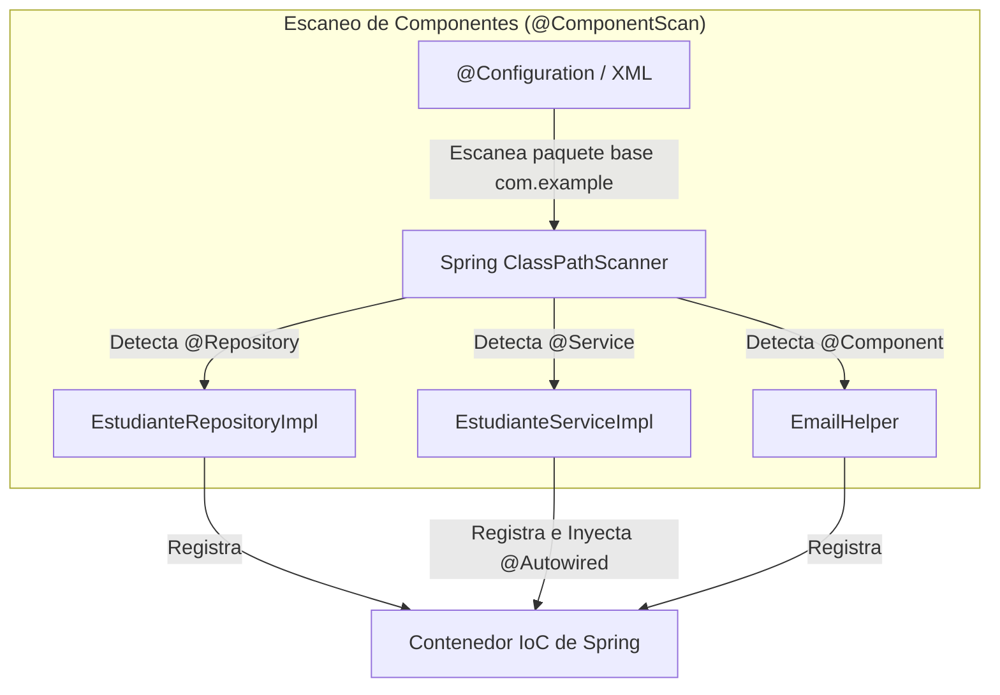
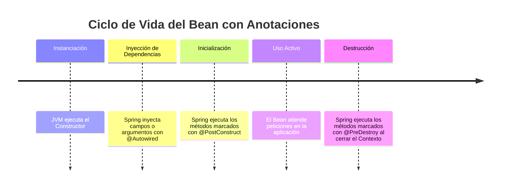

# Transición de XML a Anotaciones, Estereotipos y Java Config

En la Semana 2 aprendimos a configurar el **Contenedor IoC de Spring** declarando beans en archivos XML (`applicationContext.xml`), definiendo explícitamente sus dependencias y administrando sus alcances (*scopes*) y métodos de ciclo de vida con los atributos `init-method` y `destroy-method`.

Aunque XML permite desacoplar la configuración del código fuente Java, mantener archivos XML gigantescos en proyectos modernos se vuelve complejo y propenso a errores tipográficos. En esta primera sesión de la Semana 3 realizaremos la **transición de XML a Anotaciones y Java Config**, demostrando cómo lograr el mismo nivel de control (o superior) con menos verbosidad y mayor seguridad en tiempo de compilación.

---

## 1. De XML a Detección Automática de Componentes

En el enfoque XML definíamos cada clase como un bean utilizando la etiqueta `<bean>`:

```xml title="applicationContext.xml (Enfoque Tradicional XML)" showLineNumbers
<!-- Registro manual de beans en XML -->
<bean id="estudianteRepository" class="com.example.repository.EstudianteRepositoryImpl" />

<bean id="estudianteService" class="com.example.service.EstudianteServiceImpl">
    <constructor-arg ref="estudianteRepository" />
</bean>
```

Con las anotaciones modernas de Spring, le indicamos al framework que explore automáticamente los paquetes Java en busca de clases marcadas con **Anotaciones Estereotipo** (*Stereotype Annotations*) mediante el escaneo de componentes (*Component Scanning*).



---

## 2. Anotaciones Estereotipo (`@Component`, `@Service`, `@Repository`, `@Controller`)

En Spring, la anotación `@Component` es la anotación genérica para indicar que una clase Java es un Spring Bean que debe ser administrado por el contenedor IoC. Sin embargo, por arquitectura limpia y buenas prácticas empresariales, Spring provee **subtipos especializados (estereotipos)** que otorgan significado semántico y comportamientos adicionales a cada capa:

| Anotación Estereotipo | Capa de la Arquitectura | Propósito y Comportamientos Especiales |
| :--- | :--- | :--- |
| `@Component` | Capa General / Utilitaria | Marcador genérico para cualquier componente administrado por Spring (helpers, clientes externos, convertidores). |
| `@Repository` | Capa de Persistencia (Acceso a Datos) | Indica que la clase maneja acceso a base de datos. **Traduce automáticamente excepciones de la BD** (como `SQLException`) a la jerarquía de `DataAccessException` de Spring. |
| `@Service` | Capa de Negocio / Servicios | Almacena la lógica de negocio, validaciones y orquestación de transacciones. |
| `@Controller` / `@RestController` | Capa de Presentación / Web | Procesa peticiones HTTP en aplicaciones web (MVC o API REST). |

### Ejemplo: Conversión de Clases a Estereotipos

```java title="src/main/java/com/example/repository/EstudianteRepositoryImpl.java" showLineNumbers
package com.example.repository;

import org.springframework.stereotype.Repository;

// @Repository registra la clase como bean y activa la traducción de excepciones de persistencia
@Repository
public class EstudianteRepositoryImpl implements EstudianteRepository {
    
    public String findNombreEstudiante() {
        return "Juan Pérez";
    }
}
```

```java title="src/main/java/com/example/service/EstudianteServiceImpl.java" showLineNumbers
package com.example.service;

import com.example.repository.EstudianteRepository;
import org.springframework.beans.factory.annotation.Autowired;
import org.springframework.stereotype.Service;

// @Service indica que esta clase contiene la lógica de negocio
@Service
public class EstudianteServiceImpl implements EstudianteService {

    private final EstudianteRepository estudianteRepository;

    // @Autowired realiza la inyección automática por constructor
    @Autowired
    public EstudianteServiceImpl(EstudianteRepository estudianteRepository) {
        this.estudianteRepository = estudianteRepository;
    }

    public String obtenerDetalle() {
        return estudianteRepository.findNombreEstudiante();
    }
}
```

:::tip[Inyección por Constructor vs Campo]
Aunque puedes colocar `@Autowired` directamente sobre el atributo (`@Autowired private EstudianteRepository repo;`), **la buena práctica empresarial estándar es inyectar por constructor** y declarar el atributo como `final`. Esto facilita las pruebas unitarias con JUnit/Mockito sin necesidad de levantar el contexto de Spring.
:::

---

## 3. Alcances (*Scopes*) y Ciclo de Vida con Anotaciones

En la Semana 2 configuramos el alcance `scope="prototype"` y los métodos `init-method` y `destroy-method` en XML. Con anotaciones, este control se logra directamente en el código de la clase Java.

### A. Definiendo el Scope (`@Scope`)

Por defecto, todo bean marcado con `@Component` o sus estereotipos tiene un alcance **Singleton**. Si necesitamos una nueva instancia cada vez que se solicita el bean, utilizamos `@Scope("prototype")`:

```java title="src/main/java/com/example/model/CarritoCompras.java" showLineNumbers
package com.example.model;

import org.springframework.context.annotation.Scope;
import org.springframework.stereotype.Component;

@Component
@Scope("prototype") // Crea una nueva instancia por cada consulta / inyección
public class CarritoCompras {
    // Estado específico de la sesión/usuario actual
}
```

### B. Ciclo de Vida con `@PostConstruct` y `@PreDestroy`

En lugar de registrar cadenas de texto en XML (`init-method="init" destroy-method="cleanup"`), utilizamos las anotaciones estándar de Jakarta (`jakarta.annotation`):

* **`@PostConstruct`**: Se ejecuta inmediatamente **después** de que Spring ha instanciado el bean y ha inyectado todas sus dependencias via `@Autowired`. Ideal para cargar cachés, abrir conexiones o validar configuraciones iniciales.
* **`@PreDestroy`**: Se ejecuta **justo antes** de que el contenedor IoC destruya el bean (al apagar la aplicación o cerrar el contexto). Ideal para cerrar conexiones a sockets, liberar hilos o guardar estados temporales.

```java title="src/main/java/com/example/service/ConexionService.java" showLineNumbers
package com.example.service;

import jakarta.annotation.PostConstruct;
import jakarta.annotation.PreDestroy;
import org.springframework.stereotype.Service;

@Service
public class ConexionService {

    public ConexionService() {
        System.out.println("1. Constructor: El objeto ha sido instanciado por la JVM.");
    }

    @PostConstruct
    public void init() {
        System.out.println("2. @PostConstruct: Dependencias inyectadas. Inicializando recursos o conexiones...");
    }

    @PreDestroy
    public void cleanup() {
        System.out.println("3. @PreDestroy: El contenedor se está cerrando. Liberando recursos...");
    }
}
```



---

## 4. Reemplazando el XML por Completo: Java Configuration (`@Configuration` y `@Bean`)

A pesar de las anotaciones estereotipo, existen escenarios donde **no podemos modificar el código fuente de una clase** (por ejemplo, librerías de terceros como un cliente de base de datos o un `ObjectMapper` de Jackson). Para estos casos, Spring permite reemplazar completamente el archivo XML por una clase de configuración en Java anotada con `@Configuration`.

### A. La Clase `@Configuration` y el Método `@Bean`

* **`@Configuration`**: Indica a Spring que la clase contiene definiciones de beans y reemplaza al archivo `applicationContext.xml`.
* **`@Bean`**: Se coloca sobre un método dentro de una clase `@Configuration`. El valor devuelto por el método se registra automáticamente como un Spring Bean dentro del Contenedor IoC.
* **`@ComponentScan`**: Reemplaza la etiqueta XML `<context:component-scan base-package="..." />`.

```java title="src/main/java/com/example/config/AppConfig.java" showLineNumbers
package com.example.config;

import org.springframework.context.annotation.Bean;
import org.springframework.context.annotation.ComponentScan;
import org.springframework.context.annotation.Configuration;
import org.springframework.context.annotation.Scope;

@Configuration
@ComponentScan(basePackages = "com.example") // Activa el escaneo automático de @Component, @Service, etc.
public class AppConfig {

    // Registro explícito de beans para clases de librerías externas o configuración personalizada
    @Bean
    public String nombreAplicacion() {
        return "Sistema de Gestión Académica DocuKelo";
    }

    // Bean con ciclo de vida y alcance explícito usando Java Config
    @Bean(initMethod = "init", destroyMethod = "cleanup")
    @Scope("singleton")
    public ExternalLibraryService externalLibraryService() {
        return new ExternalLibraryService();
    }
}
```

### B. Inicializando el Contexto con `AnnotationConfigApplicationContext`

En la Semana 2 utilizábamos `ClassPathXmlApplicationContext("applicationContext.xml")`. Ahora que eliminamos el XML por completo, instanciamos el contexto utilizando la clase `AnnotationConfigApplicationContext` pasándole la clase de configuración `@Configuration`:

```java title="src/main/java/com/example/MainApplication.java" showLineNumbers
package com.example;

import com.example.config.AppConfig;
import com.example.service.EstudianteService;
import org.springframework.context.annotation.AnnotationConfigApplicationContext;

public class MainApplication {

    public static void main(String[] args) {
        // 1. Crear el contenedor IoC usando la clase de configuración Java @Configuration
        AnnotationConfigApplicationContext context = 
                new AnnotationConfigApplicationContext(AppConfig.class);

        // 2. Obtener el bean administrado por Spring
        EstudianteService estudianteService = context.getBean(EstudianteService.class);
        
        // 3. Ejecutar métodos del servicio
        System.out.println("Resultado: " + estudianteService.obtenerDetalle());

        // 4. Cerrar el contexto para disparar los métodos @PreDestroy
        context.close();
    }
}
```

---

## 5. Cuadro Comparativo: XML vs. Anotaciones vs. Java Config

| Aspecto | Enfoque XML (`applicationContext.xml`) | Enfoque Anotaciones (`@Component`) | Enfoque Java Config (`@Configuration` + `@Bean`) |
| :--- | :--- | :--- | :--- |
| **Ubicación de Configuración** | Archivos XML externos. | Directamente en las clases Java del proyecto. | Clases de configuración Java separadas. |
| **Escaneo y Detección** | Manual (`<bean class="...">`). | Automático con `@ComponentScan`. | Manual mediante métodos `@Bean` o combinado con `@ComponentScan`. |
| **Inyección de Dependencias** | `<property ref="...">` o `<constructor-arg ref="...">`. | Anotación `@Autowired`. | Parámetros en los métodos anotados con `@Bean`. |
| **Casos de Uso Principales** | Legacy o mantenimiento de código antiguo. | Componentes del proyecto propio (Services, Repositories). | Clases de terceros, frameworks externos o beans complejos. |

---

## Autoevaluación

<Quiz id="compu2-sem3-sesion1-quiz">

<Question title="¿Cuál es la principal ventaja de utilizar @Repository en lugar de @Component genérico en la capa de datos?">
  <Option>Permite que la clase se ejecute como un Servlet HTTP de forma automática.</Option>
  <Option correct>Activa la traducción automática de excepciones específicas de la base de datos a la jerarquía DataAccessException de Spring.</Option>
  <Option>Hace que todos los métodos de la clase tengan alcance Prototype por defecto.</Option>
  <Option>Evita que Spring pueda instanciar la clase mediante el operador new.</Option>
</Question>

<Question title="¿Cuándo se ejecuta exactamente un método anotado con @PostConstruct?">
  <Option>Antes de que el constructor de la clase sea invocado por la JVM.</Option>
  <Option correct>Inmediatamente después de que Spring ha instanciado la clase y ha inyectado todas sus dependencias con @Autowired.</Option>
  <Option>Únicamente cuando el usuario realiza una petición HTTP al Servlet.</Option>
  <Option>Al momento de cerrar el contexto de la aplicación con context.close().</Option>
</Question>

<Question title="¿Qué clase de ApplicationContext debemos utilizar para inicializar el contenedor de Spring cuando eliminamos los archivos XML por completo?">
  <Option>ClassPathXmlApplicationContext</Option>
  <Option>XmlWebApplicationContext</Option>
  <Option correct>AnnotationConfigApplicationContext</Option>
  <Option>FileSystemXmlApplicationContext</Option>
</Question>

<Question title="¿Cuál es la diferencia fundamental entre definir beans con @Component y definirlos con @Configuration + @Bean?">
  <Option>@Component solo sirve para interfaces y @Bean para clases abstractas.</Option>
  <Option correct>@Component se usa en nuestras propias clases con escaneo automático; @Bean se usa en clases de configuración para instanciar objetos de librerías externas que no podemos modificar.</Option>
  <Option>@Bean crea siempre instancias de tipo Prototype mientras que @Component crea Singleton.</Option>
  <Option>No hay ninguna diferencia, son exactamente intercambiables en cualquier escenario.</Option>
</Question>

</Quiz>
