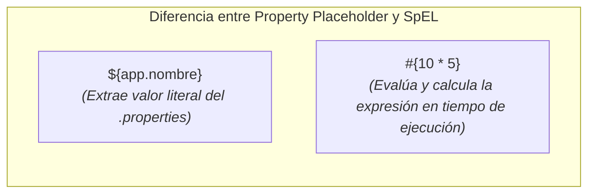

# Inyección Avanzada, Inyección de Valores y SpEL (Spring Expression Language)

En la sesión anterior aprendimos a configurar beans utilizando anotaciones estereotipo (`@Component`, `@Service`, `@Repository`), gestionar su ciclo de vida con `@PostConstruct` y `@PreDestroy`, y reemplazar los archivos XML por clases de configuración `@Configuration` y `@Bean`.

En esta segunda sesión de la Semana 3 abordaremos escenarios avanzados de inyección de dependencias y configuración externa:
1. Resolución de ambigüedades en inyección cuando existen múltiples implementaciones de una misma interfaz mediante `@Qualifier` y `@Primary`.
2. Carga y lectura de archivos de propiedades externos (`application.properties`) mediante la anotación `@Value` y la propiedad `@PropertySource`.
3. Inyección dinámica y evaluación de expresiones en tiempo de ejecución utilizando **SpEL (Spring Expression Language)**.

---

## 1. Ambigüedad en la Inyección de Dependencias y Uso de `@Qualifier`

Cuando inyectamos dependencias utilizando la interfaz (`@Autowired`), Spring busca dentro del contenedor un bean que implemente dicha interfaz. Sin embargo, ¿qué sucede si tenemos **dos o más clases que implementan la misma interfaz**?

### A. El Problema: `NoUniqueBeanDefinitionException`

Considérese la interfaz `NotificacionService` con dos implementaciones distintas:

```java title="src/main/java/com/example/service/NotificacionService.java"
package com.example.service;

public interface NotificacionService {
    void enviarMensaje(String mensaje);
}
```

```java title="src/main/java/com/example/service/NotificacionEmailServiceImpl.java"
package com.example.service;

import org.springframework.stereotype.Service;

@Service
public class NotificacionEmailServiceImpl implements NotificacionService {
    public void enviarMensaje(String mensaje) {
        System.out.println("Enviando EMAIL: " + mensaje);
    }
}
```

```java title="src/main/java/com/example/service/NotificacionSmsServiceImpl.java"
package com.example.service;

import org.springframework.stereotype.Service;

@Service
public class NotificacionSmsServiceImpl implements NotificacionService {
    public void enviarMensaje(String mensaje) {
        System.out.println("Enviando SMS: " + mensaje);
    }
}
```

Si intentamos inyectar `NotificacionService` en nuestro controlador o servicio sin aclaración adicional:

```java title="src/main/java/com/example/controller/UsuarioController.java"
@Service
public class UsuarioController {

    private final NotificacionService notificacionService;

    @Autowired
    public UsuarioController(NotificacionService notificacionService) {
        // 🔴 ERROR AL ARRANCAR SPRING: NoUniqueBeanDefinitionException
        // Spring encuentra 2 beans que implementan NotificacionService (Email y Sms) y no sabe cuál elegir.
        this.notificacionService = notificacionService;
    }
}
```

### B. Solución 1: Selección Explícita con `@Qualifier`

La anotación `@Qualifier("nombreBean")` nos permite especificar el nombre exacto del bean que deseamos inyectar, resolviendo la ambigüedad. Por defecto, el nombre del bean registrado por Spring corresponde al nombre de la clase en minúscula camello (*camelCase*):

```java title="src/main/java/com/example/controller/UsuarioController.java" showLineNumbers
package com.example.controller;

import com.example.service.NotificacionService;
import org.springframework.beans.factory.annotation.Autowired;
import org.springframework.beans.factory.annotation.Qualifier;
import org.springframework.stereotype.Service;

@Service
public class UsuarioController {

    private final NotificacionService notificacionService;

    @Autowired
    public UsuarioController(
            @Qualifier("notificacionSmsServiceImpl") NotificacionService notificacionService) {
        // 🟢 CORRECTO: Spring inyecta explícitamente la implementación de SMS
        this.notificacionService = notificacionService;
    }
}
```

También podemos asignar un identificador personalizado directamente en la anotación `@Service`:

```java
@Service("emailService")
public class NotificacionEmailServiceImpl implements NotificacionService { ... }

// En el lugar de inyección:
public UsuarioController(@Qualifier("emailService") NotificacionService service) { ... }
```

### C. Solución 2: Implementación por Defecto con `@Primary`

Si deseamos definir una implementación preferida sin necesidad de escribir `@Qualifier` en cada punto de inyección, marcamos dicha clase con `@Primary`:

```java title="src/main/java/com/example/service/NotificacionEmailServiceImpl.java" showLineNumbers
package com.example.service;

import org.springframework.context.annotation.Primary;
import org.springframework.stereotype.Service;

@Service
@Primary // 🟢 Indica a Spring que esta es la opción por defecto si hay ambigüedad
public class NotificacionEmailServiceImpl implements NotificacionService {
    public void enviarMensaje(String mensaje) {
        System.out.println("Enviando EMAIL prioritario: " + mensaje);
    }
}
```

:::tip[Regla de Precedencia]
Si una clase tiene `@Primary` pero en el constructor colocas explícitamente un `@Qualifier("notificacionSmsServiceImpl")`, **`@Qualifier` siempre tiene mayor prioridad y sobrescribe a `@Primary`**.
:::

---

## 2. Inyección de Propiedades Externas con `@Value` y `application.properties`

En aplicaciones empresariales es indispensable separar los datos de configuración (puertos de red, credenciales, URLs de servicios externos, llaves secretas) del código compilado en Java.

### A. Creación del Archivo `application.properties`

Creamos el archivo `application.properties` en el directorio de recursos del proyecto (`src/main/resources/`):

```properties title="src/main/resources/application.properties" showLineNumbers
# Configuración general de la aplicación
app.nombre=DocuKelo Academic Portal
app.version=2.5.0
app.max-usuarios-activos=150

# Configuración de servicios externos
notificacion.email-remitente=soporte@docukelo.edu.co
notificacion.puerto-smtp=587
notificacion.modo-prueba=true
```

### B. Habilitando la Lectura de Propiedades en `@Configuration`

Para que Spring lea este archivo en aplicaciones Spring Standalone/Core, utilizamos la anotación `@PropertySource` en nuestra clase de configuración:

```java title="src/main/java/com/example/config/AppConfig.java" showLineNumbers
package com.example.config;

import org.springframework.context.annotation.ComponentScan;
import org.springframework.context.annotation.Configuration;
import org.springframework.context.annotation.PropertySource;

@Configuration
@ComponentScan(basePackages = "com.example")
@PropertySource("classpath:application.properties") // Carga el archivo de propiedades del classpath
public class AppConfig {
}
```

### C. Inyectando Valores con `@Value("${...}")`

Utilizamos la sintaxis `${nombre.propiedad}` dentro de la anotación `@Value` para inyectar valores leídos del archivo de propiedades directamente en los campos o argumentos de un bean:

```java title="src/main/java/com/example/service/SistemaConfigService.java" showLineNumbers
package com.example.service;

import org.springframework.beans.factory.annotation.Value;
import org.springframework.stereotype.Service;

@Service
public class SistemaConfigService {

    // Inyección de cadenas de texto
    @Value("${app.nombre}")
    private String nombreApp;

    // Inyección con conversión automática de tipo a entero
    @Value("${app.max-usuarios-activos}")
    private int maxUsuarios;

    // Inyección con conversión automática de tipo a booleano
    @Value("${notificacion.modo-prueba}")
    private boolean modoPrueba;

    // Inyección con VALOR POR DEFECTO por si la propiedad no existe en el archivo
    @Value("${app.timeout:3000}") 
    private int timeout; // Si app.timeout no está en el .properties, asigna 3000 por defecto

    public void mostrarConfiguracion() {
        System.out.println("Aplicación: " + nombreApp);
        System.out.println("Límite Usuarios: " + maxUsuarios);
        System.out.println("Modo Prueba: " + modoPrueba);
        System.out.println("Timeout configurado: " + timeout + " ms");
    }
}
```

---

## 3. Lenguaje de Expresiones de Spring: SpEL (*Spring Expression Language*)

Mientras que la sintaxis `${...}` se utiliza exclusivamente para **extraer propiedades de archivos de configuración**, el lenguaje **SpEL (Spring Expression Language)** se representa con la sintaxis **`#{...}`** y permite **evaluar expresiones complejas, invocar métodos, realizar operaciones matemáticas y manipular colecciones en tiempo de ejecución**.



### A. Operaciones Matemáticas y Lógicas Básicas con SpEL

Podemos realizar cálculos y comparaciones directamente dentro de la anotación `@Value`:

```java title="src/main/java/com/example/service/CalculoSpELService.java" showLineNumbers
package com.example.service;

import org.springframework.beans.factory.annotation.Value;
import org.springframework.stereotype.Service;

@Service
public class CalculoSpELService {

    // Operación matemática directa
    @Value("#{10 * 5 + 20}")
    private int calculoMatematico; // Asigna 70

    // Operación lógica de comparación (Retorna true o false)
    @Value("#{sistemaConfigService.maxUsuarios > 100}")
    private boolean esGranEscala;

    // Concatenación de cadenas de texto y métodos de String
    @Value("#{'DocuKelo'.toUpperCase() + ' - VERSION ' + 2.5}")
    private String tituloFormateado;

    // Operador ternario (Condicional)
    @Value("${notificacion.modo-prueba ? 'ENTORNO_DESARROLLO' : 'ENTORNO_PRODUCCION'}")
    private String tipoEntorno;
}
```

### B. Referenciando Otros Beans e Invocando sus Métodos con SpEL

SpEL permite acceder a cualquier otro bean registrado en el contenedor IoC mediante su nombre, e invocar sus métodos o acceder a sus campos:

```java title="src/main/java/com/example/service/ProcesadorService.java" showLineNumbers
package com.example.service;

import org.springframework.beans.factory.annotation.Value;
import org.springframework.stereotype.Service;

@Service
public class ProcesadorService {

    // Inyecta el resultado de invocar un método de otro bean ('sistemaConfigService')
    @Value("#{sistemaConfigService.obtenerDetalleFormateado()}")
    private String detalleSistema;

    // Invoca métodos de clases estáticas estándar de Java (como java.lang.Math) usando T(...)
    @Value("#{T(java.lang.Math).PI}")
    private double valorPi;

    @Value("#{T(java.lang.Math).random() * 100}")
    private double numeroAleatorio;
}
```

### C. Tabla Resumen de Operaciones Comunes en SpEL (`#{...}`)

| Categoría de Operación | Ejemplo de Expresión SpEL | Resultado / Descripción |
| :--- | :--- | :--- |
| **Literal / Matemático** | `#{100 / 4 + 5}` | Evalúa la operación y asigna `30`. |
| **Relacional / Lógico** | `#{50 > 20 and 10 == 10}` | Evalúa la condición booleana (`true`). |
| **Llamada a Métodos de Beans** | `#{estudianteService.getNombre()}` | Llama al método `getNombre()` del bean `estudianteService`. |
| **Clases Estáticas de Java** | `#{T(java.lang.Math).abs(-45)}` | Utiliza la sintaxis `T(...)` para invocar métodos o constantes estáticas (`45`). |
| **Operador Ternario** | `#{estudiante.promedio >= 3.0 ? 'Aprobado' : 'Reprobado'}` | Asigna un resultado según la condición. |
| **Combinado con ${}** | `#{${app.max-usuarios-activos} * 2}` | Lee el valor de `application.properties` y lo multiplica por `2`. |

---

## 4. Ejemplo Práctico Integrador

Reunamos `@Qualifier`, `@Value`, `application.properties` y `SpEL` en un componente de auditoría completo:

```java title="src/main/java/com/example/component/AuditoriaComponent.java" showLineNumbers
package com.example.component;

import com.example.service.NotificacionService;
import org.springframework.beans.factory.annotation.Autowired;
import org.springframework.beans.factory.annotation.Qualifier;
import org.springframework.beans.factory.annotation.Value;
import org.springframework.stereotype.Component;

@Component
public class AuditoriaComponent {

    private final NotificacionService notificacionService;

    // Inyección de propiedad externa con valor por defecto
    @Value("${app.nombre:Portal Académico}")
    private String nombreApp;

    // Evaluación SpEL: Genera un ID de sesión único al inicializar
    @Value("#{'SESSION-' + T(java.util.UUID).randomUUID().toString().substring(0, 8)}")
    private String sessionId;

    @Autowired
    public AuditoriaComponent(
            @Qualifier("notificacionEmailServiceImpl") NotificacionService notificacionService) {
        this.notificacionService = notificacionService;
    }

    public void ejecutarAuditoria() {
        System.out.println("Iniciando auditoría en: " + nombreApp);
        System.out.println("ID de Sesión Generado por SpEL: " + sessionId);
        notificacionService.enviarMensaje("Auditoria completada con éxito.");
    }
}
```

---

## Autoevaluación

<Quiz id="compu2-sem3-sesion2-quiz">

<Question title="¿Qué excepción lanza Spring cuando intenta inyectar por interfaz con @Autowired y encuentra dos beans que implementan dicha interfaz sin ningun criterio de desambiguación?">
  <Option>NullPointerException</Option>
  <Option correct>NoUniqueBeanDefinitionException</Option>
  <Option>BeanCreationException</Option>
  <Option>ClassNotFoundException</Option>
</Question>

<Question title="Si una clase tiene la anotación @Primary y en el punto de inyección se coloca la anotación @Qualifier('otroBean'), ¿cuál bean seleccionará Spring?">
  <Option>Lanza una excepción de conflicto de dependencias.</Option>
  <Option>Selecciona el bean marcado con @Primary ignorando el @Qualifier.</Option>
  <Option correct>Selecciona el bean especificado en @Qualifier, ya que @Qualifier tiene mayor prioridad y sobrescribe a @Primary.</Option>
  <Option>Selecciona un bean al azar entre las dos opciones.</Option>
</Question>

<Question title="¿Cuál es la diferencia de sintaxis entre extraer una propiedad de application.properties y evaluar una expresión SpEL?">
  <Option>Propiedades se extraen con `#{...}` y SpEL se evalúa con `${...}`.</Option>
  <Option correct>Propiedades se extraen con `${...}` y SpEL se evalúa con `#{...}`.</Option>
  <Option>Ambos utilizan exactamente la misma sintaxis `${...}`.</Option>
  <Option>SpEL solo se puede usar en archivos XML y no con la anotación @Value.</Option>
</Question>

<Question title="¿Cómo se invoca un método estático o constante de una clase nativa de Java (como java.lang.Math) en una expresión SpEL dentro de @Value?">
  <Option>`@Value("#{java.lang.Math.PI}")`</Option>
  <Option correct>`@Value("#{T(java.lang.Math).PI}")` usando la sintaxis `T(...)`</Option>
  <Option>`@Value("${Math.PI}")`</Option>
  <Option>`@Value("#{Static.java.lang.Math.PI}")`</Option>
</Question>

</Quiz>
