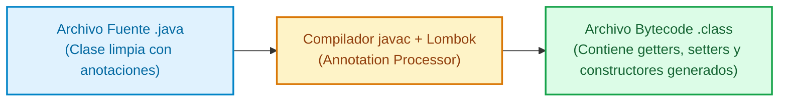

# Proyecto Lombok

**Eliminación de Código Repetitivo y Anotaciones en Spring Boot**

**Project Lombok** es una librería de procesamiento de anotaciones en tiempo de compilación que automatiza la generación de código repetitivo (*boilerplate*) en aplicaciones Java, como getters, setters, constructores, métodos `toString()`, `equals()`, `hashCode()` y loggers.

---

## 1. ¿Qué es Lombok y cómo funciona?

Durante la compilación tradicional de Java, escribir atributos privados requiere definir explícitamente decenas de líneas de código redundante. Lombok se engancha en la fase de procesamiento de anotaciones del compilador (`javac`) e inyecta directamente el código de los métodos en el archivo compilado `.class`, manteniendo el archivo fuente `.java` totalmente limpio.



---

## 2. Instalación y Configuración

Para utilizar Lombok en un proyecto de Spring Boot, es necesario incluir la dependencia en el gestor de construcción:

<Tabs>
  <TabItem value="mvn" label="Maven (pom.xml)" default>

```xml title="pom.xml" showLineNumbers
<dependencies>
    <!-- Dependencia de Project Lombok -->
    <dependency>
        <groupId>org.projectlombok</groupId>
        <artifactId>lombok</artifactId>
        <optional>true</optional>
    </dependency>
</dependencies>

<build>
    <plugins>
        <plugin>
            <groupId>org.springframework.boot</groupId>
            <artifactId>spring-boot-maven-plugin</artifactId>
            <configuration>
                <excludes>
                    <!-- Excluye Lombok del paquete ejecutable final ya que solo se necesita en compilación -->
                    <exclude>
                        <groupId>org.projectlombok</groupId>
                        <artifactId>lombok</artifactId>
                    </exclude>
                </excludes>
            </configuration>
        </plugin>
    </plugins>
</build>
```

  </TabItem>
  <TabItem value="gradle" label="Gradle (build.gradle)">

```groovy title="build.gradle" showLineNumbers
dependencies {
    // Lombok como dependencia solo en tiempo de compilación y procesador de anotaciones
    compileOnly 'org.projectlombok:lombok'
    annotationProcessor 'org.projectlombok:lombok'
}
```

  </TabItem>
</Tabs>

:::tip[Comprobación de la Instalación de Lombok]
Tras declarar la dependencia y el procesador de anotaciones de Lombok en tu archivo de construcción, es fundamental verificar que la librería se descargó y configuró correctamente en el classpath ejecutando:
- **Maven**: `./mvnw clean install` (o `mvn clean install`)
- **Gradle**: `./gradlew build` (o `./gradlew --refresh-dependencies`)

Este comando procesará las anotaciones y confirmará que el compilador `javac` reconoce las instrucciones de Lombok.
:::

---

## 3. Catálogo Detallado de Anotaciones de Lombok

### 3.1. Acceso y Encapsulamiento (`@Getter` y `@Setter`)

Generan los métodos de lectura (`getCampo()`) y escritura (`setCampo()`). Pueden colocarse a nivel de clase (para todos los atributos) o sobre atributos individuales.

```java title="src/main/java/com/icesi/app/model/Product.java" showLineNumbers
package com.icesi.app.model;

import lombok.Getter;
import lombok.Setter;

// Aplica getters y setters automáticamente a todos los campos de la clase
@Getter
@Setter
public class Product {
    private Long id;
    private String name;
    
    // Sobrescribe la visibilidad del setter solo para este atributo a nivel privado
    @Setter(lombok.AccessLevel.PRIVATE)
    private Double price;
}
```

### 3.2. Generación de Constructores

- **`@NoArgsConstructor`**: Genera un constructor sin parámetros (requerido por frameworks como JPA e Jackson).
- **`@AllArgsConstructor`**: Genera un constructor que acepta un parámetro por cada campo de la clase.
- **`@RequiredArgsConstructor`**: Genera un constructor únicamente para los campos marcados como `final` o anotados con `@NonNull`. **Es la forma recomendada en Spring para inyección de dependencias por constructor.**

```java title="src/main/java/com/icesi/app/service/impl/ProductServiceImpl.java" showLineNumbers
package com.icesi.app.service.impl;

import com.icesi.app.repository.ProductRepository;
import lombok.RequiredArgsConstructor;
import org.springframework.stereotype.Service;

@Service
// Genera un constructor automáticamente para 'productRepository' por ser un campo 'final'
@RequiredArgsConstructor
public class ProductServiceImpl {

    // Spring inyectará automáticamente esta dependencia obligatoria sin necesidad de escribir el constructor a mano
    private final ProductRepository productRepository;
}
```

### 3.3. Agrupadores de Código (`@Data` y `@Value`)

- **`@Data`**: Combina `@Getter`, `@Setter`, `@ToString`, `@EqualsAndHashCode` y `@RequiredArgsConstructor`. Ideal para DTOs o POJOs simples.
- **`@Value`**: Variante inmutable de `@Data`. Hace que todos los campos sean `private final` y no genera setters.

```java title="src/main/java/com/icesi/app/dto/UserResponseDto.java" showLineNumbers
package com.icesi.app.dto;

import lombok.Data;

// Genera getters, setters, toString, equals y hashCode para la clase DTO
@Data
public class UserResponseDto {
    private Long id;
    private String name;
    private String email;
}
```

### 3.4. Patrones de Diseño y Logging (`@Builder` y `@Slf4j`)

- **`@Builder`**: Produce una API de construcción fluida basada en el patrón Builder.
- **`@Slf4j`**: Inyecta automáticamente una instancia del logger de SLF4J llamada `log`.

```java title="src/main/java/com/icesi/app/service/impl/NotificationService.java" showLineNumbers
package com.icesi.app.service.impl;

import lombok.extern.slf4j.Slf4j;
import org.springframework.stereotype.Service;

@Service
// Inyecta automáticamente: private static final org.slf4j.Logger log = org.slf4j.LoggerFactory.getLogger(NotificationService.class);
@Slf4j
public class NotificationService {

    public void sendEmail(String to, String subject) {
        log.info("Enviando correo a: {} con asunto: {}", to, subject);
        log.debug("Detalle técnico del envío de mensaje...");
    }
}
```

---

## 4. Ejemplo Integrado: Uso del Patrón Builder

El patrón `@Builder` permite instanciar objetos complejos sin depender de constructores con múltiples parámetros:

```java title="src/main/java/com/icesi/app/model/Customer.java" showLineNumbers
package com.icesi.app.model;

import lombok.AllArgsConstructor;
import lombok.Builder;
import lombok.Getter;
import lombok.NoArgsConstructor;

@Getter
@NoArgsConstructor
@AllArgsConstructor
@Builder
public class Customer {
    private Long id;
    private String firstName;
    private String lastName;
    private String email;
    private Boolean active;
}
```

**Uso fluido del Builder en código Java:**

```java title="src/main/java/com/icesi/app/DemoApplication.java" showLineNumbers
// Creación fluida y clara de un objeto Customer con Lombok Builder
Customer customer = Customer.builder()
        .id(1L)
        .firstName("Kevin")
        .lastName("Coes")
        .email("kevin@icesi.edu.co")
        .active(true)
        .build();
```

---

## 5. Advertencias y Buenas Prácticas con JPA y Lombok

:::warning[Precaución al usar @Data en Entidades JPA]
Evita colocar `@Data` en clases anotadas con `@Entity` de JPA si contienen relaciones relacionales bidireccionales (`@OneToMany` / `@ManyToOne`).

**¿Por qué?**  
`@Data` genera de forma automática los métodos `hashCode()` y `equals()` incluyendo **todos** los campos de la clase. Si dos entidades se referencian mutuamente en una relación bidireccional, la ejecución de `hashCode()` invocará la referencia circular entre entidades provocando un fallo de desbordamiento de pila (**`StackOverflowError`**).

**Recomendación:**  
En entidades JPA, utiliza anotaciones explícitas:
```java
@Entity
@Getter
@Setter
@NoArgsConstructor
@AllArgsConstructor
public class User { ... }
```
:::

---

## Cuestionario de Autoevaluación

<Quiz id="s4-lombok-quiz">
  <Question title="¿En qué momento del ciclo de desarrollo actúa Project Lombok?">
    <Option>Únicamente al arrancar el servidor web Tomcat.</Option>
    <Option correct>En tiempo de compilación (Annotation Processing) inyectando bytecode directamente en los archivos .class.</Option>
    <Option>En tiempo de ejecución interceptando las llamadas HTTP del cliente.</Option>
    <Option>Al ejecutar scripts de migración de base de datos SQL.</Option>
  </Question>
  <Question title="¿Por qué se recomienda utilizar @RequiredArgsConstructor para la inyección de dependencias en Spring?">
    <Option>Porque genera constructores vacíos obligatorios para Hibernate.</Option>
    <Option correct>Porque genera un constructor automático para los atributos marcados como &#39;final&#39;, permitiendo inyección por constructor limpia sin escribir boilerplate.</Option>
    <Option>Porque convierte automáticamente todos los campos a tipos estáticos.</Option>
    <Option>Porque elimina la necesidad de anotar la clase con @Service.</Option>
  </Question>
  <Question title="¿Por qué debe evitarse el uso de la anotación @Data en entidades JPA con relaciones bidireccionales?">
    <Option>Porque desacelera la conexión a la base de datos PostgreSQL.</Option>
    <Option correct>Porque genera métodos hashCode() y equals() sobre todos los campos, lo que provoca referencias circulares e infalibles fallos de StackOverflowError.</Option>
    <Option>Porque deshabilita la generación automática de claves primarias.</Option>
    <Option>Porque borra los datos de la tabla al reiniciar la aplicación.</Option>
  </Question>
  <Question title="¿Qué anotaciones combina internamente la anotación agrupadora @Data?">
    <Option>@Entity, @Table, @Id y @Column.</Option>
    <Option correct>@Getter, @Setter, @ToString, @EqualsAndHashCode y @RequiredArgsConstructor.</Option>
    <Option>@Component, @Service, @Repository y @Controller.</Option>
    <Option>@Slf4j, @Builder, @Value y @Transient.</Option>
  </Question>
  <Question title="¿Qué utilidad proporciona la anotación @Slf4j en una clase Java?">
    <Option>Convierte la clase en una entidad persistente de base de datos.</Option>
    <Option correct>Inyecta automáticamente una instancia de logger de SLF4J llamada &#39;log&#39; para emitir registros de log.</Option>
    <Option>Despliega la aplicación en un contenedor Docker en la nube.</Option>
    <Option>Genera un esquema de inicialización data.sql.</Option>
  </Question>
  <Question title="¿Cuál es la función principal de la anotación @Builder de Lombok?">
    <Option>Crear la tabla física en la base de datos relacional.</Option>
    <Option correct>Proporcionar una API de construcción fluida basada en el patrón de diseño Builder para instanciar objetos complejos.</Option>
    <Option>Formatear los datos JSON de respuesta en el controlador.</Option>
    <Option>Validar que las cadenas de texto no sean nulas ni vacías.</Option>
  </Question>
  <Question title="¿En qué se diferencia la anotación @Value de la anotación @Data?">
    <Option>@Value es para clases de base de datos y @Data para controladores web.</Option>
    <Option correct>@Value genera clases e instancias inmutables (campos private final y sin métodos setters), a diferencia de @Data.</Option>
    <Option>@Value no permite el uso de registradores de log con @Slf4j.</Option>
    <Option>@Value requiere compilación manual con C++.</Option>
  </Question>
  <Question title="¿Por qué se requiere la anotación @NoArgsConstructor en clases de entidad JPA?">
    <Option>Para permitir peticiones HTTP DELETE.</Option>
    <Option correct>Porque JPA y frameworks de serialización requieren obligatoriamente un constructor sin argumentos para instanciar la clase por reflexión.</Option>
    <Option>Para sobreescribir el puerto por defecto 8080 del servidor.</Option>
    <Option>Para prevenir ataques de inyección SQL.</Option>
  </Question>
  <Question title="¿Qué comando de terminal permite verificar que el Annotation Processor de Lombok se configuró correctamente en un proyecto Maven?">
    <Option>./mvnw spring-boot:stop</Option>
    <Option correct>./mvnw clean install</Option>
    <Option>./mvnw test-compile --no-lombok</Option>
    <Option>java -jar lombok.jar</Option>
  </Question>
  <Question title="¿Cómo se excluye Lombok del artefacto ejecutable final en Maven pom.xml?">
    <Option>Borrando el archivo pom.xml antes de compilar.</Option>
    <Option correct>Configurando el plugin spring-boot-maven-plugin con la sección &lt;exclude&gt; para lombok, ya que solo es necesario en compilación.</Option>
    <Option>Agregando la anotación @Transient sobre la clase principal.</Option>
    <Option>Cambiando el scope a &lt;scope&gt;runtime&lt;/scope&gt;.</Option>
  </Question>
</Quiz>
