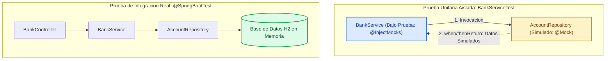

# Pruebas Unitarias y de Integración con JUnit 5 y Mockito

Garantizar la calidad y robustez de una aplicación backend requiere validar que cada componente individual cumpla su contrato y que la integración entre capas funcione como un engranaje coordinado. En el ecosistema de **Spring Boot**, el estándar de facto combina **JUnit 5 (Jupiter)** como motor de pruebas y **Mockito** como framework para la simulación (*mocking*) de dependencias.

---

## 1. Conceptos y Fundamentos Teóricos

### Pruebas Unitarias vs. Pruebas de Integración

| Criterio | Pruebas Unitarias (Unit Tests) | Pruebas de Integración (Integration Tests) |
| :--- | :--- | :--- |
| **Alcance** | Un único método o clase de servicio de forma aislada. | Múltiples capas (Controller + Service + Repository + BD). |
| **Contexto de Spring** | No carga `ApplicationContext` (ejecución ultrarrápida). | Levanta el contexto de Spring (`@SpringBootTest`). |
| **Dependencias** | Se reemplazan por objetos simulados (`@Mock`). | Se inyectan beans reales o se usan bases de datos en memoria (H2/Testcontainers). |
| **Velocidad** | Decenas de pruebas por segundo (< 100 ms). | Segundos por suite (requiere inicio de contexto de Spring). |
| **Objetivo** | Probar lógica de negocio, ramas condicionales y excepciones. | Probar transacciones, mapeos JPA, queries SQL y configuración. |

### Arquitectura de Capas y Aislamiento con Mockito



#### Explicación de los Componentes del Diagrama

1. **`@Mock` (Dependencia Simulada)**: Crea una instancia ficticia de `AccountRepository`. No ejecuta código real ni abre conexiones a bases de datos; responde exclusivamente con los valores programados con `when(...)`.
2. **`@InjectMocks` (Clase Bajo Prueba)**: Crea una instancia real de `BankService` e inyecta automáticamente los campos anotados con `@Mock`.
3. **Contexto de Integración**: Levanta el contenedor completo de Spring, validando consultas SQL contra un esquema de base de datos en memoria y verificando transacciones.

### Patrón Arrange - Act - Assert (AAA)

Toda prueba bien estructurada debe organizarse en tres fases claras:
- **Arrange (Preparación)**: Crear objetos de prueba, configurar respuestas esperadas en los mocks (`when(...).thenReturn(...)`).
- **Act (Ejecución)**: Llamar al método específico de la unidad bajo prueba.
- **Assert (Verificación)**: Comprobar el valor retornado (`assertEquals`, `assertTrue`) y verificar las interacciones con los mocks (`verify(...)`).

---

## 2. Guía Práctica: Paso a Paso

Aprenderás a estructurar dependencias, implementar pruebas unitarias con Mockito y crear pruebas de integración con perfiles aislados.

<StepByStep>
  <Step number="1" title="Verificar Dependencias en pom.xml">
    Spring Boot provee el iniciador `spring-boot-starter-test`, el cual agrupa automáticamente JUnit 5, Mockito, AssertJ y herramientas de prueba.

```xml title="pom.xml" showLineNumbers
<dependencies>
    <!-- Incluye JUnit 5, Mockito, Hamcrest y Spring Test -->
    <dependency>
        <groupId>org.springframework.boot</groupId>
        <artifactId>spring-boot-starter-test</artifactId>
        <scope>test</scope>
    </dependency>

    <!-- Base de datos en memoria para pruebas de integración -->
    <dependency>
        <groupId>com.h2database</groupId>
        <artifactId>h2</artifactId>
        <scope>test</scope>
    </dependency>
</dependencies>
```
  </Step>

  <Step number="2" title="Implementar la Clase de Servicio Bajo Prueba">
    Presentamos el servicio con inyección por constructor (la mejor práctica para facilitar la inyección de mocks).

```java title="src/main/java/com/icesi/service/BankService.java" showLineNumbers
package com.icesi.service;

import com.icesi.model.Account;
import com.icesi.repository.AccountRepository;
import org.springframework.stereotype.Service;

import java.util.Optional;

@Service
public class BankService {

    private final AccountRepository accountRepository;

    public BankService(AccountRepository accountRepository) {
        this.accountRepository = accountRepository;
    }

    /**
     * Transfiere fondos entre dos cuentas.
     * @return true si la transferencia fue exitosa, false si el saldo es insuficiente
     */
    public boolean transfer(Long fromId, Long toId, double amount) {
        if (amount <= 0) {
            throw new IllegalArgumentException("El monto a transferir debe ser positivo");
        }

        Account from = accountRepository.findById(fromId)
                .orElseThrow(() -> new IllegalArgumentException("Cuenta de origen no encontrada"));
        Account to = accountRepository.findById(toId)
                .orElseThrow(() -> new IllegalArgumentException("Cuenta de destino no encontrada"));

        if (from.getBalance() < amount) {
            return false;
        }

        from.setBalance(from.getBalance() - amount);
        to.setBalance(to.getBalance() + amount);

        accountRepository.save(from);
        accountRepository.save(to);
        return true;
    }
}
```
  </Step>

  <Step number="3" title="Escribir la Prueba Unitaria con Mockito">
    Anotamos la clase con `@ExtendWith(MockitoExtension.class)`. No se utiliza ninguna anotación de Spring como `@SpringBootTest` para mantener la ejecución instantánea.

```java title="src/test/java/com/icesi/service/BankServiceTest.java" showLineNumbers
package com.icesi.service;

import com.icesi.model.Account;
import com.icesi.repository.AccountRepository;
import org.junit.jupiter.api.DisplayName;
import org.junit.jupiter.api.Test;
import org.junit.jupiter.api.extension.ExtendWith;
import org.mockito.InjectMocks;
import org.mockito.Mock;
import org.mockito.junit.jupiter.MockitoExtension;

import java.util.Optional;

import static org.junit.jupiter.api.Assertions.*;
import static org.mockito.Mockito.*;

@ExtendWith(MockitoExtension.class)
class BankServiceTest {

    @Mock
    private AccountRepository accountRepository;

    @InjectMocks
    private BankService bankService;

    @Test
    @DisplayName("Debe transferir exitosamente cuando el saldo es suficiente")
    void shouldTransferFundsSuccessfully() {
        // 1. Arrange (Preparar datos y simular comportamiento)
        Account sourceAccount = new Account(1L, "Carol", 100.0);
        Account destinationAccount = new Account(2L, "Juan", 50.0);

        when(accountRepository.findById(1L)).thenReturn(Optional.of(sourceAccount));
        when(accountRepository.findById(2L)).thenReturn(Optional.of(destinationAccount));

        // 2. Act (Ejecutar método)
        boolean result = bankService.transfer(1L, 2L, 30.0);

        // 3. Assert (Verificar estado y llamadas a dependencias)
        assertTrue(result);
        assertEquals(70.0, sourceAccount.getBalance());
        assertEquals(80.0, destinationAccount.getBalance());

        // Verificamos que se llamó al repositorio para persistir ambas cuentas
        verify(accountRepository, times(1)).save(sourceAccount);
        verify(accountRepository, times(1)).save(destinationAccount);
    }

    @Test
    @DisplayName("Debe retornar false y no guardar cuentas si el saldo es insuficiente")
    void shouldReturnFalseWhenInsufficientBalance() {
        // Arrange
        Account sourceAccount = new Account(1L, "Carol", 20.0);
        Account destinationAccount = new Account(2L, "Juan", 50.0);

        when(accountRepository.findById(1L)).thenReturn(Optional.of(sourceAccount));
        when(accountRepository.findById(2L)).thenReturn(Optional.of(destinationAccount));

        // Act
        boolean result = bankService.transfer(1L, 2L, 100.0);

        // Assert
        assertFalse(result);
        assertEquals(20.0, sourceAccount.getBalance());
        // El repositorio nunca debe invocar save
        verify(accountRepository, never()).save(any(Account.class));
    }

    @Test
    @DisplayName("Debe lanzar IllegalArgumentException si el monto es negativo")
    void shouldThrowExceptionWhenAmountIsNegative() {
        assertThrows(IllegalArgumentException.class, () -> {
            bankService.transfer(1L, 2L, -10.0);
        });

        // Verificamos que ni siquiera se consultó la base de datos
        verifyNoInteractions(accountRepository);
    }
}
```
  </Step>

  <Step number="4" title="Configurar un Perfil Aislado para Pruebas de Integración">
    Para no alterar la base de datos de producción o desarrollo local durante los tests, creamos un archivo de propiedades específico para el entorno de pruebas.

```properties title="src/test/resources/application-test.properties" showLineNumbers
# Base de datos en memoria H2
spring.datasource.url=jdbc:h2:mem:testdb;DB_CLOSE_DELAY=-1
spring.datasource.driverClassName=org.h2.Driver
spring.datasource.username=sa
spring.datasource.password=

# Hibernate regenera el esquema automáticamente para cada ejecución de test
spring.jpa.database-platform=org.hibernate.dialect.H2Dialect
spring.jpa.hibernate.ddl-auto=create-drop
spring.jpa.show-sql=true
```
  </Step>

  <Step number="5" title="Escribir la Prueba de Integración con @SpringBootTest">
    Utilizamos `@SpringBootTest` junto con `@ActiveProfiles("test")` para ejecutar pruebas end-to-end sobre la base de datos de prueba en memoria.

```java title="src/test/java/com/icesi/integration/AccountRepositoryIntegrationTest.java" showLineNumbers
package com.icesi.integration;

import com.icesi.model.Account;
import com.icesi.repository.AccountRepository;
import org.junit.jupiter.api.DisplayName;
import org.junit.jupiter.api.Test;
import org.springframework.beans.factory.annotation.Autowired;
import org.springframework.boot.test.context.SpringBootTest;
import org.springframework.test.context.ActiveProfiles;
import org.springframework.transaction.annotation.Transactional;

import java.util.Optional;

import static org.junit.jupiter.api.Assertions.*;

@SpringBootTest
@ActiveProfiles("test")
@Transactional // Revierta las inserciones al finalizar cada prueba
class AccountRepositoryIntegrationTest {

    @Autowired
    private AccountRepository accountRepository;

    @Test
    @DisplayName("Debe persistir y recuperar una cuenta en la base de datos H2")
    void shouldPersistAndRetrieveAccount() {
        Account account = new Account(null, "Diana", 450.0);

        Account saved = accountRepository.save(account);
        assertNotNull(saved.getId(), "El ID autogenerado no debe ser nulo");

        Optional<Account> retrieved = accountRepository.findById(saved.getId());
        assertTrue(retrieved.isPresent());
        assertEquals("Diana", retrieved.get().getOwnerName());
        assertEquals(450.0, retrieved.get().getBalance());
    }
}
```
  </Step>

  <Step number="6" title="Ejecutar las Pruebas desde la Terminal o el IDE">
    Para compilar y ejecutar la suite de pruebas automatizadas, puedes emplear el **Maven Wrapper** incluido en el proyecto (`mvnw` o `mvnw.cmd`) o la instalación global de `mvn`.

<Tabs>
  <TabItem value="wrapper-win" label="Windows (PowerShell / CMD)" default>

```powershell title="Ejecutar todas las pruebas del proyecto"
# Ejecuta todas las pruebas unitarias y de integración
.\mvnw.cmd test

# Ejecutar una sola clase de prueba específica
.\mvnw.cmd test -Dtest=BankServiceTest

# Ejecutar un método de prueba puntual dentro de una clase
.\mvnw.cmd test -Dtest=BankServiceTest#shouldTransferFundsSuccessfully

# Empaquetar el proyecto omitiendo las pruebas (cuando solo requieres compilar)
.\mvnw.cmd package -DskipTests
```

  </TabItem>
  <TabItem value="wrapper-unix" label="macOS y Linux (Bash / Zsh)">

```bash title="Ejecutar todas las pruebas del proyecto"
# Asegurar permisos de ejecución en sistemas Unix (si aplica)
chmod +x mvnw

# Ejecuta todas las pruebas del proyecto
./mvnw test

# Ejecutar una clase de prueba específica
./mvnw test -Dtest=BankServiceTest

# Ejecutar un único método de prueba
./mvnw test -Dtest=BankServiceTest#shouldTransferFundsSuccessfully

# Compilar omitiendo pruebas
./mvnw package -DskipTests
```

  </TabItem>
  <TabItem value="ide" label="Desde el IDE (IntelliJ IDEA / VS Code)">

**IntelliJ IDEA:**
Haz clic en el ícono de flecha verde junto al nombre de la clase de prueba o del método (`Ctrl + Shift + F10` en Windows o `Ctrl + Shift + R` en macOS).

**VS Code:**
Instala la extensión **Extension Pack for Java** y el **Test Runner for Java**. Aparecerá un botón "Run Test" / "Debug Test" sobre cada método `@Test`.

**Reportes de ejecución:**
Maven genera un informe detallado de resultados en la carpeta `target/surefire-reports/`.

  </TabItem>
</Tabs>

:::tip[¿Por qué usar el Maven Wrapper (mvnw)?]
El archivo `mvnw` garantiza que todos los desarrolladores del equipo y los servidores de Integración Continua (CI/CD) ejecuten las pruebas con exactamente la misma versión de Maven sin necesidad de instalarla previamente en el sistema operativo.
:::
  </Step>
</StepByStep>

---

## 3. Cheatsheet de Referencia: JUnit 5 y Mockito

### Métodos de Aserción en JUnit 5

| Assert | Propósito | Ejemplo Práctico |
| :--- | :--- | :--- |
| `assertEquals(expected, actual)` | Valida igualdad exacta de valores o instancias. | `assertEquals(100.0, account.getBalance());` |
| `assertTrue(condition)` | Valida que una expresión booleana sea verdadera. | `assertTrue(result);` |
| `assertFalse(condition)` | Valida que una expresión booleana sea falsa. | `assertFalse(isBlocked);` |
| `assertNull(obj)` / `assertNotNull(obj)` | Verifica si una referencia es nula o no nula. | `assertNotNull(saved.getId());` |
| `assertThrows(Class, Executable)` | Confirma que un bloque de código lance una excepción. | `assertThrows(IllegalArgumentException.class, () -> service.pay(-5));` |
| `assertAll(Executables...)` | Agrupa aserciones ejecutándolas todas y reportando todos los fallos juntos. | `assertAll(() -> assertTrue(a), () -> assertEquals(2, b));` |

### Métodos Clave de Mockito

| Método | Propósito | Ejemplo |
| :--- | :--- | :--- |
| `when(mock.m()).thenReturn(v)` | Programa el valor de retorno simulado. | `when(repo.findById(1L)).thenReturn(Optional.of(acc));` |
| `when(mock.m()).thenThrow(ex)` | Fuerza a que la llamada al mock lance una excepción. | `when(repo.save(any())).thenThrow(new RuntimeException());` |
| `verify(mock, times(n)).m()` | Verifica que el método del mock se haya invocado `n` veces. | `verify(repo, times(1)).save(acc);` |
| `verify(mock, never()).m()` | Verifica que el método **nunca** haya sido ejecutado. | `verify(repo, never()).delete(any());` |
| `verifyNoInteractions(mock)` | Garantiza que ninguna llamada fue realizada sobre el mock. | `verifyNoInteractions(repo);` |
| `any(Class)` | Matcher comodín para aceptar cualquier argumento de ese tipo. | `verify(repo).save(any(Account.class));` |

---

## 4. Cuestionario de Autoevaluación

<Quiz id="comp2-semana6-pruebas-mockito-quiz">
  <Question title="¿Cuál es la principal diferencia entre una prueba unitaria y una de integración en Spring Boot?">
    <Option>Las pruebas unitarias solo pueden ejecutarse en servidores Linux.</Option>
    <Option correct>Las pruebas unitarias aíslan la lógica sin levantar el ApplicationContext de Spring, mientras que las de integración cargan el contexto y sus dependencias.</Option>
    <Option>Las pruebas de integración nunca interactúan con bases de datos ni con repositorios.</Option>
    <Option>Las pruebas unitarias requieren obligatoriamente la anotación @SpringBootTest.</Option>
  </Question>
  <Question title="¿Qué anotación de JUnit 5 permite habilitar las anotaciones @Mock y @InjectMocks de Mockito en la clase de prueba?">
    <Option>@EnableAutoConfiguration</Option>
    <Option>@SpringBootTest</Option>
    <Option correct>@ExtendWith(MockitoExtension.class)</Option>
    <Option>@ContextConfiguration</Option>
  </Question>
  <Question title="¿Cuál es la función exacta de la anotación @InjectMocks en una prueba unitaria?">
    <Option>Simular una base de datos relacional completa.</Option>
    <Option correct>Crear una instancia real de la clase bajo prueba e inyectar en ella automáticamente los campos simulados (@Mock).</Option>
    <Option>Convertir el método de prueba en un endpoint HTTP invocable.</Option>
    <Option>Desactivar todas las aserciones de JUnit 5.</Option>
  </Question>
  <Question title="En el patrón de pruebas AAA (Arrange - Act - Assert), ¿qué acción corresponde a la fase 'Arrange'?">
    <Option>Llamar al método de negocio que se desea evaluar.</Option>
    <Option correct>Preparar los datos de entrada y configurar el comportamiento de los mocks mediante when(...).thenReturn(...).</Option>
    <Option>Comprobar mediante assertEquals que el resultado sea el esperado.</Option>
    <Option>Compilar el proyecto con el comando ./mvnw test.</Option>
  </Question>
  <Question title="¿Qué instrucción de Mockito se utiliza para asegurar que un método de un repositorio simulado NUNCA fue ejecutado durante la prueba?">
    <Option>verify(repo, times(1))</Option>
    <Option>verify(repo, atLeastOnce())</Option>
    <Option correct>verify(repo, never()).metodo()</Option>
    <Option>verifyZeroCalls(repo)</Option>
  </Question>
  <Question title="¿Para qué se utiliza la anotación @ActiveProfiles('test') en una clase de prueba de integración?">
    <Option>Para ejecutar la prueba únicamente en usuarios con rol Administrador.</Option>
    <Option correct>Para indicarle a Spring que cargue la configuración de application-test.properties (por ejemplo, una base de datos H2 en memoria).</Option>
    <Option>Para ignorar los fallos de compilación durante el empaquetado.</Option>
    <Option>Para habilitar el autocommit permanente en la base de datos de producción.</Option>
  </Question>
  <Question title="¿Qué método de aserción en JUnit 5 permite agrupar múltiples comprobaciones ejecutándolas todas y reportando todos los fallos juntos?">
    <Option>assertGroup()</Option>
    <Option correct>assertAll()</Option>
    <Option>assertMany()</Option>
    <Option>assertBatch()</Option>
  </Question>
  <Question title="¿Cuál es la ventaja de utilizar el Maven Wrapper (mvnw o mvnw.cmd) para ejecutar las pruebas automatizadas?">
    <Option>Duplica la velocidad del procesador en tiempo de ejecución.</Option>
    <Option correct>Asegura que todos los miembros del equipo y los pipelines de CI/CD ejecuten las pruebas con la misma versión estandarizada de Maven sin instalación previa.</Option>
    <Option>Elimina la necesidad de tener instalado el Java Development Kit (JDK).</Option>
    <Option>Transforma el código Java directamente a bytecode de Python.</Option>
  </Question>
  <Question title="¿Qué comando de Maven Wrapper permite ejecutar únicamente una clase de prueba específica como BankServiceTest?">
    <Option>./mvnw test --class BankServiceTest</Option>
    <Option correct>./mvnw test -Dtest=BankServiceTest</Option>
    <Option>./mvnw run:BankServiceTest</Option>
    <Option>./mvnw test -only BankServiceTest</Option>
  </Question>
  <Question title="¿Qué aserción se debe utilizar para comprobar que un método arroje una excepción esperada al recibir argumentos inválidos?">
    <Option>assertException()</Option>
    <Option correct>assertThrows()</Option>
    <Option>assertFail()</Option>
    <Option>assertError()</Option>
  </Question>
</Quiz>
