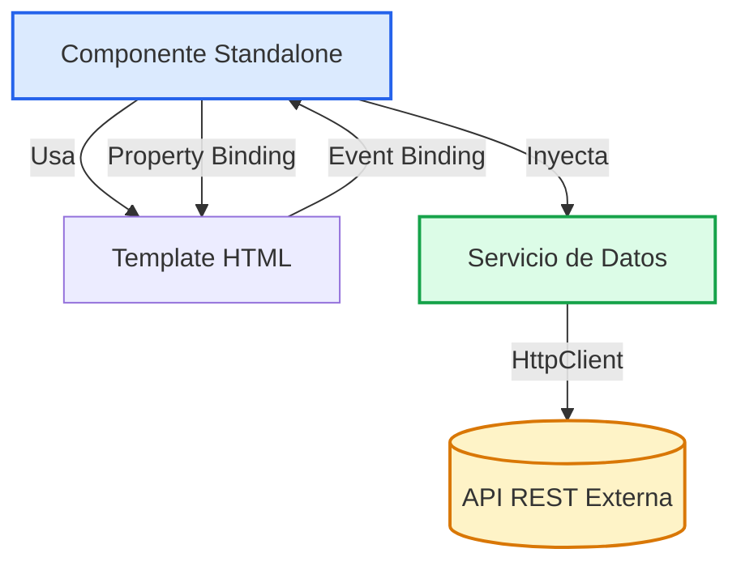

# Angular: Arquitectura y Desarrollo de Aplicaciones Web Modernas

Guía integral de la exposición de **Angular**, cubriendo Standalone Components, Reactividad, Data Binding, Control Flow y Servicios con Inyección de Dependencias.

### Integrantes
- Equipo de Computación en Internet 3 (Usuario Moodle: A00404735)

---

## Diapositivas y Repositorio

<IframeWindow url="/files/computacion-3/exposiciones-de-cursos/2026-02/angular-slides.html" />

:::tip[Modo Presentación]
Puedes interactuar directamente con la presentación arriba. Usa las teclas `→` o `Espacio` para avanzar, `N` para ver las notas del orador, o pulsa `F` para pantalla completa.
:::

:::info[Enlaces del Proyecto y Código Fuente]
- **Repositorio en GitHub:** [Bellito29/angular-proyecto](https://github.com/Bellito29/angular-proyecto)
- **Presentación Web:** [Abrir Diapositivas en pestaña completa](pathname:///files/computacion-3/exposiciones-de-cursos/2026-02/angular-slides.html)
:::

---

## 1. Modelo Mental y Arquitectura

Angular es un framework de desarrollo frontend mantenido por Google, diseñado con una estructura fuertemente tipada sobre TypeScript y una filosofía de baterías incluidas (*batteries-included*):

- **Standalone Components:** A partir de versiones recientes, los componentes ya no requieren `NgModule`, declarando directamente sus propias dependencias e imports.
- **Plantillas HTML Declarativas:** Uso de sintaxis específica para enlazar propiedades, reaccionar a eventos y estructurar el DOM.
- **Inyección de Dependencias (DI):** Sistema jerárquico que provee instancias de servicios compartidos sin instanciarlos manualmente.



---

## 2. Sintaxis de Enlace (Bindings) y Control Flow

| Tipo de Enlace | Sintaxis | Propósito |
| :--- | :--- | :--- |
| **Interpolación** | `{{ valor }}` | Renderiza valores de TypeScript en el texto HTML |
| **Property Binding** | `[propiedad]="variable"` | Modifica atributos y propiedades del elemento DOM |
| **Event Binding** | `(evento)="metodo()"` | Escucha eventos del usuario y ejecuta lógica en el componente |
| **Two-Way Binding** | `[(ngModel)]="variable"` | Sincronización bidireccional entre inputs y estado |

### Nuevo Bloque de Control de Flujo (`@for` y `@if`)

```html title="src/app/task-list.component.html"
@if (tasks.length > 0) {
  <ul>
    @for (task of tasks; track task.id) {
      <li>{{ task.title }}</li>
    }
  </ul>
} @else {
  <p>No hay tareas pendientes.</p>
}
```

:::note[¿Por qué es indispensable track?]
La cláusula `track` permite al algoritmo de reconciliación de Angular identificar de forma unívoca cada elemento, actualizando únicamente los nodos del DOM modificados en lugar de redibujar la lista entera.
:::

---

## 3. Demostración Práctica: Paso a Paso

<StepByStep>
  <Step number="1" title="Instalar Angular CLI y Crear Proyecto">
    Verifica que tienes Node.js 18+ e instala el CLI oficial:

    ```bash
    npm install -g @angular/cli
    ng new angular-demo --standalone --routing --style=css
    cd angular-demo
    ```
  </Step>

  <Step number="2" title="Generar un Servicio con Inyección de Dependencias">
    Crea un servicio para centralizar las peticiones a la API:

    ```bash
    ng generate service services/task
    ```

    ```typescript title="src/app/services/task.service.ts"
    import { Injectable, inject } from '@angular/core';
    import { HttpClient } from '@angular/common/http';
    import { Observable } from 'rxjs';

    @Injectable({ providedIn: 'root' })
    export class TaskService {
      private http = inject(HttpClient);

      getTasks(): Observable<any[]> {
        return this.http.get<any[]>('https://api.example.com/tasks');
      }
    }
    ```
  </Step>

  <Step number="3" title="Crear Componente y Consumir el Servicio">
    ```typescript title="src/app/components/tasks.component.ts"
    import { Component, inject, OnInit } from '@angular/core';
    import { TaskService } from '../services/task.service';

    @Component({
      selector: 'app-tasks',
      standalone: true,
      template: `
        <h2>Lista de Tareas</h2>
        @for (item of tasks; track item.id) {
          <div>{{ item.title }}</div>
        }
      `
    })
    export class TasksComponent implements OnInit {
      private taskService = inject(TaskService);
      tasks: any[] = [];

      ngOnInit() {
        this.taskService.getTasks().subscribe(data => this.tasks = data);
      }
    }
    ```
  </Step>

  <Step number="4" title="Servir la Aplicación">
    ```bash
    ng serve -o
    ```
  </Step>
</StepByStep>
