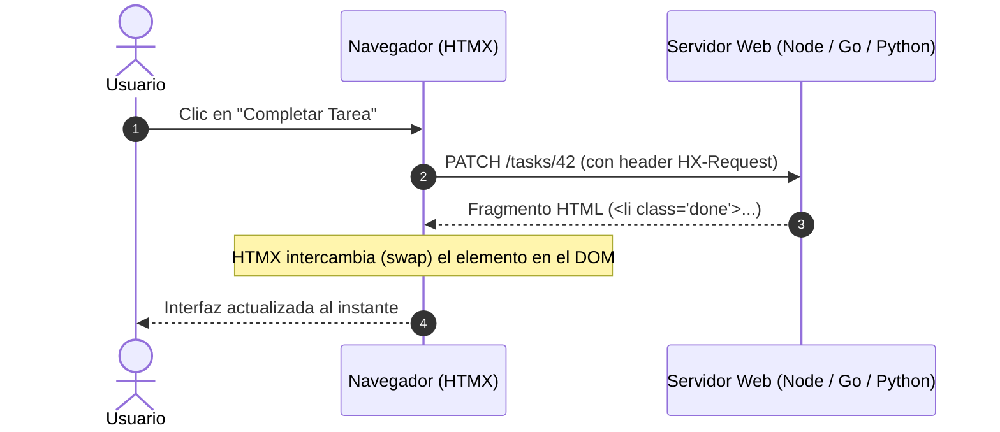

# HTMX y la Arquitectura Hipermedia

Guía y material de la exposición sobre **HTMX**, la arquitectura orientada a hipertexto (HATEOAS), Server-Driven UI y eliminación de complejidad en aplicaciones web.

### Integrantes
- Juan Diego Balanta
- Edwar Estacio
- Valeria Piza

---

## Diapositivas y Recursos

:::tip[Presentación de Diapositivas]
Puedes descargar y revisar la presentación completa en PowerPoint del equipo:
- [Descargar Presentación HTMX (PPTX)](/files/computacion-3/exposiciones-de-cursos/2026-02/HTMX-presentacion.pptx)
:::

:::info[Referencias y Ensayo]
- Roy Fielding, *REST APIs must be hypertext-driven*: [roy.gbiv.com](https://roy.gbiv.com/untangled/2008/rest-apis-must-be-hypertext-driven)
- Modelo de madurez de Richardson: [martinfowler.com](https://martinfowler.com/articles/richardsonMaturityModel.html)
:::

---

## 1. Filosofía: El Hipertexto como Motor de Estado (HATEOAS)

La arquitectura de la Web original concebida por Roy Fielding en la definición formal de REST establece que el cliente navega y muta estados a través de **hipertexto** que contiene los propios controles de navegación y acción.

Con el auge de las SPAs (Single Page Applications), los servidores se redujeron a emitir JSON sin semántica de interacción, obligando a los clientes JavaScript a duplicar lógica de rutas, validación y gestión de estado.

**htmx** rescata la visión original extendiendo el HTML estándar:
- Permite a **cualquier elemento HTML** (no solo `<a>` y `<form>`) emitir peticiones HTTP.
- Permite que las peticiones respondan a **cualquier evento** (como `change`, `keyup`, `intersect`), no solo `click` o `submit`.
- Permite reemplazar partes específicas del DOM con fragmentos de HTML devueltos directamente por el servidor, sin escribir código JavaScript en el cliente.



---

## 2. Atributos Fundamentales de HTMX

| Atributo | Propósito | Ejemplo |
| :--- | :--- | :--- |
| `hx-get` / `hx-post` / `hx-patch` / `hx-delete` | Define la URL y el verbo HTTP de la petición | `hx-post="/tasks"` |
| `hx-target` | Selector CSS del elemento donde se inyectará la respuesta | `hx-target="#task-list"` |
| `hx-swap` | Estrategia de sustitución en el DOM (`innerHTML`, `outerHTML`, `beforebegin`, etc.) | `hx-swap="outerHTML"` |
| `hx-trigger` | Evento o condición que dispara la petición (`click`, `keyup changed delay:500ms`) | `hx-trigger="keyup changed delay:300ms"` |
| `hx-swap-oob` | *Out of Band Swap*: permite actualizar elementos remotos fuera del target en una sola petición | `hx-swap-oob="true"` |

---

## 3. Demostración Práctica: TaskFlow sin JavaScript Propio

TaskFlow demuestra un gestor de tareas completo construido con plantillas en el servidor y HTMX, sin una sola línea de JavaScript propio, con soporte para degradación progresiva (funciona incluso con JavaScript desactivado).

<StepByStep>
  <Step number="1" title="Ejecución de la Demostración">
    ```bash
    # En el directorio del proyecto
    npm install
    npm run dev
    ```
    La aplicación estará disponible en `http://localhost:3000`.
  </Step>

  <Step number="2" title="Edición Inline en el DOM">
    Al hacer clic en el botón **Editar**, HTMX realiza un `GET /tasks/:id/edit` solicitando el fragmento HTML del formulario de edición y reemplazando la fila con `hx-swap="outerHTML"`.
  </Step>

  <Step number="3" title="Actualización Atómica Out of Band (OOB)">
    Al completar una tarea, el servidor devuelve la fila actualizada y un fragmento con `id="task-count"` marcado con `hx-swap-oob="true"`. HTMX actualiza el contador de la cabecera y la fila al mismo tiempo mediante una única petición HTTP.
  </Step>

  <Step number="4" title="Búsqueda con Debounce y Filtros Dinámicos">
    El campo de búsqueda emite peticiones automáticamente al escribir con retardo controlado:

    ```html title="views/search.html"
    <input 
      type="search" 
      name="q" 
      placeholder="Buscar tarea..." 
      hx-get="/tasks" 
      hx-trigger="keyup changed delay:300ms" 
      hx-target="#tasks-container" 
    />
    ```
  </Step>
</StepByStep>
