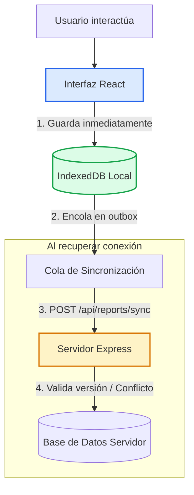

# Aplicaciones Web Offline-First: Arquitectura con PWA e IndexedDB

Guía y material de la exposición sobre **Arquitectura Offline-First**, Progressive Web Apps (PWA), Service Workers, almacenamiento local con IndexedDB y resolución de conflictos de sincronización.

### Integrantes
- María Cristina Angulo - A00404027
- Juan Pablo Serrano - A00404067
- Felipe Calderón - A00404998
- Samuel Navia - A00405006

---

## Diapositivas y Repositorio

<PdfViewer src="/files/computacion-3/exposiciones-de-cursos/2026-02/Offline-First.pdf" />

:::info[Enlaces del Proyecto y Código Fuente]
- **Repositorio en GitHub:** [Philipk84/expo-compunet-3](https://github.com/Philipk84/expo-compunet-3)
- **Presentación (PDF):** [Descargar Offline-First.pdf](/files/computacion-3/exposiciones-de-cursos/2026-02/Offline-First.pdf)
:::

---

## 1. El Paradigma Offline-First

El diseño tradicional de aplicaciones web asume que la conexión a internet es constante y confiable (*Online-First*). Ante un corte o latencia de red, la experiencia de usuario colapsa con pantallas de carga infinitas o errores.

El enfoque **Offline-First** invierte esta prioridad:
- El estado y los datos viven **primero en el dispositivo del cliente** (IndexedDB).
- La interfaz y recursos estáticos se sirven al instante desde la **caché gestionada por el Service Worker**.
- La conexión a internet se trata como un canal de sincronización periódico, no como una dependencia crítica para la operatividad de la aplicación.



---

## 2. Tecnologías Clave de la Arquitectura

### Service Worker y Estrategias de Caché
Un Service Worker es un script que el navegador ejecuta en segundo plano, independiente de la página web. Actúa como un proxy de red programable:
- **Cache First:** Consulta primero la memoria caché local. Si el recurso no existe, lo solicita a la red y lo guarda en caché. Ideal para activos estáticos (HTML, JS, CSS, fuentes).
- **Network First:** Intenta obtener el recurso de la red y recurre a la caché únicamente si la red falla. Ideal para datos que requieren frescura pero admiten respaldo.

### IndexedDB
Base de datos NoSQL transaccional embebida en el navegador capaz de almacenar grandes volúmenes de datos estructurados, blobs y registros con índices para búsqueda rápida.

### Estrategia de Resolución de Conflictos
Cuando un usuario modifica un registro sin conexión desde un dispositivo y otro usuario actualiza el mismo registro simultáneamente:
- **Control de Concurrencia Optimista:** Cada registro cuenta con un número de versión (`version`).
- Si el servidor detecta que la versión enviada no coincide con la versión actual en la base de datos, marca el estado como **Conflicto** y delega en el usuario o en una política de negocio la decisión de fusión.

---

## 3. Demostración Práctica: Bitácora Cero Señal

<StepByStep>
  <Step number="1" title="Instalar y Levantar la Demostración">
    Clona y ejecuta el servidor backend y el frontend React:

    ```bash
    git clone https://github.com/Philipk84/expo-compunet-3
    cd expo-compunet-3
    npm install
    npm run dev
    ```
  </Step>

  <Step number="2" title="Probar el Funcionamiento Offline">
    1. Abre la aplicación en `http://localhost:5173`.
    2. Haz clic en el botón **Simular corte** o activa el modo Offline en DevTools.
    3. Crea un nuevo reporte en la bitácora: observa cómo se guarda inmediatamente en **IndexedDB** con estado **Pendiente**.
  </Step>

  <Step number="3" title="Sincronización al Restablecer Red">
    1. Desactiva la simulación de corte.
    2. Pulsa el botón **Sincronizar ahora** o espera la sincronización automática.
    3. La cola de salida (*outbox*) envía los cambios pendientes y el estado se actualiza a **Sincronizado**.
  </Step>

  <Step number="4" title="Comprobación de Conflictos">
    Modifica el mismo reporte con versiones divergentes y observa el diálogo de resolución de conflictos visual en la interfaz.
  </Step>
</StepByStep>
