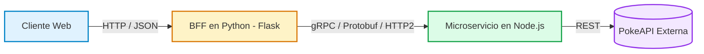

# gRPC: Microservicios Eficientes con Protocol Buffers

Guía y material de la exposición sobre **gRPC**, Protocol Buffers, HTTP/2 y el patrón arquitectónico Backend for Frontend (BFF) utilizando Node.js y Python.

### Integrantes
- Fiber Piedrahita
- Daniel Fajardo
- Paula Ferreira

---

## Diapositivas y Recursos

<PdfViewer src="/files/computacion-3/exposiciones-de-cursos/2026-02/gRPC-Pokedex.pdf" />

:::info[Enlaces del Proyecto y Presentación]
- **Presentación (PDF):** [Descargar gRPC-Pokedex.pdf](/files/computacion-3/exposiciones-de-cursos/2026-02/gRPC-Pokedex.pdf)
- **Documentación Oficial de Protocol Buffers:** [Protobuf Dev](https://protobuf.dev/)
:::

---

## 1. Fundamentos de gRPC y Protocol Buffers

**gRPC** (gRPC Remote Procedure Calls) es un framework de comunicación RPC de alto rendimiento desarrollado por Google. A diferencia de las tradicionales arquitecturas REST basadas en texto JSON sobre HTTP/1.1, gRPC se apoya en dos pilares:

1. **Protocol Buffers (Protobuf):** Mecanismo de serialización binaria fuertemente tipado y agnóstico al lenguaje de programación.
2. **Transporte HTTP/2:** Soporta multiplexación de múltiples peticiones sobre una misma conexión TCP, compresión de encabezados (HPACK) y streaming bidireccional.



---

## 2. Comparación: gRPC vs. REST

| Criterio | gRPC | REST Tradicional |
| :--- | :--- | :--- |
| **Protocolo de Red** | HTTP/2 (Multiplexado) | Generalmente HTTP/1.1 o HTTP/2 |
| **Formato de Carga** | Binario (Protocol Buffers) | Texto (JSON o XML) |
| **Definición de Contrato** | Obligatoria y estricta (`.proto`) | Opcional (OpenAPI / Swagger) |
| **Rendimiento** | Altísimo rendimiento y bajo consumo de ancho de banda | Mayor sobrecarga por tamaño de texto |
| **Transmisión** | Unario, Server/Client Streaming y Bidireccional | Típicamente petición / respuesta unaria |
| **Caso de Uso Ideal** | Comunicación interna entre microservicios | APIs públicas para navegadores y terceros |

---

## 3. Demostración Práctica: Pokédex con Arquitectura BFF

<StepByStep>
  <Step number="1" title="Definir el Contrato en Protocol Buffers">
    ```protobuf title="proto/pokemon.proto"
    syntax = "proto3";

    package pokemon;

    service PokemonService {
      rpc GetPokemon (PokemonRequest) returns (PokemonResponse);
    }

    message PokemonRequest {
      string name_or_id = 1;
    }

    message PokemonResponse {
      int32 id = 1;
      string name = 2;
      int32 height = 3;
      int32 weight = 4;
      repeated string types = 5;
      string sprite_url = 6;
      string description = 7;
    }
    ```
  </Step>

  <Step number="2" title="Implementar Servidor gRPC en Node.js">
    El servidor en Node.js carga el contrato `.proto`, consulta PokeAPI y responde al cliente gRPC en formato binario estructurado:

    ```bash
    cd backend_node
    npm install
    node server.js
    ```
  </Step>

  <Step number="3" title="Implementar el Cliente gRPC en Python (Flask)">
    El BFF en Python actúa como cliente de gRPC, compilando los stubs y exponiendo la ruta web para el navegador:

    ```bash
    cd frontend_python
    python -m venv venv
    source venv/bin/activate  # En Windows: venv\Scripts\activate
    pip install -r requirements.txt
    python app.py
    ```
  </Step>
</StepByStep>
