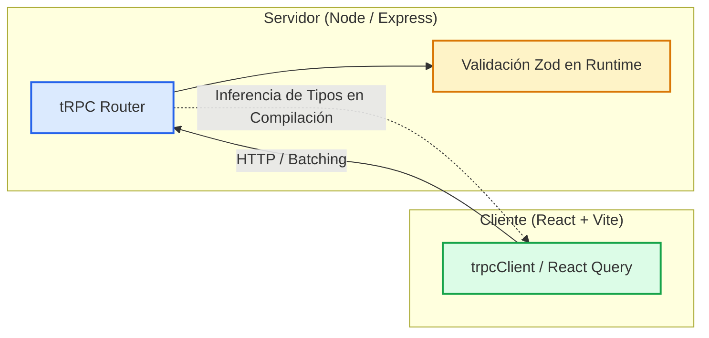

# tRPC: End-to-End Type Safety sin Generación de Código

Guía completa y material de la exposición sobre **tRPC** para arquitecturas Fullstack basadas en TypeScript (React, Node.js, Express y MongoDB).

### Integrantes
- Alejandro Vargas - A00404840
- Juan José Muñoz - A00450054
- David Chicué - A00405613
- Victoria Restrepo - A00405025

---

## Diapositivas y Recursos

<PdfViewer src="/files/computacion-3/exposiciones-de-cursos/2026-02/tRPC.pdf" />

:::info[Enlaces del Proyecto y Presentación]
- **Presentación (PDF):** [Descargar tRPC.pdf](/files/computacion-3/exposiciones-de-cursos/2026-02/tRPC.pdf)
- **Documentación Oficial:** [tRPC Documentation](https://trpc.io)
:::

---

## 1. ¿Qué es tRPC y qué problema resuelve?

En el desarrollo Fullstack tradicional (REST o GraphQL), mantener la consistencia de tipos entre cliente y servidor exige:
- Escribir manualmente interfaces duplicadas en ambos lados.
- O recurrir a herramientas generadoras de código (*code-gen*) a partir de esquemas OpenAPI o GraphQL.

**tRPC** revoluciona este flujo eliminando la necesidad de esquemas intermedios. Aprovecha la inferencia de tipos de TypeScript: **el tipo del router del backend se importa directamente como tipo en el frontend**.



### Ventajas Principales
- **Cero Code-Gen:** No requiere compilar archivos `.proto` ni esquemas `.graphql`.
- **Detección Inmediata de Errores:** Si cambias el nombre de un campo en el servidor, tu editor resalta el error en el frontend de inmediato.
- **Autocompletado Total:** Los procedimientos, parámetros y respuestas cuentan con IntelliSense en el cliente.
- **Validación con Zod:** Garantiza que los datos recibidos en tiempo de ejecución coincidan con los tipos de TypeScript.

---

## 2. Queries vs. Mutations

- **Query:** Equivalente semántico a `GET`. Se utiliza para obtener datos sin modificar el estado del servidor.
- **Mutation:** Equivalente semántico a `POST`, `PUT` o `DELETE`. Se utiliza para crear, actualizar o eliminar recursos.

---

## 3. Demostración Práctica: Gestor de Tareas Fullstack

<StepByStep>
  <Step number="1" title="Definir el Router en el Servidor">
    ```typescript title="server/src/trpc.ts"
    import { initTRPC } from '@trpc/server';
    import { z } from 'zod';

    const t = initTRPC.create();
    export const router = t.router;
    export const publicProcedure = t.procedure;

    export const appRouter = router({
      getTasks: publicProcedure.query(async () => {
        return [{ id: '1', title: 'Aprender tRPC', completed: false }];
      }),
      createTask: publicProcedure
        .input(z.object({ title: z.string().min(3) }))
        .mutation(async ({ input }) => {
          return { id: Date.now().toString(), title: input.title, completed: false };
        })
    });

    export type AppRouter = typeof appRouter;
    ```
  </Step>

  <Step number="2" title="Conectar el Router a Express">
    ```typescript title="server/src/index.ts"
    import express from 'express';
    import * as trpcExpress from '@trpc/server/adapters/express';
    import { appRouter } from './trpc';

    const app = express();
    app.use(
      '/trpc',
      trpcExpress.createExpressMiddleware({
        router: appRouter,
      })
    );

    app.listen(4000, () => console.log('Server running on port 4000'));
    ```
  </Step>

  <Step number="3" title="Consumir en React con Seguridad de Tipos">
    ```typescript title="client/src/App.tsx"
    import { createTRPCReact } from '@trpc/react-query';
    import type { AppRouter } from '../../server/src/trpc';

    export const trpc = createTRPCReact<AppRouter>();

    export function TaskList() {
      const { data: tasks, isLoading } = trpc.getTasks.useQuery();
      const createTask = trpc.createTask.useMutation();

      if (isLoading) return <div>Cargando tareas...</div>;

      return (
        <div>
          <h2>Tareas</h2>
          {tasks?.map(t => <p key={t.id}>{t.title}</p>)}
          <button onClick={() => createTask.mutate({ title: 'Nueva Tarea' })}>
            Agregar Tarea
          </button>
        </div>
      );
    }
    ```
  </Step>
</StepByStep>
