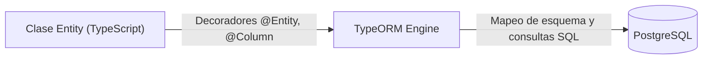
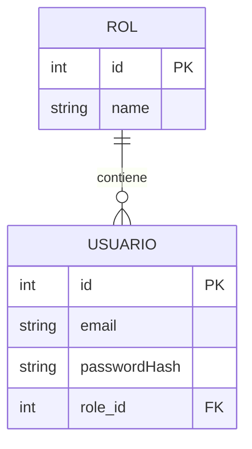

# Configuración de TypeORM y Entidades

En la guía anterior construimos el módulo de usuarios utilizando almacenamiento en memoria. Sin embargo, en un entorno de producción necesitamos persistencia real en una base de datos relacional. TypeORM es el puente entre nuestro código TypeScript en NestJS y el motor de base de datos PostgreSQL. Esta guía muestra cómo traducir diagramas de entidad-relación (ER) a entidades decoradas de TypeScript y configurar la infraestructura con Docker Compose.

---

## 1. ¿Qué es TypeORM y por qué lo necesitamos?

TypeORM es un **Object-Relational Mapper (ORM)**, una herramienta que permite interactuar con bases de datos relacionales mediante clases y objetos de TypeScript en lugar de escribir consultas SQL directas de manera manual.

* **Sin TypeORM:** Deberíamos escribir sentencias SQL crudas (`CREATE TABLE...`, `ALTER TABLE...`, `SELECT * FROM...`) y realizar el mapeo de tipos y relaciones manualmente.
* **Con TypeORM:** Definimos clases de **Entidad (Entity)** decoradas. TypeORM se encarga de crear las tablas, definir sus columnas, llaves primarias, restricciones de integridad y relaciones foráneas de forma automática o mediante migraciones.



---

## 2. Del Diagrama ER al Código: Traducción de Esquemas

Tomemos como caso de estudio la relación entre `USUARIO` y `ROL`. En este modelo, un rol puede agrupar a múltiples usuarios, mientras que cada usuario tiene asignado un único rol (relación 1:N / N:1).



La siguiente tabla resume la correspondencia entre los elementos del diagrama relacional y los decoradores de TypeORM:

| En el diagrama ER | En TypeORM (TypeScript) | Opciones comunes |
|---|---|---|
| Entidad (Tabla) | `@Entity('nombre_tabla')` | `{ name: 'users' }` |
| Llave primaria autoincremental | `@PrimaryGeneratedColumn()` | `'increment'`, `'uuid'` |
| Atributo / Columna | `@Column()` | `{ unique: true, nullable: false, length: 120 }` |
| Relación 1:N (Uno a muchos) | `@OneToMany(() => Target, (target) => target.property)` | En la entidad principal (ej. `Role`) |
| Relación N:1 (Muchos a uno) | `@ManyToOne(() => Target, (target) => target.property)` | En la entidad con la FK (ej. `User`) |
| Llave foránea explícita | `@JoinColumn({ name: 'col_name' })` | Define el nombre físico de la columna FK en PostgreSQL |

---

## 3. Guía Práctica de Configuración y Entidades

<StepByStep>

<Step>
### Instalación de dependencias

Instala los paquetes necesarios de TypeORM, el módulo de configuración y el cliente de PostgreSQL (`pg`):

```bash
npm install --save @nestjs/typeorm typeorm @nestjs/config pg
```
</Step>

<Step>
### Configuración de variables de entorno (`.env`)

Crea un archivo `.env` en la raíz del proyecto para centralizar las credenciales de conexión sin exponer secretos en el código fuente ni en el repositorio:

```env title=".env" showLineNumbers
# Configuración de Base de Datos
DB_HOST=localhost
DB_PORT=5437
DB_USERNAME=postgres
DB_PASSWORD=postgres
DB_DATABASE=nest_db
```
</Step>

<Step>
### Configuración de PostgreSQL con Docker (`docker-compose.yml`)

Crea el archivo `docker-compose.yml` en la raíz del proyecto para instanciar PostgreSQL **v18**, mapeando el puerto externo `5437` al puerto interno `5432`:

```yaml title="docker-compose.yml" showLineNumbers
services:
  db:
    image: postgres:18
    restart: always
    environment:
      POSTGRES_USER: ${DB_USERNAME}
      POSTGRES_PASSWORD: ${DB_PASSWORD}
      POSTGRES_DB: ${DB_DATABASE}
    ports:
      - '${DB_PORT}:5432'
    volumes:
      - postgres-data:/var/lib/postgresql/data

volumes:
  postgres-data:
```

Inicia el contenedor en segundo plano:

```bash
docker compose up -d
```
</Step>

<Step>
### Configuración de TypeORM en AppModule

Conecta NestJS con PostgreSQL utilizando `TypeOrmModule.forRootAsync()` e inyectando `ConfigService` para resolver las variables de entorno de forma asíncrona:

```typescript title="src/app.module.ts" showLineNumbers
import { Module } from '@nestjs/common';
import { TypeOrmModule } from '@nestjs/typeorm';
import { ConfigModule, ConfigService } from '@nestjs/config';

@Module({
  imports: [
    ConfigModule.forRoot({
      isGlobal: true,
    }),
    TypeOrmModule.forRootAsync({
      imports: [ConfigModule],
      inject: [ConfigService],
      useFactory: (configService: ConfigService) => ({
        type: 'postgres',
        host: configService.get<string>('DB_HOST'),
        port: configService.get<number>('DB_PORT'),
        username: configService.get<string>('DB_USERNAME'),
        password: configService.get<string>('DB_PASSWORD'),
        database: configService.get<string>('DB_DATABASE'),
        entities: [__dirname + '/**/*.entity{.ts,.js}'],
        synchronize: true, // Sincroniza esquemas automáticamente en desarrollo
      }),
    }),
  ],
})
export class AppModule {}
```
</Step>

<Step>
### Decoradores y Atributos de Entidad

A continuación se detallan las opciones y comportamientos principales de los decoradores de TypeORM:

#### 1. `@Entity(name?: string, options?: EntityOptions)`
Define que la clase mapea una tabla en la base de datos. Si no se especifica el nombre, se emplea el nombre de la clase en minúsculas.

```typescript title="src/roles/entities/role.entity.ts"
@Entity('roles') // Nombre explícito de la tabla en PostgreSQL
```

#### 2. `@PrimaryGeneratedColumn(strategy?: string)`
Establece la clave primaria generada automáticamente.
* `'increment'`: Clave autoincremental de tipo entero (comportamiento por defecto).
* `'uuid'`: Identificador único universal (ideal para sistemas distribuidos y mayor seguridad).

#### 3. `@Column(options?: ColumnOptions)`
Configura las propiedades físicas de la columna en la tabla:
* `type`: Tipo de dato SQL (`'varchar'`, `'int'`, `'boolean'`, `'text'`, `'timestamp'`, etc.).
* `unique`: Si es `true`, crea una restricción de unicidad en toda la tabla.
* `nullable`: Si es `true`, permite valores nulos (`NULL`). Por defecto es `false`.
* `default`: Establece un valor predeterminado si no se suministra uno.
* `length`: Define la longitud máxima para campos de texto como `varchar`.

```typescript title="src/users/entities/user.entity.ts"
@Column({ type: 'varchar', length: 120, unique: true, nullable: false })
email: string;

@Column({ type: 'boolean', default: true })
isActive: boolean;
```

#### 4. Relaciones: `@OneToMany`, `@ManyToOne` y `@JoinColumn`
* `@OneToMany(() => Target, (target) => target.property)`: Se declara en el lado "Uno" de la relación y retorna un arreglo con las entidades asociadas.
* `@ManyToOne(() => Target, (target) => target.property)`: Se declara en el lado "Muchos" (la entidad que porta la clave foránea).
* `@JoinColumn({ name: 'col_name' })`: Especifica el nombre de la columna física de la clave foránea en la tabla.

```typescript title="src/roles/entities/role.entity.ts" showLineNumbers
import { Entity, PrimaryGeneratedColumn, Column, OneToMany } from 'typeorm';
import { User } from '../../users/entities/user.entity';

@Entity('roles')
export class Role {
  @PrimaryGeneratedColumn()
  id: number;

  @Column({ type: 'varchar', length: 50, unique: true })
  name: string;

  // Un rol puede estar asignado a múltiples usuarios
  @OneToMany(() => User, (user) => user.role)
  users: User[];
}
```

```typescript title="src/users/entities/user.entity.ts" showLineNumbers
import { Entity, PrimaryGeneratedColumn, Column, ManyToOne, JoinColumn } from 'typeorm';
import { Role } from '../../roles/entities/role.entity';

@Entity('users')
export class User {
  @PrimaryGeneratedColumn()
  id: number;

  @Column({ type: 'varchar', length: 120, unique: true })
  email: string;

  @Column({ type: 'varchar', length: 255 })
  passwordHash: string;

  // Muchos usuarios están asociados a un solo rol
  @ManyToOne(() => Role, (role) => role.users, { nullable: false })
  @JoinColumn({ name: 'role_id' }) // Columna física 'role_id' como FK en la tabla 'users'
  role: Role;
}
```
</Step>

</StepByStep>

---

## 4. Poblado de Datos Iniciales (Seed Script en SQL)

Al iniciar un desarrollo, suele ser necesario contar con registros base iniciales (por ejemplo, los roles `"ADMIN"`, `"USER"` y `"GUEST"`, o un usuario administrador predeterminado).

Una estrategia limpia y directa consiste en crear un script SQL en una carpeta `/db` en la raíz del proyecto y ejecutarlo dentro del contenedor PostgreSQL mediante Docker Compose.

### Creación del archivo SQL (`db/seed.sql`)

Crea la carpeta `db/` y agrega el archivo `seed.sql`:

```sql title="db/seed.sql" showLineNumbers
-- Insertar roles base si no existen previamente
INSERT INTO roles (name) 
VALUES ('ADMIN'), ('USER'), ('GUEST')
ON CONFLICT (name) DO NOTHING;

-- Insertar usuario administrador por defecto vinculado al rol ADMIN
INSERT INTO users (email, "passwordHash", role_id)
VALUES (
  'admin@docukelo.edu.co',
  'secret_hashed_password',
  (SELECT id FROM roles WHERE name = 'ADMIN')
)
ON CONFLICT (email) DO NOTHING;
```

### Ejecución del Seed en Docker

Una vez que TypeORM haya generado las tablas (al iniciar la aplicación con `synchronize: true`), ejecuta el script directamente en el contenedor con `docker compose exec`:

```bash
docker compose exec -T db psql -U postgres -d nest_db < db/seed.sql
```

* **`docker compose exec -T db`**: Ejecuta un comando en el contenedor del servicio `db` sin asignar un pseudo-TTY (necesario para redirección de entrada).
* **`psql -U postgres -d nest_db`**: Inicia el cliente interactivo de PostgreSQL sobre la base de datos configurada.
* **`< db/seed.sql`**: Redirige el contenido del archivo local como entrada estándar del cliente `psql`.

---

## Autoevaluación

<Quiz id="compu3-typeorm-intro-quiz">

<Question title="¿Cuál es la función principal del decorador @Entity()?">
  <Option>Convertir la clase en un controlador HTTP de NestJS</Option>
  <Option>Generar una llave primaria autoincremental</Option>
  <Option>Inyectar un repositorio en los servicios de la aplicación</Option>
  <Option correct>Indicar a TypeORM que la clase de TypeScript representa una tabla en la base de datos PostgreSQL</Option>
</Question>

<Question title="¿Qué opción de @Column se utiliza para permitir que una columna acepte valores nulos en la base de datos?">
  <Option>unique: true</Option>
  <Option correct>nullable: true</Option>
  <Option>default: null</Option>
  <Option>optional: true</Option>
</Question>

<Question title="¿Para qué sirve el decorador @JoinColumn(&#123; name: 'role_id' &#125;) en una relación @ManyToOne?">
  <Option>Para unir dos tablas mediante una consulta INNER JOIN en tiempo de compilación</Option>
  <Option correct>Para especificar el nombre exacto que tendrá la columna de clave foránea (FK) en la tabla física</Option>
  <Option>Para indicar cuál es la clave primaria de la tabla destino</Option>
  <Option>Para deshabilitar la creación de la clave foránea</Option>
</Question>

<Question title="¿En qué entorno se debe mantener activada la opción 'synchronize: true' de TypeORM?">
  <Option correct>Únicamente en desarrollo local, ya que puede alterar o eliminar esquemas y datos existentes automáticamente</Option>
  <Option>Únicamente en producción, para garantizar que la base de datos siempre esté actualizada</Option>
  <Option>En todos los entornos sin excepción</Option>
  <Option>En ningún entorno, es una opción en desuso</Option>
</Question>

<Question title="¿Qué puerto externo de PostgreSQL y versión se configuran en el docker-compose.yml de este módulo?">
  <Option>Puerto 5432 con PostgreSQL v15</Option>
  <Option correct>Puerto 5437 parametrizado desde .env con la imagen postgres:18</Option>
  <Option>Puerto 3306 con MySQL v8</Option>
  <Option>Puerto 8080 con PostgreSQL v12</Option>
</Question>

<Question title="¿Cómo se ejecuta el archivo de datos iniciales db/seed.sql dentro del contenedor de base de datos?">
  <Option>Copiando y pegando manualmente cada consulta desde un cliente gráfico como pgAdmin</Option>
  <Option>Reiniciando el demonio de Docker</Option>
  <Option correct>Con el comando: docker compose exec -T db psql -U postgres -d nest_db &lt; db/seed.sql</Option>
  <Option>Instalando un módulo adicional de NestJS para leer archivos SQL</Option>
</Question>

<Question title="¿Cuál es la diferencia entre @OneToMany y @ManyToOne al modelar relaciones?">
  <Option correct>@ManyToOne se coloca en la entidad que almacena la Foreign Key; @OneToMany se coloca en la entidad principal para acceder al arreglo de entidades asociadas</Option>
  <Option>@OneToMany se usa únicamente para cadenas de texto y @ManyToOne para números</Option>
  <Option>No hay diferencia técnica, son alias intercambiables</Option>
  <Option>@OneToMany crea tablas intermedias obligatoriamente y @ManyToOne no</Option>
</Question>

<Question title="¿Qué utilidad tiene usar el paquete @nestjs/config junto con dotenv en docker-compose y TypeORM?">
  <Option>Acelerar la velocidad de respuesta de las consultas SQL</Option>
  <Option correct>Centralizar la configuración (credenciales, puertos, host) en el archivo .env sin exponer secretos en el código fuente</Option>
  <Option>Formatear el código de TypeScript automáticamente al guardar</Option>
  <Option>Reemplazar a TypeORM por completo en el acceso a datos</Option>
</Question>

<Question title="¿Por qué es preferible usar TypeOrmModule.forRootAsync() con ConfigService en lugar de TypeOrmModule.forRoot() estático?">
  <Option>Porque forRoot() no soporta bases de datos relacionales como PostgreSQL</Option>
  <Option correct>Porque forRootAsync() garantiza que las variables de entorno se carguen y resuelvan asíncronamente antes de inicializar la conexión</Option>
  <Option>Porque forRootAsync() ejecuta automáticamente todas las migraciones pendientes</Option>
  <Option>Porque forRoot() requiere que el servidor esté en modo depuración</Option>
</Question>

<Question title="¿Cuál es el propósito del patrón glob en la propiedad entities: [__dirname + '/**/*.entity&#123;.ts,.js&#125;']?">
  <Option>Excluir todas las entidades de la compilación de TypeScript</Option>
  <Option>Indicar a TypeORM que solo cargue entidades escritas en JavaScript</Option>
  <Option correct>Descubrir y registrar automáticamente todas las clases de entidad en el proyecto sin necesidad de listarlas una por una manualmente</Option>
  <Option>Crear copias de respaldo de las entidades en una carpeta temporal</Option>
</Question>

</Quiz>
