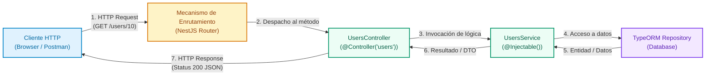

# Controladores en NestJS

Los controladores representan la capa de entrada y comunicación externa en una arquitectura backend con NestJS. En esta guía exploraremos sus fundamentos arquitectónicos, el ciclo de vida de una solicitud HTTP y las funcionalidades avanzadas para estructurar APIs REST robustas, tipadas y desacopladas.

Para seguir la parte práctica de esta guía, puedes basarte en el repositorio del curso en GitHub: [Kelocoes/compunet3-20252](https://github.com/Kelocoes/compunet3-20252/tree/nest/intro) en la rama `nest/intro`.

---

## 1. Conceptos y Fundamentos de Arquitectura

### ¿Qué es un Controlador?

En la arquitectura de software basada en el patrón **MVC (Modelo-Vista-Controlador)** o en arquitecturas en capas para APIs REST, el **Controlador** es el componente encargado de recibir las peticiones entrantes del cliente (*HTTP Requests*), interpretar los parámetros o cuerpos de datos, invocar la lógica de negocio correspondiente (generalmente ubicada en los **Servicios**) y devolver una respuesta estructurada al cliente (*HTTP Response*).

En NestJS, un controlador es una clase TypeScript decorada con `@Controller()`. Su función primordial es el **enrutamiento** (*routing*): asociar rutas URL y métodos HTTP (`GET`, `POST`, `PUT`, `PATCH`, `DELETE`) con funciones controladoras específicas llamadas métodos manejadores (*route handlers*).



#### Responsabilidades de cada componente

- **Cliente HTTP**: Realiza solicitudes hacia endpoints específicos transportando cabeceras, rutas, query params o payloads en JSON.
- **NestJS Router**: Analiza la ruta solicitada y el verbo HTTP, direccionando el flujo hacia el método correspondiente decorado en el controlador.
- **Controlador**: Extrae y valida los datos de la petición (mediante decoradores como `@Param()`, `@Body()`, `@Query()`), delega la operación pesada al servicio y define el código de estado HTTP y encabezados de salida.
- **Servicio (`@Injectable()`)**: Aloja la lógica del dominio, cálculos, reglas de negocio y control de transacciones.
- **Repositorio / Base de Datos**: Realiza la persistencia y lectura física de entidades.

:::info[Separación de Responsabilidades]
Un controlador **nunca** debe contener lógica de negocio compleja ni interactuar directamente con consultas SQL o repositorios de base de datos. Mantener los controladores delgados (*thin controllers*) y los servicios enriquecidos (*rich services*) garantiza alta cohesión, desacoplamiento y facilita la creación de pruebas unitarias aisladas.
:::

---

### Mapeo de Parámetros y Decoradores HTTP

NestJS proporciona decoradores dedicados para extraer cualquier fragmento de la solicitud HTTP de forma declarativa:

| Decorador | Objeto HTTP subyacente | Propósito y Ejemplo |
| :--- | :--- | :--- |
| `@Controller('prefix')` | Prefijo de Ruta | Define el prefijo base de URL para todos los endpoints de la clase. |
| `@Get()`, `@Post()`, `@Patch()`, `@Delete()` | Verbo HTTP | Define el método HTTP correspondiente a la acción. |
| `@Param('key')` | `req.params[key]` | Captura parámetros de segmento en la URL (ej. `/users/:id`). |
| `@Query('key')` | `req.query[key]` | Captura query strings en la URL (ej. `/products?category=tech`). |
| `@Body()` | `req.body` | Extrae el payload enviado en el cuerpo de la petición (JSON). |
| `@Headers('key')` | `req.headers[key]` | Obtiene encabezados HTTP individuales o la lista completa. |
| `@HttpCode(status)` | Código de respuesta | Fija el código de estado HTTP devuelto al cliente (ej. `201`, `204`). |
| `@Res()` | Objeto nativo de respuesta | Inyecta el objeto nativo de Express/Fastify (rompe la abstracción si no se usa con precaución). |

#### Parámetros de Ruta (`@Param`) y Consultas (`@Query`)

```typescript title="src/users/users.controller.ts" showLineNumbers
import { Controller, Get, Param, Query } from '@nestjs/common';

@Controller('users')
export class UsersController {
  // GET /users/42
  @Get(':id')
  findOne(@Param('id') id: string) {
    return `Retorna el usuario con id: ${id}`;
  }

  // GET /users?role=admin&limit=10
  @Get()
  findAll(@Query('role') role: string, @Query('limit') limit: string) {
    return `Filtrando usuarios por rol: ${role}, límite: ${limit}`;
  }
}
```

#### Cuerpo de la Solicitud (`@Body`) y DTOs

Al recibir datos estructurados en solicitudes `POST`, `PUT` o `PATCH`, se utiliza `@Body()` junto a una clase DTO (*Data Transfer Object*):

```typescript title="src/users/users.controller.ts" showLineNumbers
import { Controller, Post, Body, HttpCode, HttpStatus } from '@nestjs/common';
import { CreateUserDto } from './dto/create-user.dto';

@Controller('users')
export class UsersController {
  @Post()
  @HttpCode(HttpStatus.CREATED) // Retorna explícitamente HTTP 201
  create(@Body() createUserDto: CreateUserDto) {
    return `Usuario creado: ${createUserDto.name}`;
  }
}
```

#### Encabezados de Solicitud (`@Headers`)

Para leer tokens, claves de API o metadatos del cliente:

```typescript title="src/auth/auth.controller.ts" showLineNumbers
import { Controller, Get, Headers } from '@nestjs/common';

@Controller('auth')
export class AuthController {
  @Get('profile')
  getProfile(@Headers('authorization') authHeader: string) {
    return `Authorization header recibido: ${authHeader}`;
  }
}
```

Encabezados comunes en APIs REST:

| Encabezado | Propósito | Ejemplo de Valor |
| :--- | :--- | :--- |
| `Authorization` | Token de autenticación (JWT, Bearer token) | `Bearer eyJhbGciOiJIUz...` |
| `Content-Type` | Tipo MIME del cuerpo enviado | `application/json` |
| `User-Agent` | Identificador del cliente o navegador | `Mozilla/5.0 ...` |
| `Accept` | Formato deseado de respuesta | `application/json` |
| `X-Request-ID` | Trazabilidad única de la petición | `123e4567-e89b-12d3-a456...` |

#### Rutas con Comodines (Wildcards)

NestJS permite registrar rutas basadas en patrones mediante asteriscos (`*`):

```typescript title="src/files/files.controller.ts" showLineNumbers
import { Controller, Get, Param } from '@nestjs/common';

@Controller('files')
export class FilesController {
  // Captura /files/docs/reporte.pdf o cualquier subruta
  @Get('*')
  getFile(@Param() params: string[]) {
    return `Ruta solicitada: ${params[0]}`;
  }

  // Comodín intermedio: /files/download/reportes/2026/details
  @Get('download/*/details')
  getFileDetails(@Param() params: string[]) {
    return `Detalles de la subruta: ${params[0]}`;
  }
}
```

---

### Manejo de Respuestas y Excepciones HTTP

Por defecto, NestJS responde con formato JSON y código `200 OK` (o `201 CREATED` para `POST`). Cuando ocurre una falla, NestJS cuenta con una capa de **Exception Filters** que intercepta excepciones estándar y devuelve una estructura JSON consistente.

```typescript title="Ejemplo de lanzamiento de excepción HTTP" showLineNumbers
import { BadRequestException } from '@nestjs/common';

throw new BadRequestException('Datos inválidos en el formulario', {
  cause: new Error('Fallo validación DTO'),
  description: 'El correo electrónico ya está registrado',
});
```

El cliente recibe una respuesta uniforme con el código correspondiente:

```json
{
  "message": "Datos inválidos en el formulario",
  "error": "El correo electrónico ya está registrado",
  "statusCode": 400
}
```

#### Excepciones HTTP Estándar en NestJS

| Excepción en NestJS | Código HTTP | Descripción y Uso |
| :--- | :---: | :--- |
| `BadRequestException` | 400 | Datos de entrada con sintaxis o validaciones erróneas. |
| `UnauthorizedException` | 401 | Falta de credenciales o token expirado/inválido. |
| `ForbiddenException` | 403 | Credenciales válidas, pero permisos insuficientes para la acción. |
| `NotFoundException` | 404 | El recurso solicitado no existe en la base de datos. |
| `MethodNotAllowedException` | 405 | Verbo HTTP no soportado en la ruta. |
| `NotAcceptableException` | 406 | Formato no aceptable según cabeceras `Accept`. |
| `RequestTimeoutException` | 408 | Tiempo de respuesta excedido. |
| `ConflictException` | 409 | Conflicto con el estado actual (ej. clave única duplicada). |
| `GoneException` | 410 | Recurso que existía pero ha sido eliminado permanentemente. |
| `PayloadTooLargeException` | 413 | Archivo o cuerpo de petición supera el límite permitido. |
| `UnsupportedMediaTypeException` | 415 | Tipo multimedia no soportado por el servidor. |
| `UnprocessableEntityException` | 422 | Errores semánticos de validación detallada. |
| `InternalServerErrorException` | 500 | Error no controlado o fallo inesperado del servidor. |
| `NotImplementedException` | 501 | Funcionalidad aún no soportada en el servidor. |
| `BadGatewayException` | 502 | Fallo en upstream o servicio proxy intermediario. |
| `ServiceUnavailableException` | 503 | Servidor en sobrecarga o mantenimiento temporal. |
| `GatewayTimeoutException` | 504 | Tiempo límite agotado esperando respuesta externa. |

---

## 2. Guía Práctica: Arquitectura de Excepciones y Controlador Completo

En esta sección implementaremos paso a paso un catálogo de excepciones HTTP desacopladas y un controlador `UsersController` robusto conectado con su respectivo servicio `UsersService` y TypeORM.

La estructura que construiremos en el proyecto es la siguiente:

```plaintext
src
├── common
│   └── exceptions
│       ├── http
│       │   ├── role-not-found.exception.ts
│       │   ├── user-not-found.exception.ts
│       └── index.ts
└── users
    ├── dto
    │   ├── create-user.dto.ts
    │   └── update-user.dto.ts
    ├── entities
    │   └── user.entity.ts
    ├── users.controller.ts
    └── users.service.ts
```

<StepByStep>

  <Step number="1" title="Crear las Excepciones de Dominio Personalizadas">

Creamos clases que extiendan de `NotFoundException` para encapsular mensajes de error estandarizados y específicos de la aplicación.

```typescript title="src/common/exceptions/http/role-not-found.exception.ts" showLineNumbers
import { NotFoundException } from '@nestjs/common';

/**
 * Excepción personalizada lanzada cuando un rol solicitado no existe.
 */
export class RoleNotFoundException extends NotFoundException {
  constructor(roleIdOrName: number | string) {
    super({
      error: 'Role Not Found',
      message: `El rol con identificador o nombre '${roleIdOrName}' no existe en el sistema.`,
    });
  }
}
```

```typescript title="src/common/exceptions/http/user-not-found.exception.ts" showLineNumbers
import { NotFoundException } from '@nestjs/common';

/**
 * Excepción personalizada lanzada cuando un usuario no existe en la base de datos.
 */
export class UserNotFoundException extends NotFoundException {
  constructor(userId: number, internalCode?: string) {
    super({
      error: 'User Not Found',
      message: `El usuario con identificador ${userId} no fue encontrado.`,
      code: internalCode,
    });
  }
}
```

Exportamos todas las excepciones mediante un archivo barril (*barrel file*):

```typescript title="src/common/exceptions/index.ts" showLineNumbers
export * from './http/role-not-found.exception';
export * from './http/user-not-found.exception';
```

  </Step>

  <Step number="2" title="Implementar la Lógica de Negocio en el Servicio">

El servicio `UsersService` es responsable de la persistencia con TypeORM y de lanzar las excepciones correspondientes cuando los registros no se encuentran.

```typescript title="src/users/users.service.ts" showLineNumbers
import { Injectable } from '@nestjs/common';
import { InjectRepository } from '@nestjs/typeorm';
import { Repository } from 'typeorm';
import { CreateUserDto } from './dto/create-user.dto';
import { UpdateUserDto } from './dto/update-user.dto';
import { User } from './entities/user.entity';
import { RolesService } from '../auth/services/roles.service';
import {
  RoleNotFoundException,
  UserNotFoundException,
} from '../common/exceptions';

@Injectable()
export class UsersService {
  constructor(
    @InjectRepository(User)
    private readonly userRepository: Repository<User>,
    private readonly rolesService: RolesService,
  ) {}

  /**
   * Crea un nuevo usuario verificando previamente la existencia del rol asignado.
   */
  async create(createUserDto: CreateUserDto): Promise<User> {
    const role = await this.rolesService.findByName(createUserDto.roleName);
    if (!role) {
      throw new RoleNotFoundException(createUserDto.roleName);
    }

    const newUser = this.userRepository.create({
      ...createUserDto,
      role,
    });

    return await this.userRepository.save(newUser);
  }

  /**
   * Retorna el listado completo de usuarios registrados.
   */
  async findAll(): Promise<User[]> {
    return await this.userRepository.find();
  }

  /**
   * Busca un usuario por ID o lanza UserNotFoundException si no existe.
   */
  async findOne(id: number): Promise<User> {
    const user = await this.userRepository.findOne({ where: { id } });
    if (!user) {
      throw new UserNotFoundException(id);
    }
    return user;
  }

  /**
   * Actualiza los datos de un usuario existente.
   */
  async update(id: number, updateUserDto: UpdateUserDto): Promise<User> {
    const userExist = await this.userRepository.findOne({ where: { id } });
    if (!userExist) {
      throw new UserNotFoundException(id, 'ERR_USER_UPDATE_404');
    }

    await this.userRepository.update(id, updateUserDto);
    return this.findOne(id);
  }

  /**
   * Elimina un usuario por su identificador.
   */
  async remove(id: number): Promise<void> {
    const result = await this.userRepository.delete(id);
    if (!result.affected || result.affected === 0) {
      throw new UserNotFoundException(id);
    }
  }
}
```

  </Step>

  <Step number="3" title="Construir el Controlador Completo con Códigos HTTP">

El controlador gestiona las rutas `/users`, transforma los parámetros numéricos y asocia cada respuesta con su código de estado HTTP semántico (`200 OK`, `201 CREATED`, `204 NO CONTENT`).

```typescript title="src/users/users.controller.ts" showLineNumbers
import {
  Controller,
  Get,
  Post,
  Body,
  Patch,
  Param,
  Delete,
  HttpCode,
  HttpStatus,
  InternalServerErrorException,
} from '@nestjs/common';
import { UsersService } from './users.service';
import { CreateUserDto } from './dto/create-user.dto';
import { UpdateUserDto } from './dto/update-user.dto';

@Controller('users')
export class UsersController {
  constructor(private readonly usersService: UsersService) {}

  /**
   * POST /users -> Crea un recurso nuevo (201 Created)
   */
  @Post()
  @HttpCode(HttpStatus.CREATED)
  create(@Body() createUserDto: CreateUserDto) {
    return this.usersService.create(createUserDto);
  }

  /**
   * GET /users -> Lista los usuarios (200 OK)
   */
  @Get()
  @HttpCode(HttpStatus.OK)
  findAll() {
    return this.usersService.findAll();
  }

  /**
   * GET /users/:id -> Retorna un usuario puntual (200 OK)
   */
  @Get(':id')
  @HttpCode(HttpStatus.OK)
  findOne(@Param('id') id: string) {
    // Convierte el parámetro string a número usando el operador unario +
    return this.usersService.findOne(+id);
  }

  /**
   * PATCH /users/:id -> Modifica parcialmente un usuario (200 OK)
   */
  @Patch(':id')
  @HttpCode(HttpStatus.OK)
  async update(
    @Param('id') id: string,
    @Body() updateUserDto: UpdateUserDto,
  ) {
    try {
      return await this.usersService.update(+id, updateUserDto);
    } catch (error) {
      // Si la excepción es del negocio (como UserNotFoundException), se relanza directamente
      if (error instanceof Error && 'status' in error) {
        throw error;
      }
      throw new InternalServerErrorException('Fallo al actualizar el usuario', {
        cause: error,
        description: 'Error inesperado al persistir los cambios en la base de datos.',
      });
    }
  }

  /**
   * DELETE /users/:id -> Elimina el usuario y no devuelve cuerpo (204 No Content)
   */
  @Delete(':id')
  @HttpCode(HttpStatus.NO_CONTENT)
  async remove(@Param('id') id: string): Promise<void> {
    await this.usersService.remove(+id);
  }
}
```

  </Step>

</StepByStep>

---

## Cuestionario de Autoevaluación

<Quiz id="dedw-semana6-controllers-quiz">
  <Question title="¿Cuál es la responsabilidad principal de un controlador en la arquitectura de NestJS?">
    <Option>Realizar directamente consultas SQL a la base de datos y gestionar transacciones ACID.</Option>
    <Option correct>Recibir peticiones HTTP entrantes, extraer parámetros/cuerpos, invocar los servicios de negocio y retornar respuestas al cliente.</Option>
    <Option>Servir como sustituto de los modelos y entidades de TypeORM.</Option>
    <Option>Compilar el código TypeScript a JavaScript en tiempo de ejecución.</Option>
  </Question>

  <Question title="Si un controlador se decora con @Controller('users') y un método tiene el decorador @Get(':id'), ¿cuál será la URL mapeada?">
    <Option>/users</Option>
    <Option>/users/id</Option>
    <Option correct>/users/:id</Option>
    <Option>/:id/users</Option>
  </Question>

  <Question title="¿Qué decorador de NestJS se utiliza para extraer los parámetros pasados en el query string de la URL (ej. ?category=tech)?">
    <Option>@Param()</Option>
    <Option correct>@Query()</Option>
    <Option>@Body()</Option>
    <Option>@Headers()</Option>
  </Question>

  <Question title="¿Qué código de estado HTTP emite por defecto el decorador @HttpCode(HttpStatus.NO_CONTENT)?">
    <Option>200</Option>
    <Option>201</Option>
    <Option correct>204</Option>
    <Option>404</Option>
  </Question>

  <Question title="¿Por qué se considera una mala práctica ubicar lógica de negocio pesada o acceso directo a bases de datos dentro de un controlador?">
    <Option>Porque NestJS no permite inyectar repositorios dentro de módulos.</Option>
    <Option>Porque los controladores no admiten métodos asíncronos con async/await.</Option>
    <Option correct>Porque acopla el protocolo de transporte HTTP con el dominio, violando la separación de responsabilidades y dificultando las pruebas unitarias.</Option>
    <Option>Porque TypeScript genera un error de compilación si un controlador supera las 50 líneas.</Option>
  </Question>

  <Question title="¿Cuál es el código de estado HTTP estándar retornado por la excepción BadRequestException de NestJS?">
    <Option correct>400</Option>
    <Option>401</Option>
    <Option>403</Option>
    <Option>404</Option>
  </Question>

  <Question title="¿Qué excepción nativa de NestJS debe lanzarse cuando un cliente envía credenciales válidas pero no cuenta con los permisos necesarios para acceder al recurso?">
    <Option>UnauthorizedException (401)</Option>
    <Option correct>ForbiddenException (403)</Option>
    <Option>NotFoundException (404)</Option>
    <Option>ConflictException (409)</Option>
  </Question>

  <Question title="Al definir una ruta con comodín como @Get('download/*/details'), ¿qué valor recibe params[0] para la solicitud /files/download/reportes/2026/details?">
    <Option>/files</Option>
    <Option>details</Option>
    <Option correct>reportes/2026</Option>
    <Option>download</Option>
  </Question>

  <Question title="¿Qué decorador se utiliza para tipar y recibir los datos estructurados enviados en el cuerpo (payload JSON) de una solicitud POST?">
    <Option>@Param()</Option>
    <Option>@Query()</Option>
    <Option correct>@Body()</Option>
    <Option>@Res()</Option>
  </Question>

  <Question title="En la arquitectura propuesta, ¿dónde se recomienda lanzar excepciones como RoleNotFoundException o UserNotFoundException?">
    <Option>En el cliente HTTP antes de despachar el request.</Option>
    <Option correct>En la capa de servicio (Service), cuando la entidad requerida no existe tras consultar el repositorio.</Option>
    <Option>Únicamente en el archivo main.ts durante el bootstrap.</Option>
    <Option>En el archivo de configuración de TypeScript tsconfig.json.</Option>
  </Question>
</Quiz>