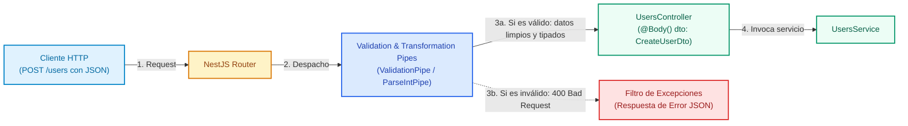

# Pipes y Validadores en NestJS

Los **Pipes** son componentes fundamentales en el ciclo de vida de una petición en NestJS. Operan sobre los argumentos de entrada antes de que el método del controlador (*route handler*) sea invocado, cumpliendo dos propósitos esenciales: **transformación de datos** y **validación**.

---

## 1. Conceptos y Fundamentos de Arquitectura

### ¿Qué es un Pipe en NestJS?

Un Pipe es una clase anotada con `@Injectable()` que implementa la interfaz `PipeTransform`. A diferencia de los middlewares estándar de Express, los pipes se ejecutan dentro del contexto de la arquitectura de NestJS justo antes del controlador, lo que les da acceso a los metadatos del argumento (`ArgumentMetadata`) y les permite:

1. **Transformación**: Mutar los datos de entrada a la forma o tipo deseado (por ejemplo, convertir un string `"42"` de la URL en un número entero `42`, o instanciar una entidad).
2. **Validación**: Evaluar si los datos recibidos cumplen con ciertas restricciones y reglas de negocio. Si los datos son válidos, continúan su flujo; si no son válidos, el pipe interrumpe la petición lanzando una excepción HTTP (habitualmente `BadRequestException` 400).



#### Anatomía de la interfaz `PipeTransform`

Todo pipe debe implementar el método `transform(value: any, metadata: ArgumentMetadata)`:

- **`value`**: El dato crudo entrante que se va a procesar (procedente de `@Body()`, `@Param()`, o `@Query()`).
- **`metadata`**: Metadatos asociados al argumento:
  - `type`: Indica el origen del valor (`'body'`, `'query'`, `'param'` o `'custom'`).
  - `metatype`: El tipo de dato esperado definido en TypeScript (por ejemplo, `CreateUserDto` o `Number`).
  - `data`: El string pasado como argumento al decorador (por ejemplo, `@Param('id')` produce `data = 'id'`).

---

### Pipes Integrados en NestJS

NestJS incluye una suite de pipes listos para usar exportados desde `@nestjs/common`:

| Pipe Integrado | Propósito | Ejemplo de Uso |
| :--- | :--- | :--- |
| `ValidationPipe` | Valida esquemas DTO usando `class-validator` y transforma objetos con `class-transformer`. | Global o en `@Body()` |
| `ParseIntPipe` | Convierte un string numérico a entero primitivo (`number`). Lanza `400` si no es válido. | `@Param('id', ParseIntPipe)` |
| `ParseFloatPipe` | Convierte un string a número de punto flotante. | `@Query('price', ParseFloatPipe)` |
| `ParseBoolPipe` | Convierte `"true"`, `"false"`, `true`, `false` a valor booleano. | `@Query('active', ParseBoolPipe)` |
| `ParseArrayPipe` | Transforma listas separadas por comas en arreglos tipados. | `@Query('ids', new ParseArrayPipe(...))` |
| `ParseUUIDPipe` | Verifica que el parámetro sea un identificador UUID (v3, v4 o v5). | `@Param('uuid', new ParseUUIDPipe())` |
| `ParseEnumPipe` | Comprueba que el valor pertenezca a un `enum` de TypeScript. | `@Param('status', new ParseEnumPipe(CatStatus))` |
| `DefaultValuePipe` | Provee un valor por defecto si el parámetro no fue suministrado. | `@Query('page', new DefaultValuePipe(1))` |
| `ParseFilePipe` | Valida archivos subidos (`size`, `mime-type`) con `@UploadedFile()`. | Peticiones multipart con archivos |

#### Ejemplo de Pipes en Parámetros de Ruta

```typescript title="src/cats/cats.controller.ts" showLineNumbers
import {
  Controller,
  Get,
  Param,
  Query,
  ParseIntPipe,
  ParseUUIDPipe,
  ParseEnumPipe,
  DefaultValuePipe,
} from '@nestjs/common';

export enum CatBreed {
  SIAMESE = 'siamese',
  PERSIAN = 'persian',
  MAINE_COON = 'maine_coon',
}

@Controller('cats')
export class CatsController {
  // Convierte automáticamente el ID a number
  @Get(':id')
  findOne(@Param('id', ParseIntPipe) id: number) {
    return { id, type: typeof id }; // id es un number garantizado
  }

  // Valida que el parámetro sea un UUID v4 válido
  @Get('by-uuid/:uuid')
  findByUuid(@Param('uuid', new ParseUUIDPipe({ version: '4' })) uuid: string) {
    return { uuid };
  }

  // Valida contra un enum y asigna paginación por defecto si falta
  @Get('filter/:breed')
  filter(
    @Param('breed', new ParseEnumPipe(CatBreed)) breed: CatBreed,
    @Query('page', new DefaultValuePipe(1), ParseIntPipe) page: number,
  ) {
    return { breed, page };
  }
}
```

---

### Ámbitos de Aplicación de un Pipe

Un pipe se puede registrar en cuatro niveles según la granularidad deseada:

1. **A nivel de Parámetro**: `@Param('id', ParseIntPipe) id: number`.
2. **A nivel de Método**: `@UsePipes(new ValidationPipe())` sobre un método `@Post()`.
3. **A nivel de Controlador**: `@UsePipes(new ValidationPipe())` sobre la clase `@Controller('users')`.
4. **A nivel Global**: Aplica a cada ruta de la aplicación completa. Se registra en `main.ts` con `app.useGlobalPipes(new ValidationPipe())` o mediante inyección en un módulo:

```typescript title="src/main.ts" showLineNumbers
import { NestFactory } from '@nestjs/core';
import { ValidationPipe } from '@nestjs/common';
import { AppModule } from './app.module';

async function bootstrap() {
  const app = await NestFactory.create(AppModule);

  // Pipe global para validar todos los DTOs entrantes
  app.useGlobalPipes(
    new ValidationPipe({
      whitelist: true, // Remueve propiedades que no estén en el DTO
      forbidNonWhitelisted: true, // Lanza error si se envían propiedades no reconocidas
      transform: true, // Transforma automáticamente los payloads a instancias de sus DTOs
    }),
  );

  await app.listen(3000);
}
bootstrap();
```

---

## 2. Guía Práctica: Validación con `class-validator` y Pipes Personalizados

En esta sección implementaremos paso a paso un sistema de validación robusto para creación de usuarios utilizando `class-validator` y `class-transformer`, además de un Pipe personalizado para validar que un ID sea un entero estrictamente positivo.

<StepByStep>

  <Step number="1" title="Instalar Dependencias de Validación">

Instalamos los paquetes oficiales necesarios para activar las anotaciones de validación y la transformación de objetos en NestJS:

```bash title="Terminal"
npm install class-validator class-transformer
```

  </Step>

  <Step number="2" title="Crear un Pipe Personalizado: PositiveIntPipe">

Creamos un pipe personalizado que valide que el identificador numérico no solo sea entero sino estrictamente mayor a cero:

```typescript title="src/common/pipes/positive-int.pipe.ts" showLineNumbers
import {
  PipeTransform,
  Injectable,
  ArgumentMetadata,
  BadRequestException,
} from '@nestjs/common';

/**
 * Transforma una cadena en un entero y valida que sea estrictamente positivo (> 0).
 */
@Injectable()
export class PositiveIntPipe implements PipeTransform<string, number> {
  transform(value: string, metadata: ArgumentMetadata): number {
    const val = parseInt(value, 10);

    if (isNaN(val)) {
      throw new BadRequestException(
        `El parámetro '${metadata.data ?? 'id'}' debe ser un número entero válido.`,
      );
    }

    if (val <= 0) {
      throw new BadRequestException(
        `El parámetro '${metadata.data ?? 'id'}' debe ser un número positivo mayor que 0.`,
      );
    }

    return val;
  }
}
```

  </Step>

  <Step number="3" title="Definir las Reglas de Validación en el DTO">

Construimos el DTO decorando cada propiedad con reglas semánticas provistas por `class-validator`:

```typescript title="src/users/dto/create-user.dto.ts" showLineNumbers
import {
  IsString,
  IsEmail,
  IsNotEmpty,
  MinLength,
  MaxLength,
  IsOptional,
  Matches,
} from 'class-validator';

export class CreateUserDto {
  @IsString({ message: 'El nombre de usuario debe ser una cadena de texto' })
  @IsNotEmpty({ message: 'El nombre de usuario es obligatorio' })
  @MinLength(3, { message: 'El nombre de usuario debe contener al menos 3 caracteres' })
  username: string;

  @IsEmail({}, { message: 'Debe ingresar un correo electrónico válido' })
  @IsNotEmpty({ message: 'El correo electrónico es requerido' })
  email: string;

  @IsString()
  @MinLength(8, { message: 'La contraseña debe tener mínimo 8 caracteres' })
  @Matches(/^(?=.*[a-z])(?=.*[A-Z])(?=.*\d).*$/, {
    message: 'La contraseña debe contener al menos una mayúscula, una minúscula y un número',
  })
  password: string;

  @IsOptional()
  @IsString()
  @MaxLength(200, { message: 'La biografía no puede exceder 200 caracteres' })
  bio?: string;

  @IsString({ message: 'El rol debe ser un string válido' })
  @IsNotEmpty({ message: 'Debe especificar el rol del usuario' })
  roleName: string;
}
```

  </Step>

  <Step number="4" title="Conectar el DTO y el Pipe en el Controlador">

Implementamos el endpoint en el controlador. Al recibir la petición, el `ValidationPipe` valida el cuerpo y `PositiveIntPipe` valida el parámetro de ruta `:id`:

```typescript title="src/users/users.controller.ts" showLineNumbers
import {
  Controller,
  Get,
  Post,
  Body,
  Param,
  HttpCode,
  HttpStatus,
} from '@nestjs/common';
import { UsersService } from './users.service';
import { CreateUserDto } from './dto/create-user.dto';
import { PositiveIntPipe } from '../common/pipes/positive-int.pipe';

@Controller('users')
export class UsersController {
  constructor(private readonly usersService: UsersService) {}

  /**
   * POST /users -> Valida automáticamente el body con CreateUserDto
   */
  @Post()
  @HttpCode(HttpStatus.CREATED)
  create(@Body() createUserDto: CreateUserDto) {
    return this.usersService.create(createUserDto);
  }

  /**
   * GET /users/:id -> Valida que :id sea un número entero positivo mayor a 0
   */
  @Get(':id')
  @HttpCode(HttpStatus.OK)
  findOne(@Param('id', PositiveIntPipe) id: number) {
    return this.usersService.findOne(id);
  }
}
```

:::info[¿Qué ocurre si la petición es inválida?]
Si un cliente envía `POST /users` con un correo mal formado (`"email": "no-es-correo"`), el `ValidationPipe` detiene automáticamente la ejecución antes de entrar a `create()` y responde con:

```json
{
  "message": [
    "Debe ingresar un correo electrónico válido"
  ],
  "error": "Bad Request",
  "statusCode": 400
}
```
:::

  </Step>

</StepByStep>

---

## Cuestionario de Autoevaluación

<Quiz id="dedw-semana6-pipes-quiz">
  <Question title="¿Cuáles son los dos objetivos principales de los Pipes en la arquitectura de NestJS?">
    <Option>Compilar código TypeScript y generar migraciones en la base de datos.</Option>
    <Option correct>Transformar datos de entrada al formato deseado y validar que cumplan las restricciones requeridas.</Option>
    <Option>Autenticar sesiones con cookies y emitir tokens JWT exclusivamente.</Option>
    <Option>Reemplazar los repositorios de TypeORM y los servicios de negocio.</Option>
  </Question>

  <Question title="¿Qué interfaz de TypeScript debe implementar una clase para funcionar como Pipe en NestJS?">
    <Option>NestMiddleware</Option>
    <Option>CanActivate</Option>
    <Option correct>PipeTransform</Option>
    <Option>NestInterceptor</Option>
  </Question>

  <Question title="¿Qué excepción HTTP arroja por defecto un Pipe como ParseIntPipe si el parámetro recibido no es un número entero válido?">
    <Option>404 NotFoundException</Option>
    <Option>401 UnauthorizedException</Option>
    <Option correct>400 BadRequestException</Option>
    <Option>500 InternalServerErrorException</Option>
  </Question>

  <Question title="¿Qué paquetes de npm se requieren habitualmente para habilitar validaciones declarativas mediante decoradores en DTOs con ValidationPipe?">
    <Option>express y body-parser</Option>
    <Option correct>class-validator y class-transformer</Option>
    <Option>bcrypt y jsonwebtoken</Option>
    <Option>typeorm y pg</Option>
  </Question>

  <Question title="Al configurar ValidationPipe({ whitelist: true }), ¿cuál es el comportamiento ante propiedades no definidas en el DTO?">
    <Option>Lanza inmediatamente una excepción 500 Internal Server Error.</Option>
    <Option correct>Filtra y remueve silenciosamente cualquier propiedad que no esté declarada en el DTO.</Option>
    <Option>Inserta las propiedades automáticamente en la base de datos.</Option>
    <Option>Transforma las propiedades no definidas en cadenas vacías.</Option>
  </Question>

  <Question title="¿Qué pipe integrado de NestJS permite definir un valor predeterminado para un parámetro de consulta (@Query) si el cliente no lo envía?">
    <Option>ParseIntPipe</Option>
    <Option>ParseBoolPipe</Option>
    <Option correct>DefaultValuePipe</Option>
    <Option>ValidationPipe</Option>
  </Question>

  <Question title="¿En qué nivel se debe registrar app.useGlobalPipes(new ValidationPipe()) para que aplique a todas las rutas de la aplicación?">
    <Option>En cada archivo .spec.ts de pruebas unitarias.</Option>
    <Option correct>En la función bootstrap() del archivo main.ts.</Option>
    <Option>Dentro de las entidades de TypeORM.</Option>
    <Option>En el archivo tsconfig.json.</Option>
  </Question>

  <Question title="¿Qué información contiene la propiedad 'type' del objeto ArgumentMetadata recibido en el método transform()?">
    <Option>La versión del compilador de TypeScript.</Option>
    <Option correct>El origen del valor entrante ('body', 'query', 'param' o 'custom').</Option>
    <Option>El tipo de motor de base de datos conectado.</Option>
    <Option>El tiempo de respuesta en milisegundos de la petición HTTP.</Option>
  </Question>

  <Question title="Si se envía la petición GET /cats/filter/invalido a un endpoint con ParseEnumPipe(CatBreed), ¿cuál será el resultado?">
    <Option>Se asigna el primer valor del enum de forma silenciosa.</Option>
    <Option>Se retorna una respuesta 200 OK con valor null.</Option>
    <Option correct>Se rechaza la petición con código 400 Bad Request indicando que el valor no pertenece al enum.</Option>
    <Option>El servidor se reinicia automáticamente.</Option>
  </Question>

  <Question title="¿Por qué es ventajoso aplicar validación en Pipes antes de que la petición llegue a los métodos del controlador?">
    <Option>Porque permite omitir por completo las pruebas unitarias.</Option>
    <Option correct>Porque garantiza que el controlador y los servicios siempre operen con datos limpios, consistentes y tipados, previniendo estados inconsistentes tempranamente.</Option>
    <Option>Porque los pipes reducen el consumo de memoria RAM a cero.</Option>
    <Option>Porque NestJS no permite el uso de sentencias if/else en los servicios.</Option>
  </Question>
</Quiz>
