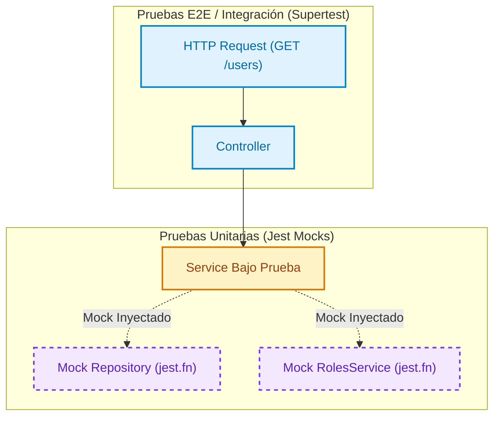

# Guía de Testing en NestJS

El testing automatizado es uno de los pilares fundamentales del desarrollo de software moderno. En NestJS, la arquitectura basada en Inyección de Dependencias (DI) permite aislar y verificar componentes de forma predecible y reproducible.

Para seguir los ejemplos prácticos de esta guía, puedes basarte en el repositorio del curso: [Kelocoes/compunet3-20252](https://github.com/Kelocoes/compunet3-20252) en la rama `main` o `nest/intro`.

---

## 1. Fundamentos y Tipos de Pruebas

En el ecosistema backend con NestJS existen dos niveles principales de pruebas:

1. **Pruebas Unitarias (*Unit Tests*)**: Verifican funciones, métodos o clases en aislamiento estricto (como un `UsersService` o `UsersController`). Todas sus dependencias externas (bases de datos, servicios HTTP, repositorios TypeORM) se reemplazan por simulaciones (*mocks* o *stubs*).
2. **Pruebas de Integración y End-to-End (*E2E Tests*)**: Evalúan la interacción coordinada entre múltiples capas de la aplicación (enrutador, interceptores, guards, servicios y base de datos de pruebas) emulando peticiones HTTP reales mediante herramientas como [Supertest](https://github.com/visionmedia/supertest).



---

## 2. Comandos de Ejecución con Jest en NestJS

NestJS integra [Jest](https://jestjs.io/) como ejecutor de pruebas estándar a través de los scripts preconfigurados en `package.json`:

```bash title="Terminal: Comandos principales de pruebas"
# 1. Ejecutar toda la suite de pruebas unitarias una sola vez
npm run test

# 2. Modo observador (Watch Mode): re-ejecuta pruebas al detectar cambios en archivos
npm run test:watch

# 3. Ejecutar un archivo o patrón específico de pruebas
npm test users.service.spec.ts

# 4. Modo depuración con Node inspector
npm run test:debug

# 5. Ejecutar suite de pruebas de integración End-to-End
npm run test:e2e

# 6. Generar el reporte de cobertura de código
npm run test:cov
```

---

## 3. Configuración y Métricas de Cobertura de Código

La cobertura de código (*code coverage*) mide la proporción del código fuente que ha sido ejecutada durante las pruebas automatizadas.

### Métricas de Cobertura Reportadas por Jest

Al ejecutar `npm run test:cov`, Jest genera una tabla con cuatro indicadores clave:

- **% Stmts (Statements)**: Porcentaje de declaraciones o instrucciones ejecutadas.
- **% Branch (Branches)**: Porcentaje de ramas lógicas evaluadas (bifurcaciones `if`, `else`, operadores ternarios `? :`, sentencias `switch`).
- **% Funcs (Functions)**: Porcentaje de funciones y métodos llamados durante la ejecución.
- **% Lines**: Porcentaje de líneas físicas de código visitadas.
- **Uncovered Line #s**: Indica exactamente qué líneas o rangos numéricos de código no fueron transitados por ningún caso de prueba.

### Configuración de Jest y Umbrales Mínimos (`coverageThreshold`)

La configuración de Jest se define habitualmente en la sección `"jest"` de `package.json` o en un archivo independiente `jest.config.js`. 

Para garantizar un estándar de calidad e impedir que se integren cambios sin pruebas suficientes, se pueden fijar umbrales mínimos (*thresholds*):

```json title="package.json" showLineNumbers
{
  "jest": {
    "moduleFileExtensions": ["js", "json", "ts"],
    "rootDir": "src",
    "testRegex": ".*\\.spec\\.ts$",
    "transform": {
      "^.+\\.(t|j)s$": "ts-jest"
    },
    "collectCoverageFrom": [
      "**/*.(t|j)s",
      "!**/*.module.ts",
      "!main.ts",
      "!**/*.dto.ts",
      "!**/*.entity.ts"
    ],
    "coverageDirectory": "../coverage",
    "testEnvironment": "node",
    "coverageThreshold": {
      "global": {
        "branches": 80,
        "functions": 85,
        "lines": 85,
        "statements": 85
      }
    }
  }
}
```

:::tip[¿Qué archivos excluir de la cobertura?]
Archivos de configuración, módulos (`*.module.ts`), DTOs simples sin lógica, entidades de TypeORM y el archivo de arranque `main.ts` suelen excluirse mediante patrones de negación (`!**/*.entity.ts`) en `collectCoverageFrom`, ya que no contienen ramas lógicas de negocio y sesgan artificialmente las métricas.
:::

---

## 4. Guía Práctica: Pruebas Unitarias de un Servicio

En esta sección implementaremos las pruebas unitarias para `UsersService`, simulando el repositorio de TypeORM y los servicios dependientes con `Test.createTestingModule`.

<StepByStep>

  <Step number="1" title="Configurar el Entorno de Prueba y Mocks">

Creamos el archivo `src/users/users.service.spec.ts`. Definimos objetos de simulación (*mock objects*) con métodos Jest (`jest.fn()`) para emular el comportamiento de la base de datos sin conectarse a un motor real.

```typescript title="src/users/users.service.spec.ts" showLineNumbers
import { Test, TestingModule } from '@nestjs/testing';
import { getRepositoryToken } from '@nestjs/typeorm';
import { UsersService } from './users.service';
import { RolesService } from '../auth/services/roles.service';
import { User } from './entities/user.entity';

// Objeto mock que simula los métodos del repositorio TypeORM
const mockRepository = {
  find: jest.fn(),
  findOne: jest.fn(),
  create: jest.fn(),
  save: jest.fn(),
  update: jest.fn(),
  delete: jest.fn(),
};

// Objeto mock para servicios auxiliares
const mockRolesService = {
  findByName: jest.fn(),
};

describe('UsersService', () => {
  let service: UsersService;

  beforeEach(async () => {
    // Restablece el historial de llamadas de los mocks entre cada prueba
    jest.clearAllMocks();

    const module: TestingModule = await Test.createTestingModule({
      providers: [
        UsersService,
        {
          provide: RolesService,
          useValue: mockRolesService,
        },
        {
          provide: getRepositoryToken(User),
          useValue: mockRepository,
        },
      ],
    }).compile();

    service = module.get<UsersService>(UsersService);
  });

  it('debe estar definido e instanciado correctamente', () => {
    expect(service).toBeDefined();
  });
});
```

  </Step>

  <Step number="2" title="Probar la Creación de un Usuario (Caso Exitoso)">

Validamos que cuando el rol existe, el servicio cree la entidad con el rol asociado y la guarde en el repositorio.

```typescript title="src/users/users.service.spec.ts" showLineNumbers
  it('debe crear un usuario exitosamente cuando el rol existe', async () => {
    const createUserDto = {
      username: 'kelocoes',
      email: 'kelocoes@icesi.edu.co',
      passwordHash: 'secret_hash_123',
      bio: 'Docente de Entornos Digitales',
      roleName: 'admin',
    };

    const mockRole = { id: 1, name: 'admin', description: 'Administrador' };
    const mockCreatedUser = { id: 10, ...createUserDto, role: mockRole };

    // Configuramos los retornos esperados en los mocks
    mockRolesService.findByName.mockResolvedValue(mockRole);
    mockRepository.create.mockReturnValue(mockCreatedUser);
    mockRepository.save.mockResolvedValue(mockCreatedUser);

    const result = await service.create(createUserDto);

    // Asertos de interacción
    expect(mockRolesService.findByName).toHaveBeenCalledWith('admin');
    expect(mockRepository.create).toHaveBeenCalledWith({
      ...createUserDto,
      role: mockRole,
    });
    expect(mockRepository.save).toHaveBeenCalledWith(mockCreatedUser);
    expect(result).toEqual(mockCreatedUser);
  });
```

  </Step>

  <Step number="3" title="Probar el Manejo de Excepciones (Caso de Falla)">

Verificamos que si el rol no se encuentra en el sistema, el servicio no intente guardar el usuario y lance `RoleNotFoundException`.

```typescript title="src/users/users.service.spec.ts" showLineNumbers
  it('debe lanzar RoleNotFoundException si el rol no existe', async () => {
    const createUserDto = {
      username: 'usuario_invalido',
      email: 'user@test.com',
      passwordHash: 'pass123',
      bio: '',
      roleName: 'rol_inexistente',
    };

    // Simulamos que el rol no existe retornando null
    mockRolesService.findByName.mockResolvedValue(null);

    // Verificamos que la promesa sea rechazada con la excepción esperada
    await expect(service.create(createUserDto)).rejects.toThrow();
    expect(mockRepository.save).not.toHaveBeenCalled();
  });
```

  </Step>

  <Step number="4" title="Probar Métodos de Consulta y Búsqueda">

Evaluamos que `findAll()` retorne el arreglo esperado y que `findOne()` devuelva la entidad o lance `UserNotFoundException`.

```typescript title="src/users/users.service.spec.ts" showLineNumbers
  it('debe retornar todos los usuarios registrados', async () => {
    const mockUsers = [
      { id: 1, username: 'user1', email: 'user1@icesi.edu.co' },
      { id: 2, username: 'user2', email: 'user2@icesi.edu.co' },
    ];

    mockRepository.find.mockResolvedValue(mockUsers);

    const result = await service.findAll();

    expect(mockRepository.find).toHaveBeenCalledTimes(1);
    expect(result).toEqual(mockUsers);
  });

  it('debe lanzar UserNotFoundException si el usuario no existe al buscar por id', async () => {
    mockRepository.findOne.mockResolvedValue(null);

    await expect(service.findOne(999)).rejects.toThrow();
    expect(mockRepository.findOne).toHaveBeenCalledWith({ where: { id: 999 } });
  });
```

  </Step>

</StepByStep>

---

## 5. Pruebas de Integración End-to-End (E2E) con Supertest

Las pruebas E2E levantan una instancia completa de la aplicación NestJS en memoria y prueban las rutas HTTP públicas como si se tratara de un cliente externo.

```typescript title="test/users.e2e-spec.ts" showLineNumbers
import { Test, TestingModule } from '@nestjs/testing';
import { INestApplication } from '@nestjs/common';
import * as request from 'supertest';
import { AppModule } from '../src/app.module';

describe('UsersController (e2e)', () => {
  let app: INestApplication;

  beforeAll(async () => {
    const moduleFixture: TestingModule = await Test.createTestingModule({
      imports: [AppModule],
    }).compile();

    app = moduleFixture.createNestApplication();
    await app.init();
  });

  afterAll(async () => {
    await app.close();
  });

  it('GET /users debe retornar status 200 y un array', async () => {
    const response = await request(app.getHttpServer())
      .get('/users')
      .expect(200);

    expect(Array.isArray(response.body)).toBe(true);
  });

  it('GET /users/:id debe responder 404 cuando el id no existe', async () => {
    await request(app.getHttpServer())
      .get('/users/999999')
      .expect(404);
  });
});
```

---

## Cuestionario de Autoevaluación

<Quiz id="dedw-semana6-testing-quiz">
  <Question title="¿Cuál es la principal diferencia entre una prueba unitaria y una prueba E2E (End-to-End)?">
    <Option>Las pruebas unitarias solo se pueden escribir en JavaScript y las E2E en TypeScript.</Option>
    <Option correct>Las pruebas unitarias verifican un componente aislado reemplazando dependencias por mocks, mientras que las E2E prueban el flujo completo a través de peticiones HTTP.</Option>
    <Option>Las pruebas unitarias requieren obligatoriamente una base de datos PostgreSQL conectada.</Option>
    <Option>Las pruebas E2E no pueden ejecutarse mediante scripts de npm.</Option>
  </Question>

  <Question title="¿Qué comando de la CLI de NestJS se utiliza para calcular y visualizar el reporte detallado de cobertura de código?">
    <Option>npm run test</Option>
    <Option>npm run start:dev</Option>
    <Option correct>npm run test:cov</Option>
    <Option>npm run build</Option>
  </Question>

  <Question title="En el reporte de cobertura de Jest, ¿qué mide la métrica '% Branch'?">
    <Option>El número de ramas de git creadas en el repositorio.</Option>
    <Option correct>El porcentaje de bifurcaciones y caminos lógicos (if, else, switch, ternarios) evaluados durante las pruebas.</Option>
    <Option>La cantidad de controladores conectados al módulo principal.</Option>
    <Option>El número de dependencias instaladas en node_modules.</Option>
  </Question>

  <Question title="¿Qué utilidad de NestJS permite crear un módulo de inyección de dependencias simulado para pruebas unitarias?">
    <Option>AppModule.forRoot()</Option>
    <Option>NestFactory.create()</Option>
    <Option correct>Test.createTestingModule()</Option>
    <Option>TypeOrmModule.forFeature()</Option>
  </Question>

  <Question title="¿Cómo se obtiene el token de inyección necesario para simular un Repositorio de TypeORM en Test.createTestingModule?">
    <Option>getToken(Entity)</Option>
    <Option correct>getRepositoryToken(Entity)</Option>
    <Option>provideRepository(Entity)</Option>
    <Option>InjectRepositoryToken()</Option>
  </Question>

  <Question title="¿Cuál propiedad de configuración de Jest en package.json permite definir porcentajes mínimos obligatorios de cobertura?">
    <Option>coverageDirectory</Option>
    <Option>testMatch</Option>
    <Option correct>coverageThreshold</Option>
    <Option>moduleFileExtensions</Option>
  </Question>

  <Question title="¿Qué biblioteca se utiliza habitualmente en NestJS junto con Jest para realizar llamadas HTTP reales en pruebas E2E?">
    <Option>Axios</Option>
    <Option correct>Supertest</Option>
    <Option>Fetch API</Option>
    <Option>Express Router</Option>
  </Question>

  <Question title="¿Por qué es recomendable excluir archivos como *.entity.ts o *.dto.ts de la recolección de cobertura en Jest?">
    <Option>Porque Jest no soporta archivos escritos en TypeScript.</Option>
    <Option>Porque provocan que las pruebas fallen con timeout.</Option>
    <Option correct>Porque son estructuras puramente declarativas o de definición de tipos sin lógica ejecutable que distorsionan negativamente la métrica.</Option>
    <Option>Porque TypeORM bloquea el acceso de lectura a los DTOs.</Option>
  </Question>

  <Question title="¿Qué método de Jest permite restablecer los contadores de llamadas e historial de todos los mocks antes de cada prueba?">
    <Option>jest.resetEnvironment()</Option>
    <Option correct>jest.clearAllMocks()</Option>
    <Option>jest.disableAllMocks()</Option>
    <Option>jest.finish()</Option>
  </Question>

  <Question title="¿Qué script de npm permite ejecutar Jest en modo interactivo para que las pruebas se vuelvan a ejecutar automáticamente tras guardar un cambio?">
    <Option>npm run build --watch</Option>
    <Option>npm run test:e2e</Option>
    <Option correct>npm run test:watch</Option>
    <Option>npm run start:prod</Option>
  </Question>
</Quiz>
