# Introducción a NestJS

NestJS es un framework progresivo de Node.js diseñado para construir aplicaciones de servidor (backend) eficientes, confiables y escalables. Está construido con TypeScript de forma nativa y combina elementos de la Programación Orientada a Objetos (POO), la Programación Funcional (FP) y la Programación Reactiva Funcional (FRP).

---

## 1. Fundamentos Conceptuales y Arquitectura

NestJS proporciona una arquitectura de aplicación lista para usar (out-of-the-box) que permite a los desarrolladores y equipos crear aplicaciones altamente testeables, escalables, sueltamente acopladas y fáciles de mantener. Se inspira fuertemente en patrones de diseño probados en el desarrollo enterprise, como la **Inyección de Dependencias (DI)** y la arquitectura de controladores y servicios (estilo Angular o Spring Boot).

### A. Ciclo de Vida de una Solicitud (Request Lifecycle)

En NestJS, las solicitudes HTTP entrantes atraviesan una serie de capas organizadas secuencialmente antes de que la respuesta sea enviada de vuelta al cliente. Cada capa cumple un propósito específico dentro de la arquitectura de la aplicación:

```mermaid
graph LR
    A["Cliente (HTTP Request)"] --> B["Middlewares"]
    B --> C["Guards"]
    C --> D["Interceptors (Pre)"]
    D --> E["Pipes"]
    E --> F["Controller (Route Handler)"]
    F --> G["Service (Business Logic)"]
    G --> F
    F --> H["Interceptors (Post)"]
    H --> I["Exception Filters"]
    I --> J["Respuesta HTTP"]

    style A fill:#f8fafc,stroke:#64748b,stroke-width:2px
    style B fill:#dbeafe,stroke:#2563eb,stroke-width:2px,color:#1e3a8a
    style C fill:#fef3c7,stroke:#d97706,stroke-width:2px,color:#78350f
    style D fill:#dbeafe,stroke:#2563eb,stroke-width:2px,color:#1e3a8a
    style E fill:#fef3c7,stroke:#d97706,stroke-width:2px,color:#78350f
    style F fill:#dcfce7,stroke:#16a34a,stroke-width:2px,color:#14532d
    style G fill:#dcfce7,stroke:#16a34a,stroke-width:2px,color:#14532d
    style H fill:#dbeafe,stroke:#2563eb,stroke-width:2px,color:#1e3a8a
    style I fill:#fee2e2,stroke:#dc2626,stroke-width:2px,color:#7f1d1d
    style J fill:#f8fafc,stroke:#64748b,stroke-width:2px
```

#### Explicación Técnica de las Capas del Ciclo de Vida:

* **Middlewares**: Funciones que se ejecutan antes del manejador de la ruta. Tienen acceso a los objetos de solicitud (`req`) y respuesta (`res`). Se utilizan comúnmente para tareas como registro de logs (logging), parsing de body o validación de cabeceras.
* **Guards (Guardias)**: Determinan si una solicitud dada será manejada por el controlador o no, dependiendo de condiciones específicas (por ejemplo, autenticación de usuarios o permisos basados en roles).
* **Interceptors (Interceptores)**: Permiten vincular lógica extra antes o después de la ejecución del método objetivo, transformar el resultado devuelto por una función o extender el comportamiento básico.
* **Pipes (Tuberías)**: Se utilizan para dos casos de uso principales: **transformación** (convertir datos de entrada al formato deseado, como string a number) y **validación** (evaluar si los datos de entrada son válidos según reglas definidas en DTOs).
* **Controllers (Controladores)**: Responsables de recibir las solicitudes entrantes, procesar las rutas HTTP (`GET`, `POST`, `PUT`, `DELETE`) y retornar las respuestas apropiadas al cliente.
* **Services (Servicios / Providers)**: Contienen la lógica de negocio pura de la aplicación. Son inyectados en los controladores mediante Inyección de Dependencias.
* **Exception Filters (Filtros de Excepciones)**: Capturan todos los errores no manejados generados a lo largo de la aplicación para procesarlos y devolver una respuesta HTTP limpia y estandarizada al cliente.

---

## 2. Recurso Visual y Hoja de Ruta

A continuación puedes consultar la presentación interactiva del módulo y la hoja de atajos (Cheatsheet) oficial con los comandos e instrucciones clave de NestJS.

<iframe 
    src="https://www.canva.com/design/DAG-mDgHK-8/44Hv_nQphNgBu0_MODzMrg/view?embed"
    width="100%"
    height="600px"
    allowfullscreen="true"
    frameborder="0"
></iframe>

 

<PdfViewer src="/files/desarrollo-entornos-digitales-web/Nest-cheatsheet.pdf" width="100%" height="600px" title="NestJS Cheatsheet" />

---

## 3. Cuestionario de Autoevaluación

<Quiz id="dedw-nest-intro-quiz">
  <Question title="¿Cuál es el propósito principal de los Guards (Guardias) en el ciclo de vida de una solicitud en NestJS?">
    <Option>Transformar tipos de datos como convertir strings a números enteros.</Option>
    <Option correct>Determinar si una solicitud será procesada por el controlador según reglas de autenticación o permisos.</Option>
    <Option>Capturar excepciones no controladas y formatear la respuesta de error.</Option>
    <Option>Servir archivos estáticos y assets directamente desde la memoria caché.</Option>
  </Question>
  <Question title="¿Qué responsabilidad cumplen las Pipes (Tuberías) en NestJS?">
    <Option>Iniciar la conexión con la base de datos PostgreSQL.</Option>
    <Option>Manejar el enrutamiento principal de las peticiones HTTP GET y POST.</Option>
    <Option correct>Realizar transformación y validación de los datos de entrada antes de llegar al controlador.</Option>
    <Option>Interceptar la respuesta del servidor para encriptar el payload.</Option>
  </Question>
  <Question title="¿En qué orden secuencial se evalúan las capas antes de ejecutar el manejador del controlador (Controller Route Handler)?">
    <Option>Controller -&gt; Pipes -&gt; Guards -&gt; Middlewares.</Option>
    <Option correct>Middlewares -&gt; Guards -&gt; Interceptors (Pre) -&gt; Pipes -&gt; Controller.</Option>
    <Option>Pipes -&gt; Interceptors -&gt; Exception Filters -&gt; Controller.</Option>
    <Option>Guards -&gt; Exception Filters -&gt; Middlewares -&gt; Controller.</Option>
  </Question>
  <Question title="¿Cuál es el rol principal de los Services (Servicios) en la arquitectura de NestJS?">
    <Option>Definir los decorators de las rutas HTTP como @Get() o @Post().</Option>
    <Option correct>Encapsular la lógica de negocio pura de la aplicación para ser inyectados mediante Inyección de Dependencias.</Option>
    <Option>Configurar el servidor web Nginx como proxy reverso.</Option>
    <Option>Validar únicamente las cabeceras de autorización JWT en cada petición.</Option>
  </Question>
  <Question title="¿Qué componente de NestJS se encarga de capturar errores no manejados para responder con un formato HTTP unificado?">
    <Option>Interceptors.</Option>
    <Option>Pipes.</Option>
    <Option correct>Exception Filters.</Option>
    <Option>Middlewares.</Option>
  </Question>
  <Question title="¿Qué paradigma de programación integra NestJS de manera nativa junto con TypeScript?">
    <Option>Únicamente programación orientada a objetos (POO) tradicional sin tipos.</Option>
    <Option correct>Programación Orientada a Objetos (POO), Programación Funcional (FP) y Programación Reactiva Funcional (FRP).</Option>
    <Option>Exclusivamente programación basada en procedimientos planos sin clases.</Option>
    <Option>Programación estructurada mediante scripts imperativos en Node.js puro.</Option>
  </Question>
  <Question title="¿Qué capa del ciclo de vida permite transformar o agregar lógica tanto ANTES como DESPUÉS de la ejecución del método del controlador?">
    <Option>Exception Filters.</Option>
    <Option correct>Interceptors.</Option>
    <Option>Guards.</Option>
    <Option>Pipes.</Option>
  </Question>
  <Question title="¿Cómo se inyecta un Servicio dentro de un Controlador en NestJS?">
    <Option>Importándolo con la instrucción require() dentro de cada función.</Option>
    <Option>Declarando una variable global en el archivo main.ts.</Option>
    <Option correct>A través de la Inyección de Dependencias en el constructor de la clase del Controlador.</Option>
    <Option>Ejecutando el comando nest build --inject service.</Option>
  </Question>
  <Question title="¿Qué capa del ciclo de vida es la primera en recibir y procesar la petición HTTP entrante (Request)?">
    <Option>Pipes.</Option>
    <Option correct>Middlewares.</Option>
    <Option>Guards.</Option>
    <Option>Interceptors.</Option>
  </Question>
  <Question title="¿Cuál es la función principal de los Controllers en NestJS?">
    <Option>Gestionar la persistencia física en tablas SQL.</Option>
    <Option correct>Manejar las solicitudes HTTP entrantes, procesar las rutas y devolver la respuesta adecuada al cliente.</Option>
    <Option>Compilar código TypeScript a código binario de máquina.</Option>
    <Option>Validar los esquemas de bases de datos relacionales.</Option>
  </Question>
</Quiz>
