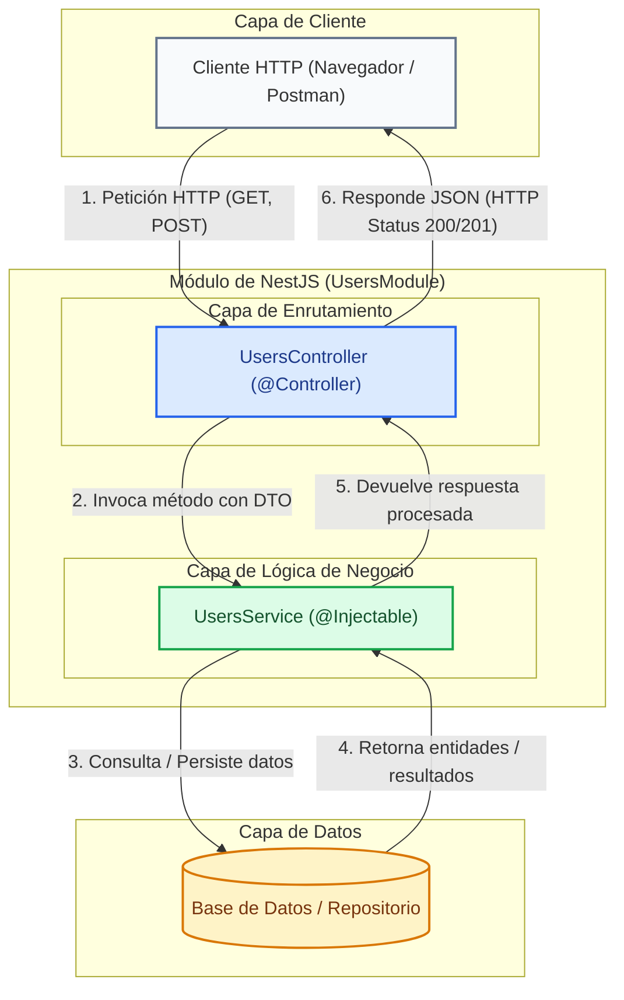

# Primeros Pasos con NestJS

NestJS organiza las aplicaciones de backend mediante una estructura modular inspirada en patrones enterprise. En esta guía práctica aprenderás a instalar el CLI, instanciar un nuevo proyecto, comprender su arquitectura interna y construir tus propios módulos, controladores y servicios.

---

## 1. Arquitectura y Fundamentos de Componentes

Antes de escribir código o generar archivos con el CLI, es esencial comprender cómo interactúan los componentes fundamentales dentro de un módulo de NestJS:



### Explicación de los Componentes Principales:

* **Módulo (`@Module`)**: Es la unidad organizativa fundamental en NestJS. Agrupa los controladores y proveedores (servicios) relacionados, delimitando las dependencias y permitiendo construir una arquitectura modular escalable.
* **Controlador (`@Controller`)**: Es responsable de escuchar las peticiones HTTP externas en rutas específicas (por ejemplo, `/users`), desempaquetar parámetros o payloads en el body, y llamar a la lógica del servicio correspondiente.
* **Servicio (`@Injectable`)**: Contiene la lógica de negocio pura (cálculos, transformaciones, llamadas a bases de datos o servicios de terceros). Los servicios se decoran con `@Injectable()` para ser inyectados automáticamente mediante la Inyección de Dependencias de NestJS.

---

## 2. Guía Práctica de Desarrollo (Paso a Paso)

<StepByStep>
  <Step number="1" title="Instalación global de NestJS CLI">
    El CLI (Command Line Interface) de NestJS permite automatizar la creación de proyectos y la generación de componentes siguiendo las mejores prácticas de la arquitectura Nest.

    ```bash title="Terminal"
    npm install -g @nestjs/cli
    ```

    :::tip[Por qué usar el CLI]
    El CLI evita la configuración manual de TypeScript, Webpack/SWC, ESLint y Jest, además de mantener una estructura limpia y estandarizada entre proyectos.
    :::
  </Step>

  <Step number="2" title="Creación del proyecto base">
    Ejecuta el comando `nest new` para inicializar un nuevo proyecto llamado `my-nest-app`:

    ```bash title="Terminal"
    nest new my-nest-app
    ```

    Durante la ejecución, el CLI preguntará qué gestor de paquetes deseas utilizar. Selecciona `npm` (o `yarn` / `pnpm` según tus preferencias).
  </Step>

  <Step number="3" title="Inspección de la estructura de archivos">
    Navega al directorio recién creado y examina los archivos generados:

    ```bash title="Terminal"
    cd my-nest-app
    ```

    La estructura resultante se organiza de la siguiente manera:

    ```text title="Estructura de archivos"
    my-nest-app/
    ├── src/
    │   ├── app.controller.spec.ts  # Pruebas unitarias del controlador principal
    │   ├── app.controller.ts       # Controlador base con ruta de prueba ('/')
    │   ├── app.module.ts           # Módulo raíz de la aplicación
    │   ├── app.service.ts          # Servicio base con métodos sencillos
    │   └── main.ts                 # Punto de entrada (inicia el servidor HTTP)
    ├── test/
    │   └── app.e2e-spec.ts         # Pruebas end-to-end
    ├── nest-cli.json               # Configuración interna del CLI de Nest
    ├── package.json                # Dependencias y scripts de ejecución
    └── tsconfig.json               # Configuración del compilador de TypeScript
    ```

    Explicación de los archivos principales en `src/`:
    - **`main.ts`**: Utiliza `NestFactory.create(AppModule)` para instanciar la aplicación e iniciar el servidor en el puerto 3000 por defecto.
    - **`app.module.ts`**: Punto focal de montaje de la aplicación. Aquí se registran los controladores y proveedores raíz.
    - **`app.controller.ts`**: Contiene manejadores HTTP básicos (por ejemplo, `GET /`).
    - **`app.service.ts`**: Retorna respuestas simples (como `"Hello World!"`).
  </Step>

  <Step number="4" title="Ejecución de la aplicación en modo desarrollo">
    Inicia el servidor local en modo vigilancia (watch mode) para que detecte cambios automáticamente al guardar:

    ```bash title="Terminal"
    npm run start:dev
    ```

    Abre tu navegador en `http://localhost:3000` para verificar que la aplicación responda correctamente.

    :::info[Cambio de puerto en main.ts]
    Si el puerto 3000 está ocupado en tu equipo, puedes modificar el archivo `src/main.ts`:

    ```typescript title="src/main.ts" showLineNumbers
    import { NestFactory } from '@nestjs/core';
    import { AppModule } from './app.module';

    async function bootstrap() {
      // Instancia la aplicación Nest utilizando el módulo raíz
      const app = await NestFactory.create(AppModule);
      
      // Define el puerto de escucha del servidor HTTP (ej: 3001)
      await app.listen(3001);
    }
    bootstrap();
    ```
    :::
  </Step>

  <Step number="5" title="Generación modular con el CLI">
    Para construir una funcionalidad aislada (por ejemplo, gestión de usuarios), se recomienda generar sus tres capas base: Módulo, Controlador y Servicio.

    Abre una nueva pestaña en tu terminal e ingresa los siguientes comandos:

    <Tabs>
      <TabItem value="step-by-step-cmds" label="Comandos Individuales" default>
        ```bash title="Terminal"
        # 1. Generar el módulo de usuarios
        nest generate module users

        # 2. Generar el controlador de usuarios
        nest generate controller users

        # 3. Generar el servicio de usuarios
        nest generate service users
        ```
      </TabItem>
      <TabItem value="resource-cmd" label="Comando Todo en Uno (CRUD Resource)">
        ```bash title="Terminal"
        # Genera el recurso completo de usuarios (Módulo, Controlador, Servicio, DTOs y Entidades)
        nest generate resource users
        ```
      </TabItem>
    </Tabs>

    :::tip[Formas cortas del CLI]
    Puedes usar alias abreviados en la consola: `nest g mo users`, `nest g co users` y `nest g s users`.
    :::
  </Step>

  <Step number="6" title="Implementación del código de Usuarios">
    Examina el código generado en `src/users/` e implementa la lógica básica de comunicación entre las capas:

    ```typescript title="src/users/users.service.ts" showLineNumbers
    import { Injectable } from '@nestjs/common';

    // Decorador que marca la clase como inyectable por el contenedor de IoC de NestJS
    @Injectable()
    export class UsersService {
      // Colección simulada en memoria para representar la fuente de datos
      private users = [
        { id: 1, name: 'Alice', email: 'alice@icesi.edu.co' },
        { id: 2, name: 'Bob', email: 'bob@icesi.edu.co' },
      ];

      // Método para retornar todos los usuarios registrados
      findAll() {
        return this.users;
      }

      // Método para retornar un usuario específico según su ID
      findOne(id: number) {
        return this.users.find(user => user.id === id);
      }
    }
    ```

    ```typescript title="src/users/users.controller.ts" showLineNumbers
    import { Controller, Get, Param } from '@nestjs/common';
    import { UsersService } from './users.service';

    // Decorador que define la ruta base HTTP '/users' para todas las peticiones de este controlador
    @Controller('users')
    export class UsersController {
      // Inyección de dependencias: Nest inyecta automáticamente la instancia de UsersService
      constructor(private readonly usersService: UsersService) {}

      // Maneja peticiones HTTP GET a '/users'
      @Get()
      getAllUsers() {
        return this.usersService.findAll();
      }

      // Maneja peticiones HTTP GET a '/users/:id'
      @Get(':id')
      getUserById(@Param('id') id: string) {
        // Convierte el parámetro de ruta en número antes de pasarlo al servicio
        return this.usersService.findOne(Number(id));
      }
    }
    ```

    ```typescript title="src/users/users.module.ts" showLineNumbers
    import { Module } from '@nestjs/common';
    import { UsersController } from './users.controller';
    import { UsersService } from './users.service';

    // Decorador que registra los controladores y proveedores del módulo
    @Module({
      controllers: [UsersController],
      providers: [UsersService],
    })
    export class UsersModule {}
    ```
  </Step>
</StepByStep>

---

## 3. Cuestionario de Autoevaluación

<Quiz id="dedw-nest-first-steps-quiz">
  <Question title="¿Cuál es la función del comando global 'npm install -g @nestjs/cli'?">
    <Option>Instalar la base de datos PostgreSQL localmente en la máquina.</Option>
    <Option correct>Instalar la herramienta de línea de comandos de NestJS para automatizar la creación de proyectos y generadores de código.</Option>
    <Option>Compilar directamente código TypeScript a ejecutables binarios de C++.</Option>
    <Option>Crear un proxy reverso Nginx configurado con SSL.</Option>
  </Question>
  <Question title="¿Qué comando del CLI se utiliza para instanciar un nuevo proyecto de NestJS llamado 'my-app'?">
    <Option>nest create my-app</Option>
    <Option>npm init nest-app my-app</Option>
    <Option correct>nest new my-app</Option>
    <Option>nest start my-app --init</Option>
  </Question>
  <Question title="¿Qué archivo en la carpeta 'src/' de un proyecto NestJS sirve como punto de entrada e inicia el servidor HTTP?">
    <Option>src/app.module.ts</Option>
    <Option correct>src/main.ts</Option>
    <Option>src/app.controller.ts</Option>
    <Option>src/nest-cli.json</Option>
  </Question>
  <Question title="¿Para qué sirve el script 'npm run start:dev' en un proyecto NestJS?">
    <Option>Para ejecutar los contenedores de Docker en producción.</Option>
    <Option correct>Para iniciar la aplicación en modo desarrollo con recarga automática ante cambios de código.</Option>
    <Option>Para compilar la aplicación a producción sin ejecutar el servidor.</Option>
    <Option>Para ejecutar únicamente las pruebas de integración end-to-end.</Option>
  </Question>
  <Question title="¿Qué decorador debe añadirse a una clase de servicio para que NestJS pueda inyectarla mediante Inyección de Dependencias?">
    <Option>@Controller()</Option>
    <Option>@Module()</Option>
    <Option correct>@Injectable()</Option>
    <Option>@Entity()</Option>
  </Question>
  <Question title="¿Cuál es el atajo corto en el CLI para generar un módulo de usuarios?">
    <Option>nest g m users</Option>
    <Option correct>nest g mo users</Option>
    <Option>nest make module users</Option>
    <Option>nest add module users</Option>
  </Question>
  <Question title="¿Cómo se inyecta un servicio (UsersService) en un controlador (UsersController)?">
    <Option>Haciendo un import estático dentro del método del handler HTTP.</Option>
    <Option correct>Declarando una variable privada readonly en el constructor de la clase del controlador.</Option>
    <Option>Utilizando la variable global process.env.SERVICE.</Option>
    <Option>Mediante el decorador @InjectService() encima del nombre de la clase.</Option>
  </Question>
  <Question title="¿Qué comando del CLI permite generar todo un recurso CRUD completo (Módulo, Controlador, Servicio, DTOs) en un solo paso?">
    <Option>nest generate crud users</Option>
    <Option correct>nest generate resource users</Option>
    <Option>nest generate api users</Option>
    <Option>nest build resource users</Option>
  </Question>
  <Question title="¿Qué decorador se utiliza en una clase para definir las rutas HTTP a las que responderá un controlador?">
    <Option>@Route()</Option>
    <Option>@Endpoint()</Option>
    <Option correct>@Controller('ruta')</Option>
    <Option>@Path()</Option>
  </Question>
  <Question title="¿Cuál es el rol de un Módulo (@Module) en la arquitectura de NestJS?">
    <Option>Ejecutar las consultas SQL hacia la base de datos.</Option>
    <Option correct>Agrupar controladores y proveedores relacionados para estructurar la aplicación de forma coherente y delimitada.</Option>
    <Option>Renderizar plantillas HTML en el navegador del usuario.</Option>
    <Option>Supervisar el uso de memoria RAM de la máquina virtual.</Option>
  </Question>
</Quiz>
