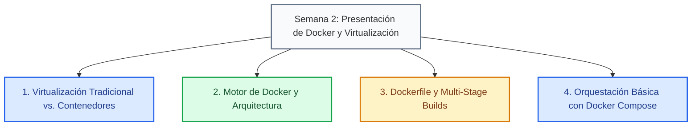

# Slides de la Semana

Diapositivas oficiales correspondientes a la Semana 2: **Virtualización vs. Contenedores, Arquitectura de Docker, Dockerfile (Multi-Stage Builds), Comandos Útiles e Introducción a Docker Compose**.

---

## 1. Visión General del Contenido de las Diapositivas

El material en PDF abarca los conceptos teóricos y prácticos fundamentales abordados durante la sesión de la Semana 2:

### Resumen de Ejes Temáticos:

* **Virtualización Tradicional vs. Contenedores**: Comparativa entre Hypervisores (Tipo 1 y Tipo 2) y el aislamiento ligero basado en el Kernel del sistema operativo host.
* **Arquitectura de Docker Engine**: Funcionamiento del cliente Docker CLI, el Docker Daemon (`dockerd`) y el almacenamiento de imágenes en registros (Docker Hub).
* **Construcción Eficiente de Imágenes**: Buenas prácticas para la creación de archivos `Dockerfile`, optimización de capas de caché y uso de compilaciones multietapa (*Multi-stage builds*) para reducir el tamaño final de los contenedores.
* **Docker Compose**: Definición declarativa de entornos de desarrollo multicontenedor mediante archivos `docker-compose.yml`.

---

## 2. Visor Interactivo de la Presentación

Puedes navegar hoja por hoja a través del siguiente visor interactivo cargado directamente desde los recursos del curso.

<PdfViewer 
  src="/files/computacion-3/semana-1/docker-intro.pdf" 
  totalPages={36} 
  title="Semana 2: Virtualización y Contenedores con Docker"
/>

---

## 3. Cuestionario de Autoevaluación

<Quiz id="dedw-docker-slides-quiz">
  <Question title="¿Cuál es el beneficio principal de utilizar Multi-Stage Builds en un Dockerfile según el material presentado?">
    <Option>Permite ejecutar múltiples hipervisores tipo 1 de forma simultánea.</Option>
    <Option correct>Separar el entorno de compilación pesada del entorno de ejecución final para obtener imágenes mucho más ligeras y seguras.</Option>
    <Option>Reemplazar por completo el archivo docker-compose.yml en producción.</Option>
    <Option>Aumentar el número de puertos expuestos automáticamente hacia la red física.</Option>
  </Question>
  <Question title="¿Qué componente de la arquitectura de Docker se encarga de escuchar las peticiones de la CLI y gestionar los contenedores e imágenes?">
    <Option>El Hipervisor bare-metal.</Option>
    <Option correct>El Docker Daemon (dockerd).</Option>
    <Option>El cliente de PowerShell/Terminal.</Option>
    <Option>El registro de Docker Hub exclusivamente.</Option>
  </Question>
  <Question title="¿En qué consiste el aislamiento a nivel de kernel que utilizan los contenedores Docker?">
    <Option>Cada contenedor virtualiza una CPU física independiente.</Option>
    <Option correct>Los contenedores comparten el sistema operativo del host pero utilizan namespaces y cgroups para aislar procesos y recursos.</Option>
    <Option>Requiere instalar un sistema operativo completo invitada en cada imagen.</Option>
    <Option>Solo es posible si el host tiene instalado Windows Server 2022.</Option>
  </Question>
  <Question title="¿Qué instrucción de Dockerfile se utiliza para definir etapas intermedias en una construcción Multi-Stage?">
    <Option>FROM &lt;imagen&gt; BUILDER</Option>
    <Option correct>FROM &lt;imagen&gt; AS &lt;nombre_etapa&gt;</Option>
    <Option>STAGE &lt;nombre_etapa&gt;</Option>
    <Option>STEP &lt;nombre_etapa&gt;</Option>
  </Question>
  <Question title="¿Qué ventajas ofrece Docker Compose en comparación con ejecutar comandos manuales de 'docker run'?">
    <Option>Aumenta la velocidad del procesador físico durante la compilación.</Option>
    <Option correct>Permite definir, configurar y lanzar múltiples servicios interactivos de forma declarativa mediante un único archivo YAML.</Option>
    <Option>Elimina la necesidad de instalar el motor de Docker en la máquina host.</Option>
    <Option>Genera automáticamente el código fuente de los controladores NestJS.</Option>
  </Question>
  <Question title="¿Qué sucede cuando se modifica una línea inicial de un Dockerfile en términos de caché de capas?">
    <Option>Se utilizan las capas cacheadas sin volver a compilar nada.</Option>
    <Option correct>Se invalida el caché para esa línea y para todas las instrucciones subsecuentes.</Option>
    <Option>Docker elimina automáticamente la imagen base de la máquina local.</Option>
    <Option>Se detienen inmediatamente todos los contenedores activos en el sistema.</Option>
  </Question>
  <Question title="¿Dónde se almacenan y distribuyen las imágenes públicas oficiales de Docker como Node.js, Nginx o PostgreSQL?">
    <Option>En el servidor local de la universidad.</Option>
    <Option correct>En un registro central como Docker Hub.</Option>
    <Option>Directamente en el navegador del desarrollador.</Option>
    <Option>En el archivo tsconfig.json del proyecto.</Option>
  </Question>
  <Question title="¿Qué parámetro del comando 'docker run' permite enlazar un puerto del host con un puerto del contenedor?">
    <Option>-v / --volume</Option>
    <Option correct>-p / --publish</Option>
    <Option>-e / --env</Option>
    <Option>-d / --detach</Option>
  </Question>
  <Question title="¿Cuál es la función del comando 'docker compose down'?">
    <Option>Pausar temporalmente la ejecución del Docker Daemon.</Option>
    <Option correct>Detener y remover todos los contenedores, redes y volúmenes creados por la aplicación.</Option>
    <Option>Descargar la versión más reciente de Docker Desktop.</Option>
    <Option>Compilar el proyecto de TypeScript a código fuente JavaScript.</Option>
  </Question>
  <Question title="¿Por qué es recomendable utilizar imágenes base reducidas como 'alpine' en producción?">
    <Option>Porque contienen un hipervisor tipo 2 integrado.</Option>
    <Option correct>Porque reducen drásticamente el tamaño en disco y la superficie de vulnerabilidades de seguridad.</Option>
    <Option>Porque son las únicas compatibles con sistemas operativos macOS.</Option>
    <Option>Porque impiden que el contenedor requiera memoria RAM para ejecutarse.</Option>
  </Question>
</Quiz>
