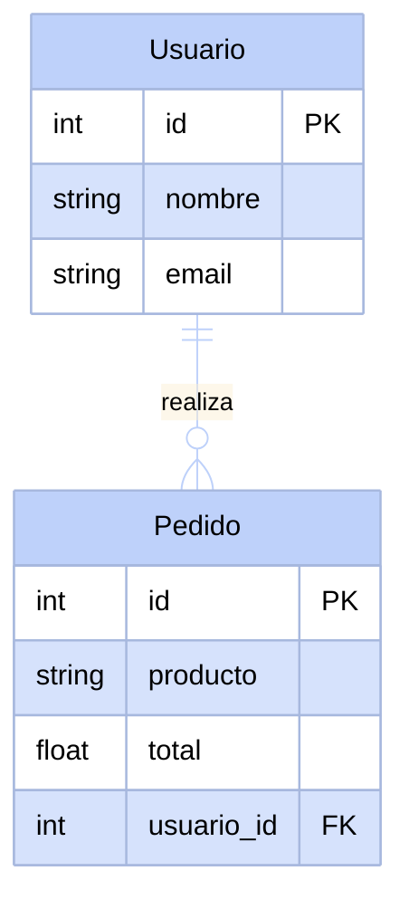
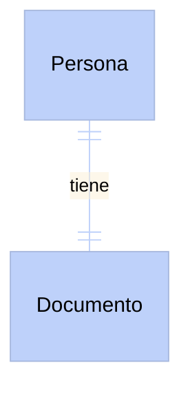
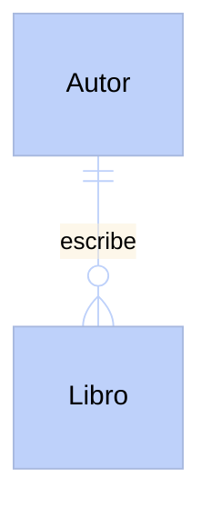
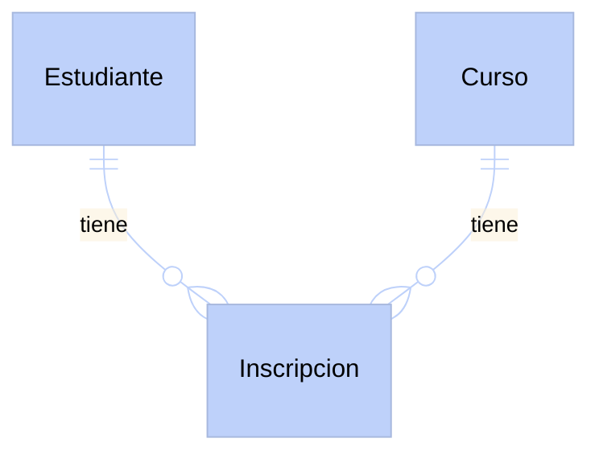

# Bases de datos relacionales

Una base de datos es el lugar donde las aplicaciones web guardan su información para que no se pierda al apagar el servidor. Piensa en ella como una hoja de cálculo, pero mucho más inteligente, rápida y con la capacidad de relacionar diferentes hojas entre sí. Esto nos permite hacer preguntas complejas sobre los datos de forma muy eficiente.

## La tabla: la unidad básica

En una base de datos relacional, la información se organiza en **tablas**. Cada tabla guarda datos sobre una sola entidad o concepto, como usuarios, productos o pedidos.

Una tabla está formada por **columnas** (los campos o propiedades) y **filas** (los registros individuales). Cada columna define qué tipo de información se guarda, mientras que cada fila representa un elemento específico.

Mira este ejemplo con una tabla de usuarios y otra de pedidos:

**Tabla Usuario**

| ID | Nombre | Email |
| -- | ------ | ----- |
| 1 | Ana | ana@correo.com |
| 2 | Luis | luis@correo.com |

**Tabla Pedido**

| ID | Producto | Total | Usuario_ID |
| -- | -------- | ----- | ---------- |
| 100 | Teclado | 45.0 | 1 |
| 101 | Ratón | 20.0 | 1 |
| 102 | Monitor | 150.0 | 2 |

## La llave principal y la llave foránea

Para que las tablas puedan relacionarse sin confusiones, necesitamos una forma de identificar cada fila de manera única. Aquí es donde entran las llaves.

:::info
La **llave principal** (Primary Key o PK) es un valor único que identifica a un registro dentro de su propia tabla. No pueden existir dos filas con la misma llave principal.
:::

:::info
La **llave foránea** (Foreign Key o FK) es una columna en una tabla que hace referencia a la llave principal de otra tabla. Es el puente que conecta los datos.
:::

:::tip
Imagina que la llave principal es como tu número de pasaporte: es único en el mundo y te identifica a ti. La llave foránea es como escribir tu número de pasaporte en un formulario de hotel: el hotel usa ese número para referirse a ti sin tener que copiar todos tus datos personales.
:::

En nuestro ejemplo, Ana tiene el ID 1 en la tabla de usuarios (su llave principal). En la tabla de pedidos, vemos que Ana hizo los pedidos 100 y 101, porque ambos tienen un 1 en la columna `Usuario_ID` (la llave foránea).

## Diagramas de entidad-relación (ER)

Para visualizar cómo se conectan nuestras tablas, usamos diagramas. Observa esta relación entre Usuario y Pedido:

En este diagrama, los símbolos en la línea que conecta las tablas nos cuentan la historia de su relación:
- El símbolo `||` junto a Usuario significa "exactamente uno".
- El símbolo `o{` junto a Pedido significa "cero o muchos".
- Toda la conexión `||--o{` se lee como: "un Usuario puede realizar cero o muchos Pedidos, pero cada Pedido pertenece a exactamente un Usuario".

## Tipos de relaciones

Dependiendo de cómo interactúan las entidades en la vida real, las relaciones pueden ser de tres tipos:

### Relación 1:1 (Uno a uno)

Ocurre cuando un registro de la Tabla A se relaciona con un solo registro de la Tabla B, y viceversa. Un ejemplo clásico es una persona y su documento de identidad nacional. Una persona tiene un solo documento, y un documento pertenece a una sola persona.

### Relación 1:N (Uno a muchos)

Es la más común. Un registro de la Tabla A puede estar asociado a varios de la Tabla B, pero los de la B solo pertenecen a uno de la A. Como un autor que escribe varios libros, pero cada libro (en este escenario simple) tiene un solo autor.

### Relación N:M (Muchos a muchos)

Ocurre cuando muchos registros de la Tabla A se relacionan con muchos de la Tabla B. Piensa en estudiantes y cursos: un estudiante toma varios cursos, y un curso tiene varios estudiantes.

Para lograr esto en una base de datos relacional, **siempre** necesitamos crear una tercera tabla en medio, conocida como tabla puente o intermedia. Esta nueva tabla guarda las conexiones combinando las llaves principales de ambas tablas.

## ¿Qué tipos de datos puede guardar una columna?

Cada columna debe definir estrictamente qué tipo de información va a almacenar. Esto ayuda a mantener el orden y evitar errores. Estos son los tipos más comunes:

- **INT (Entero):** Números sin decimales. Perfecto para edades, cantidades o identificadores.
- **VARCHAR (Texto variable):** Cadenas de texto cortas. Útil para nombres, apellidos o correos electrónicos.
- **TEXT (Texto largo):** Para guardar grandes cantidades de texto, como el contenido de un artículo de blog o comentarios.
- **DATE (Fecha):** Almacena fechas. Ideal para la fecha de nacimiento o cuándo se hizo una compra.
- **BOOLEAN (Booleano):** Solo acepta verdadero o falso. Sirve para saber si un usuario está activo, o si un pedido ya fue enviado.
- **FLOAT o DECIMAL (Decimales):** Números con fracciones. Indispensable para precios de productos o medidas.

## ¿Quién administra todo esto? Los RDBMS

Las bases de datos relacionales son gestionadas por programas especializados llamados Sistemas de Gestión de Bases de Datos Relacionales (RDBMS, por sus siglas en inglés).

Existen varias opciones populares en el mercado. Por ejemplo, MySQL es muy común en la web, y SQLite es excelente para aplicaciones móviles o proyectos pequeños porque guarda todo en un solo archivo.

En este curso utilizaremos **PostgreSQL**. Es un sistema robusto, de código abierto y altamente respetado en la industria por su confiabilidad y características avanzadas.

<Quiz id="dedw-relational-dbs-quiz">
  <Question title="¿Qué es una llave principal (Primary Key)?">
    <Option>Una contraseña para proteger la base de datos.</Option>
    <Option correct>Un valor único que identifica a un registro específico dentro de su propia tabla.</Option>
    <Option>Una columna que guarda textos muy largos.</Option>
    <Option>El identificador del servidor donde está la base de datos.</Option>
  </Question>
  <Question title="¿Qué es una llave foránea (Foreign Key)?">
    <Option correct>Una columna que hace referencia a la llave principal de otra tabla para conectar datos.</Option>
    <Option>Una llave utilizada por usuarios extranjeros.</Option>
    <Option>El número único que identifica a una fila en su propia tabla.</Option>
    <Option>Un tipo de dato especial para números decimales.</Option>
  </Question>
  <Question title="En un sistema donde un cliente puede tener múltiples direcciones, pero cada dirección pertenece a un solo cliente, ¿qué tipo de relación es?">
    <Option>Uno a uno (1:1).</Option>
    <Option correct>Uno a muchos (1:N).</Option>
    <Option>Muchos a muchos (N:M).</Option>
    <Option>No se puede relacionar.</Option>
  </Question>
  <Question title="¿Cuándo necesitas crear una tabla intermedia o tabla puente?">
    <Option>Cuando quieres relacionar dos tablas en una relación Uno a Uno.</Option>
    <Option>Para separar textos largos de los números enteros.</Option>
    <Option>Cuando una tabla tiene demasiadas columnas.</Option>
    <Option correct>Siempre que necesitas establecer una relación Muchos a Muchos entre dos entidades.</Option>
  </Question>
  <Question title="Si necesitas guardar el precio de un producto, ¿qué tipo de dato es el más adecuado?">
    <Option>BOOLEAN</Option>
    <Option correct>FLOAT o DECIMAL</Option>
    <Option>INT</Option>
    <Option>VARCHAR</Option>
  </Question>
  <Question title="¿Qué sistema de gestión de bases de datos relacionales (RDBMS) utilizaremos principalmente en este curso?">
    <Option>MySQL</Option>
    <Option>SQLite</Option>
    <Option correct>PostgreSQL</Option>
    <Option>MongoDB</Option>
  </Question>
  <Question title="¿Qué representa una fila en una tabla de base de datos?">
    <Option>El tipo de dato que se va a guardar.</Option>
    <Option>El nombre de la tabla puente.</Option>
    <Option correct>Un registro individual o elemento específico de esa entidad.</Option>
    <Option>La lista de todas las columnas disponibles.</Option>
  </Question>
  <Question title="En un diagrama ER, ¿qué significa el símbolo ||--o{ entre dos tablas?">
    <Option>Que no existe ninguna relación entre ellas.</Option>
    <Option correct>Que un elemento de la primera tabla puede tener cero o muchos elementos de la segunda.</Option>
    <Option>Que exactamente un elemento se relaciona con exactamente otro elemento.</Option>
    <Option>Que es obligatorio tener una tabla intermedia.</Option>
  </Question>
</Quiz>
