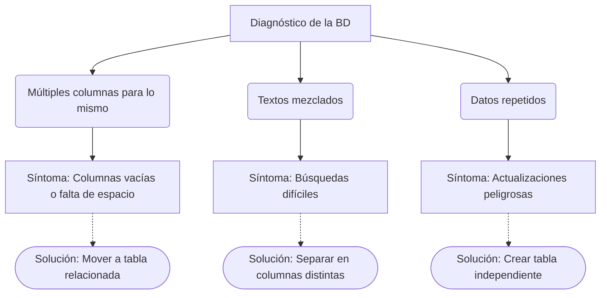

# Cómo diseñar una buena base de datos

Ahora que sabemos qué son las tablas y las relaciones, ¿cómo decidimos la manera de organizar la información? Esta sección enseña reglas prácticas para construir una base de datos bien estructurada.

## Una BD enferma

Para entender el buen diseño, primero debemos ver cómo luce un mal diseño. Imagina que creas una tabla llamada `CONTACTOS` para guardar la información de las personas.

A simple vista, puede parecer buena idea guardar todo en el mismo lugar. Sin embargo, veamos lo que sucede cuando empezamos a llenarla con datos reales.

| id | nombre_completo | telefono1 | telefono2 | telefono3 | correo | ciudad_de_residencia | nombre_ciudad_pais |
|---|---|---|---|---|---|---|---|
| 1 | Ana Gómez | 300123 | | | ana@mail.com | Medellín | Medellín, Colombia |
| 2 | Juan Pérez | 310456 | 320789 | | juan@mail.com | Medellín | Medellín, Colombia |
| 3 | Luz Silva | 301987 | | 311234 | luz@mail.com | Bogotá | Bogotá, Colombia |
| 4 | Carlos Ruiz | 315654 | | | carlos@mail.com | Medellín | Medellín, Colombia |

:::warning[Problemas detectados]
* **Problema 1: Datos repetidos (redundancia):** "Medellín" aparece muchas veces. Si descubres que escribiste mal el nombre y debe ser "Medellín Centro", tendrías que actualizar cientos o miles de filas a mano.
* **Problema 2: Columnas vacías sin sentido:** `telefono2` y `telefono3` están vacíos para la mayoría de las personas, desperdiciando espacio y generando desorden.
* **Problema 3: Un dato hace dos cosas:** `nombre_ciudad_pais` guarda la ciudad y el país al mismo tiempo. Si alguien te pide buscar "solo los contactos de Colombia", será un dolor de cabeza.
* **Problema 4: Grupos repetidos:** `telefono1`, `telefono2` y `telefono3` son exactamente el mismo tipo de información, solo que repetida como columnas diferentes.
:::

Podemos visualizar los síntomas de una base de datos enferma con el siguiente diagnóstico:



## Las reglas del buen diseño

Para evitar que tu base de datos se enferme, existen ciertas reglas prácticas de diseño. A continuación, te presentamos cuatro reglas esenciales para mantener tus datos organizados.

### Regla 1: "Un dato, una sola vez"

Cada pieza de información debe vivir en exactamente UN lugar dentro de la base de datos. Si te encuentras repitiendo la misma información en múltiples filas, esos datos merecen su propia tabla.

Por ejemplo, si tienes el nombre de una ciudad repetido en cada contacto, es mejor crear una tabla separada para las ciudades.

:::tip[Antes y Después]
* **Antes:** La tabla contacto tiene la columna `ciudad_nombre` repetida ("Medellín", "Medellín", "Medellín").
* **Después:** Creas una tabla `CIUDAD`. El contacto ahora solo tiene un identificador `id_ciudad`.
:::

### Regla 2: "Cada columna guarda UNA sola cosa"

Una columna debe contener un pedazo de información indivisible. No debes mezclar diferentes tipos de datos en una sola celda.

:::tip[Antes y Después]
* **Antes:** La columna `nombre_ciudad_pais` guarda el valor "Medellín, Colombia".
* **Después:** Separas la información en dos columnas: `ciudad` y `pais`. O mejor aún, creas tablas separadas para ambos conceptos.
:::

### Regla 3: "No más columnas del mismo tipo"

Si tienes columnas como `telefono1`, `telefono2`, `telefono3`, estás rompiendo esta regla. Siempre que tengas un grupo de columnas que hacen lo mismo, debes crear una nueva tabla y vincularla.

**Antes** — La misma información repetida como columnas separadas:

| id | nombre | telefono1 | telefono2 | telefono3 |
|----|--------|-----------|-----------|-----------|
| 1  | Ana    | 300123    | 310456    |           |
| 2  | Juan   | 315789    |           |           |

**Después** — Una tabla separada con una fila por cada número:

| id | id_persona | numero |
|----|------------|--------|
| 1  | 1          | 300123 |
| 2  | 1          | 310456 |
| 3  | 2          | 315789 |

:::tip[Ventaja]
Si Ana consigue un cuarto teléfono, simplemente agregas una fila más. No tienes que modificar la estructura de la tabla ni tocar los datos de Juan.
:::

### Regla 4: "Cada columna depende de la llave, solo de la llave"

Cada columna de una tabla debe decirnos algo sobre la llave principal de esa tabla, y no sobre otras columnas. Toda la información debe describir directamente al sujeto principal de la tabla.

:::tip[Antes y Después]
* **Antes:** En una tabla `PEDIDO`, tienes `ciudad_de_envio`, `nombre_ciudad` y `codigo_postal_ciudad`. Estos últimos datos describen a la ciudad, no al pedido.
* **Después:** Dejas el identificador de la ciudad en el pedido, pero creas una tabla `DIRECCION` o `CIUDAD` para guardar sus detalles.
:::

## El proceso de mejorar una BD

Aplicar las reglas requiere un proceso metódico. Sigamos los pasos usando nuestra tabla `CONTACTOS` enferma como ejemplo real, así puedes ver la acción concreta en cada etapa.

<StepByStep>
  <Step number={1} title="Escribe todo en una tabla plana">
    Haz una lista de absolutamente toda la información que necesitas guardar, sin preocuparte por la organización. Ponla en una sola tabla gigante.

    *Aplicado al ejemplo:* Tomamos la tabla `CONTACTOS` con todas sus columnas tal cual:

    | id | nombre_completo | telefono1 | telefono2 | telefono3 | correo | ciudad_de_residencia | nombre_ciudad_pais |
    |----|-----------------|-----------|-----------|-----------|--------|----------------------|---------------------|
    | 1  | Ana Gómez       | 300123    |           |           | ana@   | Medellín             | Medellín, Colombia  |
    | 2  | Juan Pérez      | 310456    | 320789    |           | juan@  | Medellín             | Medellín, Colombia  |

    Esta es tu "tabla enferma" de partida. Es normal que se vea así al inicio.
  </Step>
  <Step number={2} title="Encuentra los datos que se repiten fila a fila">
    Busca columnas cuyo valor es el mismo en muchas filas. Eso indica que ese dato merece su propia tabla.

    *Aplicado al ejemplo:* La columna `ciudad_de_residencia` tiene "Medellín" repetido en las filas 1, 2 y 4. Si tuviéramos 500 contactos de Medellín y la ciudad cambia de nombre, tendríamos 500 filas que actualizar a mano.

    **Acción:** Crear una tabla `CIUDAD` separada y reemplazar el texto repetido por un `id_ciudad`.

    | id | nombre_ciudad |
    |----|---------------|
    | 1  | Medellín      |
    | 2  | Bogotá        |
  </Step>
  <Step number={3} title="Divide las columnas que mezclan dos cosas">
    Busca columnas que guarden más de un concepto en una sola celda. Sepáralas.

    *Aplicado al ejemplo:* La columna `nombre_ciudad_pais` guarda "Medellín, Colombia" — dos datos en uno. Si alguien pide filtrar por país, es imposible hacerlo limpiamente.

    **Acción:** En la tabla `CIUDAD` que ya creamos, separamos en dos columnas distintas:

    | id | nombre_ciudad | nombre_pais |
    |----|---------------|-------------|
    | 1  | Medellín      | Colombia    |
    | 2  | Bogotá        | Colombia    |

    Ahora puedes filtrar por país, por ciudad, o por ambos sin problemas.
  </Step>
  <Step number={4} title="Elimina los grupos de columnas del mismo tipo">
    Si tienes `telefono1`, `telefono2`, `telefono3`... estás guardando el mismo tipo de dato en columnas repetidas. Crea una tabla separada con una fila por cada valor.

    *Aplicado al ejemplo:* En lugar de 3 columnas de teléfono, creamos la tabla `TELEFONO`:

    | id | id_persona | numero |
    |----|------------|--------|
    | 1  | 1          | 300123 |
    | 2  | 2          | 310456 |
    | 3  | 2          | 320789 |

    Ahora Juan puede tener 10 teléfonos y nunca nos faltará espacio. Solo agregas filas, no columnas.
  </Step>
  <Step number={5} title="Verifica que cada columna describa solo su tabla">
    Lee cada columna y pregúntate: "¿Este dato describe a la entidad principal o en realidad describe a otra cosa?". Si la respuesta es "otra cosa", muévelo.

    *Aplicado al ejemplo:* Revisamos la tabla `PERSONA`. ¿La columna `nombre_completo` describe a la persona? Sí. ¿El `correo` describe a la persona? Sí. ¿El `nombre_ciudad_pais` describe a la persona o a la ciudad? A la ciudad — ya lo movimos en el Paso 3.

    **Acción:** Separar `nombre_completo` en `nombre` y `apellido` para mayor flexibilidad:

    | id | nombre | apellido | correo      | id_ciudad |
    |----|--------|----------|-------------|-----------|
    | 1  | Ana    | Gómez    | ana@mail.com | 1        |
    | 2  | Juan   | Pérez    | juan@mail.com| 1        |
  </Step>
  <Step number={6} title="Dibuja el diagrama final">
    Con todas las tablas depuradas, construye el diagrama ER para visualizar cómo quedaron conectadas. Este es el diseño que vas a implementar en código.

    *Aplicado al ejemplo:* El resultado final de rediseñar `CONTACTOS` es:

    ```mermaid
    %%{init: {
        "theme": "base",
        "themeVariables": {
            "primaryColor": "#bed1fa",
            "primaryTextColor": "#000000",
            "lineColor": "#bed1fa"
        }
    }}%%
    erDiagram
        CIUDAD {
            int id PK
            string nombre_ciudad
            string nombre_pais
        }
        PERSONA {
            int id PK
            string nombre
            string apellido
            string correo
            int id_ciudad FK
        }
        TELEFONO {
            int id PK
            int id_persona FK
            string numero
        }
        CIUDAD ||--o{ PERSONA : "tiene residentes"
        PERSONA ||--o{ TELEFONO : "tiene numeros"
    ```

    Pasamos de una tabla caótica con 8 columnas a tres tablas limpias, sin datos repetidos y sin columnas vacías.
  </Step>
</StepByStep>

## Pon a prueba tus conocimientos

<Quiz id="dedw-db-design-quiz">
  <Question title="¿Qué regla soluciona principalmente el problema de la redundancia y los datos repetidos?">
    <Option>La regla de que cada columna guarda una sola cosa.</Option>
    <Option correct>La regla de un dato, una sola vez.</Option>
    <Option>La regla de no más columnas del mismo tipo.</Option>
    <Option>La regla de agrupar los datos parecidos.</Option>
  </Question>

  <Question title="Si tienes las columnas telefono1, telefono2 y telefono3, ¿qué deberías hacer?">
    <Option>Dejarlas así para que la base de datos sea más rápida.</Option>
    <Option>Agregar telefono4 por si acaso lo necesitan después.</Option>
    <Option correct>Crear una nueva tabla para los teléfonos y vincularla.</Option>
    <Option>Juntar todos los números separados por comas en una sola columna.</Option>
  </Question>

  <Question title="¿Qué necesita una columna que mezcla dos valores diferentes (ej. nombre y apellido)?">
    <Option>Cambiar el tipo de dato para que quepan ambos.</Option>
    <Option>Crear una tabla intermedia para conectarlos.</Option>
    <Option>Dejarse como está porque ahorra espacio.</Option>
    <Option correct>Dividirse en columnas independientes para cada valor.</Option>
  </Question>

  <Question title="¿Para qué sirve una tabla puente o tabla intermedia?">
    <Option correct>Para conectar dos tablas que tienen una relación de muchos a muchos.</Option>
    <Option>Para guardar copias de seguridad de los datos repetidos.</Option>
    <Option>Para almacenar columnas que están vacías.</Option>
    <Option>Para reemplazar a las llaves primarias.</Option>
  </Question>

  <Question title="¿En qué momento deberías mover datos a su propia tabla independiente?">
    <Option>Cuando una tabla supera las 10 columnas.</Option>
    <Option>Solo cuando el cliente lo pida explícitamente.</Option>
    <Option correct>Cuando descubres que los mismos datos se van a repetir en múltiples filas.</Option>
    <Option>Cuando los textos son demasiado largos para leerlos.</Option>
  </Question>

  <Question title="¿Cuál es el principal problema si el nombre de una ciudad se repite textualmente en 500 filas?">
    <Option>Que la base de datos dejará de funcionar por falta de memoria.</Option>
    <Option correct>Que si el nombre cambia o tiene un error ortográfico, hay que actualizar 500 lugares diferentes.</Option>
    <Option>Que los números de teléfono se mezclarán con el texto.</Option>
    <Option>No hay ningún problema, las bases de datos están hechas para eso.</Option>
  </Question>

  <Question title="¿Qué significa en palabras simples que 'cada columna depende de la llave'?">
    <Option>Que si borras la llave, no se borran las columnas.</Option>
    <Option>Que las columnas necesitan una contraseña para poder verse.</Option>
    <Option>Que todas las tablas deben tener llaves foráneas.</Option>
    <Option correct>Que los datos de la fila deben describir al sujeto principal de la tabla y nada más.</Option>
  </Question>

  <Question title="Si una tabla LIBRO tiene las columnas: id, titulo, autor, fecha_nacimiento_autor. ¿Cuál es el error de diseño?">
    <Option>El título debería estar en una tabla separada.</Option>
    <Option>Le falta una tabla intermedia para conectar el id con el título.</Option>
    <Option correct>La fecha de nacimiento describe al autor, no al libro, y debería estar en una tabla de autores.</Option>
    <Option>Los libros no necesitan un campo id.</Option>
  </Question>
</Quiz>
