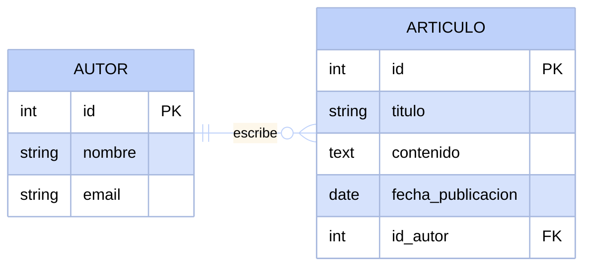
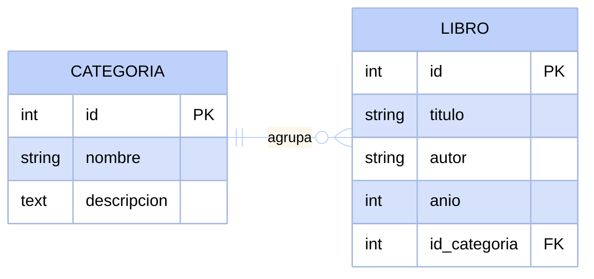
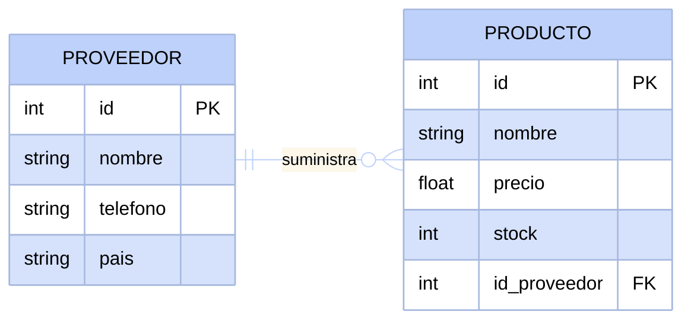
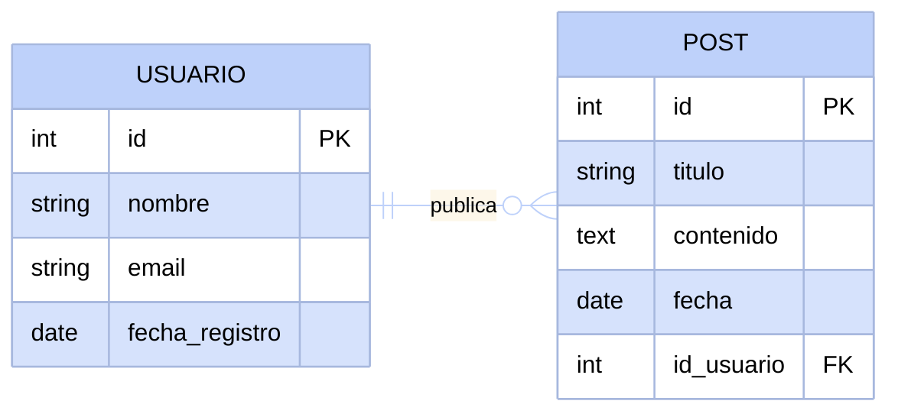
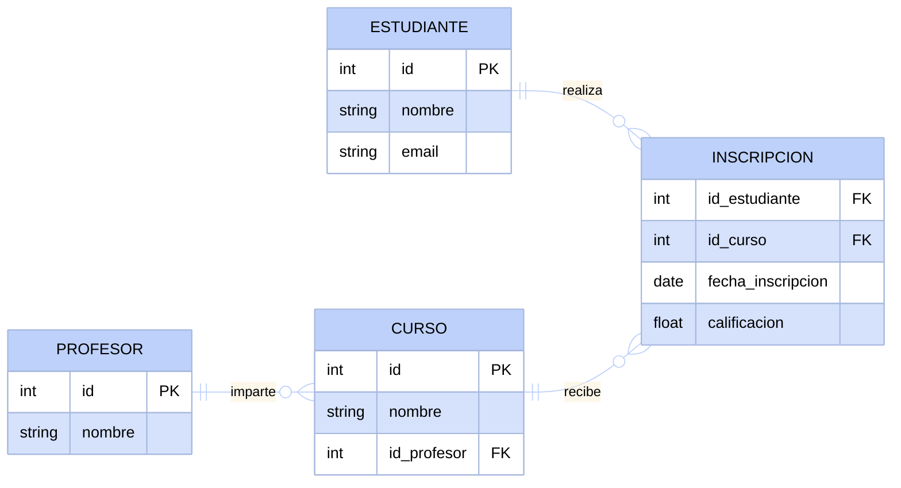
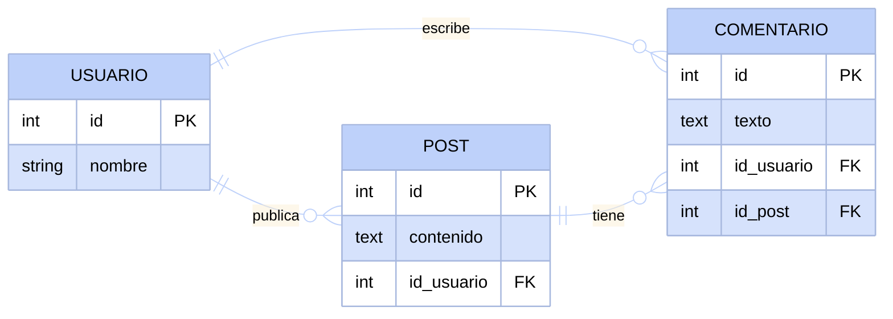
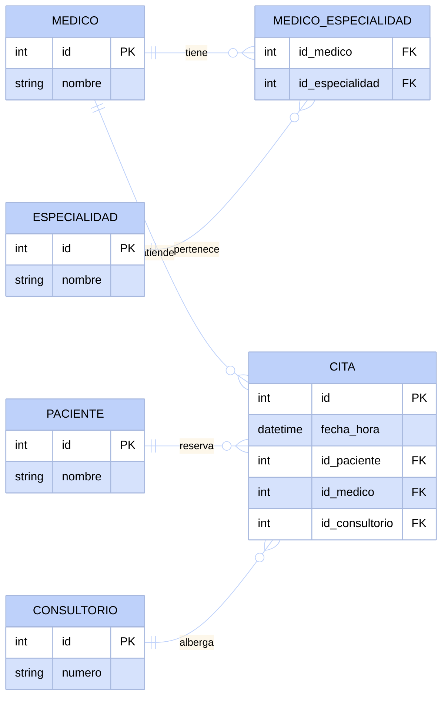
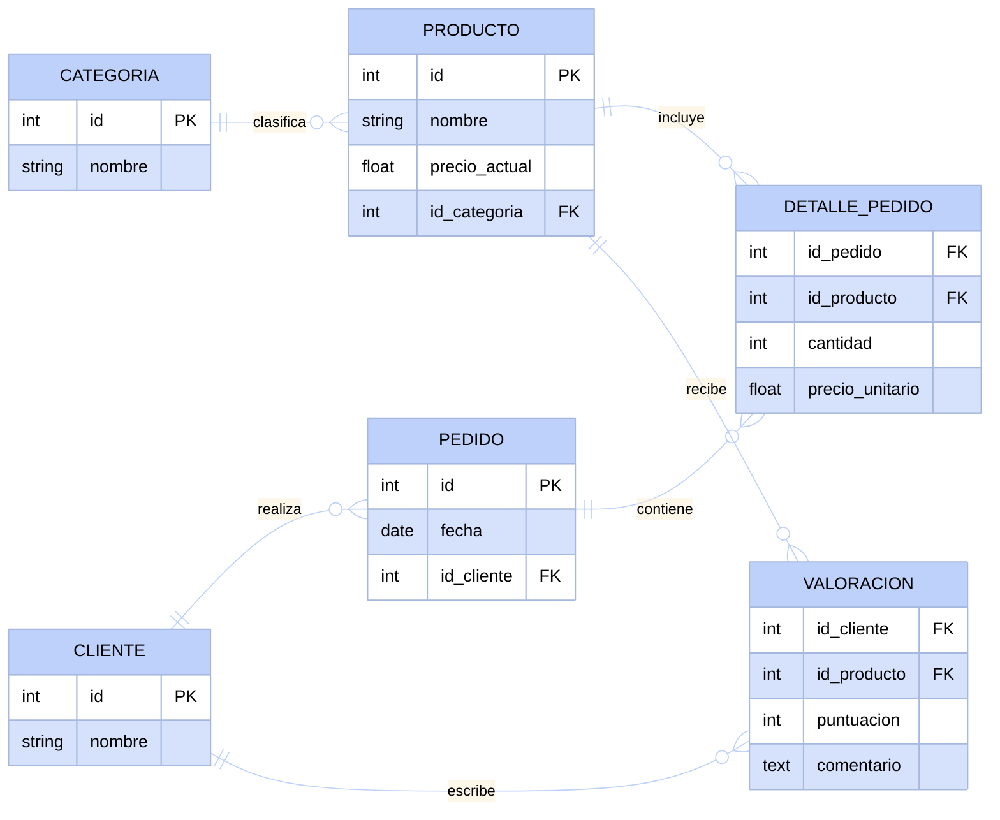
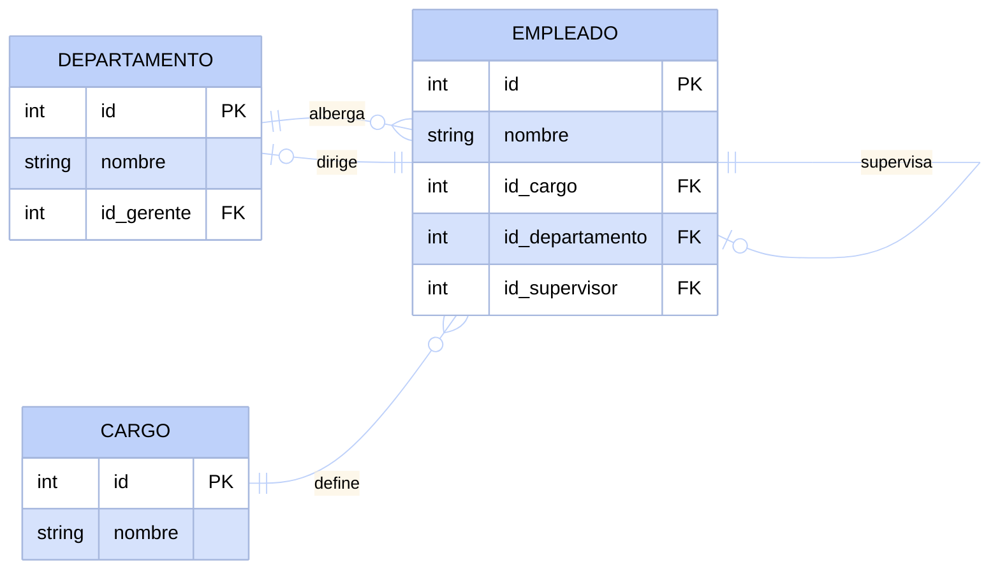
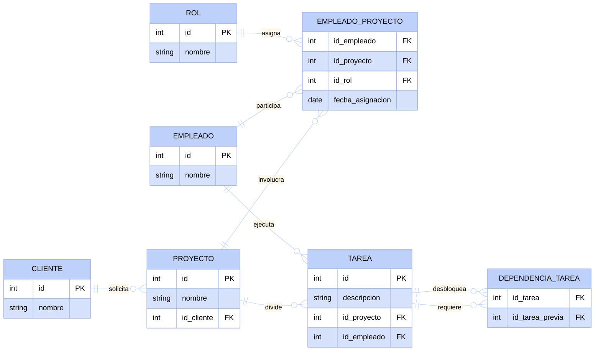

# Ejercicios: del texto al diagrama

La mejor manera de aprender diseño de bases de datos es practicar pasando de la descripción de un problema a un diagrama.

Estos ejercicios aumentan de complejidad de forma progresiva.

Antes de resolver cada uno, intenta identificar las partes fundamentales del problema.

:::tip[Antes de dibujar el diagrama, pregúntate]
- ¿Qué cosas (entidades) aparecen en el texto?
- ¿Qué información tengo de cada una (atributos)?
- ¿Cómo se relacionan entre sí?
- ¿Cuántos de A pueden relacionarse con cuántos de B? (1:1, 1:N, N:M)
- ¿Necesito una tabla puente para alguna relación N:M?
:::

### Ejercicio 1: Blog simple
**Nivel: Principiante**

Un blog tiene autores que escriben artículos. Cada artículo pertenece a un único autor.

:::info[Pista de resolución]
Piensa en cuál es la entidad principal que crea el contenido y cuál es la entidad que representa ese contenido. ¿Dónde deberías poner la clave foránea para conectar ambas?
:::

Ver solución propuesta

En este diagrama vemos una relación de uno a muchos clásica. El autor existe independientemente y el artículo depende del autor.

### Ejercicio 2: Biblioteca básica
**Nivel: Principiante**

Una biblioteca organiza sus libros por categorías. Cada libro pertenece a una sola categoría, pero una categoría puede tener muchos libros.

:::info[Pista de resolución] 
Identifica qué entidad sirve como agrupación o clasificación para la otra. La entidad de agrupación generalmente cede su identificador a los elementos que clasifica.
:::

Ver solución propuesta

Aquí la categoría actúa como un catálogo. Almacenamos el identificador de la categoría dentro de cada libro para saber a dónde pertenece.

### Ejercicio 3: Tienda con productos y proveedores
**Nivel: Básico**

Una tienda vende productos. Cada producto tiene un proveedor que lo suministra. Un proveedor puede abastecer varios productos, pero cada producto tiene un solo proveedor principal.

:::info[Pista de resolución]
Considera los datos de contacto que podrías necesitar del proveedor y los datos de inventario del producto. La cardinalidad determina en qué tabla guardamos la referencia.
:::

Ver solución propuesta

Como un producto tiene un solo proveedor principal, es seguro poner el identificador del proveedor dentro de la tabla del producto.

### Ejercicio 4: Red social simple
**Nivel: Básico**

En una red social, los usuarios publican posts. Cada post es escrito por un único usuario. Los posts tienen título, contenido y fecha de publicación.

:::info[Pista de resolución]
Similar al ejercicio del blog, pero con atributos específicos de una red social. Piensa en qué información propia necesitas recolectar del usuario.
:::

Ver solución propuesta

La estructura fundamental sigue siendo de uno a muchos. El identificador del usuario se encuentra en el post para representar su autoría.

### Ejercicio 5: Sistema de cursos
**Nivel: Intermedio**

En una plataforma educativa, los profesores imparten cursos. Los estudiantes se inscriben en cursos. Cada curso tiene un único profesor asignado, pero un estudiante puede inscribirse en varios cursos y un curso puede tener varios estudiantes.

:::info[Pista de resolución]
La relación entre profesores y cursos es directa, pero entre estudiantes y cursos es de muchos a muchos. ¿Qué tabla intermedia necesitas para manejar esta inscripción?
:::

:::warning
No intentes guardar una lista de cursos dentro del estudiante, ni una lista de estudiantes en el curso. Recuerda que las bases de datos relacionales requieren tablas puente.
:::

Ver solución propuesta

La tabla de inscripciones actúa como puente. Además, nos permite guardar datos como la calificación, que solo tienen sentido en el contexto de esa relación específica.

### Ejercicio 6: Red social con comentarios
**Nivel: Intermedio**

Los usuarios de una red social crean posts y pueden comentar en cualquier post (incluyendo los propios). Cada comentario pertenece a un post específico y fue escrito por un usuario específico.

:::info[Pista de resolución]
Un comentario es una entidad que depende de otras dos al mismo tiempo. Piensa en cuántas claves foráneas necesitará la tabla para no perder esa información.
:::

Ver solución propuesta

La entidad de comentarios necesita obligatoriamente referenciar tanto al autor del mismo como al post original donde fue publicado.

### Ejercicio 7: Sistema hospitalario
**Nivel: Avanzado**

Un hospital tiene pacientes que se atienden con médicos en consultorios específicos. Cada cita involucra exactamente un paciente, un médico y un consultorio. Un médico puede tener muchas especialidades.

:::info[Pista de resolución]
La relación entre médicos y especialidades es de muchos a muchos. Por otro lado, la cita es el corazón del sistema y conecta tres entidades distintas.
:::

Ver solución propuesta

Observa cómo la cita centraliza el modelo al contener tres claves foráneas simultáneas. Además, se aísla la relación de especialidades médicas.

### Ejercicio 8: Tienda online con valoraciones
**Nivel: Avanzado**

Una tienda online organiza sus productos en categorías. Los clientes realizan pedidos que pueden contener varios productos en distintas cantidades. Además, los clientes pueden escribir valoraciones de los productos que han comprado, indicando una puntuación y un comentario.

:::info[Pista de resolución]
Hay dos relaciones de muchos a muchos aquí. Un pedido se desglosa en líneas de detalle para guardar cantidades. La valoración es otra relación separada entre el cliente y el producto.
:::

Ver solución propuesta

Es crucial guardar el precio unitario en el detalle del pedido. El precio del producto puede cambiar, pero el pedido debe registrar el monto exacto al momento de la compra.

### Ejercicio 9: Empresa con empleados y departamentos
**Nivel: Experto**

Una empresa tiene empleados que trabajan en departamentos. Cada departamento tiene un gerente (que también es un empleado). Un empleado pertenece a un único departamento y tiene un único cargo asignado. Los empleados pueden tener un supervisor directo (que también es un empleado del mismo sistema).

:::info[Pista de resolución]
Este ejercicio requiere autorreferencias y normalización de catálogos. ¿Cómo haces que un empleado apunte a otro empleado? El departamento también necesita apuntar a la tabla de empleados, y los cargos deben estar en su propia tabla catálogo.
:::

Ver solución propuesta

La tabla de empleados usa una clave foránea hacia sí misma para registrar al supervisor, referencia a `CARGO` para su puesto y el departamento referencia al empleado para asignar su gerente.

### Ejercicio 10: Sistema de gestión de proyectos
**Nivel: Experto**

En una empresa de software, los empleados trabajan en múltiples proyectos asumiendo diferentes roles (Tech Lead, Frontend Dev, QA, etc.). Cada proyecto pertenece a un cliente. Los proyectos se dividen en tareas asignadas a empleados. Algunas tareas solo pueden comenzar cuando otras han sido completadas (dependencias).

:::info[Pista de resolución]
Este es el reto final. Desglosa el problema por partes: clientes y proyectos, empleados en proyectos con roles (usando una tabla catálogo para los roles), tareas asignadas, y finalmente las dependencias entre tareas.
:::

Ver solución propuesta

Este modelo aborda asignaciones múltiples con roles catalogados, seguimiento de tareas y dependencias complejas usando una tabla puente autorreferencial.

:::info[Conclusión]
Si llegaste hasta el Ejercicio 10, ahora tienes las herramientas para diseñar la base de datos de casi cualquier aplicación en el mundo real.
:::
