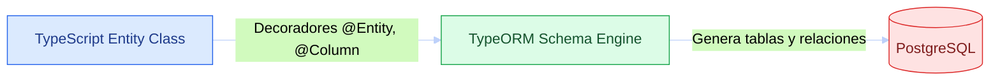
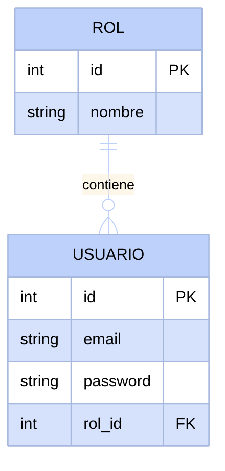

# Entidades en NestJS con TypeORM

Ahora que sabemos cómo diseñar una base de datos relacional (tablas, relaciones, llaves foráneas), es momento de implementarlo en código. TypeORM es el puente entre nuestro código NestJS y PostgreSQL. Esta sección muestra cómo traducir lo que dibujamos en diagramas de entidad-relación a clases de TypeScript decoradas que definen la estructura del sistema.

## ¿Qué es TypeORM y por qué lo necesitamos?

TypeORM es un Object-Relational Mapper (ORM), una herramienta que traduce entre las clases de TypeScript (objetos) y las tablas de la base de datos (relaciones). 
- Sin TypeORM, tendríamos que escribir consultas SQL crudas (`CREATE TABLE...`, `ALTER TABLE...`) y manejar tipos manualmente.
- Con TypeORM, definimos clases de **Entidad (Entity)** y decoradores. TypeORM se encarga de crear las tablas, definir sus columnas, llaves primarias, restricciones y relaciones automáticamente.



## Del diagrama ER al código: cómo se traduce

Tomemos como ejemplo la relación entre `USUARIO` y `ROL`. En nuestro diseño, un rol puede pertenecer a múltiples usuarios, y un usuario tiene un único rol (relación uno a muchos).



La siguiente tabla resume cómo los elementos gráficos del diagrama se convierten en decoradores de TypeORM:

| En el diagrama | En TypeORM (TypeScript) | Opciones comunes |
|---|---|---|
| Entidad (tabla) | `@Entity('nombre_tabla')` | `{ name: 'users' }` |
| Llave primaria autoincremental | `@PrimaryGeneratedColumn()` | `'increment'`, `'uuid'` |
| Atributo / Columna | `@Column()` | `{ unique: true, nullable: false, length: 100 }` |
| Relación 1:N (Uno a muchos) | `@OneToMany(() => Target, (target) => target.property)` | En la entidad principal (ej. `Role`) |
| Relación N:1 (Muchos a uno) | `@ManyToOne(() => Target, (target) => target.property)` | En la entidad con la FK (ej. `User`) |
| Llave foránea explicita | `@JoinColumn({ name: 'col_name' })` | Define el nombre exacto de la columna FK en BD |

---

## Guía práctica de configuración y creación de entidades

<StepByStep>

<Step>
### Instalación de dependencias

Instala los paquetes necesarios de TypeORM y el driver de PostgreSQL en tu proyecto de NestJS:

```bash
npm install --save @nestjs/typeorm typeorm @nestjs/config pg
```
</Step>

<Step>
### Configuración de variables de entorno (`.env`)

Creamos el archivo `.env` en la raíz del proyecto. Este archivo servirá tanto para configurar nuestra aplicación en NestJS como para parametrizar el contenedor de Docker Compose:

```env title=".env" showLineNumbers
# Configuración de Base de Datos
DB_HOST=localhost
DB_PORT=5437
DB_USERNAME=postgres
DB_PASSWORD=postgres
DB_DATABASE=nest_db
```
</Step>

<Step>
### Configuración de PostgreSQL con Docker (`docker-compose.yml`)

Crea la configuración de Docker Compose usando PostgreSQL **v18** y parametrizado mediante las variables de entorno definidas en `.env`:

```yaml title="docker-compose.yml" showLineNumbers
services:
  db:
    image: postgres:18
    restart: always
    environment:
      POSTGRES_USER: ${DB_USERNAME}
      POSTGRES_PASSWORD: ${DB_PASSWORD}
      POSTGRES_DB: ${DB_DATABASE}
    ports:
      - '${DB_PORT}:5432'
    volumes:
      - postgres-data:/var/lib/postgresql/data

volumes:
  postgres-data:
```

Para iniciar el contenedor de base de datos ejecuta:

```bash
docker compose up -d
```
</Step>

<Step>
### Configuración de TypeORM en AppModule

Conectamos NestJS con PostgreSQL leyendo dinámicamente las variables de `.env`:

```typescript title="src/app.module.ts" showLineNumbers
import { Module } from '@nestjs/common';
import { TypeOrmModule } from '@nestjs/typeorm';
import { ConfigModule, ConfigService } from '@nestjs/config';

@Module({
  imports: [
    ConfigModule.forRoot({
      isGlobal: true,
    }),
    TypeOrmModule.forRootAsync({
      imports: [ConfigModule],
      inject: [ConfigService],
      useFactory: (configService: ConfigService) => ({
        type: 'postgres',
        host: configService.get<string>('DB_HOST'),
        port: configService.get<number>('DB_PORT'),
        username: configService.get<string>('DB_USERNAME'),
        password: configService.get<string>('DB_PASSWORD'),
        database: configService.get<string>('DB_DATABASE'),
        entities: [__dirname + '/**/*.entity{.ts,.js}'],
        synchronize: true, // Sincroniza el esquema de entidades automáticamente en desarrollo
      }),
    }),
  ],
})
export class AppModule {}
```
</Step>

<Step>
### Profundizando en Decoradores y Atributos de Entidad

A continuación exploramos las opciones fundamentales que podemos pasar a los decoradores de TypeORM:

#### 1. `@Entity(name?: string, options?: EntityOptions)`
Define que la clase representa una tabla. Si no especificas un nombre, se usa el nombre de la clase en minúsculas.
```typescript
@Entity('roles') // Nombre explícito de la tabla en PostgreSQL
```

#### 2. `@PrimaryGeneratedColumn(strategy?: string)`
Establece la clave primaria de la entidad.
* `'increment'`: Clave autoincremental de tipo entero (por defecto).
* `'uuid'`: Identificador único universal (útil para sistemas distribuidos y mayor seguridad).

#### 3. `@Column(options?: ColumnOptions)`
Permite configurar las propiedades exactas de la columna en PostgreSQL:
* `type`: Tipo de dato SQL (`'varchar'`, `'int'`, `'boolean'`, `'text'`, `'timestamp'`, etc.).
* `unique`: `true` fuerza a que el valor sea único en toda la tabla.
* `nullable`: `true` permite valores nulos (`NULL`). Por defecto es `false`.
* `default`: Define un valor por defecto si no se proporciona uno.
* `length`: Define la longitud máxima de un `varchar`.

```typescript
@Column({ type: 'varchar', length: 150, unique: true, nullable: false })
email: string;

@Column({ type: 'boolean', default: true })
isActive: boolean;
```

#### 4. Relaciones: `@OneToMany`, `@ManyToOne` y `@JoinColumn`
* `@OneToMany(() => EntidadDestino, (instancia) => instancia.propiedadRelacionada)`: Se define en el lado "Uno" de la relación. Retorna un arreglo de la entidad hija.
* `@ManyToOne(() => EntidadDestino, (instancia) => instancia.propiedadRelacionada)`: Se define en el lado "Muchos" (la entidad que contiene la Foreign Key).
* `@JoinColumn({ name: 'nombre_columna_fk' })`: Opcional pero muy útil para especificar el nombre físico exacto de la columna Foreign Key en la tabla.

```typescript title="src/roles/entities/role.entity.ts" showLineNumbers
import { Entity, PrimaryGeneratedColumn, Column, OneToMany } from 'typeorm';
import { User } from '../../users/entities/user.entity';

@Entity('roles')
export class Role {
  @PrimaryGeneratedColumn()
  id: number;

  @Column({ type: 'varchar', length: 50, unique: true })
  name: string;

  // Un rol se relaciona con muchos usuarios
  @OneToMany(() => User, (user) => user.role)
  users: User[];
}
```

```typescript title="src/users/entities/user.entity.ts" showLineNumbers
import { Entity, PrimaryGeneratedColumn, Column, ManyToOne, JoinColumn } from 'typeorm';
import { Role } from '../../roles/entities/role.entity';

@Entity('users')
export class User {
  @PrimaryGeneratedColumn()
  id: number;

  @Column({ type: 'varchar', length: 120, unique: true })
  email: string;

  @Column({ type: 'varchar', length: 255 })
  passwordHash: string;

  // Muchos usuarios tienen un solo rol
  @ManyToOne(() => Role, (role) => role.users, { nullable: false })
  @JoinColumn({ name: 'role_id' }) // Crea la columna 'role_id' como FK en la tabla 'users'
  role: Role;
}
```
</Step>

</StepByStep>

---

## Poblado de datos iniciales (Seed Script en SQL)

Al iniciar un desarrollo, frecuentemente necesitamos poblar la base de datos con registros base (por ejemplo, los roles `"ADMIN"`, `"USER"` y `"GUEST"`, o un usuario administrador inicial). 

Una forma directa y eficiente de lograrlo es crear un archivo de script SQL ubicado fuera de `src` (en una carpeta dedicada `/db`) y ejecutarlo dentro del contenedor de PostgreSQL mediante Docker Compose.

### Paso 1: Creación del archivo SQL (`db/seed.sql`)

Crea la carpeta `db/` en la raíz del proyecto y agrega el archivo `seed.sql`:

```sql title="db/seed.sql" showLineNumbers
-- Insertar roles base si no existen
INSERT INTO roles (name) 
VALUES ('ADMIN'), ('USER'), ('GUEST')
ON CONFLICT (name) DO NOTHING;

-- Insertar usuario Administrador por defecto vinculado al rol ADMIN
INSERT INTO users (email, "passwordHash", role_id)
VALUES (
  'admin@docukelo.edu.co',
  'secret_hashed_password',
  (SELECT id FROM roles WHERE name = 'ADMIN')
)
ON CONFLICT (email) DO NOTHING;
```

### Paso 2: Ejecución del Seed a través del contenedor de Docker

Una vez que las entidades han sido creadas por TypeORM (con `synchronize: true`), puedes ejecutar este archivo dentro del contenedor `db` con una sola línea utilizando `docker compose exec`:

```bash
docker compose exec -T db psql -U postgres -d nest_db < db/seed.sql
```

* **`docker compose exec -T db`**: Ejecuta una orden dentro del contenedor del servicio de base de datos.
* **`psql -U postgres -d nest_db`**: Abre la herramienta cliente de PostgreSQL usando el usuario `postgres` en la base de datos `nest_db`.
* **`< db/seed.sql`**: Redirecciona el contenido de nuestro script SQL local como entrada directa para su ejecución.

---

## Autoevaluación

<Quiz id="dedw-typeorm-intro-quiz">

<Question title="¿Cuál es la función principal del decorador @Entity()?">
  <Option>Convertir la clase en un controlador HTTP de NestJS</Option>
  <Option>Generar una llave primaria autoincremental</Option>
  <Option>Inyectar un repositorio en los servicios</Option>
  <Option correct>Indicar a TypeORM que la clase de TypeScript representa una tabla en la base de datos PostgreSQL</Option>
</Question>

<Question title="¿Qué opción de @Column se utiliza para permitir que una columna acepte valores nulos en la base de datos?">
  <Option>unique: true</Option>
  <Option correct>nullable: true</Option>
  <Option>default: null</Option>
  <Option>optional: true</Option>
</Question>

<Question title="¿Para qué sirve el decorador @JoinColumn({ name: 'role_id' }) en una relación @ManyToOne?">
  <Option>Para unir dos tablas mediante una consulta INNER JOIN en tiempo de ejecución</Option>
  <Option correct>Para especificar el nombre exacto que tendrá la columna de clave foránea (FK) en la tabla física</Option>
  <Option>Para indicar cuál es la clave primaria de la tabla destino</Option>
  <Option>Para deshabilitar la creación de la clave foránea</Option>
</Question>

<Question title="¿En qué entorno se debe mantener activada la opción 'synchronize: true' de TypeORM?">
  <Option correct>Únicamente en desarrollo, ya que puede alterar o eliminar esquemas y datos existentes automáticamente</Option>
  <Option>Únicamente en producción, para garantizar que la base de datos siempre esté actualizada</Option>
  <Option>En todos los entornos sin excepción</Option>
  <Option>En ningún entorno, es un decorador en desuso</Option>
</Question>

<Question title="¿Qué puerto externo de PostgreSQL y versión configuramos en nuestro docker-compose.yml parametrizado?">
  <Option>Puerto 5432 con PostgreSQL v15</Option>
  <Option correct>Puerto 5437 parametrizado desde .env con la imagen postgres:18</Option>
  <Option>Puerto 3306 con MySQL v8</Option>
  <Option>Puerto 8080 con PostgreSQL v12</Option>
</Question>

<Question title="¿Cómo se ejecuta fácilmente un archivo de datos iniciales en SQL db/seed.sql dentro del contenedor de la base de datos?">
  <Option>Copiando y pegando manualmente cada consulta desde pgAdmin</Option>
  <Option>Reiniciando la computadora</Option>
  <Option correct>Con el comando: docker compose exec -T db psql -U postgres -d nest_db < db/seed.sql</Option>
  <Option>Instalando un módulo adicional de NestJS para leer archivos SQL</Option>
</Question>

<Question title="¿Cuál es la diferencia entre @OneToMany y @ManyToOne?">
  <Option correct>@ManyToOne se coloca en la entidad que almacena la Foreign Key; @OneToMany se coloca en la entidad principal para acceder al arreglo de entidades asociadas</Option>
  <Option>@OneToMany se usa únicamente para cadenas de texto y @ManyToOne para números</Option>
  <Option>No hay diferencia, son nombres alternativos para el mismo decorador</Option>
  <Option>@OneToMany crea tablas puente y @ManyToOne no</Option>
</Question>

<Question title="¿Qué utilidad tiene usar el paquete @nestjs/config junto con dotenv en docker-compose y TypeORM?">
  <Option>Acelerar el rendimiento de las consultas SQL</Option>
  <Option correct>Centralizar la configuración (credenciales, puertos, host) en el archivo .env sin exponer datos sensibles en el código o en docker-compose</Option>
  <Option>Formatear el código de TypeScript automáticamente</Option>
  <Option>Reemplazar a TypeORM por completo</Option>
</Question>

</Quiz>


