# Bases de datos relacionales

Al desarrollar aplicaciones web, sistemas interactivos o cualquier software que maneje datos, es fundamental contar con mecanismos para almacenar, recuperar y manipular información de manera eficiente. Para esto existen las bases de datos, sistemas especializados en gestionar grandes volúmenes de datos.

Generalmente, distinguimos entre dos grandes tipos de bases de datos: relacionales y no relacionales (NoSQL). En esta sección nos enfocaremos en las bases de datos relacionales, las más utilizadas en el desarrollo web tradicional.

Las bases de datos relacionales organizan la información en **tablas**, similares a hojas de cálculo: cada fila representa un registro y cada columna un campo o atributo. Por ejemplo, una base de datos de usuarios podría tener una tabla llamada "Usuarios" con columnas como "ID", "Nombre", "Correo Electrónico" y "Fecha de Registro". Cada fila contendría los datos de un usuario específico:

| ID  | Nombre     | Correo Electrónico  | Fecha de Registro |
| --- | ---------- | ------------------- | ----------------- |
| 1   | Juan Pérez | juan.perez@mail.com | 2024-04-01        |
| 2   | Ana Gómez  | ana.gomez@mail.com  | 2024-04-02        |
| 3   | Luis Díaz  | luis.diaz@mail.com  | 2024-04-03        |

La columna "ID" es clave para identificar de manera única cada registro, evitando ambigüedades cuando existen usuarios con nombres similares.

En una aplicación real, podríamos tener muchas tablas: "Productos" para una tienda en línea, "Pedidos" para registrar compras, etc. Lo más interesante de las bases de datos relacionales es que estas tablas pueden **relacionarse** entre sí mediante claves primarias y foráneas.

Por ejemplo, la tabla "Pedidos" podría almacenar los pedidos realizados por los usuarios, incluyendo el ID del pedido, la fecha, el usuario que lo realizó (referenciado por su ID) y el total:

| ID Pedido | Fecha      | ID Usuario | Total  |
| --------- | ---------- | ---------- | ------ |
| 101       | 2024-04-05 | 1          | 150.00 |
| 102       | 2024-04-06 | 2          | 200.00 |
| 103       | 2024-04-07 | 1          | 75.00  |

Aquí, "ID Usuario" en la tabla "Pedidos" es una **clave foránea** que apunta a la columna "ID" en la tabla "Usuarios". Así, cada pedido queda vinculado al usuario que lo realizó. Por ejemplo, el usuario con ID 1 (Juan Pérez) realizó dos pedidos (IDs 101 y 103). Esta relación entre tablas permite organizar los datos eficientemente, evitando duplicaciones y facilitando consultas complejas.

Para interactuar con bases de datos relacionales utilizamos SQL (Structured Query Language), un lenguaje que permite insertar, actualizar, eliminar y consultar datos mediante sentencias como `SELECT`, `INSERT`, `UPDATE` y `DELETE`.

La relación entre las tablas del ejemplo se puede visualizar así:

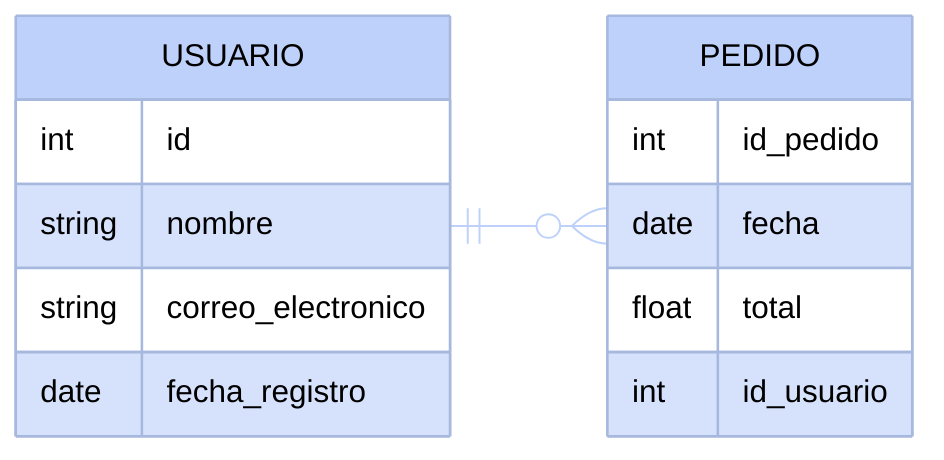

## Tipos de relaciones entre tablas

En las bases de datos relacionales, las tablas pueden vincularse de diferentes maneras según la naturaleza de los datos. Los principales tipos de relaciones son:

-   **Uno a uno (1:1):** Un registro de una tabla se relaciona con un solo registro de otra tabla. Por ejemplo, si cada usuario tuviera un perfil único en otra tabla, la relación sería uno a uno.
-   **Uno a muchos (1:N):** Un registro de una tabla puede estar relacionado con varios registros de otra tabla. En nuestro ejemplo, un usuario puede tener muchos pedidos, pero cada pedido pertenece a un solo usuario. Esto se representa con una clave foránea en la tabla "Pedidos" que apunta al "ID" de la tabla "Usuarios".
-   **Muchos a muchos (N:M):** Varios registros de una tabla pueden estar relacionados con varios registros de otra tabla. Por ejemplo, si los usuarios pudieran comprar varios productos y cada producto pudiera ser comprado por varios usuarios, necesitaríamos una tabla intermedia (por ejemplo, "DetallePedido") para gestionar esta relación.

En los diagramas ER (Entidad-Relación), estas relaciones se denotan con diferentes símbolos:

-   `||--o{` indica una relación uno a muchos (como entre "Usuario" y "Pedido").
-   `||--||` indica una relación uno a uno.
-   `}o--o{` indica una relación muchos a muchos.

Comprender estos tipos de relaciones es esencial para diseñar bases de datos eficientes y evitar redundancias o inconsistencias en los datos.

## Tipos de datos comuness en bases de datos relacionales

Al definir las tablas en una base de datos relacional, es importante especificar el tipo de datos que cada columna puede almacenar. Algunos de los tipos de datos más comunes son:

-   **Enteros (INT):** Números enteros, tanto positivos como negativos. Ejemplo: 1, -5, 100.
-   **Números de punto flotante (FLOAT, DOUBLE):** Números con decimales. Ejemplo: 3.14, -0.001, 2.71828.
-   **Cadenas de texto (VARCHAR, TEXT):** Secuencias de caracteres. VARCHAR tiene una longitud máxima definida, mientras que TEXT puede almacenar textos más largos. Ejemplo: "Hola", "Este es un texto largo".
-   **Fechas y horas (DATE, DATETIME, TIMESTAMP):** Almacenan fechas y horas en formatos específicos. Ejemplo: '2024-04-01', '2024-04-01 12:30:00'.
-   **Booleanos (BOOLEAN):** Valores de verdadero o falso. Ejemplo: TRUE, FALSE.

## Sistemas de gestión de bases de datos relacionales (RDBMS)

Para manejar las bases de datos relacionales, se utilizan sistemas de gestión de bases de datos relacionales (RDBMS). Algunos de los RDBMS más populares incluyen:

-   **MySQL:** Muy utilizado en aplicaciones web, especialmente con PHP. Es conocido por su rendimiento y facilidad de uso.
-   **PostgreSQL:** Un RDBMS avanzado que soporta características complejas y es altamente extensible.
-   **SQLite:** Una base de datos ligera que se almacena en un solo archivo, ideal para aplicaciones móviles y de escritorio.
-   **Oracle Database:** Utilizado en entornos empresariales, conocido por su robustez y escalabilidad.

Cada uno de estos sistemas tiene sus propias características, ventajas y desventajas, pero todos siguen los principios fundamentales de las bases de datos relacionales y utilizan SQL para la manipulación de datos.

## Ejercicios
A continuación encontrarás una serie de ejercicios prácticos para diseñar diagramas de entidad-relación. La idea es que leas el enunciado de cada ejercicio e intentes crear el diagrama por tu cuenta antes de ver la solución. Los ejercicios aumentan progresivamente en complejidad, agregando más relaciones entre las entidades. Recuerda que las soluciones propuestas son una posible implementación; pueden existir otras variantes válidas.

### Ejercicio 1: Blog simple
Diseña un diagrama relacional para un blog donde los autores escriben artículos. Cada artículo pertenece a un único autor.

Ver solución propuesta

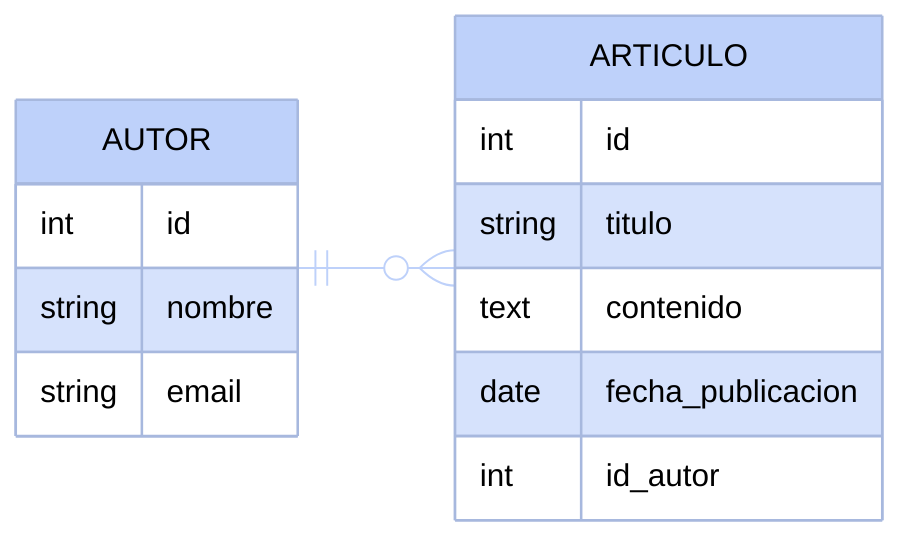

### Ejercicio 2: Biblioteca
Diseña un diagrama relacional para una biblioteca donde cada libro pertenece a una categoría. Cada categoría puede tener múltiples libros.

Ver solución propuesta

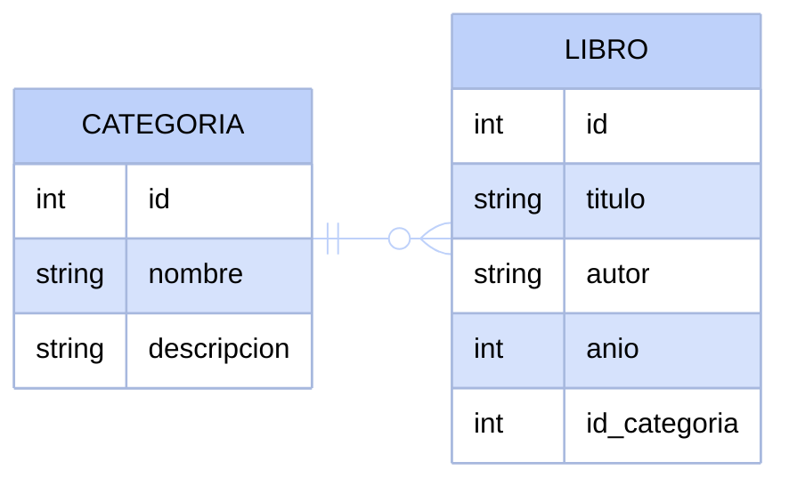

### Ejercicio 3: Sistema de cursos
Diseña un diagrama relacional para un sistema donde los profesores imparten cursos y los estudiantes se inscriben en cursos. Cada curso tiene un único profesor asignado.

Ver solución propuesta

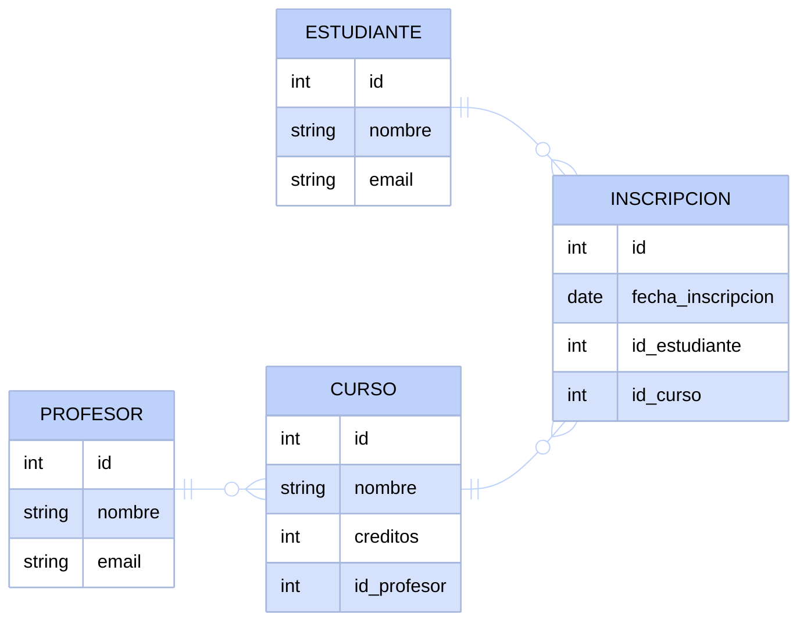

### Ejercicio 4: Red social básica
Diseña un diagrama relacional para una red social donde los usuarios publican posts y pueden comentar en los posts de otros usuarios.

Ver solución propuesta

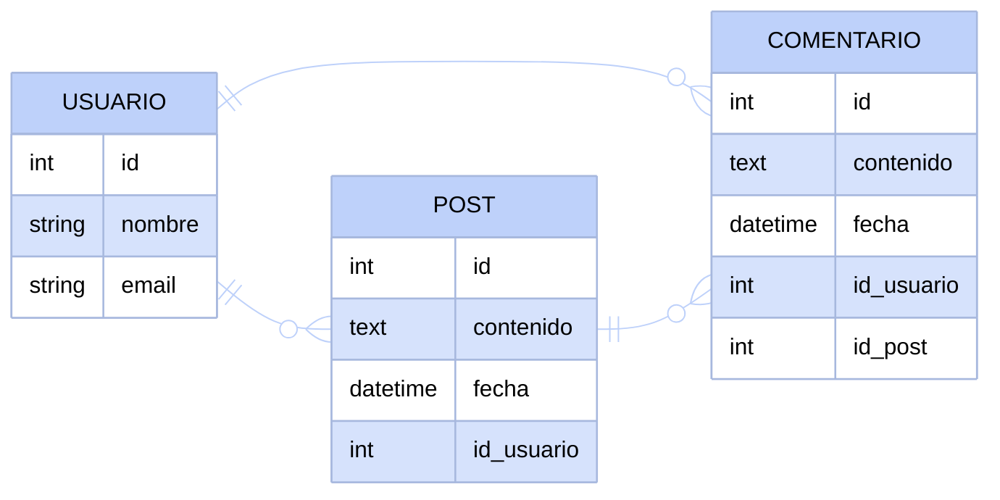

### Ejercicio 5: Sistema de empleados y departamentos
Diseña un diagrama relacional para una empresa donde los empleados trabajan en departamentos. Cada departamento tiene un gerente (que también es un empleado) y cada empleado pertenece a un departamento.

Ver solución propuesta

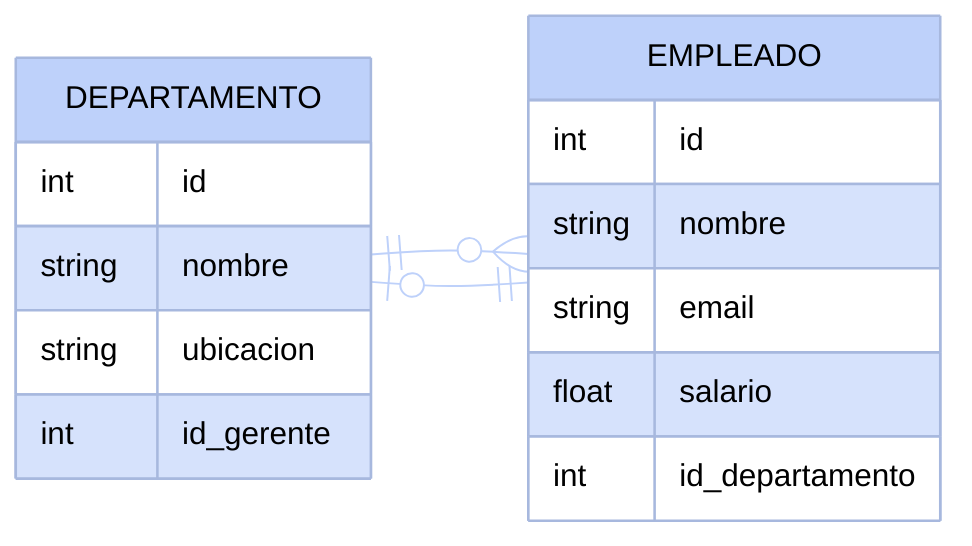

### Ejercicio 6: Plataforma de streaming
Diseña un diagrama relacional para una plataforma de streaming donde las películas pertenecen a géneros, los usuarios crean listas de reproducción y agregan películas a sus listas.

Ver solución propuesta

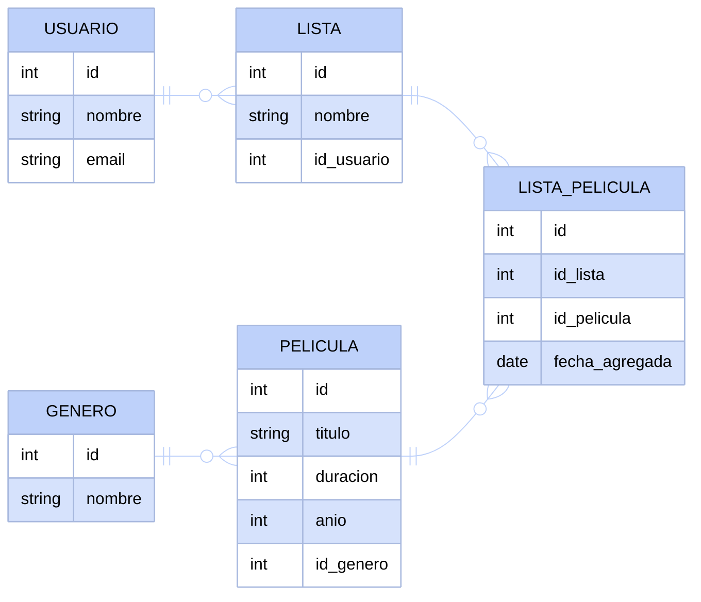

### Ejercicio 7: Sistema hospitalario
Diseña un diagrama relacional para un hospital donde los pacientes tienen citas con doctores en consultorios específicos. Cada cita involucra un paciente, un doctor y un consultorio.

Ver solución propuesta

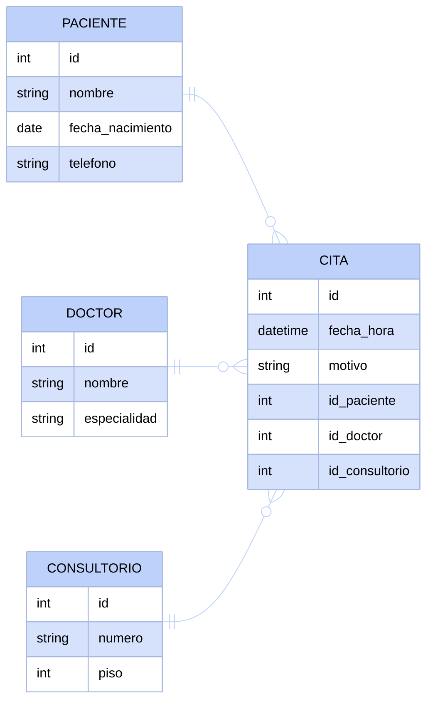

### Ejercicio 8: Tienda online con valoraciones
Diseña un diagrama relacional para una tienda online donde los productos pertenecen a categorías, los clientes realizan pedidos con múltiples productos, y los clientes pueden valorar los productos que han comprado.

Ver solución propuesta

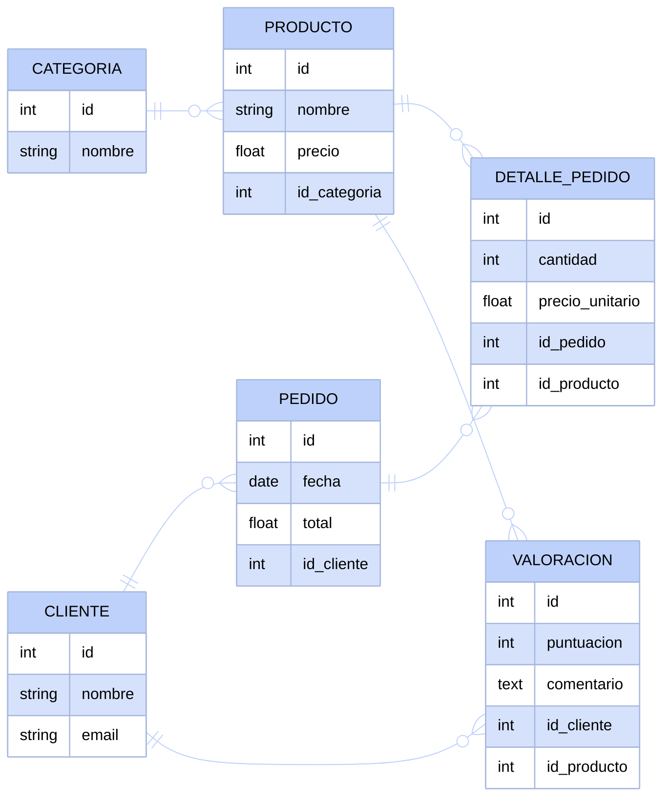

### Ejercicio 9: Universidad completa
Diseña un diagrama relacional para una universidad donde los estudiantes se inscriben en cursos impartidos por profesores, los cursos pertenecen a programas académicos, y cada curso tiene prerrequisitos (otros cursos que deben completarse primero).

Ver solución propuesta

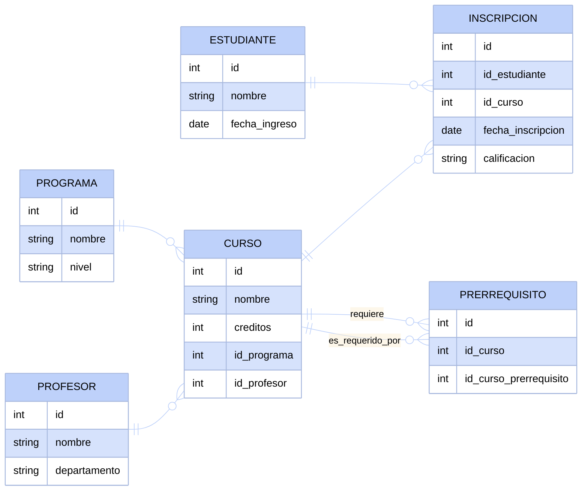

### Ejercicio 10: Sistema de gestión de proyectos
Diseña un diagrama relacional para un sistema de gestión de proyectos donde los empleados trabajan en múltiples proyectos con roles específicos, los proyectos tienen clientes, se dividen en tareas asignadas a empleados, y las tareas tienen dependencias entre sí.

Ver solución propuesta

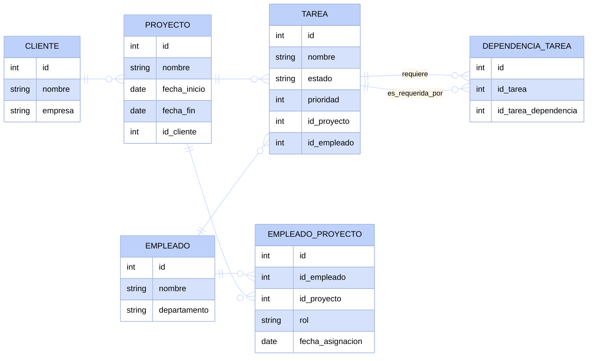

