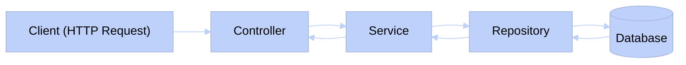

# Providers y Repositorios en NestJS

Hasta este punto, hemos visto cómo representar las entidades de nuestra aplicación utilizando TypeORM. Sin embargo, esta es solo una de las muchas capas que componen una aplicación de NestJS. Para organizar nuestro código de manera eficiente y escalable, es fundamental entender cómo funcionan los **providers** y los **repositorios** en NestJS.

Las aplicaciones desarrolladas en NestJS se estructuran en módulos, y para separar de manera organizada cada una de las preocupaciones y responsabilidades de la aplicación, Nest propone un sistema de capas ampliamente utilizado en otras arquitecturas de software. Estas capas son:


- **Módulos**: Agrupan los controladores, servicios y repositorios relacionados en una unidad cohesiva. Esto facilita la organización, el mantenimiento y la evolución del código.
- **Controladores**: Son responsables de manejar las solicitudes HTTP entrantes y devolver las respuestas al cliente. Actúan como la interfaz entre el cliente y el resto de la aplicación.
- **Servicios**: Contienen la lógica de negocio de la aplicación. Son responsables de procesar los datos, realizar cálculos y coordinar las operaciones necesarias para cumplir con las solicitudes del cliente.
- **Repositorios**: Son responsables de interactuar con la base de datos. Utilizan TypeORM para realizar operaciones CRUD (Crear, Leer, Actualizar, Eliminar) sobre las entidades.



Nuestro objetivo es construir la aplicación de manera que cada una de estas capas tenga una responsabilidad clara y definida, lo que facilita la escalabilidad y el mantenimiento del código a largo plazo. En las siguientes secciones, exploraremos cómo implementar cada una de estas capas en NestJS.

## Módulos en NestJS

Un módulo en NestJS es una clase decorada con `@Module()`, que organiza el código en unidades cohesivas y reutilizables. Un módulo puede importar otros módulos, declarar controladores y proveedores (servicios y repositorios), y exportar lo que sea necesario para que otros módulos puedan usarlo. En tu aplicación, los módulos pueden representar diferentes áreas de funcionalidad, como usuarios, productos, pedidos, etc. Esta segmentación ayuda a mantener el código organizado, facilita la colaboración entre desarrolladores y permite que el proyecto escale sin que la complejidad se vuelva inmanejable.

Aquí hay un ejemplo de cómo se ve un módulo básico en NestJS:

```typescript
// Importamos los decoradores y módulos necesarios de NestJS y TypeORM
import { Module } from "@nestjs/common";
import { UsersController } from "./users.controller";
import { UsersService } from "./users.service";
import { TypeOrmModule } from "@nestjs/typeorm";
import { User } from "./user.entity";

// Decoramos la clase con @Module para definirla como módulo
@Module({
    // Importamos el módulo de TypeORM configurado para la entidad User
    imports: [TypeOrmModule.forFeature([User])],
    // Declaramos los controladores que pertenecen a este módulo
    controllers: [UsersController],
    // Declaramos los servicios (providers) disponibles en este módulo
    providers: [UsersService],
    // Exportamos los servicios necesarios para otros módulos
    exports: [UsersService],
})
export class UsersModule {}
```

Los módulos en NestJS son más archivos de configuración que grandes clases con lógica compleja, pero son fundamentales para organizar tu aplicación de manera profesional. Específicamente, cada módulo se compone de cuatro partes importantes:

- **Imports**: Aquí importamos otros módulos que necesitamos para que nuestro módulo funcione correctamente. En el ejemplo, estamos importando `TypeOrmModule.forFeature([User])`, lo que permite que NestJS cree automáticamente un repositorio de la entidad `User` que podemos inyectar en nuestros servicios.
- **Controllers**: Aquí declaramos los controladores que pertenecen a este módulo. En el ejemplo, estamos declarando `UsersController`, que manejará las solicitudes HTTP relacionadas con los usuarios.
- **Providers**: Aquí declaramos los servicios y otros proveedores que pertenecen a este módulo. En el ejemplo, estamos declarando `UsersService`, que contiene la lógica de negocio relacionada con los usuarios.
- **Exports**: Aquí declaramos qué servicios o proveedores queremos que estén disponibles para otros módulos que importen este módulo. En el ejemplo, estamos exportando `UsersService`, lo que significa que otros módulos podrán acceder a la lógica de negocio relacionada con los usuarios.

:::warning
Recuerda que un módulo no es más que una clase decorada con `@Module()`. Su función principal es organizar el código de tu aplicación de manera coherente. No debe contener lógica de negocio compleja, sino que debe ser una unidad cohesiva que agrupe controladores, servicios y repositorios relacionados.
:::

## Repositorios en NestJS

En NestJS, los repositorios son componentes fundamentales para interactuar con la base de datos de manera estructurada y eficiente. Son clases especializadas en la interacción con las entidades y se encargan de realizar operaciones CRUD (Crear, Leer, Actualizar, Eliminar) sobre las entidades. Con NestJS puedes usar TypeORM para crear repositorios de manera sencilla y automática.

Cuando importas `TypeOrmModule.forFeature([Entity])` en tu módulo, NestJS automáticamente crea un repositorio para esa entidad que puedes inyectar en tus servicios para realizar operaciones sobre la base de datos. Debido a la facilidad que ofrece TypeORM, en la mayoría de los casos no necesitamos crear repositorios personalizados. El repositorio generado automáticamente será suficiente para nuestras necesidades. Sin embargo, si necesitas realizar operaciones complejas o consultas específicas, puedes extender la clase `Repository` de TypeORM para agregar métodos personalizados.

Aquí tienes un ejemplo de cómo inyectar e utilizar un repositorio creado automáticamente por TypeORM:

```typescript
// Importamos los decoradores y módulos necesarios
import { Injectable } from "@nestjs/common";
import { InjectRepository } from "@nestjs/typeorm";
import { Repository } from "typeorm";
import { User } from "./user.entity";

// Marcamos la clase como un provider inyectable
@Injectable()
export class UsersService {
    // Inyectamos el repositorio de User usando el decorador @InjectRepository
    constructor(
        @InjectRepository(User)
        private usersRepository: Repository<User>,
    ) {}

    // Los métodos aquí interactúan con la base de datos usando usersRepository
}
```

Como puedes observar, hemos creado un servicio llamado `UsersService` e inyectado el repositorio de la entidad `User` utilizando el decorador `@InjectRepository(User)`. Esto nos permite usar `usersRepository` para realizar operaciones sobre la base de datos relacionadas con los usuarios, como crear nuevos usuarios, obtener listas de usuarios, actualizar información o eliminar registros.

## Providers y Servicios

Ya hemos introducido los servicios, pero es importante destacar que en NestJS, los servicios son considerados **providers**. Un provider es cualquier clase que puede ser inyectada como una dependencia en otras partes de la aplicación. Los servicios son un tipo específico de provider que contiene la lógica de negocio de la aplicación.

Al marcar una clase con el decorador `@Injectable()`, estamos indicando a NestJS que esa clase es un provider y puede ser inyectada en otros lugares de la aplicación. Este mecanismo es fundamental para la arquitectura de NestJS, ya que permite una separación clara de responsabilidades, facilita la reutilización de código y mejora significativamente la mantenibilidad del proyecto.

:::info ¿Qué es la inyección de dependencias?
La inyección de dependencias es un patrón de diseño que permite a una clase recibir sus dependencias desde el exterior en lugar de crearlas internamente. Esto facilita la modularidad, la reutilización y el mantenimiento del código, ya que las dependencias pueden ser fácilmente reemplazadas o modificadas sin afectar la clase que las utiliza. En NestJS, la inyección de dependencias se logra utilizando decoradores como `@Injectable()` para marcar las clases como providers y `@Inject()` para inyectar las dependencias en el constructor.
:::

Veamos un ejemplo de cómo se ve un servicio básico en NestJS:

```typescript
// Importamos el decorador Injectable de NestJS
import { Injectable } from "@nestjs/common";

// Marcamos la clase como un provider inyectable
@Injectable()
export class UsersService {
    // Aquí iría la lógica de negocio relacionada con los usuarios
}
```

Al marcar la clase `UsersService` con el decorador `@Injectable()`, indicamos a NestJS que esta clase es un provider y puede ser inyectada en otras partes de la aplicación, como controladores u otros servicios. Esto nos permite mantener una arquitectura limpia y modular, donde cada clase tiene una responsabilidad clara y puede ser fácilmente reutilizada o modificada sin afectar otras partes del sistema.

Agreguemos algunos métodos que implementen las operaciones CRUD utilizando el repositorio que inyectamos anteriormente:

```typescript
// Importamos los decoradores y módulos necesarios
import { Injectable } from "@nestjs/common";
import { InjectRepository } from "@nestjs/typeorm";
import { Repository } from "typeorm";
import { User } from "./user.entity";

// Marcamos la clase como un provider inyectable
@Injectable()
export class UsersService {
    // Inyectamos el repositorio de User en el constructor
    constructor(
        @InjectRepository(User)
        private usersRepository: Repository<User>,
    ) {}

    // Método para crear un nuevo usuario en la base de datos
    async createUser(userData: CreateUserDto): Promise<User> {
        const user = this.usersRepository.create(userData);
        return this.usersRepository.save(user);
    }

    // Método para obtener todos los usuarios de la base de datos
    async findAll(): Promise<User[]> {
        return this.usersRepository.find();
    }

    // Método para obtener un usuario específico por su ID
    async findOne(id: number): Promise<User> {
        return this.usersRepository.findOne({ where: { id } });
    }

    // Método para actualizar un usuario existente
    async updateUser(id: number, updateData: UpdateUserDto): Promise<User> {
        await this.usersRepository.update(id, updateData);
        return this.usersRepository.findOne({ where: { id } });
    }

    // Método para eliminar un usuario de la base de datos
    async deleteUser(id: number): Promise<void> {
        await this.usersRepository.delete(id);
    }
}
```

Como puedes ver, hemos agregado varios métodos al servicio `UsersService` para realizar operaciones CRUD completas sobre la entidad `User`. Cada método utiliza el repositorio inyectado para interactuar con la base de datos y realizar las operaciones necesarias de manera segura y eficiente. Esto demuestra cómo los servicios en NestJS pueden contener la lógica de negocio y utilizar los repositorios para acceder a los datos de manera organizada, permitiendo que el código sea más mantenible y escalable.
