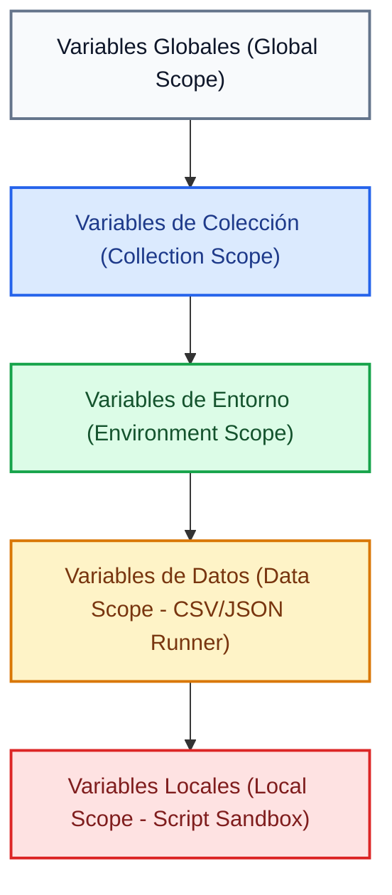
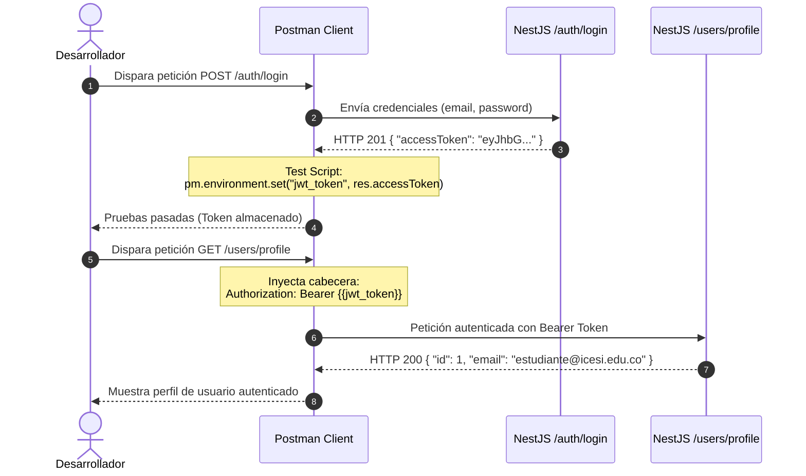

# Pruebas de APIs con Postman

En el desarrollo de aplicaciones web modernas, construir controladores y servicios en el backend es solo la mitad del trabajo. Para garantizar que los servicios respondan de forma consistente, procesen adecuadamente los datos de entrada y rechacen solicitudes maliciosas o malformadas, es indispensable contar con una estrategia rigurosa de prueba y validación de endpoints HTTP.

**Postman** es la plataforma estándar en la industria para diseñar, probar, documentar y automatizar APIs HTTP. Permite a los desarrolladores backend simular clientes, inspeccionar respuestas en tiempo real, encadenar flujos de autenticación mediante variables y automatizar suites de pruebas antes de desplegar a producción.

---

## 1. Conceptos y Fundamentos Teóricos

### ¿Por qué utilizar Postman en lugar de herramientas de consola?

Aunque herramientas de terminal como `curl` o extensiones ligeras permiten enviar solicitudes HTTP básicas, Postman proporciona una arquitectura completa para el ciclo de vida de desarrollo de APIs:

- **Inspección visual estructurada**: Formateo automático de respuestas JSON, análisis de cabeceras HTTP, tiempos de latencia y tamaños de transferencia.
- **Gestión modular de entornos (Environments)**: Capacidad de alternar variables de configuración (por ejemplo, URLs de desarrollo local vs. servidores en la nube) con un solo clic y sin modificar las rutas a mano.
- **Encadenamiento reactivo de peticiones**: Captura dinámica de identificadores o tokens JWT generados en un endpoint (como `/auth/login`) para inyectarlos automáticamente en las peticiones posteriores.
- **Automatización de aserciones**: Scripts de pruebas en JavaScript para verificar códigos de estado, esquemas de datos y tiempos de respuesta.
- **Automatización de suites completas con Collection Runner**: Ejecución secuencial de colecciones completas para pruebas de regresión y validación continua de endpoints.

---

### Anatomía de la Interfaz de Postman

Comprender la disposición de los paneles y herramientas en Postman es fundamental para trabajar con fluidez durante el desarrollo backend.


#### Desglose Técnico de los Componentes

1. **Gestor de Entornos y Variables**: Ubicado en la esquina superior derecha. Permite seleccionar el conjunto activo de variables (por ejemplo, *Dev - NestJS (Local)*). Al activar un entorno, las expresiones con formato `{{variable_name}}` se resuelven dinámicamente en cualquier campo de la petición.
2. **Constructor de la Petición (Request Builder)**:
   - **Selector de Método HTTP**: Define el verbo semántico de la operación (`GET` para consulta, `POST` para creación, `PUT`/`PATCH` para actualización, `DELETE` para eliminación).
   - **Barra de URL**: Endpoint de destino parametrizado con variables de entorno (por ejemplo, `{{base_url}}/api/v1/auth/login`).
   - **Pestaña Body (raw / JSON)**: Editor donde se especifica el payload que viaja en el cuerpo de la solicitud HTTP hacia los controladores de NestJS.
   - **Pestañas Params, Authorization y Headers**: Paneles para configurar query parameters en la URL, credenciales de autenticación (Bearer Token, Basic Auth) y cabeceras obligatorias (como `Content-Type: application/json`).
3. **Pestañas de Scripts (Pre-request y Tests)**:
   - **Pre-request Script**: Lógica en JavaScript que se ejecuta antes de emitir la petición hacia la red (ideal para generar valores únicos o calcular marcas de tiempo).
   - **Tests (Post-response)**: Scripts en JavaScript que se disparan de forma sincrónica una vez se recibe la respuesta HTTP desde el servidor, permitiendo validar aserciones y capturar datos en variables.
4. **Panel de Inspección de Respuesta (Response Inspector)**:
   - **Insignias de Estado y Rendimiento**: Muestra el código de estado HTTP (`200 OK`, `201 Created`, `400 Bad Request`, `401 Unauthorized`), el tiempo transcurrido en milisegundos y el peso de la transferencia.
   - **Visor de Payload JSON**: Permite examinar la estructura de datos retornada por el servicio.
   - **Pestaña Test Results**: Informa cuántas aserciones definidas en los scripts pasaron o fallaron de manera exitosa.

---

### El Ciclo de Vida de una Petición en Postman

Cuando se pulsa el botón **Send**, Postman no se limita a disparar un paquete de red. Existe un flujo secuencial riguroso que interactúa con el sandbox de JavaScript y el backend:


#### Fases del Ciclo de Ejecución

1. **Fase 1: Pre-request Script**: Postman inicia un entorno de ejecución seguro (sandbox) donde corre cualquier fragmento de JavaScript asignado a la petición o a la colección. En esta fase se pueden instanciar variables temporales, calcular hashes criptográficos o asignar cabeceras dinámicas.
2. **Fase 2: Construcción y Transmisión de la Petición**: El cliente compila las cabeceras, resuelve todas las referencias a variables entre dobles llaves (`{{...}}`), empaqueta el cuerpo JSON y envía la solicitud HTTP a través de la red hacia el puerto donde escucha la API.
3. **Fase 3: Pipeline de Procesamiento en NestJS**: El servidor recibe la petición. En una arquitectura de NestJS, la solicitud atraviesa secuencialmente los `Middlewares`, los `Guards` de autenticación, los `Interceptors`, los `ValidationPipes` (que comprueban los DTOs con `class-validator`) y finalmente ingresa al `Controller` y al `Service` antes de interactuar con TypeORM y la base de datos PostgreSQL.
4. **Fase 4: Retorno y Recepción de Respuesta**: El backend devuelve la respuesta HTTP empaquetada con su código de estado (`200`, `201`, `400`, `401`, `500`), cabeceras del servidor y cuerpo de respuesta en JSON.
5. **Fase 5: Post-response Scripts y Tests**: Postman activa de inmediato el sandbox de pruebas. Se ejecutan las funciones `pm.test()`, evaluando las aserciones sobre el código de estado y los campos del JSON.
6. **Fase 6: Reutilización y Persistencia de Variables**: Los datos críticos extraídos de la respuesta (como un `accessToken`) se guardan en el entorno mediante `pm.environment.set()`. Quedan disponibles de inmediato para todas las peticiones siguientes de la colección.

---

### Jerarquía y Ámbitos de Variables (Variable Scopes)

Postman organiza las variables en diferentes niveles de jerarquía. Si una variable tiene el mismo nombre en múltiples niveles, Postman prioriza el ámbito más específico (de menor a mayor alcance):



#### Descripción de Cada Ámbito

- **Global**: Visibles en todas las colecciones y espacios de trabajo. Adecuadas para utilidades universales o constantes inmutables.
- **Collection**: Declaradas a nivel de la colección raíz. Son compartidas por todas las peticiones que forman parte de ese módulo.
- **Environment**: Vinculadas a un entorno de despliegue particular (por ejemplo, `Local`, `Staging`, `Production`). Es el nivel recomendado para `base_url` y tokens de sesión.
- **Data**: Valores inyectados externamente a través de archivos de datos (`.csv` o `.json`) durante ejecuciones masivas en el Runner.
- **Local**: Variables declaradas dentro del código de un Pre-request o Test script (`pm.variables.set()`). Solo existen durante la ejecución de esa petición individual.

---

### Flujo de Autenticación y Encadenamiento de Peticiones

En aplicaciones protegidas con JSON Web Tokens (JWT), es ineficiente y propenso a errores copiar y pegar manualmente el token en cada endpoint. El encadenamiento automatizado permite sincronizar el flujo completo:



#### Explicación del Diagrama de Secuencia

1. El cliente envía las credenciales de acceso al endpoint público de autenticación en NestJS.
2. El servidor valida la contraseña con `bcrypt`, genera el JWT firmado y devuelve el token en el payload.
3. El script de tests de Postman intercepta el token y lo almacena de forma programática en la variable de entorno `jwt_token`.
4. En las siguientes solicitudes a rutas protegidas, la cabecera `Authorization: Bearer {{jwt_token}}` se resuelve automáticamente sin intervención manual.

---

## 2. Guía Práctica Paso a Paso: Validación de una API NestJS

En esta sección desarrollaremos un flujo completo de pruebas sobre un backend en NestJS que cuenta con módulos de autenticación y recursos protegidos.

<StepByStep>
  <Step number="1" title="Crear la Colección y Definir el Entorno">
    El primer paso consiste en organizar las peticiones en una colección y configurar las variables base del servidor local.

    1. Abre Postman y en la barra lateral izquierda selecciona **Collections** > **Create Collection (+)**. Nómbrala `NestJS Web API`.
    2. En el panel izquierdo, dirígete a **Environments** > **Create Environment (+)**. Nómbralo `Dev - Local`.
    3. Añade las siguientes variables:

    | Variable | Tipo | Initial Value | Current Value |
    | :--- | :--- | :--- | :--- |
    | `base_url` | default | `http://localhost:3000` | `http://localhost:3000` |
    | `jwt_token` | secret | *(vacío)* | *(vacío)* |

    :::tip[Valor Inicial vs. Valor Actual]
    El campo **Initial Value** se comparte al sincronizar con tu equipo de trabajo o repositorio público. El campo **Current Value** se almacena exclusivamente en tu cliente local, protegiendo credenciales sensibles contra filtraciones involuntarias.
    :::
  </Step>

  <Step number="2" title="Crear la Petición de Inicio de Sesión (Login)">
    Configuraremos la petición HTTP para autenticarnos contra el controlador de autenticación de NestJS.

    1. Dentro de la colección `NestJS Web API`, añade una nueva petición seleccionando **Add request**.
    2. Configura los siguientes parámetros:
       - **Nombre**: `01 - Login de Usuario`
       - **Método**: `POST`
       - **URL**: `{{base_url}}/api/v1/auth/login`
    3. En la pestaña **Headers**, verifica que esté presente la cabecera:
       - `Content-Type: application/json`
    4. En la pestaña **Body**, selecciona la opción **raw** y formato **JSON**, ingresando el payload correspondiente:

    ```json title="request-body-login.json"
    {
      "email": "estudiante@icesi.edu.co",
      "password": "PasswordSeguro123!"
    }
    ```
  </Step>

  <Step number="3" title="Configurar Tests Automatizados y Captura del Token">
    En la pestaña **Tests** de la petición de login, escribiremos aserciones para validar el código de respuesta y extraer el `accessToken` hacia el entorno activo.

    ```javascript title="postman-tests-login.js" showLineNumbers
    // 1. Validar que el servidor responda con código HTTP 200 o 201 (Created/OK)
    pm.test("El código de respuesta es 200 o 201", function () {
        pm.expect(pm.response.code).to.be.oneOf([200, 201]);
    });

    // 2. Verificar que el cuerpo de respuesta sea un objeto JSON válido
    pm.test("La respuesta contiene un accessToken en formato string", function () {
        // Parsear el cuerpo de la respuesta a un objeto manipulable en JS
        const responseData = pm.response.json();
        
        // Comprobar que exista la propiedad accessToken y sea una cadena no vacía
        pm.expect(responseData).to.have.property("accessToken");
        pm.expect(responseData.accessToken).to.be.a("string").and.not.empty;

        // 3. Persistir el token recibido en la variable de entorno jwt_token
        pm.environment.set("jwt_token", responseData.accessToken);
        console.log("Token JWT actualizado exitosamente en el entorno activo.");
    });

    // 4. Validar que el tiempo de respuesta esté dentro de límites aceptables
    pm.test("Tiempo de respuesta inferior a 800ms", function () {
        pm.expect(pm.response.responseTime).to.be.below(800);
    });
    ```

    Haz clic en **Send**. En el panel inferior deberás ver **Test Results (3/3 PASS)** y la variable `jwt_token` actualizada automáticamente con el hash del token.
  </Step>

  <Step number="4" title="Configurar Petición Protegida con Bearer Token">
    Ahora crearemos un endpoint protegido por un `AuthGuard('jwt')` en NestJS, consumiendo la variable `{{jwt_token}}`.

    1. Añade una nueva petición en la colección:
       - **Nombre**: `02 - Crear Producto Protegido`
       - **Método**: `POST`
       - **URL**: `{{base_url}}/api/v1/products`
    2. Dirígete a la pestaña **Authorization**:
       - **Type**: `Bearer Token`
       - **Token**: `{{jwt_token}}`
    3. En la pestaña **Body**, selecciona **raw** > **JSON** y añade los datos del producto:

    ```json title="request-body-create-product.json"
    {
      "name": "Monitor Curvo 27 Pulgadas",
      "price": 1250000,
      "stock": 15,
      "description": "Panel IPS 144Hz para desarrollo de interfaces web"
    }
    ```
    
    4. En la pestaña **Tests**, incluye aserciones para validar la persistencia en base de datos:

    ```javascript title="postman-tests-create-product.js" showLineNumbers
    // Validar creación exitosa según convención REST
    pm.test("Status code es 201 Created", function () {
        pm.response.to.have.status(201);
    });

    // Validar coherencia del schema devuelto por el controlador
    pm.test("El objeto retornado contiene un id numérico autogenerado", function () {
        const body = pm.response.json();
        pm.expect(body).to.have.property("id");
        pm.expect(body.id).to.be.a("number");
        pm.expect(body.name).to.eql("Monitor Curvo 27 Pulgadas");
    });
    ```
  </Step>

  <Step number="5" title="Pruebas de Frontera y Manejo de Errores (ValidationPipe)">
    Una suite de pruebas completa debe validar también los escenarios de error y rechazo de datos.

    1. Añade una petición con datos deliberadamente inválidos:
       - **Nombre**: `03 - Error de Validación DTO (Negative Test)`
       - **Método**: `POST`
       - **URL**: `{{base_url}}/api/v1/products`
       - **Authorization**: `Bearer Token` con `{{jwt_token}}`
    2. Envía un precio negativo y un nombre vacío para detonar el `ValidationPipe` de NestJS:

    ```json title="request-body-invalid.json"
    {
      "name": "",
      "price": -500,
      "stock": "invalido"
    }
    ```

    3. Configura el script de tests para verificar que el servidor rechace la solicitud con código `400 Bad Request`:

    ```javascript title="postman-tests-validation-error.js" showLineNumbers
    // Validar que el ValidationPipe capture la inconsistencia
    pm.test("El servidor responde con HTTP 400 Bad Request", function () {
        pm.response.to.have.status(400);
    });

    pm.test("La respuesta contiene lista de errores de validación", function () {
        const errorResponse = pm.response.json();
        pm.expect(errorResponse).to.have.property("message");
        pm.expect(errorResponse.message).to.be.an("array");
    });
    ```
  </Step>

  <Step number="6" title="Ejecución de la Suite Completa con Collection Runner">
    El **Collection Runner** permite correr todas las peticiones de la colección en secuencia, verificando la estabilidad general del sistema.

    1. En el panel izquierdo de Postman, pasa el cursor sobre la colección `NestJS Web API` y haz clic en el botón de tres puntos `...` > **Run collection**.
    2. Comprueba el orden de ejecución:
       - `01 - Login de Usuario`
       - `02 - Crear Producto Protegido`
       - `03 - Error de Validación DTO`
    3. Asegúrate de tener seleccionado el entorno `Dev - Local`.
    4. Pulsa **Run NestJS Web API**. Postman ejecutará las llamadas consecutivamente y generará una matriz detallada con todas las aserciones superadas.
  </Step>
</StepByStep>

---

## 3. Buenas Prácticas para Pruebas en Postman

Al construir suites de pruebas en Postman para backends desarrollados en NestJS, es recomendable aplicar los siguientes principios de calidad y mantenibilidad:

### Variables Dinámicas Integradas (Dynamic Variables)

Para evitar errores por registros duplicados en la base de datos (por ejemplo, intentar registrar un usuario con un email que ya existe en PostgreSQL), Postman incluye generadores de datos aleatorios nativos mediante la sintaxis `{{$...}}`:

- `{{$randomEmail}}`: Genera una dirección de correo electrónico aleatoria y única.
- `{{$randomFullName}}`: Genera un nombre completo simulado.
- `{{$randomUUID}}`: Genera un identificador universal único (UUID versión 4).
- `{{$timestamp}}`: Genera la marca de tiempo Unix actual en segundos.

Puedes utilizarlas directamente en el Body de tus peticiones:

```json title="request-body-dynamic.json"
{
  "email": "{{$randomEmail}}",
  "fullName": "{{$randomFullName}}"
}
```

### Aislamiento y Ciclo Completo del Recurso (CRUD)

Estructura el orden de tus colecciones reflejando el ciclo de vida natural del recurso:

1. **POST**: Crea el recurso y almacena su identificador en el entorno (`pm.environment.set("productId", res.id)`).
2. **GET**: Consulta el recurso individual utilizando `{{base_url}}/api/v1/products/{{productId}}`.
3. **PATCH / PUT**: Actualiza propiedades puntuales del recurso y verifica el cambio.
4. **DELETE**: Elimina el recurso al finalizar la prueba para mantener la base de datos de desarrollo limpia.

### Aserciones Robustas y Granulares

Una prueba confiable no debe limitarse únicamente a verificar el código `200 OK`. Conviene validar siempre:

- **Código de estado HTTP**: `pm.response.to.have.status(200)` o `201`.
- **Cabeceras de respuesta**: Validar que `Content-Type` contenga `application/json`.
- **Estructura y tipos de datos**: Asegurarse de que las propiedades esperadas existan y posean el tipo correcto (`string`, `number`, `array`).
- **Tiempos de latencia**: Garantizar que las consultas no superen umbrales críticos (por ejemplo, `pm.expect(pm.response.responseTime).to.be.below(500)`).

:::warning[Seguridad con Variables de Entorno en Repositorios]
Nunca incluyas tokens de producción, claves de base de datos o contraseñas reales en los campos **Initial Value** al compartir o exportar entornos. Mantén siempre las credenciales sensibles en **Current Value**, el cual reside exclusivamente en tu máquina local.
:::

---

## Cuestionario de Autoevaluación

<Quiz id="dedw-semana-8-postman-quiz">
  <Question title="¿Cuál es la función principal de los Pre-request Scripts en Postman?">
    <Option>Inspeccionar el código de estado HTTP recibido desde el servidor backend.</Option>
    <Option correct>Ejecutar código JavaScript antes de que la petición HTTP sea enviada para configurar parámetros dinámicos o firmas.</Option>
    <Option>Exportar automáticamente la documentación del API a formato Swagger o OpenAPI.</Option>
    <Option>Compilar el código TypeScript del backend antes de levantar el servidor.</Option>
  </Question>

  <Question title="¿En qué momento del ciclo de vida de Postman se ejecutan las funciones declaradas en la pestaña Tests?">
    <Option>Antes de que la petición HTTP se serialice a través de la red.</Option>
    <Option>De forma paralela mientras el servidor NestJS procesa la consulta en la base de datos.</Option>
    <Option correct>Inmediatamente después de recibir la respuesta HTTP del servidor en el cliente Postman.</Option>
    <Option>Únicamente cuando la respuesta HTTP devuelve un código de error 4xx o 5xx.</Option>
  </Question>

  <Question title="Si una variable con el nombre 'base_url' existe en el ámbito Global y también en el ámbito Environment, ¿cuál valor priorizará Postman al enviar la petición?">
    <Option>El valor definido en el ámbito Global, porque tiene mayor cobertura en el workspace.</Option>
    <Option correct>El valor definido en el ámbito Environment, porque es más específico en la jerarquía de precedencia.</Option>
    <Option>Postman genera un error de conflicto de nombres y cancela el envío de la solicitud.</Option>
    <Option>Concatena ambos valores separándolos por una barra inclinada.</Option>
  </Question>

  <Question title="¿Cuál es la instrucción correcta en JavaScript de Postman para persistir un token en el entorno activo tras recibir la respuesta?">
    <Option>pm.variables.save(&quot;jwt_token&quot;, response.token);</Option>
    <Option correct>pm.environment.set(&quot;jwt_token&quot;, pm.response.json().accessToken);</Option>
    <Option>localStorage.setItem(&quot;jwt_token&quot;, response.token);</Option>
    <Option>pm.request.headers.add(&quot;Authorization&quot;, token);</Option>
  </Question>

  <Question title="¿Cuál es la diferencia de seguridad entre los campos Initial Value y Current Value en la configuración de entornos de Postman?">
    <Option>Initial Value es solo de lectura, mientras que Current Value permite números y booleanos.</Option>
    <Option>Initial Value se borra automáticamente al cerrar la aplicación.</Option>
    <Option correct>Initial Value se comparte con el equipo al sincronizar la colección, mientras que Current Value reside únicamente en el cliente local.</Option>
    <Option>Current Value se envía automáticamente al repositorio de GitHub como archivo público.</Option>
  </Question>

  <Question title="¿Cómo se referencia el valor de una variable de entorno llamada 'jwt_token' dentro de la pestaña Authorization (Bearer Token) o en la URL de una petición?">
    <Option>$jwt_token</Option>
    <Option>:jwt_token</Option>
    <Option correct>&#123;&#123;jwt_token&#125;&#125;</Option>
    <Option>&lt;jwt_token&gt;</Option>
  </Question>

  <Question title="¿Cuál es la ventaja de utilizar variables dinámicas integradas de Postman como &#123;&#123;$randomEmail&#125;&#125; o &#123;&#123;$randomUUID&#125;&#125; en el Body de una petición?">
    <Option>Permite cambiar el puerto de escucha del servidor NestJS de forma automática.</Option>
    <Option correct>Permite generar datos únicos y aleatorios en cada ejecución para evitar colisiones de clave única o errores de registros duplicados.</Option>
    <Option>Desactiva temporalmente el ValidationPipe de NestJS durante las pruebas locales.</Option>
    <Option>Firma el token JWT con un algoritmo asimétrico de clave pública en el cliente.</Option>
  </Question>

  <Question title="¿Qué aserción en los Tests de Postman permite validar correctamente que el código de estado retornado sea 201 Created?">
    <Option>pm.expect(pm.status).to.equal(&quot;CREATED&quot;);</Option>
    <Option correct>pm.response.to.have.status(201);</Option>
    <Option>pm.assert.statusCode === 201;</Option>
    <Option>pm.validate.code(201);</Option>
  </Question>

  <Question title="¿Qué utilidad aporta el Collection Runner de Postman durante el desarrollo de una API?">
    <Option>Convierte los controladores de NestJS en microservicios independientes.</Option>
    <Option>Compila el código TypeScript a JavaScript optimizado para producción.</Option>
    <Option correct>Ejecuta en lote y en orden secuencial una serie de peticiones HTTP, validando automáticamente todas sus aserciones asociadas.</Option>
    <Option>Monitorea el uso de memoria RAM y CPU del servidor PostgreSQL.</Option>
  </Question>

  <Question title="En un endpoint protegido por AuthGuard('jwt') en NestJS, ¿qué cabecera HTTP estándar debe configurarse para enviar las credenciales validadas?">
    <Option>Authentication: Token &#123;&#123;jwt_token&#125;&#125;</Option>
    <Option correct>Authorization: Bearer &#123;&#123;jwt_token&#125;&#125;</Option>
    <Option>X-JWT-Credential: &#123;&#123;jwt_token&#125;&#125;</Option>
    <Option>Content-Security: &#123;&#123;jwt_token&#125;&#125;</Option>
  </Question>
</Quiz>

---

## Recursos Recomendados

<CardGrid cols={2}>
  <Card 
    title="Documentación Oficial de Postman" 
    description="Manual de referencia completo para el diseño de peticiones, entornos, variables y colecciones." 
    link="https://learning.postman.com/docs/introduction/overview/" 
  />
  <Card 
    title="Variables Dinámicas en Postman" 
    description="Listado completo de generadores de datos aleatorios integrados (emails, nombres, UUIDs, timestamps)." 
    link="https://learning.postman.com/docs/tests-and-scripts/write-scripts/variables-list/" 
  />
  <Card 
    title="Guía de Scripts de Prueba en Postman" 
    description="Referencia de sintaxis para aserciones con Chai.js, validación de schemas JSON y manipulación de respuestas." 
    link="https://learning.postman.com/docs/tests-and-scripts/write-scripts/test-scripts/" 
  />
  <Card 
    title="Postman Learning Center en YouTube" 
    description="Tutoriales en video sobre automatización de flujos de prueba, collection runner y buenas prácticas." 
    link="https://www.youtube.com/@postman" 
  />
</CardGrid>