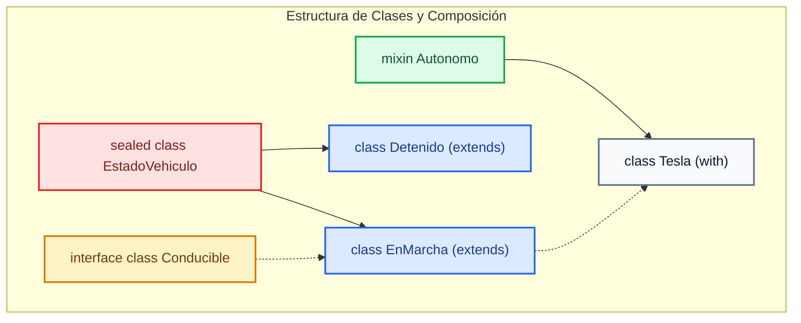

# Programación Orientada a Objetos: Herencia, Mixins y Modificadores

En Dart, la estructuración avanzada de clases nos permite crear sistemas escalables y seguros. En esta sección abordaremos cómo compartir comportamiento mediante herencia (`extends`), contratos a través de interfaces (`implements`), composición usando mixins (`with`), y cómo restringir la arquitectura mediante los modificadores de clase integrados en Dart 3+.

---

## 1. Herencia y Polimorfismo (extends)

La herencia permite crear una subclase que hereda comportamiento y estado de una superclase. Dart utiliza la palabra clave `extends` y soporta únicamente herencia simple.

```dart title="lib/models/animal.dart" showLineNumbers
abstract class Mascota {
  final String nombre;

  Mascota(this.nombre);

  // Método abstracto (sin implementación)
  void emitirSonido();

  void mostrarInfo() {
    print("Mascota: $nombre");
  }
}

class Perro extends Mascota {
  Perro(String nombre) : super(nombre);

  // Sobrescribimos el método obligatorio
  @override
  void emitirSonido() {
    print("¡Guau! ¡Guau!");
  }
}
```

---

## 2. Contratos e Interfaces (implements)

En Dart, **no existe la palabra clave `interface`** para declarar una estructura diferente a una clase. En su lugar, toda clase define implícitamente una interfaz que contiene todos sus miembros. Cualquier clase puede implementar la interfaz de otra usando `implements`, obligándose a redefinir todos sus métodos y propiedades.

```dart title="lib/interfaces/repository.dart" showLineNumbers
abstract class AuthRepository {
  Future<bool> login(String email, String password);
  Future<void> logout();
}

// Implementación concreta
class AuthRepositoryImpl implements AuthRepository {
  @override
  Future<bool> login(String email, String password) async {
    // Lógica para autenticar con una API externa
    return true;
  }

  @override
  Future<void> logout() async {
    // Lógica para limpiar el token local
  }
}
```

---

## 3. Reutilización de Código sin Herencia (with / Mixins)

Los *mixins* son una forma de reutilizar código en múltiples jerarquías de clases sin incurrir en los problemas de la herencia múltiple. Se aplican utilizando la palabra clave `with`.

```dart title="lib/mixins/flyable.dart" showLineNumbers
mixin Volador {
  void volar() {
    print("Estoy volando por los cielos.");
  }
}

mixin Caminante {
  void caminar() {
    print("Estoy caminando sobre la tierra.");
  }
}

// Combinando comportamientos mediante Mixins
class Pato extends Mascota with Volador, Caminante {
  Pato(String nombre) : super(nombre);

  @override
  void emitirSonido() {
    print("¡Cuac! ¡Cuac!");
  }
}
```

---

## 4. Modificadores de Clase (Class Modifiers)

A partir de Dart 3, se introdujeron modificadores de clase que permiten a los autores de librerías controlar qué pueden hacer los consumidores externos con sus clases.

| Modificador | ¿Se puede instanciar? | ¿Se puede extender (`extends`)? | ¿Se puede implementar (`implements`)? | Notas clave |
| :--- | :--- | :--- | :--- | :--- |
| **`sealed`** | No | Sí (dentro del mismo archivo) | Sí (dentro del mismo archivo) | Ideal para tipos de unión (Union types) y control de flujos con `switch` exhaustivos. |
| **`interface`**| Sí | No | Sí | Permite usar la clase como contrato pero prohíbe herencia directa de implementación. |
| **`base`** | Sí | Sí | No | Exige que cualquier subclase herede su comportamiento y también sea marcada como `base` o `final`. |
| **`final`** | Sí | No | No | Cierra completamente la jerarquía. No se puede extender ni implementar por fuera de su archivo. |

### Ejemplo Práctico: Sealed Classes para UI States

```dart title="lib/states/ui_state.dart" showLineNumbers
// Un sealed class actúa como un grupo cerrado de subtipos
sealed class ResultState {}

class LoadingState extends ResultState {}

class SuccessState extends ResultState {
  final String datos;
  SuccessState(this.datos);
}

class ErrorState extends ResultState {
  final String mensaje;
  ErrorState(this.mensaje);
}

// El compilador de Dart valida que cubramos todos los subtipos en el switch
void renderUI(ResultState estado) {
  final mensaje = switch (estado) {
    LoadingState() => "Cargando datos...",
    SuccessState(datos: var d) => "Éxito: $d",
    ErrorState(mensaje: var m) => "Error detectado: $m",
  };
  print(mensaje);
}
```

---

## 5. Arquitectura Visual de Relaciones

El siguiente diagrama de clases en Mermaid representa la relación entre las clases modificadas, herencia, mixins e interfaces:



### Explicación del Diagrama
1. **`EstadoVehiculo` (Sealed Class)**: Marcada en rojo/alerta. Funciona como un nodo raíz inmodificable externamente, que agrupa estrictamente a `EnMarcha` y `Detenido`.
2. **`Conducible` (Interface Class)**: Marcada en amarillo. Actúa como un contrato puro que debe ser implementado (línea discontinua) por `EnMarcha`.
3. **`Autonomo` (Mixin)**: Marcado en verde. Proporciona capacidades reusables sin jerarquía directa de herencia, inyectándose en la clase `Tesla` mediante la palabra clave `with`.

---

## 6. Ejercicios Prácticos

### Ejercicio 1: Modelando el Sistema de Notificaciones con Sealed Classes
Define una estructura cerrada (`sealed class`) llamada `Notificacion` con tres subtipos posibles: `NotificacionEmail(String destinatario, String asunto)`, `NotificacionSMS(String numero, String texto)` y `NotificacionPush(String tokenDispositivo, String titulo)`. Crea una función llamada `enviarNotificacion(Notificacion notificacion)` que reciba este tipo de dato y use una expresión `switch` exhaustiva para simular el envío del mensaje adecuado.

<details>
<summary>Ver Solución</summary>

```dart title="lib/exercises/exercise_1_advanced.dart" showLineNumbers
sealed class Notificacion {}

class NotificacionEmail extends Notificacion {
  final String destinatario;
  final String asunto;
  NotificacionEmail(this.destinatario, this.asunto);
}

class NotificacionSMS extends Notificacion {
  final String numero;
  final String texto;
  NotificacionSMS(this.numero, this.texto);
}

class NotificacionPush extends Notificacion {
  final String tokenDispositivo;
  final String titulo;
  NotificacionPush(this.tokenDispositivo, this.titulo);
}

void enviarNotificacion(Notificacion notificacion) {
  final resultado = switch (notificacion) {
    NotificacionEmail(destinatario: var d, asunto: var a) => 
      "Enviando Email a $d con asunto: '$a'",
    NotificacionSMS(numero: var n, texto: var t) => 
      "Enviando SMS al número $n con texto: '$t'",
    NotificacionPush(tokenDispositivo: var td, titulo: var ti) => 
      "Enviando Push al dispositivo $td con título: '$ti'",
  };
  print(resultado);
}

void main() {
  final miEmail = NotificacionEmail("estudiante@icesi.edu.co", "Notas Primer Parcial");
  enviarNotificacion(miEmail);
}
```

</details>

### Ejercicio 2: El mixin de Auditoría (AuditMixin)
Crea un mixin llamado `Auditable` que tenga una propiedad de tipo `DateTime? fechaCreacion` y un método `registrarCreacion()` que asigne la fecha y hora actual (`DateTime.now()`) a dicha propiedad. Luego, crea una clase llamada `Transaccion` que use este mixin para registrar automáticamente cuándo se crea una nueva transacción bancaria.

<details>
<summary>Ver Solución</summary>

```dart title="lib/exercises/exercise_2_advanced.dart" showLineNumbers
mixin Auditable {
  DateTime? fechaCreacion;

  void registrarCreacion() {
    fechaCreacion = DateTime.now();
  }
}

class Transaccion with Auditable {
  final double monto;
  final String origen;

  Transaccion(this.monto, this.origen) {
    // Al instanciarse, aprovechamos el método del mixin
    registrarCreacion();
  }

  void mostrarDetalle() {
    print("Transacción de \$$monto desde $origen el día $fechaCreacion");
  }
}

void main() {
  final tx = Transaccion(150000.0, "Cuenta Ahorros");
  tx.mostrarDetalle();
}
```

</details>
