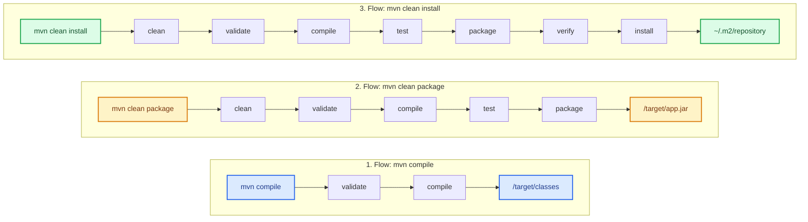

# Apache Maven: Management and Lifecycle

**Apache Maven** is a core tool in the Java ecosystem used for project management, build automation, and software dependency management.

Unlike compiling manually with the `javac` command or manually managing JAR files, Maven introduces a Project Object Model (**POM**, defined in the `pom.xml` file) that standardizes the project structure and automates compilation, testing, and packaging phases.

---

## 1. Apache Maven Installation

To use Maven in your local environment, first make sure you have an active installation of the **Java Development Kit (JDK)**.

<Tabs>
  <TabItem value="win" label="Windows (Scoop / Choco / Manual)" default>

### Option A: Via package managers (Recommended)
If you use **Scoop** or **Chocolatey** in PowerShell:
```powershell
# Using Scoop
scoop install maven

# Using Chocolatey
choco install maven
```

### Option B: Manual Installation
1. Download the binary ZIP file from the official [Apache Maven](https://maven.apache.org/download.cgi) page.
2. Extract the content to a directory in your system (for example, `C:\Program Files\apache-maven-3.9.x`).
3. Add the `MAVEN_HOME` or `M2_HOME` system environment variable pointing to that directory.
4. Add the path `C:\Program Files\apache-maven-3.9.x\bin` to the `PATH` environment variable.
5. Verify the installation in a new terminal by running:
   ```cmd
   mvn -version
   ```

  </TabItem>
  <TabItem value="mac" label="macOS (Homebrew)">

### Installation with Homebrew
On macOS, the easiest way is using **Homebrew**:
```bash
brew install maven
```

Verify the installation by running:
```bash
mvn -version
```

  </TabItem>
  <TabItem value="linux" label="Linux (APT / DNF)">

### Installation on Debian/Ubuntu
```bash
sudo apt update
sudo apt install maven -y
```

### Installation on Fedora/RHEL
```bash
sudo dnf install maven -y
```

Verify the installation by running:
```bash
mvn -version
```

  </TabItem>
</Tabs>

---

## 2. The Maven Lifecycle

The default Maven lifecycle (*default lifecycle*) executes a strict series of sequential phases. When you run a command indicating a specific phase, Maven automatically executes all preceding phases in order:

$$ \text{validate} \rightarrow \mathbf{compile} \rightarrow \text{test} \rightarrow \mathbf{package} \rightarrow \text{verify} \rightarrow \mathbf{install} \rightarrow \text{deploy} $$

### Main Phases Explained:

* **`validate`**: Verifies that the project is correct and all necessary information is available (for example, validating that `pom.xml` is well-formed).
* **`compile`**: Compiles the project source code (`.java` files) into bytecode (`.class`). They are placed in the `target/classes` directory.
* **`test`**: Runs unit tests (using frameworks like JUnit or TestNG) against compiled code.
* **`package`**: Takes the compiled code and packages it into its distribution format (such as a `.jar` or `.war` file), placing it in the `target/` directory.
* **`verify`**: Runs additional checks on packages to ensure quality criteria are met.
* **`install`**: Installs the packaged artifact into the local Maven repository (located at `~/.m2/repository`), making it available as a dependency for other local projects.
* **`deploy`**: Copies the final package to a remote repository (like Nexus or JFrog Artifactory) to share with other developers or teams.

---

## 3. Comparison: `mvn compile` vs `mvn clean package` vs `mvn clean install`

It is very common to prefix commands with `clean` (for example, `mvn clean package`). The `clean` phase belongs to Maven's clean lifecycle and removes the `target/` directory from previous builds to ensure a clean build from scratch.

### Sequence Diagram and Differences (Mermaid SVG)



### Direct Comparison Table

| Command | What it executes | Main Output Location | Best Use Case |
| :--- | :--- | :--- | :--- |
| **`mvn compile`** | `validate` $\rightarrow$ `compile` | Target directory (`/target/classes`) | Quick syntax check and local testing. |
| **`mvn clean package`** | Deletes old build $\rightarrow$ `validate` $\rightarrow$ `compile` $\rightarrow$ `test` $\rightarrow$ `package` | Target directory (`/target/app.jar`) | Creating a production-ready file for a standalone app. |
| **`mvn clean install`** | Deletes old build $\rightarrow$ executes all phases up to `install` | Local M2 repository (`~/.m2/repository`) | Building multi-module projects where other local apps rely on this code. |

---

## 4. Standard Maven Project Structure

Maven promotes the principle of *Convention over Configuration*. A standard project follows this folder structure:

```text
my-project/
├── pom.xml
└── src/
    ├── main/
    │   ├── java/         # Application source code (.java)
    │   └── resources/    # Configuration files (application.properties, etc.)
    └── test/
        ├── java/         # Unit tests (.java)
        └── resources/    # Test resources
```
