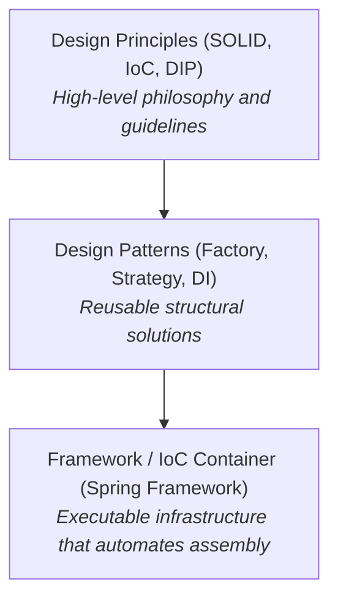
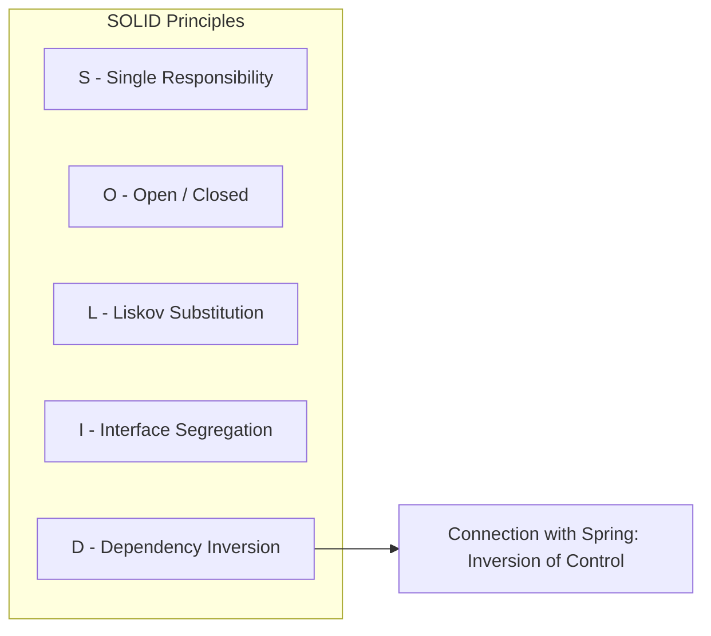
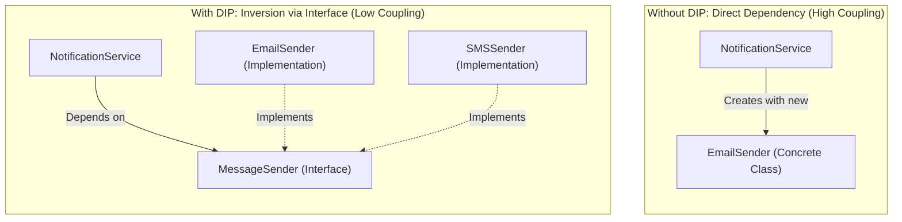
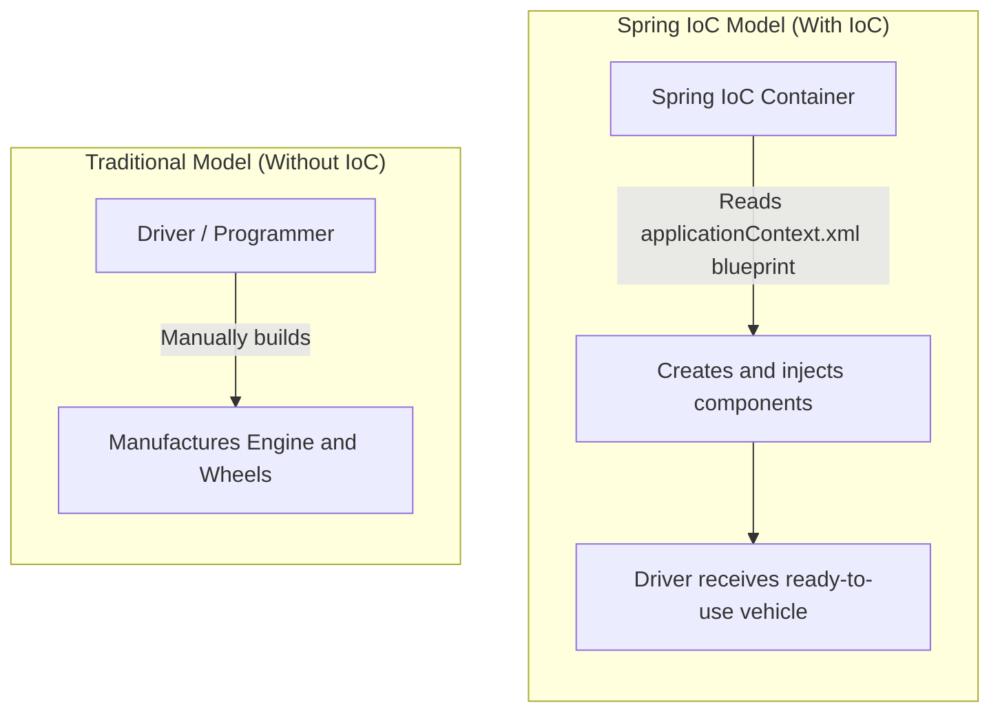
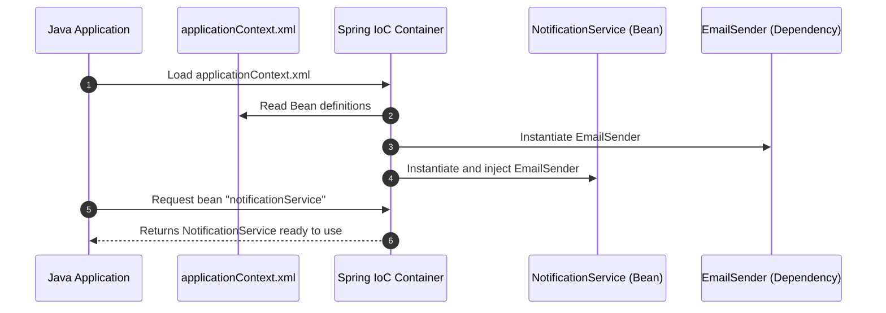

# Principles, Patterns, and Dependency Injection

To understand the architecture of **Spring Framework**, it is necessary to first analyze how object-oriented software is designed in a clean and maintainable way. Developers often confuse terms such as principles, patterns, and frameworks; however, there is a very clear conceptual hierarchy between them.

In this document, we will explore what a design principle is, break down the **SOLID** principles, learn what a design pattern is, and see how Spring connects these concepts using **Inversion of Control (IoC)** and the **Dependency Inversion Principle (DIP)**.

---

## 1. Design Principles vs. Design Patterns

Before writing code, software architects establish rules and guidelines. It is essential to differentiate a **Principle** from a **Pattern**:

### Explanation of the Hierarchy

- **Design Principle**: A high-level rule or guideline. It indicates **what quality we should seek** in software (for example, "classes should be decoupled"), but **does not specify how to code it**. It does not depend on any programming language.
- **Design Pattern**: A proven solution scheme for a recurring object-oriented programming problem. It specifies **how to structure classes** to meet one or several principles. Examples: *Factory*, *Singleton*, *Strategy*.
- **Framework**: The concrete software tool (such as Spring) that implements these patterns internally to save us from writing repetitive boilerplate code.

---

## 2. The SOLID Principles

The **SOLID** principles are a set of five guidelines created by Robert C. Martin ("Uncle Bob") to build software that is easy to maintain, extend, and test.

| Acronym | English Principle | Spanish Name | Brief Description |
| :---: | :--- | :--- | :--- |
| **S** | **Single Responsibility Principle (SRP)** | Single Responsibility Principle | A class should have only one reason to change; it should serve a single specific function. |
| **O** | **Open/Closed Principle (OCP)** | Open/Closed Principle | Software entities should be open for extension, but closed for modification. |
| **L** | **Liskov Substitution Principle (LSP)** | Liskov Substitution Principle | Objects of a subclass should be able to replace objects of a superclass without altering the correct behavior of the program. |
| **I** | **Interface Segregation Principle (ISP)** | Interface Segregation Principle | It is better to have several specific interfaces than a single interface overloaded with unused methods. |
| **D** | **Dependency Inversion Principle (DIP)** | Dependency Inversion Principle | High-level modules should not depend on low-level modules; both should depend on abstractions. |

---

## 3. Two Key Principles in Spring: DIP and IoC

Spring relies on the combination of two fundamental principles:

### A. Dependency Inversion Principle (DIP)

The Dependency Inversion Principle establishes two main rules:
1. High-level classes (business logic) should not depend directly on low-level classes (technical details such as sending emails, database connection, etc.). Both must depend on **interfaces (abstractions)**.
2. Abstractions should not depend on details; details should depend on abstractions.

#### Conceptual Scheme: With vs. Without DIP

### B. Inversion of Control (IoC)

Traditionally, the programmer writes code that controls application execution flow: deciding when to instantiate objects with `new`, when to call a method, and when to release memory.

In **Inversion of Control (IoC)**, the responsibility for object creation and lifecycle management is delegated to an external entity: the **Spring IoC Container**. The programmer transitions from being the "builder assembling parts" to a "declarer of rules" (using XML configuration files or annotations).

#### Abstract Scheme: The Car Factory Analogy

---

## 4. The Dependency Injection (DI) Pattern

While IoC and DIP are **design principles** (philosophy), **Dependency Injection (DI)** is the concrete **design pattern** that brings them to life.

Dependency Injection means an object does not create its dependencies; instead, they are **supplied (injected)** from the outside at the time of its instantiation.

### Types of Dependency Injection using XML

In Spring, using XML configuration files, we have two main ways to inject dependencies:

#### 1. Constructor Injection (`<constructor-arg>`)
Required dependencies are passed as arguments to the class constructor. This is the ideal approach for mandatory dependencies.

#### 2. Setter Injection (`<property>`)
The container creates the object using its default (no-arg) constructor and then invokes `set...()` methods to assign each dependency. It is suitable for optional or reconfigurable dependencies.

---

## Self-Assessment Quiz

<Quiz id="comp2-semana2-01-principios-patrones-quiz">
  <Question title="What is the fundamental difference between a Design Principle and a Design Pattern?">
    <Option>Principles are executable code and patterns are UML diagrams.</Option>
    <Option correct>A principle provides high-level abstract guidelines without implementation, while a pattern suggests a concrete class structure to solve a recurring problem.</Option>
    <Option>A design pattern depends exclusively on Java, while a principle applies only to C++.</Option>
    <Option>Principles are only applied by frameworks and patterns are only applied by programmers.</Option>
  </Question>
  <Question title="In the SOLID acronym, what does the letter 'D' represent and what is its main premise?">
    <Option>Dependency Injection: states that we must use the @Autowired annotation on all attributes.</Option>
    <Option>Data Access Principle: states that every database must be relational.</Option>
    <Option correct>Dependency Inversion Principle (DIP): states that high-level modules should depend on abstractions (interfaces) and not on concrete low-level classes.</Option>
    <Option>Dynamic Interface Programming: states that multiple abstract classes should be used instead of interfaces.</Option>
  </Question>
  <Question title="What does the concept of Inversion of Control (IoC) mean?">
    <Option>That the end user takes control of the graphical user interface of the application.</Option>
    <Option correct>That responsibility for creating, configuring, and managing the lifecycle of objects is transferred from the developer to an external container or framework.</Option>
    <Option>That the Java compiler reverses the order in which main methods are executed.</Option>
    <Option>That setter methods execute before constructors in all classes.</Option>
  </Question>
  <Question title="How do IoC, DIP, and DI relate in Spring Framework?">
    <Option>IoC is a programming language, DIP is the database, and DI is the web view.</Option>
    <Option>DI is the general principle, IoC is the pattern, and DIP is the Spring framework.</Option>
    <Option correct>DIP and IoC are design principles establishing decoupling; DI is the design pattern that Spring uses internally as a framework to realize this inversion.</Option>
    <Option>They have no relationship to each other; each is used in independent application layers.</Option>
  </Question>
  <Question title="When configuring Constructor Dependency Injection in Spring via XML, which tag is used inside <bean>?">
    <Option>&lt;property name="..." ref="..." /&gt;</Option>
    <Option correct>&lt;constructor-arg ref="..." /&gt;</Option>
    <Option>&lt;inject-dependency ref="..." /&gt;</Option>
    <Option>&lt;autowire-constructor ref="..." /&gt;</Option>
  </Question>
</Quiz>
