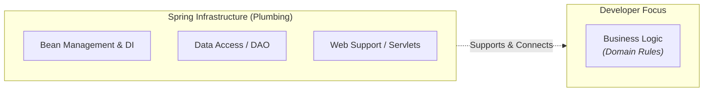
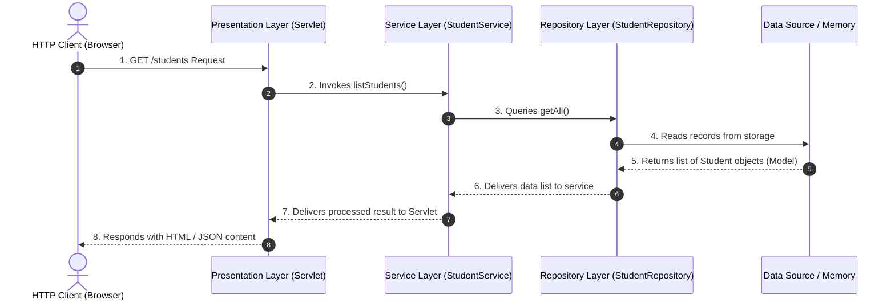

# Spring Ecosystem and Layered Architecture

In enterprise Java application development, one of the greatest advantages of using **Spring Framework** is that it handles the infrastructure or "plumbing" code (*plumbing code*). This allows development teams to focus their effort exclusively on business logic.

---

## 1. The Concept of "Plumbing Code" in Spring

In software engineering, the term *plumbing* refers to all repetitive support code that provides no direct business value but is essential for the application to run. Examples include:

- Manual creation and management of object instances.
- Manual connection and dependency injection between components.
- Resource, transaction, and session management.
- Abstractions to connect with databases or remote services.

:::note[Why is delegating plumbing to Spring crucial?]
By delegating object creation and assembly to Spring via XML configuration, Java application code remains clean (*POJOs*), free from rigid dependencies, and easy to unit test.
:::

---

## 2. Overview of the Spring Ecosystem

The Spring ecosystem is not a single monolithic block, but an interconnected family of independent and modular projects built to solve specific challenges in the lifecycle of a Java application:

### Key Ecosystem Components

Based on the architecture shown in the diagram above, the ecosystem is broken down into the following key pillars:

- **Spring Boot (Foundation)**: The technological foundation sustaining modern Spring projects. It provides auto-configuration and embedded servers to quickly launch applications without requiring complex initial setups.
- **Spring Core**: Represents the fundamental core of the framework. It is responsible for Inversion of Control (IoC), the bean container, and dependency injection via XML or Java.
- **Spring MVC**: Presentation layer framework implementing the Model-View-Controller pattern to build standardized web applications and REST APIs.
- **Spring Persistence**: Set of tools and abstractions (like Spring Data / JDBC / ORM) designed to simplify interaction with relational and non-relational databases.
- **Spring Security**: Module dedicated to authentication, authorization, and protection against common web vulnerabilities (CSRF, XSS, session fixation).
- **Spring Cloud**: Infrastructure for building distributed systems and microservice architectures (service discovery, centralized configuration management, routing).
- **Other Spring Projects**: A wide range of specialized extensions such as Spring Batch (batch processing), Spring Integration (messaging), Spring GraphQL, among others.

---

## 3. Layered Architecture: Model - Repository - Service

To guarantee **Separation of Concerns**, a Spring application is hierarchically divided into specialized layers. Each layer has a single purpose and communicates exclusively with its adjacent layer via interfaces (abstractions).

### Layer Responsibility Matrix

| Layer | Key Component | Main Responsibility | Communication Rule |
| :--- | :--- | :--- | :--- |
| **Presentation** | `Servlet` / `Controller` | Receives client HTTP requests, extracts parameters, and delegates execution. | Only invokes the Service Layer via its interface. |
| **Service (Business)** | `Service` | Contains business rules, validations, and operation orchestration. | Invokes the Repository Layer via abstract interfaces. |
| **Repository (Data)** | `Repository` / `DAO` | Manages data access (CRUD operations in memory, files, or database). | Manipulates and returns Domain Model objects. |
| **Model (Domain)** | `Model` / `Entity` | Represents the system's information entities (POJO classes). | Carried freely across all layers. |

---

### Information Flow Between Layers

The following diagram illustrates the journey of a web request from its arrival at the Servlet to querying data and returning to the client:

:::note[Isolation Principle]
The Presentation Layer must never communicate directly with the Repository Layer or Database. All operations must transit through the Service Layer to ensure business rules are properly enforced.
:::

---

## Self-Assessment Quiz

<Quiz id="comp2-semana2-02-ecosistema-modulos-quiz">
  <Question title="In the context of Spring Framework, what does the term 'plumbing code' refer to?">
    <Option>To code used to connect database pipes via network connectors in C++.</Option>
    <Option correct>To repetitive infrastructure code (object creation, dependency assembly, transaction management) that Spring automates so developers can focus on business logic.</Option>
    <Option>To CSS scripts that provide graphical styles to web applications.</Option>
    <Option>To internal Tomcat web server configuration for listening on port 8080.</Option>
  </Question>
  <Question title="According to the Spring ecosystem diagram (spring-ecosystem.png), which component serves as the technological foundation simplifying configuration and embedded servers?">
    <Option>Spring Cloud.</Option>
    <Option>Spring Security.</Option>
    <Option correct>Spring Boot.</Option>
    <Option>Spring MVC.</Option>
  </Question>
  <Question title="What is the main role of the Service Layer in the Model-Repository-Service architecture?">
    <Option>To store relational database tables.</Option>
    <Option>To generate HTML code responses for the user's browser.</Option>
    <Option correct>To contain application business rules and logic, coordinating operations that interact with the repository layer.</Option>
    <Option>To define the attribute structure and getters/setters of the data model.</Option>
  </Question>
  <Question title="In Layered Architecture, what is the correct communication rule regarding the Presentation Layer (Servlets)?">
    <Option>The Presentation Layer must directly query the Database without passing through other layers.</Option>
    <Option correct>The Presentation Layer should only communicate with the Service Layer via its abstract interface.</Option>
    <Option>The Presentation Layer is responsible for defining Repository methods.</Option>
    <Option>The Presentation Layer must directly modify Spring XML files at runtime.</Option>
  </Question>
</Quiz>
