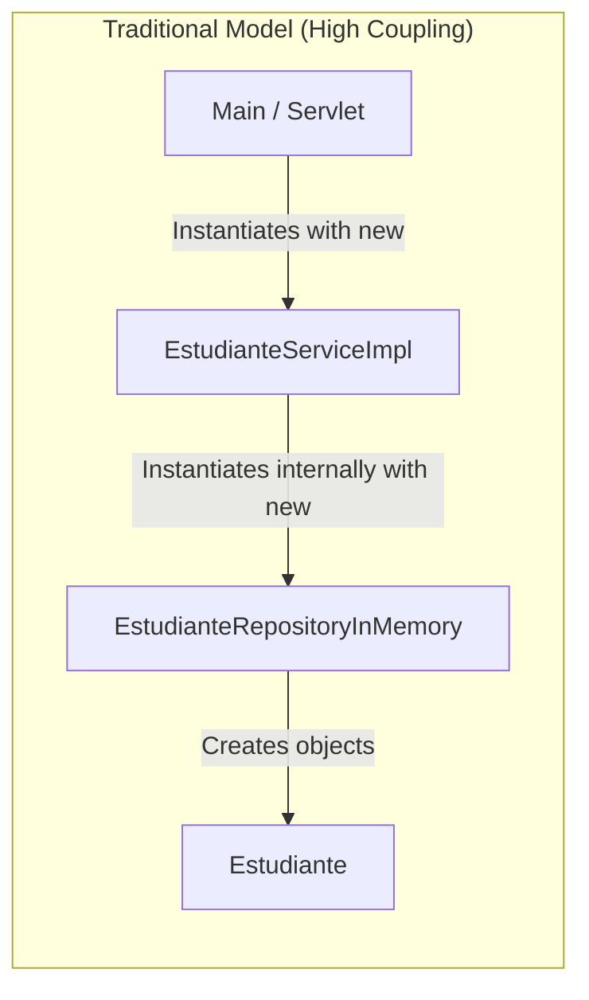
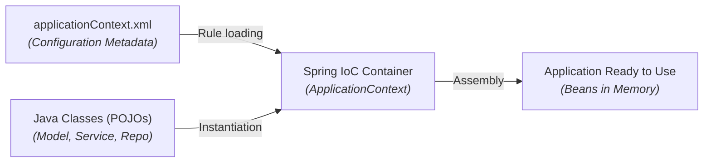

# IoC Containers and Bean Configuration with XML

In previous documents, we explored **Design Principles** (SOLID, IoC, DIP) and **Layered Architecture** (Model-Repository-Service). Now we will dive into the technical mechanism that enables this assembly: the **Spring IoC Container** and the declarative definition of **Spring Beans via XML files**.

In this guide, we will compare how Java applications worked before Spring, analyze the differences between `BeanFactory` and `ApplicationContext`, and build step-by-step a complete application connected via XML without using annotations.

---

## 1. How Projects Worked Before Spring

In traditional Java applications (Java SE or pure Servlets), the developer was responsible for manually instantiating and assembling all system layers using the `new` operator.



### Issues with the Traditional Approach

Consider the code of a service without Spring:

```java title="src/main/java/com/example/service/EstudianteServiceImpl.java" showLineNumbers
package com.example.service;

import com.example.repository.EstudianteRepositoryInMemory;

public class EstudianteServiceImpl {

    // Tight coupling to the concrete low-level class
    private EstudianteRepositoryInMemory repositorio;

    public EstudianteServiceImpl() {
        // Class directly controls instantiation of its dependency
        this.repositorio = new EstudianteRepositoryInMemory();
    }
}
```

- **Tight Coupling**: To replace `EstudianteRepositoryInMemory` with `EstudianteRepositoryDatabase`, you must modify `EstudianteServiceImpl` and recompile the entire project.
- **Inability to Unit Test**: You cannot pass mock objects of the repository to test business logic in isolation.

---

## 2. The Spring IoC Container

Spring solves this problem by introducing the **IoC Container** (*Inversion of Control Container*). The container is the central framework engine responsible for:

1. **Reading** configuration metadata declared in the XML file (`applicationContext.xml`).
2. **Instantiating** POJO classes as **Spring Beans**.
3. **Injecting** required dependencies between them.
4. **Managing** their lifecycle and scopes.



### Types of IoC Containers in Spring

Spring provides two main interfaces representing the IoC container:

| IoC Container | Java Interface | Key Features | Recommended Use |
| :--- | :--- | :--- | :--- |
| **Bean Factory** | `org.springframework.beans.factory.BeanFactory` | Basic container. Provides core DI support and lazy loading (creates beans only when requested). | Reserved for devices with severely limited memory. |
| **Application Context** | `org.springframework.context.ApplicationContext` | Extends `BeanFactory`. Adds web integration, events, internationalization (I18N), and default eager loading. | **Recommended standard choice** for all enterprise applications. |

---

## 3. What is a Spring Bean?

A **Spring Bean** is any object whose instantiation, assembly, and lifecycle are managed entirely by the **Spring IoC Container**, which runs inside the **Java Virtual Machine (JVM)** process.

Unlike classes instantiated manually with `new`, Spring Beans coexist within the container as living components. The IoC container in the JVM handles connecting and injecting the **Service Bean** with the **Repository Bean** via **Dependency Injection (DI)**.

<div style={{textAlign: 'center', margin: '20px 0'}}>
  
</div>

### Ways to Register a Bean in XML

In this module, bean registration is performed exclusively in the `applicationContext.xml` file using the `<bean>` tag:

```xml title="src/main/resources/applicationContext.xml" showLineNumbers
<?xml version="1.0" encoding="UTF-8"?>
<beans xmlns="http://www.springframework.org/schema/beans"
       xmlns:xsi="http://www.w3.org/2001/XMLSchema-instance"
       xsi:schemaLocation="http://www.springframework.org/schema/beans
           http://www.springframework.org/schema/beans/spring-beans.xsd">

    <!-- Basic Bean Definition -->
    <bean id="myBean" class="com.example.MyClass" />

</beans>
```

- **`id`**: Unique identifier for the bean within the IoC container (`repoBean`, `serviceBean`, `servletBean`).
- **`class`**: Fully qualified name of the Java class to instantiate.

---

## 4. XML Dependency Injection in Layered Architecture

Taking the layered structure (**Model - Repository - Service**) defined in the previous document, we will see how to implement and inject dependencies via XML using two methods: **Constructor Injection** and **Setter Injection**.

### A. Model Layer (Model POJO)

```java title="src/main/java/com/example/model/Estudiante.java" showLineNumbers
package com.example.model;

public class Estudiante {

    private String id;
    private String nombre;
    private String correo;

    public Estudiante() {
    }

    public Estudiante(String id, String nombre, String correo) {
        this.id = id;
        this.nombre = nombre;
        this.correo = correo;
    }

    public String getId() {
        return id;
    }

    public void setId(String id) {
        this.id = id;
    }

    public String getNombre() {
        return nombre;
    }

    public void setNombre(String nombre) {
        this.nombre = nombre;
    }

    public String getCorreo() {
        return correo;
    }

    public void setCorreo(String correo) {
        this.correo = correo;
    }
}
```

---

### B. Repository Layer (Repository)

We define the repository interface and implementation:

```java title="src/main/java/com/example/repository/EstudianteRepository.java" showLineNumbers
package com.example.repository;

import com.example.model.Estudiante;
import java.util.List;

public interface EstudianteRepository {
    List<Estudiante> obtenerTodos();
    void guardar(Estudiante estudiante);
}
```

```java title="src/main/java/com/example/repository/EstudianteRepositoryInMemory.java" showLineNumbers
package com.example.repository;

import com.example.model.Estudiante;
import java.util.ArrayList;
import java.util.List;

public class EstudianteRepositoryInMemory implements EstudianteRepository {

    private final List<Estudiante> estudiantes = new ArrayList<>();

    public EstudianteRepositoryInMemory() {
        estudiantes.add(new Estudiante("1", "Ana Gómez", "ana@icesi.edu.co"));
        estudiantes.add(new Estudiante("2", "Carlos Pérez", "carlos@icesi.edu.co"));
    }

    @Override
    public List<Estudiante> obtenerTodos() {
        return new ArrayList<>(this.estudiantes);
    }

    @Override
    public void guardar(Estudiante estudiante) {
        this.estudiantes.add(estudiante);
    }
}
```

---

### C. Service Layer with Constructor Injection

The service class receives the repository through its constructor:

```java title="src/main/java/com/example/service/EstudianteServiceImpl.java" showLineNumbers
package com.example.service;

import com.example.model.Estudiante;
import com.example.repository.EstudianteRepository;
import java.util.List;

public class EstudianteServiceImpl implements EstudianteService {

    private final EstudianteRepository estudianteRepository;

    // Required dependency injected via constructor
    public EstudianteServiceImpl(EstudianteRepository estudianteRepository) {
        this.estudianteRepository = estudianteRepository;
    }

    @Override
    public List<Estudiante> listarEstudiantes() {
        return this.estudianteRepository.obtenerTodos();
    }

    @Override
    public void registrarEstudiante(Estudiante estudiante) {
        if (estudiante.getCorreo() == null || !estudiante.getCorreo().contains("@")) {
            throw new IllegalArgumentException("Invalid email address");
        }
        this.estudianteRepository.guardar(estudiante);
    }
}
```

#### Declaration in `applicationContext.xml`:

```xml title="src/main/resources/applicationContext.xml" showLineNumbers
<!-- 1. Repository Bean -->
<bean id="estudianteRepositoryBean" 
      class="com.example.repository.EstudianteRepositoryInMemory" />

<!-- 2. Service Bean using Constructor Injection -->
<bean id="estudianteServiceBean" 
      class="com.example.service.EstudianteServiceImpl">
    <constructor-arg ref="estudianteRepositoryBean" />
</bean>
```

---

### D. Service Layer with Setter Injection

Alternatively, injection can be done by defining *setter* methods:

```java title="src/main/java/com/example/service/EstudianteServiceSetterImpl.java" showLineNumbers
package com.example.service;

import com.example.model.Estudiante;
import com.example.repository.EstudianteRepository;
import java.util.List;

public class EstudianteServiceSetterImpl implements EstudianteService {

    private EstudianteRepository estudianteRepository;

    public EstudianteServiceSetterImpl() {
    }

    // Setter for dependency injection
    public void setEstudianteRepository(EstudianteRepository estudianteRepository) {
        this.estudianteRepository = estudianteRepository;
    }

    @Override
    public List<Estudiante> listarEstudiantes() {
        return this.estudianteRepository.obtenerTodos();
    }

    @Override
    public void registrarEstudiante(Estudiante estudiante) {
        this.estudianteRepository.guardar(estudiante);
    }
}
```

#### Declaration in `applicationContext.xml`:

```xml title="src/main/resources/applicationContext.xml" showLineNumbers
<!-- Setter Injection using property 'estudianteRepository' -->
<bean id="estudianteServiceSetterBean" 
      class="com.example.service.EstudianteServiceSetterImpl">
    <property name="estudianteRepository" ref="estudianteRepositoryBean" />
</bean>
```

:::note[Key difference between constructor-arg and property]
- `<constructor-arg ref="..." />`: Used when the class has a constructor accepting dependencies. Guarantees immutability.
- `<property name="..." ref="..." />`: Uses the corresponding setter method (`setEstudianteRepository`). Requires a default no-arg constructor.
:::

---

## Self-Assessment Quiz

<Quiz id="comp2-semana2-03-contenedor-beans-quiz">
  <Question title="What is the main drawback of instantiating dependencies with 'new' inside constructors in Java without Spring?">
    <Option>The Java compiler generates larger .class files.</Option>
    <Option correct>It generates tight coupling between client class and concrete implementation, preventing unit testing with mock objects.</Option>
    <Option>Variables declared with 'new' are immediately erased from RAM.</Option>
    <Option>It mandatorily requires importing Jakarta servlets.</Option>
  </Question>
  <Question title="Between 'BeanFactory' and 'ApplicationContext', what is the standard recommendation for enterprise applications and why?">
    <Option>BeanFactory, because it does not require XML files.</Option>
    <Option correct>ApplicationContext, because it extends BeanFactory adding enterprise services such as events, web integration, and eager loading of beans.</Option>
    <Option>BeanFactory, because it is the only container supporting dependency injection.</Option>
    <Option>ApplicationContext, because it removes the need for interfaces in Java.</Option>
  </Question>
  <Question title="In the applicationContext.xml file, what is the difference between <constructor-arg ref='...' /> and <property name='...' ref='...' />?">
    <Option>&lt;constructor-arg&gt; creates a file on disk and &lt;property&gt; saves it in a database.</Option>
    <Option correct>&lt;constructor-arg&gt; injects dependencies via constructor parameters, while &lt;property&gt; invokes a specified setter method.</Option>
    <Option>&lt;property&gt; is only used with Java annotations like @Autowired.</Option>
    <Option>Both tags do exact same thing and can be swapped without modifying Java classes.</Option>
  </Question>
  <Question title="What is the role of the class attribute in the <bean> tag inside applicationContext.xml?">
    <Option>Specifying physical path of .java file on disk.</Option>
    <Option correct>Indicating fully qualified name of Java class that container should instantiate.</Option>
    <Option>Defining SQL database table name.</Option>
    <Option>Assigning font style family for user interface.</Option>
  </Question>
</Quiz>
