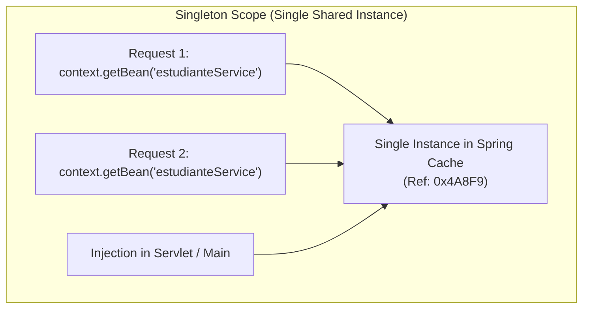
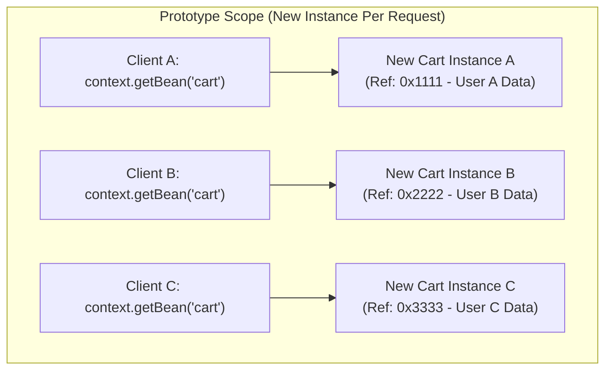
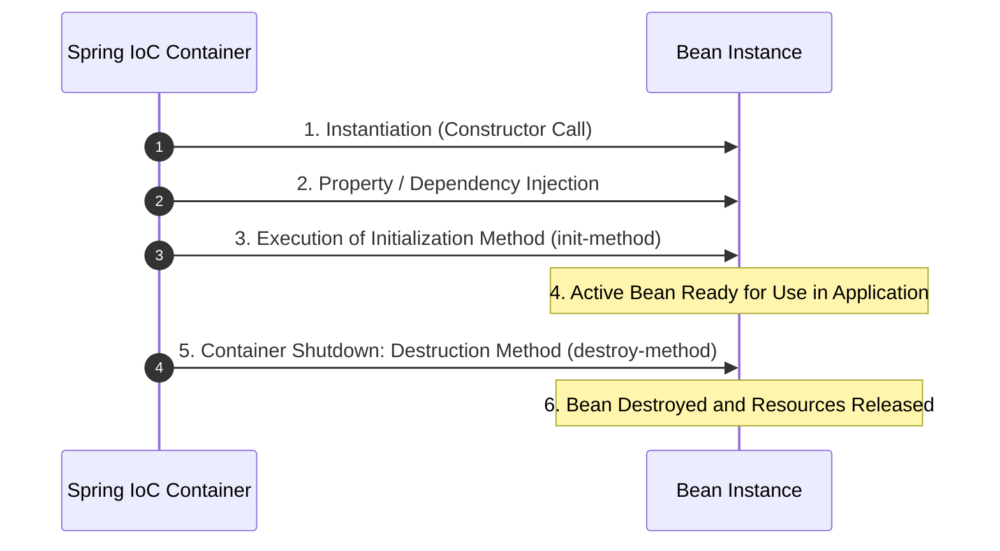

# Scopes, Bean Lifecycle, and Standalone Execution

In the previous document, we learned how to define beans in XML and connect them using Dependency Injection. Now we will delve into the internal behavior of beans inside the IoC container: their **Scopes**, customizing their **Lifecycle** via initialization and destruction methods, and testing the architecture in a Standalone Java application using `ClassPathXmlApplicationContext`.

---

## 1. Bean Scopes in XML

The **scope** specifies how many instances of a bean the Spring IoC container will create and how those references are shared during execution.

In XML configuration, the scope is defined using the `scope="..."` attribute in the `<bean>` tag.

### A. Singleton Scope (`scope="singleton"`)

- **Default Behavior**: If we omit the `scope` attribute, Spring automatically assigns `singleton` scope.
- **Single Instance**: The IoC container creates a **single instance** of the object for the entire `ApplicationContext` and caches it.
- **Recommended Use**: Stateless classes such as Services and Repositories.

```xml title="src/main/resources/applicationContext.xml" showLineNumbers
<!-- Singleton Scope Bean (Default) -->
<bean id="estudianteServiceSingleton" 
      class="com.example.service.EstudianteServiceImpl" 
      scope="singleton">
    <constructor-arg ref="estudianteRepositoryBean" />
</bean>
```



---

### B. Prototype Scope (`scope="prototype"`)

- **New Instance Per Request**: Every time the application requests the bean via `context.getBean()` or injects it into another class, the IoC container creates a **completely new and independent object**.
- **No Caching**: Unlike `singleton`, Spring does not store prototype bean references in memory or reuse previous instances.

```xml title="src/main/resources/applicationContext.xml" showLineNumbers
<!-- Prototype Scope Bean -->
<bean id="shoppingCartPrototype" 
      class="com.example.model.ShoppingCart" 
      scope="prototype" />
```



#### Why and when to use Prototype Scope?

1. **Stateful Beans**:
   - In a multithreaded web application, if a bean stores user-specific or transaction-specific information in instance variables (for example, items in a shopping cart or a temporary session token), **using Singleton would cause data corruption** because all users would modify the same shared variables.
   - With `prototype`, each thread or operation receives a clean copy without risk of interference.

2. **Main Advantages**:
   - **Total Isolation & Thread-Safety**: Guarantees that state modifications in one bean do not affect other clients or concurrent threads.
   - **Clean State Reset**: Every invocation starts with a freshly constructed object in its initial state.

3. **Real Enterprise Use Cases**:
   - **Shopping Carts or Multi-step Forms**: Storing temporary variables before processing or persistence.
   - **Report Generators or PDF Exporters**: Accumulating data buffers or processing states during single document generation.
   - **Task Commands (Command Pattern)**: Instances created to execute a specific job once and then be discarded.

:::warning[Prototype Memory Management Consideration]
Spring is responsible for instantiating and injecting Prototype beans, but **does not manage final object destruction**. Memory release for a Prototype bean is the responsibility of the JVM Garbage Collector once the bean is no longer referenced.
:::

---

### Comparison Table: Singleton vs. Prototype

| Feature | Singleton Scope | Prototype Scope |
| :--- | :--- | :--- |
| **Number of Instances** | Single instance per `ApplicationContext`. | A new instance per request. |
| **XML Configuration** | `scope="singleton"` *(default)* | `scope="prototype"` |
| **Memory Usage** | Reuses the same instance (RAM efficient). | Continually instantiates objects (higher consumption). |
| **Destruction** | Spring manages the bean until container shutdown. | Spring creates the instance but **does not run destruction**. |

---

## 2. Bean Lifecycle with XML

The IoC container manages the bean lifecycle from instantiation to removal from memory.



### Event Methods: `init-method` and `destroy-method`

Instead of coupling our classes to framework interfaces, Spring allows specifying initialization and cleanup methods directly in the XML file using `init-method` and `destroy-method` attributes:

- **`init-method`**: Executes immediately **after** instantiating the bean and injecting all dependencies. Ideal for opening connections or initializing caches.
- **`destroy-method`**: Executes **before** shutting down the container. Ideal for closing files or releasing connections.

#### Java Code Example (Pure POJO):

```java title="src/main/java/com/example/repository/EstudianteRepositoryWithLifecycle.java" showLineNumbers
package com.example.repository;

public class EstudianteRepositoryWithLifecycle {

    // Method invoked on Bean initialization
    public void iniciarRepositorio() {
        System.out.println("-> [LIFECYCLE] Initializing connection and loading initial data...");
    }

    // Method invoked on Bean destruction
    public void limpiarRecursos() {
        System.out.println("-> [LIFECYCLE] Closing connections and releasing memory...");
    }
}
```

#### Declaration in `applicationContext.xml`:

```xml title="src/main/resources/applicationContext.xml" showLineNumbers
<!-- init-method and destroy-method XML configuration -->
<bean id="repoLifecycleBean" 
      class="com.example.repository.EstudianteRepositoryWithLifecycle"
      init-method="iniciarRepositorio"
      destroy-method="limpiarRecursos" />
```

---

## 3. Standalone Execution with `Main.java` and `ClassPathXmlApplicationContext`

To verify layered architecture and dependency injection without deploying a web server, an executable `Main.java` class is used to initialize the `ApplicationContext` by loading the XML from the *classpath*.

```java title="src/main/java/com/example/Main.java" showLineNumbers
package com.example;

import com.example.model.Estudiante;
import com.example.service.EstudianteService;
import org.springframework.context.support.ClassPathXmlApplicationContext;

import java.util.List;

public class Main {

    public static void main(String[] args) {
        System.out.println("=== 1. Initializing Spring IoC Container ===");
        
        // Load context from applicationContext.xml in src/main/resources
        ClassPathXmlApplicationContext context = 
                new ClassPathXmlApplicationContext("applicationContext.xml");

        System.out.println("\n=== 2. Requesting Service Bean ===");
        // Retrieve bean by ID configured in XML
        EstudianteService servicio = (EstudianteService) context.getBean("estudianteServiceBean");

        System.out.println("\n=== 3. Executing Business Logic ===");
        List<Estudiante> estudiantes = servicio.listarEstudiantes();
        for (Estudiante e : estudiantes) {
            System.out.println("Registered Student: " + e.getNombre() + " (" + e.getCorreo() + ")");
        }

        System.out.println("\n=== 4. Closing IoC Container ===");
        // Close context to trigger destroy-method execution
        context.close();
    }
}
```

### Execution Plugin Configuration in `pom.xml`

To execute the standalone `Main.java` class from the console using **Maven**, include the `exec-maven-plugin` inside `pom.xml`:

```xml title="pom.xml" showLineNumbers
<build>
    <plugins>
        <!-- Plugin to execute Standalone Java classes via Maven -->
        <plugin>
            <groupId>org.codehaus.mojo</groupId>
            <artifactId>exec-maven-plugin</artifactId>
            <version>3.1.0</version>
            <configuration>
                <!-- Fully qualified main class name -->
                <mainClass>com.example.Main</mainClass>
            </configuration>
        </plugin>
    </plugins>
</build>
```

---

### Terminal Execution Command with Maven

Once `pom.xml` is configured, compile and run the Standalone project from the terminal using:

```bash
mvn clean compile exec:java
```

:::tip[What does this Maven command do?]
1. `clean`: Removes previously compiled files in the `target/` directory.
2. `compile`: Compiles Java classes and copies resource files (`applicationContext.xml`) to output classpath directory.
3. `exec:java`: Invokes the main class `com.example.Main` inside the JVM with all Spring dependencies loaded in classpath.
:::

---

## Self-Assessment Quiz

<Quiz id="comp2-semana2-04-scopes-lifecycle-quiz">
  <Question title="In 'singleton' scope (Spring default), how many instances of a bean does the IoC container create?">
    <Option>A new instance per call to context.getBean().</Option>
    <Option>One instance per browser HTTP session.</Option>
    <Option correct>A single shared instance throughout the entire lifecycle of the ApplicationContext.</Option>
    <Option>As many instances as threads in the JVM.</Option>
  </Question>
  <Question title="What is the main difference between 'singleton' scope and 'prototype' scope in XML configuration?">
    <Option>Singleton is configured with annotations and Prototype with XML.</Option>
    <Option correct>Singleton reuses a single instance in memory, while Prototype creates a new instance every time the bean is requested.</Option>
    <Option>Prototype deletes database and Singleton backs it up.</Option>
    <Option>Singleton only works in servlets and Prototype in console applications.</Option>
  </Question>
  <Question title="When configuring init-method and destroy-method attributes in XML <bean>, when does init-method execute?">
    <Option>Before calling the object's constructor.</Option>
    <Option correct>Immediately after instantiating the object and injecting all its dependencies.</Option>
    <Option>When shutting down the JVM.</Option>
    <Option>Only if the object implements a Spring interface.</Option>
  </Question>
  <Question title="Which method must be called on ClassPathXmlApplicationContext to ensure execution of destroy-method in a Standalone app?">
    <Option>context.start()</Option>
    <Option>context.refresh()</Option>
    <Option correct>context.close()</Option>
    <Option>context.destroyAll()</Option>
  </Question>
</Quiz>
