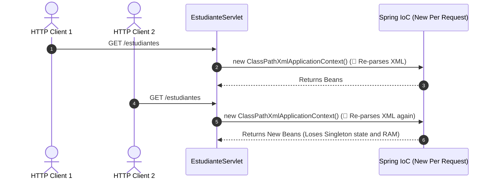

# Spring Context Integration in Web Servlets

In previous documents, we learned to configure the **Spring IoC Container** using XML and run Standalone Java applications with `ClassPathXmlApplicationContext`. However, in a professional web environment using **Servlets** (`jakarta.servlet`), the web container (such as Apache Tomcat) handles multiple concurrent HTTP requests.

In this guide, we will address the problem of recreating the Spring context for every HTTP request, implement the **Singleton / Context Listener Pattern (`ContextLoaderListener`)** to keep a single instance of `ApplicationContext` alive throughout the web application lifecycle, and inject service beans into Servlets.

---

## 1. The Issue of Loading ApplicationContext Inside a Servlet

A common mistake when initiating Spring integration with Servlets is instantiating the `ApplicationContext` inside the request processing method (`doGet` or `doPost`) of the Servlet.

### Anti-Pattern Example:

```java title="src/main/java/com/example/servlet/EstudianteServletError.java" showLineNumbers
package com.example.servlet;

import com.example.service.EstudianteService;
import jakarta.servlet.ServletException;
import jakarta.servlet.annotation.WebServlet;
import jakarta.servlet.http.HttpServlet;
import jakarta.servlet.http.HttpServletRequest;
import jakarta.servlet.http.HttpServletResponse;
import org.springframework.context.ApplicationContext;
import org.springframework.context.support.ClassPathXmlApplicationContext;

import java.io.IOException;

@WebServlet("/estudiantes-error")
public class EstudianteServletError extends HttpServlet {

    @Override
    protected void doGet(HttpServletRequest req, HttpServletResponse resp) 
            throws ServletException, IOException {

        // 🔴 ANTI-PATTERN: Loading XML on every HTTP request
        ApplicationContext context = 
                new ClassPathXmlApplicationContext("applicationContext.xml");
        
        EstudianteService servicio = 
                (EstudianteService) context.getBean("estudianteServiceBean");
        
        // ... process response
    }
}
```



### Consequences of this Anti-Pattern:

1. **Performance Breakdown (I/O Overhead)**: The server re-reads and parses `applicationContext.xml` from disk on **every click or HTTP request**.
2. **Loss of Singleton State**: Beans declared with `scope="singleton"` cease to be singletons for the application; isolated copies are created on each request.
3. **Memory Leaks**: The Garbage Collector gets overwhelmed cleaning up multiple orphaned Spring containers.

---

## 2. The Solution: Singleton Pattern and ContextLoaderListener

To resolve this issue, Spring's `ApplicationContext` must be instantiated **once** when the web server (Tomcat) starts the application, stored as an attribute of the servlet context (`ServletContext`), and destroyed when the application shuts down.

<div style={{textAlign: 'center', margin: '25px 0'}}>
  
</div>

### Layer Breakdown in the Web Server

1. **Web Client (Browser)**: Sends HTTP requests (`GET / POST`) over the network to web server port (e.g. `8080`).
2. **Apache Tomcat Web Server**: Receiving application hosting the servlet execution engine.
3. **Catalina Engine (Servlet Engine)**: The central Tomcat component responsible for managing deployed web applications (`.war`) and routing HTTP requests to the appropriate Servlet.
4. **`ServletContext` (Shared WebApp Memory)**: Memory map persisting throughout the entire web application lifecycle. Coexisting within it are:
   - The **Servlets** (`EstudianteServlet`) serving requests.
   - The **Spring IoC Container** (`WebApplicationContext`), initialized once upon Tomcat startup via `ContextLoaderListener`.
5. **Living Spring Beans**: Service and Repository beans reside in Spring container as Singleton objects, consumed by Servlets without re-reading XML.

---

## 3. `web.xml` Configuration (Web Deployment)

To enable automatic Spring context loading in a traditional web application, configure `web.xml`:

```xml title="src/main/webapp/WEB-INF/web.xml" showLineNumbers
<?xml version="1.0" encoding="UTF-8"?>
<web-app xmlns="https://jakarta.ee/xml/ns/jakartaee"
         xmlns:xsi="http://www.w3.org/2001/XMLSchema-instance"
         xsi:schemaLocation="https://jakarta.ee/xml/ns/jakartaee 
                             https://jakarta.ee/xml/ns/jakartaee/web-app_6_0.xsd"
         version="6.0">

    <!-- 1. Location of Spring XML configuration file -->
    <context-param>
        <param-name>contextConfigLocation</param-name>
        <param-value>classpath:applicationContext.xml</param-value>
    </context-param>

    <!-- 2. Spring Listener initializing ApplicationContext on Tomcat startup -->
    <listener>
        <listener-class>org.springframework.web.context.ContextLoaderListener</listener-class>
    </listener>

</web-app>
```

:::note[Jakarta EE Compatibility]
As of Spring 6 and Tomcat 10+, applications use the `jakarta.servlet` namespace. Ensure your `spring-web` dependencies are version 6.0 or higher.
:::

---

## 4. Implementation of Spring-Integrated Servlet

With context loaded on startup by the listener, the Servlet retrieves the single service reference during its `init()` initialization method or in `doGet()`:

```java title="src/main/java/com/example/servlet/EstudianteServlet.java" showLineNumbers
package com.example.servlet;

import com.example.model.Estudiante;
import com.example.service.EstudianteService;
import jakarta.servlet.ServletException;
import jakarta.servlet.annotation.WebServlet;
import jakarta.servlet.http.HttpServlet;
import jakarta.servlet.http.HttpServletRequest;
import jakarta.servlet.http.HttpServletResponse;

import org.springframework.web.context.WebApplicationContext;
import org.springframework.web.context.support.WebApplicationContextUtils;

import java.io.IOException;
import java.io.PrintWriter;
import java.util.List;
import java.util.UUID;

@WebServlet(name = "estudianteServlet", value = "/estudiantes")
public class EstudianteServlet extends HttpServlet {

    private EstudianteService estudianteService;

    @Override
    public void init() throws ServletException {
        super.init();
        
        // Retrieve Singleton ApplicationContext stored in ServletContext by Listener
        WebApplicationContext context = WebApplicationContextUtils
                .getRequiredWebApplicationContext(getServletContext());

        // Extract service bean injected via XML
        this.estudianteService = (EstudianteService) context.getBean("estudianteServiceBean");
    }

    // 1. GET Method: Renders HTML form and student list
    @Override
    protected void doGet(HttpServletRequest request, HttpServletResponse response) 
            throws ServletException, IOException {

        response.setContentType("text/html;charset=UTF-8");
        PrintWriter out = response.getWriter();

        List<Estudiante> estudiantes = this.estudianteService.listarEstudiantes();

        out.println("<!DOCTYPE html>");
        out.println("<html><head><title>Student Management - Spring + Servlets</title></head><body>");
        out.println("<h1>Student Management (Spring Context + Servlets)</h1>");
        
        // HTML form to register a new student via POST
        out.println("<h2>Register New Student</h2>");
        out.println("<form action='estudiantes' method='POST'>");
        out.println("  <label>Name:</label><br/>");
        out.println("  <input type='text' name='nombre' required/><br/><br/>");
        out.println("  <label>Email:</label><br/>");
        out.println("  <input type='email' name='correo' required/><br/><br/>");
        out.println("  <button type='submit'>Save Student</button>");
        out.println("</form>");

        out.println("<hr/>");
        out.println("<h2>Registered Students List</h2>");
        out.println("<ul>");
        for (Estudiante e : estudiantes) {
            out.println("<li><strong>" + e.getNombre() + "</strong> - " + e.getCorreo() + "</li>");
        }
        out.println("</ul>");
        out.println("</body></html>");
    }

    // 2. POST Method: Receives form data, invokes Service Layer, and redirects
    @Override
    protected void doPost(HttpServletRequest request, HttpServletResponse response) 
            throws ServletException, IOException {

        // Extract parameters submitted by HTML form
        String nombre = request.getParameter("nombre");
        String correo = request.getParameter("correo");

        // Create Domain Model object
        String idGenerado = UUID.randomUUID().toString().substring(0, 8);
        Estudiante nuevoEstudiante = new Estudiante(idGenerado, nombre, correo);

        // Delegate execution to Service Layer (Spring Bean)
        this.estudianteService.registrarEstudiante(nuevoEstudiante);

        // Redirect (Post-Redirect-Get Pattern) to refresh list
        response.sendRedirect(request.getContextPath() + "/estudiantes");
    }
}
```

---

## 5. Complete Maven Project Structure (`war`)

To compile and package a web application integrating Servlets with Spring, standard Maven folder structure should be organized as follows:

```
src/
├── main/
│   ├── java/
│   │   └── com/example/
│   │       ├── model/
│   │       │   └── Estudiante.java
│   │       ├── repository/
│   │       │   ├── EstudianteRepository.java
│   │       │   └── EstudianteRepositoryInMemory.java
│   │       ├── service/
│   │       │   ├── EstudianteService.java
│   │       │   └── EstudianteServiceImpl.java
│   │       └── servlet/
│   │           └── EstudianteServlet.java
│   ├── resources/
│   │   └── applicationContext.xml
│   └── webapp/
│       └── WEB-INF/
│           └── web.xml
└── pom.xml
```

### Required Dependencies in `pom.xml`:

```xml title="pom.xml" showLineNumbers
<dependencies>
    <!-- 1. Spring Context and Spring Web -->
    <dependency>
        <groupId>org.springframework</groupId>
        <artifactId>spring-web</artifactId>
        <version>6.0.11</version>
    </dependency>

    <!-- 2. Jakarta Servlet API -->
    <dependency>
        <groupId>jakarta.servlet</groupId>
        <artifactId>jakarta.servlet-api</artifactId>
        <version>6.0.0</version>
        <scope>provided</scope>
    </dependency>
</dependencies>
```

---

## Self-Assessment Quiz

<Quiz id="comp2-semana2-05-servlets-spring-quiz">
  <Question title="Why is instantiating 'new ClassPathXmlApplicationContext()' inside doGet() of a Servlet considered a severe anti-pattern?">
    <Option>Because Servlets only accept JSON files and not XML.</Option>
    <Option correct>Because it destroys performance by re-reading and parsing XML on every HTTP request, generating multiple containers and breaking Singleton pattern.</Option>
    <Option>Because web browser blocks requests that read classpath.</Option>
    <Option>Because XML metadata can only be loaded on Windows operating systems.</Option>
  </Question>
  <Question title="What is the role of 'ContextLoaderListener' class in web.xml file?">
    <Option>Clean Tomcat temporary files upon receiving a 404 error.</Option>
    <Option correct>Initialize a single ApplicationContext instance when web application starts and store it in ServletContext to be shared by all Servlets.</Option>
    <Option>Convert Java objects into relational database tables.</Option>
    <Option>Automatically compile JSP pages at runtime.</Option>
  </Question>
  <Question title="What utility does 'WebApplicationContextUtils.getRequiredWebApplicationContext(getServletContext())' provide?">
    <Option>Create a new Servlet in browser memory.</Option>
    <Option correct>Retrieve shared WebApplicationContext instance stored in ServletContext by Spring listener.</Option>
    <Option>Delete all Prototype scope beans from RAM.</Option>
    <Option>Download Maven dependencies at runtime.</Option>
  </Question>
  <Question title="When packaging a web application using Spring and Servlets with Maven, what packaging type must be specified in pom.xml?">
    <Option>&lt;packaging&gt;jar&lt;/packaging&gt;</Option>
    <Option correct>&lt;packaging&gt;war&lt;/packaging&gt;</Option>
    <Option>&lt;packaging&gt;zip&lt;/packaging&gt;</Option>
    <Option>&lt;packaging&gt;pom&lt;/packaging&gt;</Option>
  </Question>
</Quiz>
