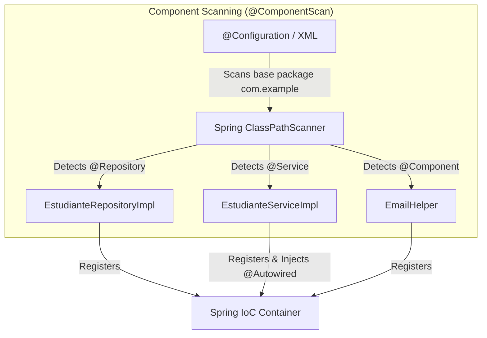
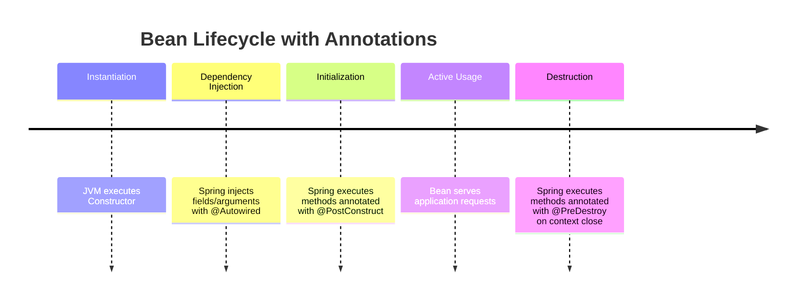

# Transition from XML to Annotations, Stereotypes & Java Config

In Week 2, we learned to configure the **Spring IoC Container** by declaring beans in XML files (`applicationContext.xml`), explicitly defining their dependencies, and managing their scopes and lifecycle methods with `init-method` and `destroy-method` attributes.

Although XML decouples configuration from Java source code, maintaining gigantic XML files in modern projects becomes complex and prone to typographical errors. In this first session of Week 3, we will make the **transition from XML to Annotations and Java Config**, demonstrating how to achieve the same level of control (or higher) with less verbosity and greater compile-time safety.

---

## 1. From XML to Automatic Component Detection

In the XML approach, we defined each class as a bean using the `<bean>` tag:

```xml title="applicationContext.xml (Traditional XML Approach)" showLineNumbers
<!-- Manual bean registration in XML -->
<bean id="estudianteRepository" class="com.example.repository.EstudianteRepositoryImpl" />

<bean id="estudianteService" class="com.example.service.EstudianteServiceImpl">
    <constructor-arg ref="estudianteRepository" />
</bean>
```

With modern Spring annotations, we instruct the framework to automatically scan Java packages for classes marked with **Stereotype Annotations** via **Component Scanning**.



---

## 2. Stereotype Annotations (`@Component`, `@Service`, `@Repository`, `@Controller`)

In Spring, `@Component` is the generic annotation indicating that a Java class is a Spring Bean managed by the IoC container. However, for clean architecture and enterprise best practices, Spring provides **specialized subtypes (stereotypes)** that grant semantic meaning and additional behaviors to each layer:

| Stereotype Annotation | Architecture Layer | Purpose & Special Behaviors |
| :--- | :--- | :--- |
| `@Component` | General / Utility Layer | Generic marker for any Spring-managed component (helpers, external clients, converters). |
| `@Repository` | Persistence Layer (Data Access) | Indicates data access handling. **Automatically translates DB exceptions** (such as `SQLException`) to Spring's `DataAccessException` hierarchy. |
| `@Service` | Business / Service Layer | Holds business logic, validations, and transaction orchestration. |
| `@Controller` / `@RestController` | Presentation / Web Layer | Processes HTTP requests in web applications (MVC or REST APIs). |

### Example: Converting Classes to Stereotypes

```java title="src/main/java/com/example/repository/EstudianteRepositoryImpl.java" showLineNumbers
package com.example.repository;

import org.springframework.stereotype.Repository;

// @Repository registers the class as a bean and enables persistence exception translation
@Repository
public class EstudianteRepositoryImpl implements EstudianteRepository {
    
    public String findNombreEstudiante() {
        return "Juan Pérez";
    }
}
```

```java title="src/main/java/com/example/service/EstudianteServiceImpl.java" showLineNumbers
package com.example.service;

import com.example.repository.EstudianteRepository;
import org.springframework.beans.factory.annotation.Autowired;
import org.springframework.stereotype.Service;

// @Service indicates that this class contains business logic
@Service
public class EstudianteServiceImpl implements EstudianteService {

    private final EstudianteRepository estudianteRepository;

    // @Autowired performs automatic constructor injection
    @Autowired
    public EstudianteServiceImpl(EstudianteRepository estudianteRepository) {
        this.estudianteRepository = estudianteRepository;
    }

    public String obtenerDetalle() {
        return estudianteRepository.findNombreEstudiante();
    }
}
```

:::tip[Constructor vs Field Injection]
Although you can place `@Autowired` directly over fields (`@Autowired private EstudianteRepository repo;`), **enterprise best practice is constructor injection** declaring fields as `final`. This facilitates unit testing with JUnit/Mockito without booting the Spring context.
:::

---

## 3. Scopes & Lifecycle with Annotations

In Week 2, we configured `scope="prototype"` and `init-method` / `destroy-method` attributes in XML. With annotations, this control is achieved directly in Java class code.

### A. Defining Scope (`@Scope`)

By default, every bean marked with `@Component` or its stereotypes has a **Singleton** scope. If we need a new instance every time a bean is requested, we use `@Scope("prototype")`:

```java title="src/main/java/com/example/model/CarritoCompras.java" showLineNumbers
package com.example.model;

import org.springframework.context.annotation.Scope;
import org.springframework.stereotype.Component;

@Component
@Scope("prototype") // Creates a new instance per lookup / injection
public class CarritoCompras {
    // State specific to current session/user
}
```

### B. Lifecycle Hooks with `@PostConstruct` & `@PreDestroy`

Instead of registering text strings in XML (`init-method="init" destroy-method="cleanup"`), we use standard Jakarta annotations (`jakarta.annotation`):

* **`@PostConstruct`**: Executes immediately **after** Spring instantiates the bean and injects all `@Autowired` dependencies. Ideal for loading caches, opening connections, or validating initial configurations.
* **`@PreDestroy`**: Executes **just before** the IoC container destroys the bean (when stopping the application or closing context). Ideal for closing socket connections, releasing threads, or persisting temporary state.

```java title="src/main/java/com/example/service/ConexionService.java" showLineNumbers
package com.example.service;

import jakarta.annotation.PostConstruct;
import jakarta.annotation.PreDestroy;
import org.springframework.stereotype.Service;

@Service
public class ConexionService {

    public ConexionService() {
        System.out.println("1. Constructor: Object instantiated by JVM.");
    }

    @PostConstruct
    public void init() {
        System.out.println("2. @PostConstruct: Dependencies injected. Initializing resources or connections...");
    }

    @PreDestroy
    public void cleanup() {
        System.out.println("3. @PreDestroy: Container closing. Releasing resources...");
    }
}
```



---

## 4. Replacing XML Completely: Java Configuration (`@Configuration` & `@Bean`)

Despite stereotype annotations, scenarios exist where **we cannot modify source code of a class** (e.g., third-party libraries like database clients or Jackson `ObjectMapper`). For these cases, Spring allows replacing XML files entirely with a Java configuration class annotated with `@Configuration`.

### A. The `@Configuration` Class & `@Bean` Method

* **`@Configuration`**: Instructs Spring that the class contains bean definitions, replacing `applicationContext.xml`.
* **`@Bean`**: Placed over a method inside a `@Configuration` class. The returned value is automatically registered as a Spring Bean within the IoC container.
* **`@ComponentScan`**: Replaces the XML tag `<context:component-scan base-package="..." />`.

```java title="src/main/java/com/example/config/AppConfig.java" showLineNumbers
package com.example.config;

import org.springframework.context.annotation.Bean;
import org.springframework.context.annotation.ComponentScan;
import org.springframework.context.annotation.Configuration;
import org.springframework.context.annotation.Scope;

@Configuration
@ComponentScan(basePackages = "com.example") // Enables automatic scanning of @Component, @Service, etc.
public class AppConfig {

    // Explicit bean registration for third-party library classes
    @Bean
    public String nombreAplicacion() {
        return "DocuKelo Academic Management System";
    }

    // Bean with explicit lifecycle and scope using Java Config
    @Bean(initMethod = "init", destroyMethod = "cleanup")
    @Scope("singleton")
    public ExternalLibraryService externalLibraryService() {
        return new ExternalLibraryService();
    }
}
```

### B. Initializing Context with `AnnotationConfigApplicationContext`

In Week 2, we used `ClassPathXmlApplicationContext("applicationContext.xml")`. Now that XML is eliminated, we instantiate context using `AnnotationConfigApplicationContext` passing the `@Configuration` class:

```java title="src/main/java/com/example/MainApplication.java" showLineNumbers
package com.example;

import com.example.config.AppConfig;
import com.example.service.EstudianteService;
import org.springframework.context.annotation.AnnotationConfigApplicationContext;

public class MainApplication {

    public static void main(String[] args) {
        // 1. Create IoC container using @Configuration class
        AnnotationConfigApplicationContext context = 
                new AnnotationConfigApplicationContext(AppConfig.class);

        // 2. Retrieve Spring-managed bean
        EstudianteService estudianteService = context.getBean(EstudianteService.class);
        
        // 3. Execute service methods
        System.out.println("Result: " + estudianteService.obtenerDetalle());

        // 4. Close context to trigger @PreDestroy methods
        context.close();
    }
}
```

---

## 5. Comparison: XML vs. Annotations vs. Java Config

| Aspect | XML Approach (`applicationContext.xml`) | Annotations Approach (`@Component`) | Java Config Approach (`@Configuration` + `@Bean`) |
| :--- | :--- | :--- | :--- |
| **Config Location** | External XML files. | Directly inside project Java classes. | Separate Java configuration classes. |
| **Scanning & Detection** | Manual (`<bean class="...">`). | Automatic via `@ComponentScan`. | Manual via `@Bean` methods or combined with `@ComponentScan`. |
| **Dependency Injection** | `<property ref="...">` or `<constructor-arg ref="...">`. | `@Autowired` annotation. | Method parameters in `@Bean` methods. |
| **Main Use Cases** | Legacy or maintenance of older systems. | Own project components (Services, Repositories). | Third-party classes, external frameworks, complex beans. |

---

## Self-Assessment

<Quiz id="compu2-sem3-sesion1-quiz">

<Question title="What is the main advantage of using @Repository instead of generic @Component in the data layer?">
  <Option>Allows class to execute automatically as an HTTP Servlet.</Option>
  <Option correct>Activates automatic translation of database-specific exceptions into Spring's DataAccessException hierarchy.</Option>
  <Option>Makes all class methods Prototype scope by default.</Option>
  <Option>Prevents Spring from instantiating the class with new.</Option>
</Question>

<Question title="When exactly does a method annotated with @PostConstruct execute?">
  <Option>Before the class constructor is invoked by the JVM.</Option>
  <Option correct>Immediately after Spring instantiates the class and injects all @Autowired dependencies.</Option>
  <Option>Only when a user sends an HTTP request to the Servlet.</Option>
  <Option>When closing application context with context.close().</Option>
</Question>

<Question title="Which ApplicationContext class should we use to initialize Spring container when removing XML files entirely?">
  <Option>ClassPathXmlApplicationContext</Option>
  <Option>XmlWebApplicationContext</Option>
  <Option correct>AnnotationConfigApplicationContext</Option>
  <Option>FileSystemXmlApplicationContext</Option>
</Question>

<Question title="What is the fundamental difference between defining beans with @Component vs @Configuration + @Bean?">
  <Option>@Component is only for interfaces and @Bean for abstract classes.</Option>
  <Option correct>@Component is used on our own classes with component scanning; @Bean is used in configuration classes for third-party library objects we cannot modify.</Option>
  <Option>@Bean always creates Prototype instances while @Component creates Singleton.</Option>
  <Option>No difference, they are strictly interchangeable.</Option>
</Question>

</Quiz>
