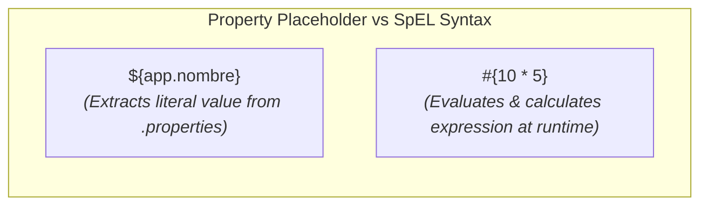

# Advanced Injection, Value Injection & SpEL (Spring Expression Language)

In the previous session, we learned to configure beans using stereotype annotations (`@Component`, `@Service`, `@Repository`), manage their lifecycle with `@PostConstruct` and `@PreDestroy`, and replace XML files with `@Configuration` and `@Bean` classes.

In this second session of Week 3, we address advanced dependency injection and external configuration scenarios:
1. Disambiguation in injection when multiple implementations of an interface exist using `@Qualifier` and `@Primary`.
2. Loading and reading external properties files (`application.properties`) via `@Value` and `@PropertySource`.
3. Dynamic injection and runtime expression evaluation using **SpEL (Spring Expression Language)**.

---

## 1. Ambiguity in Dependency Injection & `@Qualifier`

When injecting dependencies by interface (`@Autowired`), Spring looks inside the container for a bean implementing that interface. However, what happens if we have **two or more classes implementing the same interface**?

### A. The Problem: `NoUniqueBeanDefinitionException`

Consider interface `NotificacionService` with two distinct implementations:

```java title="src/main/java/com/example/service/NotificacionService.java"
package com.example.service;

public interface NotificacionService {
    void enviarMensaje(String mensaje);
}
```

```java title="src/main/java/com/example/service/NotificacionEmailServiceImpl.java"
package com.example.service;

import org.springframework.stereotype.Service;

@Service
public class NotificacionEmailServiceImpl implements NotificacionService {
    public void enviarMensaje(String mensaje) {
        System.out.println("Sending EMAIL: " + mensaje);
    }
}
```

```java title="src/main/java/com/example/service/NotificacionSmsServiceImpl.java"
package com.example.service;

import org.springframework.stereotype.Service;

@Service
public class NotificacionSmsServiceImpl implements NotificacionService {
    public void enviarMensaje(String mensaje) {
        System.out.println("Sending SMS: " + mensaje);
    }
}
```

If we attempt to inject `NotificacionService` without clarification:

```java title="src/main/java/com/example/controller/UsuarioController.java"
@Service
public class UsuarioController {

    private final NotificacionService notificacionService;

    @Autowired
    public UsuarioController(NotificacionService notificacionService) {
        // 🔴 ERROR ON SPRING STARTUP: NoUniqueBeanDefinitionException
        // Spring finds 2 beans implementing NotificacionService and cannot choose.
        this.notificacionService = notificacionService;
    }
}
```

### B. Solution 1: Explicit Selection with `@Qualifier`

The `@Qualifier("beanName")` annotation allows specifying the exact bean name to inject. By default, bean names correspond to camelCase class names:

```java title="src/main/java/com/example/controller/UsuarioController.java" showLineNumbers
package com.example.controller;

import com.example.service.NotificacionService;
import org.springframework.beans.factory.annotation.Autowired;
import org.springframework.beans.factory.annotation.Qualifier;
import org.springframework.stereotype.Service;

@Service
public class UsuarioController {

    private final NotificacionService notificacionService;

    @Autowired
    public UsuarioController(
            @Qualifier("notificacionSmsServiceImpl") NotificacionService notificacionService) {
        // 🟢 CORRECT: Spring explicitly injects SMS implementation
        this.notificacionService = notificacionService;
    }
}
```

Custom bean identifiers can also be declared in `@Service`:

```java
@Service("emailService")
public class NotificacionEmailServiceImpl implements NotificacionService { ... }

// Injection point:
public UsuarioController(@Qualifier("emailService") NotificacionService service) { ... }
```

### C. Solution 2: Default Implementation with `@Primary`

If we want a preferred implementation without writing `@Qualifier` at every injection point, we annotate that class with `@Primary`:

```java title="src/main/java/com/example/service/NotificacionEmailServiceImpl.java" showLineNumbers
package com.example.service;

import org.springframework.context.annotation.Primary;
import org.springframework.stereotype.Service;

@Service
@Primary // 🟢 Tells Spring this is default if ambiguity exists
public class NotificacionEmailServiceImpl implements NotificacionService {
    public void enviarMensaje(String mensaje) {
        System.out.println("Sending priority EMAIL: " + mensaje);
    }
}
```

:::tip[Precedence Rule]
If a class has `@Primary` but a constructor explicitly specifies `@Qualifier("notificacionSmsServiceImpl")`, **`@Qualifier` always takes precedence and overrides `@Primary`**.
:::

---

## 2. External Property Injection with `@Value` & `application.properties`

In enterprise applications, decoupling configuration (ports, credentials, external URLs, secret keys) from compiled Java code is essential.

### A. Creating `application.properties`

Create `application.properties` inside project resources (`src/main/resources/`):

```properties title="src/main/resources/application.properties" showLineNumbers
# General application configuration
app.nombre=DocuKelo Academic Portal
app.version=2.5.0
app.max-usuarios-activos=150

# External services configuration
notificacion.email-remitente=soporte@docukelo.edu.co
notificacion.puerto-smtp=587
notificacion.modo-prueba=true
```

### B. Enabling Property Loading in `@Configuration`

Use `@PropertySource` in configuration class:

```java title="src/main/java/com/example/config/AppConfig.java" showLineNumbers
package com.example.config;

import org.springframework.context.annotation.ComponentScan;
import org.springframework.context.annotation.Configuration;
import org.springframework.context.annotation.PropertySource;

@Configuration
@ComponentScan(basePackages = "com.example")
@PropertySource("classpath:application.properties") // Loads property file from classpath
public class AppConfig {
}
```

### C. Injecting Values with `@Value("${...}")`

Use `${property.name}` syntax inside `@Value` to inject values into bean fields/arguments:

```java title="src/main/java/com/example/service/SistemaConfigService.java" showLineNumbers
package com.example.service;

import org.springframework.beans.factory.annotation.Value;
import org.springframework.stereotype.Service;

@Service
public class SistemaConfigService {

    // String injection
    @Value("${app.nombre}")
    private String nombreApp;

    // Automatic type conversion to integer
    @Value("${app.max-usuarios-activos}")
    private int maxUsuarios;

    // Automatic type conversion to boolean
    @Value("${notificacion.modo-prueba}")
    private boolean modoPrueba;

    // Injection with DEFAULT VALUE if property does not exist
    @Value("${app.timeout:3000}") 
    private int timeout; // Assigns 3000 if app.timeout is missing

    public void mostrarConfiguracion() {
        System.out.println("Application: " + nombreApp);
        System.out.println("User Limit: " + maxUsuarios);
        System.out.println("Test Mode: " + modoPrueba);
        System.out.println("Timeout: " + timeout + " ms");
    }
}
```

---

## 3. Spring Expression Language: SpEL (`#{...}`)

While `${...}` syntax is strictly for **extracting configuration file properties**, **SpEL (Spring Expression Language)** uses **`#{...}`** syntax to **evaluate complex expressions, invoke methods, perform mathematical operations, and manipulate collections at runtime**.



### A. Mathematical & Logical Operations with SpEL

Perform calculations directly inside `@Value`:

```java title="src/main/java/com/example/service/CalculoSpELService.java" showLineNumbers
package com.example.service;

import org.springframework.beans.factory.annotation.Value;
import org.springframework.stereotype.Service;

@Service
public class CalculoSpELService {

    // Direct mathematical operation
    @Value("#{10 * 5 + 20}")
    private int calculoMatematico; // Assigns 70

    // Logical comparison (Returns true/false)
    @Value("#{sistemaConfigService.maxUsuarios > 100}")
    private boolean esGranEscala;

    // String concatenation & methods
    @Value("#{'DocuKelo'.toUpperCase() + ' - VERSION ' + 2.5}")
    private String tituloFormateado;

    // Ternary operator
    @Value("${notificacion.modo-prueba ? 'DEV_ENV' : 'PROD_ENV'}")
    private String tipoEntorno;
}
```

### B. Referencing Other Beans with SpEL

SpEL accesses IoC container beans by name and invokes their methods:

```java title="src/main/java/com/example/service/ProcesadorService.java" showLineNumbers
package com.example.service;

import org.springframework.beans.factory.annotation.Value;
import org.springframework.stereotype.Service;

@Service
public class ProcesadorService {

    // Injects result of invoking method on another bean
    @Value("#{sistemaConfigService.obtenerDetalleFormateado()}")
    private String detalleSistema;

    // Invokes static methods on standard Java classes using T(...)
    @Value("#{T(java.lang.Math).PI}")
    private double valorPi;

    @Value("#{T(java.lang.Math).random() * 100}")
    private double numeroAleatorio;
}
```

### C. Common SpEL Operations Summary (`#{...}`)

| Category | SpEL Expression Example | Result / Description |
| :--- | :--- | :--- |
| **Literal / Math** | `#{100 / 4 + 5}` | Evaluates operation and assigns `30`. |
| **Relational / Logical** | `#{50 > 20 and 10 == 10}` | Evaluates boolean condition (`true`). |
| **Bean Method Call** | `#{estudianteService.getNombre()}` | Calls `getNombre()` on `estudianteService` bean. |
| **Java Static Class** | `#{T(java.lang.Math).abs(-45)}` | Uses `T(...)` syntax for static methods/constants (`45`). |
| **Ternary Operator** | `#{estudiante.promedio >= 3.0 ? 'Passed' : 'Failed'}` | Assigns result based on condition. |
| **Combined with ${}** | `#{${app.max-usuarios-activos} * 2}` | Reads `.properties` value and multiplies by `2`. |

---

## 4. Integrator Practical Example

Combining `@Qualifier`, `@Value`, `application.properties`, and `SpEL` in an audit component:

```java title="src/main/java/com/example/component/AuditoriaComponent.java" showLineNumbers
package com.example.component;

import com.example.service.NotificacionService;
import org.springframework.beans.factory.annotation.Autowired;
import org.springframework.beans.factory.annotation.Qualifier;
import org.springframework.beans.factory.annotation.Value;
import org.springframework.stereotype.Component;

@Component
public class AuditoriaComponent {

    private final NotificacionService notificacionService;

    // Property injection with default
    @Value("${app.nombre:Academic Portal}")
    private String nombreApp;

    // SpEL Evaluation: Generates unique session ID at initialization
    @Value("#{'SESSION-' + T(java.util.UUID).randomUUID().toString().substring(0, 8)}")
    private String sessionId;

    @Autowired
    public AuditoriaComponent(
            @Qualifier("notificacionEmailServiceImpl") NotificacionService notificacionService) {
        this.notificacionService = notificacionService;
    }

    public void ejecutarAuditoria() {
        System.out.println("Starting audit in: " + nombreApp);
        System.out.println("Session ID Generated by SpEL: " + sessionId);
        notificacionService.enviarMensaje("Audit completed successfully.");
    }
}
```

---

## Self-Assessment

<Quiz id="compu2-sem3-sesion2-quiz">

<Question title="Which exception is thrown by Spring when attempting interface injection with @Autowired when two beans implement that interface without disambiguation?">
  <Option>NullPointerException</Option>
  <Option correct>NoUniqueBeanDefinitionException</Option>
  <Option>BeanCreationException</Option>
  <Option>ClassNotFoundException</Option>
</Question>

<Question title="If a class has @Primary and the injection point specifies @Qualifier('otherBean'), which bean will Spring select?">
  <Option>Throws a dependency conflict exception.</Option>
  <Option>Selects the bean marked @Primary ignoring @Qualifier.</Option>
  <Option correct>Selects the bean specified in @Qualifier, because @Qualifier has higher priority and overrides @Primary.</Option>
  <Option>Selects a random bean between the two.</Option>
</Question>

<Question title="What is the syntax difference between extracting an application.properties property vs evaluating a SpEL expression?">
  <Option>Properties use #{...} and SpEL uses ${...}.</Option>
  <Option correct>Properties use ${...} and SpEL uses #{...}.</Option>
  <Option>Both use ${...}.</Option>
  <Option>SpEL can only be used in XML files.</Option>
</Question>

<Question title="How do you invoke a static method or constant from a native Java class (like java.lang.Math) in a SpEL expression inside @Value?">
  <Option>`@Value("#{java.lang.Math.PI}")`</Option>
  <Option correct>`@Value("#{T(java.lang.Math).PI}")` using `T(...)` syntax</Option>
  <Option>`@Value("${Math.PI}")`</Option>
  <Option>`@Value("#{Static.java.lang.Math.PI}")`</Option>
</Question>

</Quiz>
