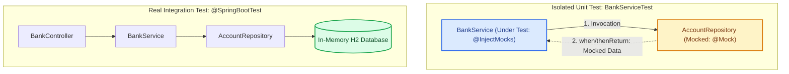

# Unit and Integration Testing with JUnit 5 and Mockito

Ensuring quality and reliability in backend architectures requires validating that individual units fulfill their contracts and that layer integration functions seamlessly. In the **Spring Boot** ecosystem, the standard testing stack combines **JUnit 5 (Jupiter)** as the testing framework with **Mockito** for dependency mocking.

---

## 1. Concepts and Theoretical Foundations

### Unit Testing vs. Integration Testing

| Criterion | Unit Testing | Integration Testing |
| :--- | :--- | :--- |
| **Scope** | Single service class or method in complete isolation. | Multiple layers (Controller + Service + Repository + DB). |
| **Spring Context** | No `ApplicationContext` loaded (instant execution). | Loads full Spring context (`@SpringBootTest`). |
| **Dependencies** | Substituted with mock objects (`@Mock`). | Real beans injected or in-memory DB used (H2/Testcontainers). |
| **Speed** | Tens of tests per second (< 100 ms). | Seconds per test suite due to context bootstrapping. |
| **Objective** | Business logic, edge branches, and exception paths. | Transactions, JPA mappings, SQL queries, and configuration. |

### Layer Architecture and Mockito Isolation



#### Diagram Component Overview

1. **`@Mock` (Simulated Dependency)**: Instantiates a mock representation of `AccountRepository`. It does not execute underlying database code; it responds strictly with stubs programmed via `when(...)`.
2. **`@InjectMocks` (Target Under Test)**: Instantiates `BankService` and automatically injects all declared `@Mock` fields.
3. **Integration Context**: Bootstraps the real Spring container, executing real SQL statements against an in-memory test database while verifying transactional boundaries.

### Arrange - Act - Assert (AAA) Pattern

Well-structured unit tests follow three clear steps:
- **Arrange**: Set up test fixtures and define mock expectations (`when(...).thenReturn(...)`).
- **Act**: Execute the specific method under test.
- **Assert**: Validate outputs (`assertEquals`, `assertTrue`) and verify mock interactions (`verify(...)`).

---

## 2. Practical Guide: Step-by-Step

<StepByStep>
  <Step number="1" title="Verify Dependencies in pom.xml">
    The `spring-boot-starter-test` artifact automatically bundles JUnit 5, Mockito, AssertJ, and Spring Test.

```xml title="pom.xml" showLineNumbers
<dependencies>
    <!-- Includes JUnit 5, Mockito, and Spring Test -->
    <dependency>
        <groupId>org.springframework.boot</groupId>
        <artifactId>spring-boot-starter-test</artifactId>
        <scope>test</scope>
    </dependency>

    <!-- In-memory database for integration tests -->
    <dependency>
        <groupId>com.h2database</groupId>
        <artifactId>h2</artifactId>
        <scope>test</scope>
    </dependency>
</dependencies>
```
  </Step>

  <Step number="2" title="Implement the Service Class Under Test">
    Constructor injection facilitates passing mock dependencies without reflection overhead.

```java title="src/main/java/com/icesi/service/BankService.java" showLineNumbers
package com.icesi.service;

import com.icesi.model.Account;
import com.icesi.repository.AccountRepository;
import org.springframework.stereotype.Service;

import java.util.Optional;

@Service
public class BankService {

    private final AccountRepository accountRepository;

    public BankService(AccountRepository accountRepository) {
        this.accountRepository = accountRepository;
    }

    /**
     * Transfers funds between accounts.
     * @return true if successful, false if balance is insufficient
     */
    public boolean transfer(Long fromId, Long toId, double amount) {
        if (amount <= 0) {
            throw new IllegalArgumentException("Transfer amount must be positive");
        }

        Account from = accountRepository.findById(fromId)
                .orElseThrow(() -> new IllegalArgumentException("Source account not found"));
        Account to = accountRepository.findById(toId)
                .orElseThrow(() -> new IllegalArgumentException("Destination account not found"));

        if (from.getBalance() < amount) {
            return false;
        }

        from.setBalance(from.getBalance() - amount);
        to.setBalance(to.getBalance() + amount);

        accountRepository.save(from);
        accountRepository.save(to);
        return true;
    }
}
```
  </Step>

  <Step number="3" title="Write Unit Tests with Mockito">
    Annotate the class with `@ExtendWith(MockitoExtension.class)`. Avoid loading Spring context annotations to keep tests instantaneous.

```java title="src/test/java/com/icesi/service/BankServiceTest.java" showLineNumbers
package com.icesi.service;

import com.icesi.model.Account;
import com.icesi.repository.AccountRepository;
import org.junit.jupiter.api.DisplayName;
import org.junit.jupiter.api.Test;
import org.junit.jupiter.api.extension.ExtendWith;
import org.mockito.InjectMocks;
import org.mockito.Mock;
import org.mockito.junit.jupiter.MockitoExtension;

import java.util.Optional;

import static org.junit.jupiter.api.Assertions.*;
import static org.mockito.Mockito.*;

@ExtendWith(MockitoExtension.class)
class BankServiceTest {

    @Mock
    private AccountRepository accountRepository;

    @InjectMocks
    private BankService bankService;

    @Test
    @DisplayName("Should transfer funds successfully when balance is sufficient")
    void shouldTransferFundsSuccessfully() {
        // 1. Arrange
        Account sourceAccount = new Account(1L, "Carol", 100.0);
        Account destinationAccount = new Account(2L, "Juan", 50.0);

        when(accountRepository.findById(1L)).thenReturn(Optional.of(sourceAccount));
        when(accountRepository.findById(2L)).thenReturn(Optional.of(destinationAccount));

        // 2. Act
        boolean result = bankService.transfer(1L, 2L, 30.0);

        // 3. Assert
        assertTrue(result);
        assertEquals(70.0, sourceAccount.getBalance());
        assertEquals(80.0, destinationAccount.getBalance());

        verify(accountRepository, times(1)).save(sourceAccount);
        verify(accountRepository, times(1)).save(destinationAccount);
    }

    @Test
    @DisplayName("Should return false and skip saving when balance is insufficient")
    void shouldReturnFalseWhenInsufficientBalance() {
        // Arrange
        Account sourceAccount = new Account(1L, "Carol", 20.0);
        Account destinationAccount = new Account(2L, "Juan", 50.0);

        when(accountRepository.findById(1L)).thenReturn(Optional.of(sourceAccount));
        when(accountRepository.findById(2L)).thenReturn(Optional.of(destinationAccount));

        // Act
        boolean result = bankService.transfer(1L, 2L, 100.0);

        // Assert
        assertFalse(result);
        assertEquals(20.0, sourceAccount.getBalance());
        verify(accountRepository, never()).save(any(Account.class));
    }

    @Test
    @DisplayName("Should throw IllegalArgumentException when amount is negative")
    void shouldThrowExceptionWhenAmountIsNegative() {
        assertThrows(IllegalArgumentException.class, () -> {
            bankService.transfer(1L, 2L, -10.0);
        });

        verifyNoInteractions(accountRepository);
    }
}
```
  </Step>

  <Step number="4" title="Configure an Isolated Test Profile">
    Create a separate properties configuration to avoid modifying local development or production databases.

```properties title="src/test/resources/application-test.properties" showLineNumbers
# In-memory H2 database
spring.datasource.url=jdbc:h2:mem:testdb;DB_CLOSE_DELAY=-1
spring.datasource.driverClassName=org.h2.Driver
spring.datasource.username=sa
spring.datasource.password=

# Hibernate schema auto-generation
spring.jpa.database-platform=org.hibernate.dialect.H2Dialect
spring.jpa.hibernate.ddl-auto=create-drop
spring.jpa.show-sql=true
```
  </Step>

  <Step number="5" title="Write Integration Tests with @SpringBootTest">
    Use `@SpringBootTest` alongside `@ActiveProfiles("test")` for end-to-end database testing.

```java title="src/test/java/com/icesi/integration/AccountRepositoryIntegrationTest.java" showLineNumbers
package com.icesi.integration;

import com.icesi.model.Account;
import com.icesi.repository.AccountRepository;
import org.junit.jupiter.api.DisplayName;
import org.junit.jupiter.api.Test;
import org.springframework.beans.factory.annotation.Autowired;
import org.springframework.boot.test.context.SpringBootTest;
import org.springframework.test.context.ActiveProfiles;
import org.springframework.transaction.annotation.Transactional;

import java.util.Optional;

import static org.junit.jupiter.api.Assertions.*;

@SpringBootTest
@ActiveProfiles("test")
@Transactional
class AccountRepositoryIntegrationTest {

    @Autowired
    private AccountRepository accountRepository;

    @Test
    @DisplayName("Should persist and retrieve account in H2 database")
    void shouldPersistAndRetrieveAccount() {
        Account account = new Account(null, "Diana", 450.0);

        Account saved = accountRepository.save(account);
        assertNotNull(saved.getId());

        Optional<Account> retrieved = accountRepository.findById(saved.getId());
        assertTrue(retrieved.isPresent());
        assertEquals("Diana", retrieved.get().getOwnerName());
        assertEquals(450.0, retrieved.get().getBalance());
    }
}
```
  </Step>

  <Step number="6" title="Execute Tests from the Terminal or IDE">
    Use the Maven Wrapper (`mvnw` or `mvnw.cmd`) to run test suites cleanly across any development environment.

<Tabs>
  <TabItem value="wrapper-win" label="Windows (PowerShell / CMD)" default>

```powershell title="Execute all project tests"
# Run all unit and integration tests
.\mvnw.cmd test

# Run a specific test class
.\mvnw.cmd test -Dtest=BankServiceTest

# Run a single test method
.\mvnw.cmd test -Dtest=BankServiceTest#shouldTransferFundsSuccessfully

# Package while skipping tests
.\mvnw.cmd package -DskipTests
```

  </TabItem>
  <TabItem value="wrapper-unix" label="macOS & Linux (Bash / Zsh)">

```bash title="Execute all project tests"
# Ensure executable permissions on Unix systems
chmod +x mvnw

# Run all test suites
./mvnw test

# Run a specific test class
./mvnw test -Dtest=BankServiceTest

# Run a single test method
./mvnw test -Dtest=BankServiceTest#shouldTransferFundsSuccessfully

# Package while skipping tests
./mvnw package -DskipTests
```

  </TabItem>
  <TabItem value="ide" label="From IDE (IntelliJ IDEA / VS Code)">

**IntelliJ IDEA:**
Click the green run arrow next to the test class or method declaration (`Ctrl + Shift + F10` on Windows, `Ctrl + Shift + R` on macOS).

**VS Code:**
Install the **Extension Pack for Java** and **Test Runner for Java**. Click "Run Test" or "Debug Test" buttons displayed directly above each `@Test` method.

**Test Reports:**
Maven outputs comprehensive Surefire XML/text reports into the `target/surefire-reports/` folder.

  </TabItem>
</Tabs>

:::tip[Why use the Maven Wrapper (mvnw)?]
The `mvnw` wrapper guarantees that all developers and automated CI/CD runners execute tests against identical Maven versions without requiring prior system-level installation.
:::
  </Step>
</StepByStep>

---

## 3. Reference Cheatsheet: JUnit 5 and Mockito

### Key JUnit 5 Assertions

| Assertion | Purpose | Example |
| :--- | :--- | :--- |
| `assertEquals(expected, actual)` | Verifies exact value equality. | `assertEquals(100.0, account.getBalance());` |
| `assertTrue(condition)` | Checks that boolean expression evaluates to true. | `assertTrue(result);` |
| `assertFalse(condition)` | Checks that boolean expression evaluates to false. | `assertFalse(isBlocked);` |
| `assertNull(obj)` / `assertNotNull(obj)` | Validates nullability of an object reference. | `assertNotNull(saved.getId());` |
| `assertThrows(Class, Executable)` | Confirms executable block throws expected exception. | `assertThrows(IllegalArgumentException.class, () -> service.pay(-5));` |
| `assertAll(Executables...)` | Executes grouped assertions and reports all failures together. | `assertAll(() -> assertTrue(a), () -> assertEquals(2, b));` |

### Key Mockito Methods

| Method | Purpose | Example |
| :--- | :--- | :--- |
| `when(mock.m()).thenReturn(v)` | Configures stubbed return value. | `when(repo.findById(1L)).thenReturn(Optional.of(acc));` |
| `when(mock.m()).thenThrow(ex)` | Stubs mock call to throw exception. | `when(repo.save(any())).thenThrow(new RuntimeException());` |
| `verify(mock, times(n)).m()` | Verifies method was invoked `n` times. | `verify(repo, times(1)).save(acc);` |
| `verify(mock, never()).m()` | Confirms method was never invoked. | `verify(repo, never()).delete(any());` |
| `verifyNoInteractions(mock)` | Confirms zero interactions occurred with the mock. | `verifyNoInteractions(repo);` |
| `any(Class)` | Matcher accepting any argument of specified type. | `verify(repo).save(any(Account.class));` |

---

## 4. Self-Assessment Quiz

<Quiz id="comp2-semana6-pruebas-mockito-quiz-en">
  <Question title="What is the primary difference between a unit test and an integration test in Spring Boot?">
    <Option>Unit tests can only execute on Linux environments.</Option>
    <Option correct>Unit tests isolate logic without bootstrapping Spring ApplicationContext, whereas integration tests load the context and dependencies.</Option>
    <Option>Integration tests never communicate with repositories or databases.</Option>
    <Option>Unit tests strictly require the @SpringBootTest annotation.</Option>
  </Question>
  <Question title="Which JUnit 5 extension enables @Mock and @InjectMocks annotations in a test class?">
    <Option>@EnableAutoConfiguration</Option>
    <Option>@SpringBootTest</Option>
    <Option correct>@ExtendWith(MockitoExtension.class)</Option>
    <Option>@ContextConfiguration</Option>
  </Question>
  <Question title="What is the exact purpose of @InjectMocks in a unit test?">
    <Option>To simulate a relational database engine.</Option>
    <Option correct>To instantiate the class under test and inject all declared @Mock dependencies into it.</Option>
    <Option>To expose the test method as a callable HTTP endpoint.</Option>
    <Option>To disable JUnit 5 assertions during execution.</Option>
  </Question>
  <Question title="In the AAA (Arrange - Act - Assert) testing pattern, what takes place during the 'Arrange' phase?">
    <Option>Invoking the target service method being tested.</Option>
    <Option correct>Setting up test fixtures and configuring mock responses using when(...).thenReturn(...).</Option>
    <Option>Validating return values using assertEquals.</Option>
    <Option>Compiling the repository using the ./mvnw test command.</Option>
  </Question>
  <Question title="Which Mockito verification verifies that a repository method was NEVER called during test execution?">
    <Option>verify(repo, times(1))</Option>
    <Option>verify(repo, atLeastOnce())</Option>
    <Option correct>verify(repo, never()).method()</Option>
    <Option>verifyZeroCalls(repo)</Option>
  </Question>
  <Question title="Why is @ActiveProfiles('test') used in integration test classes?">
    <Option>To run tests exclusively under user accounts with Administrator roles.</Option>
    <Option correct>To instruct Spring to load configuration from application-test.properties (e.g., an in-memory H2 database).</Option>
    <Option>To ignore compiler errors during artifact packaging.</Option>
    <Option>To enable autocommit flags in production databases.</Option>
  </Question>
  <Question title="Which assertion method in JUnit 5 executes multiple assertions together and reports all failures at once?">
    <Option>assertGroup()</Option>
    <Option correct>assertAll()</Option>
    <Option>assertMany()</Option>
    <Option>assertBatch()</Option>
  </Question>
  <Question title="What is the advantage of using Maven Wrapper (mvnw or mvnw.cmd) for running tests?">
    <Option>It doubles processor frequency during bytecode compilation.</Option>
    <Option correct>It ensures all team members and CI/CD pipelines run the exact same Maven version without requiring prior local installation.</Option>
    <Option>It removes the requirement of having a JDK installed.</Option>
    <Option>It converts Java code directly into Python bytecode.</Option>
  </Question>
  <Question title="Which Maven Wrapper command executes only a specific test class like BankServiceTest?">
    <Option>./mvnw test --class BankServiceTest</Option>
    <Option correct>./mvnw test -Dtest=BankServiceTest</Option>
    <Option>./mvnw run:BankServiceTest</Option>
    <Option>./mvnw test -only BankServiceTest</Option>
  </Question>
  <Question title="Which assertion verifies that a method throws an expected exception when invalid inputs are provided?">
    <Option>assertException()</Option>
    <Option correct>assertThrows()</Option>
    <Option>assertFail()</Option>
    <Option>assertError()</Option>
  </Question>
</Quiz>
