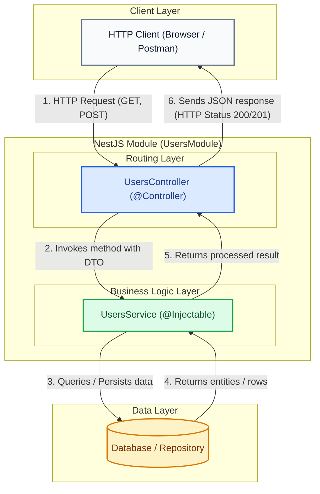

# First Steps with NestJS

NestJS structures backend applications using a modular architecture inspired by enterprise-grade patterns. In this hands-on guide, you will learn how to install the CLI, bootstrap a new project, understand its internal layout, and build your own modules, controllers, and services.

---

## 1. Architecture and Component Fundamentals

Before generating code or scaffolding with the CLI, it is essential to understand how core components interact within a NestJS module:



### Main Components Overview:

* **Module (`@Module`)**: The fundamental organizational unit in NestJS. It bundles cohesive controllers and providers (services), establishing clear encapsulation boundaries for a scalable modular system.
* **Controller (`@Controller`)**: Responsible for handling incoming HTTP requests on specified route paths (such as `/users`), unpacking parameters or request body payloads, and delegating execution to the appropriate service method.
* **Service (`@Injectable`)**: Contains pure business logic (calculations, transformations, database calls, or external API communication). Services are decorated with `@Injectable()` so they can be injected automatically by NestJS's IoC container.

---

## 2. Step-by-Step Hands-On Guide

<StepByStep>

<Step number="1" title="Global NestJS CLI Installation">
The NestJS Command Line Interface (CLI) automates project bootstrapping and component generation according to architectural best practices.

```bash title="Terminal"
npm install -g @nestjs/cli
```

:::tip[Why Use the CLI]
The CLI prevents manual configuration of TypeScript, Webpack/SWC, ESLint, and Jest, maintaining a clean and standardized structure across projects.
:::
</Step>

<Step number="2" title="Bootstrapping the Base Project">
Run the `nest new` command to scaffold a new project named `my-nest-app`:

```bash title="Terminal"
nest new my-nest-app
```

During execution, the CLI will ask which package manager you prefer. Select `npm` (or `yarn` / `pnpm` depending on your setup).
</Step>

<Step number="3" title="Inspecting Project Anatomy">
Navigate into the newly created directory and inspect the generated files:

```bash title="Terminal"
cd my-nest-app
```

The resulting folder structure is organized as follows:

```text title="File Structure"
my-nest-app/
├── src/
│   ├── app.controller.spec.ts  # Unit tests for root controller
│   ├── app.controller.ts       # Base controller with test endpoint ('/')
│   ├── app.module.ts           # Root module of the application
│   ├── app.service.ts          # Base service with simple methods
│   └── main.ts                 # Application entry point (starts HTTP server)
├── test/
│   └── app.e2e-spec.ts         # End-to-end test suite
├── nest-cli.json               # NestJS CLI configuration
├── package.json                # Dependencies and npm scripts
└── tsconfig.json               # TypeScript compiler options
```

Core files in `src/`:
- **`main.ts`**: Uses `NestFactory.create(AppModule)` to instantiate the app and bind the server to port 3000 by default.
- **`app.module.ts`**: The root module that mounts the application and registers base providers and controllers.
- **`app.controller.ts`**: Contains sample HTTP route handlers (e.g., `GET /`).
- **`app.service.ts`**: Returns sample responses (such as `"Hello World!"`).
</Step>

<Step number="4" title="Running the App in Development Mode">
Start the local server in watch mode so that file changes are automatically detected and reloaded:

```bash title="Terminal"
npm run start:dev
```

Open your browser at `http://localhost:3000` to verify that the application responds correctly.

:::info[Changing Port in main.ts]
If port 3000 is occupied on your machine, you can change it in `src/main.ts`:

```typescript title="src/main.ts" showLineNumbers
import { NestFactory } from '@nestjs/core';
import { AppModule } from './app.module';

async function bootstrap() {
  // Instantiate NestJS application using root module
  const app = await NestFactory.create(AppModule);

  // Define HTTP listen port (e.g., 3001)
  await app.listen(3001);
}
bootstrap();
```
:::
</Step>

<Step number="5" title="Generating Modules with the CLI">
To build an isolated feature (such as user management), it is recommended to generate its three architectural layers: Module, Controller, and Service.

Open a new terminal tab and run:

<Tabs>
  <TabItem value="step-by-step-cmds" label="Individual Commands" default>
    ```bash title="Terminal"
    # 1. Generate users module
    nest generate module users

    # 2. Generate users controller
    nest generate controller users

    # 3. Generate users service
    nest generate service users
    ```
  </TabItem>
  <TabItem value="resource-cmd" label="All-In-One Command (CRUD Resource)">
    ```bash title="Terminal"
    # Generates full users resource (Module, Controller, Service, DTOs, Entities)
    nest generate resource users
    ```
  </TabItem>
</Tabs>

:::tip[CLI Shortcuts]
You can use shorthand aliases in your terminal: `nest g mo users`, `nest g co users`, and `nest g s users`.
:::
</Step>

<Step number="6" title="Implementing Users Feature Logic">
Inspect the code generated under `src/users/` and implement the basic inter-layer communication:

```typescript title="src/users/users.service.ts" showLineNumbers
import { Injectable } from '@nestjs/common';

// Decorator marking the class as injectable by the NestJS IoC container
@Injectable()
export class UsersService {
  // In-memory array simulating a data source
  private users = [
    { id: 1, name: 'Alice', email: 'alice@icesi.edu.co' },
    { id: 2, name: 'Bob', email: 'bob@icesi.edu.co' },
  ];

  // Return all registered users
  findAll() {
    return this.users;
  }

  // Return a specific user by ID
  findOne(id: number) {
    return this.users.find((user) => user.id === id);
  }
}
```

```typescript title="src/users/users.controller.ts" showLineNumbers
import { Controller, Get, Param } from '@nestjs/common';
import { UsersService } from './users.service';

// Decorator setting the base route path '/users' for this controller
@Controller('users')
export class UsersController {
  // Dependency injection: Nest automatically injects UsersService
  constructor(private readonly usersService: UsersService) {}

  // Handles HTTP GET to '/users'
  @Get()
  getAllUsers() {
    return this.usersService.findAll();
  }

  // Handles HTTP GET to '/users/:id'
  @Get(':id')
  getUserById(@Param('id') id: string) {
    // Cast route param string to number before passing to service
    return this.usersService.findOne(Number(id));
  }
}
```

```typescript title="src/users/users.module.ts" showLineNumbers
import { Module } from '@nestjs/common';
import { UsersController } from './users.controller';
import { UsersService } from './users.service';

// Decorator registering controllers and providers of this module
@Module({
  controllers: [UsersController],
  providers: [UsersService],
})
export class UsersModule {}
```
</Step>

</StepByStep>

---

## 3. Self-Assessment Quiz

<Quiz id="compu3-nest-first-steps-quiz">
  <Question title="What is the purpose of the global command 'npm install -g @nestjs/cli'?">
    <Option>Install the PostgreSQL database locally on the operating system.</Option>
    <Option correct>Install the NestJS CLI tool to automate project scaffolding and code generation.</Option>
    <Option>Directly compile TypeScript files into C++ binary executables.</Option>
    <Option>Create an Nginx reverse proxy preconfigured with SSL certificates.</Option>
  </Question>
  <Question title="Which CLI command bootstraps a new NestJS project named 'my-app'?">
    <Option>nest create my-app</Option>
    <Option>npm init nest-app my-app</Option>
    <Option correct>nest new my-app</Option>
    <Option>nest start my-app --init</Option>
  </Question>
  <Question title="Which file inside 'src/' serves as the entry point that initializes the HTTP server?">
    <Option>src/app.module.ts</Option>
    <Option correct>src/main.ts</Option>
    <Option>src/app.controller.ts</Option>
    <Option>src/nest-cli.json</Option>
  </Question>
  <Question title="What does the 'npm run start:dev' script do in a NestJS project?">
    <Option>Runs production Docker containers.</Option>
    <Option correct>Starts the application in development mode with automatic hot-reloading on code changes.</Option>
    <Option>Compiles the application for production without starting the server.</Option>
    <Option>Exclusively executes end-to-end integration tests.</Option>
  </Question>
  <Question title="Which decorator must be added to a service class for NestJS to inject it via Dependency Injection?">
    <Option>@Controller()</Option>
    <Option>@Module()</Option>
    <Option correct>@Injectable()</Option>
    <Option>@Entity()</Option>
  </Question>
  <Question title="What is the shorthand CLI command to generate a users module?">
    <Option>nest g m users</Option>
    <Option correct>nest g mo users</Option>
    <Option>nest make module users</Option>
    <Option>nest add module users</Option>
  </Question>
  <Question title="How is a service (UsersService) injected into a controller (UsersController)?">
    <Option>By importing it statically inside the HTTP route handler method.</Option>
    <Option correct>By declaring a private readonly parameter in the controller constructor.</Option>
    <Option>By reading from the global variable process.env.SERVICE.</Option>
    <Option>Using the @InjectService() decorator above the class declaration.</Option>
  </Question>
  <Question title="Which CLI command generates a complete CRUD resource (Module, Controller, Service, DTOs) in one step?">
    <Option>nest generate crud users</Option>
    <Option correct>nest generate resource users</Option>
    <Option>nest generate api users</Option>
    <Option>nest build resource users</Option>
  </Question>
  <Question title="Which decorator defines the base HTTP route path handled by a controller class?">
    <Option>@Route()</Option>
    <Option>@Endpoint()</Option>
    <Option correct>@Controller('path')</Option>
    <Option>@Path()</Option>
  </Question>
  <Question title="What is the architectural role of a Module (@Module) in NestJS?">
    <Option>Execute SQL queries against the database.</Option>
    <Option correct>Group cohesive controllers and providers to structure the application within clear encapsulation boundaries.</Option>
    <Option>Render HTML templates in the client browser.</Option>
    <Option>Monitor RAM usage on the host virtual machine.</Option>
  </Question>
</Quiz>
