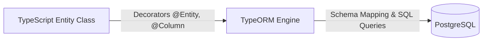
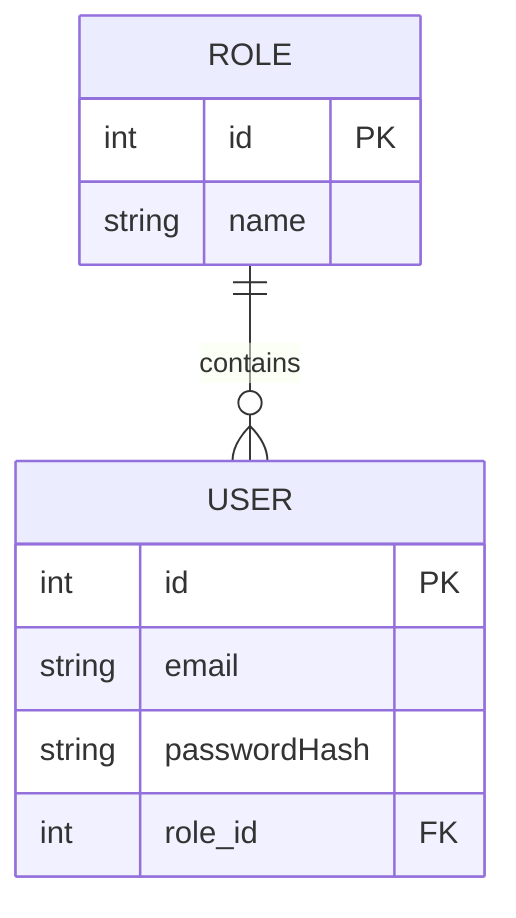

# TypeORM Configuration and Entities

In the previous guide, we built a users module using in-memory data storage. However, in a production environment, persistent storage within a relational database is required. TypeORM serves as the bridge between our TypeScript code in NestJS and the PostgreSQL database engine. This guide explains how to translate Entity-Relationship (ER) diagrams into decorated TypeScript entities and configure local database infrastructure using Docker Compose.

---

## 1. What is TypeORM and Why Do We Need It?

TypeORM is an **Object-Relational Mapper (ORM)**, a tool that allows developers to interact with relational databases using TypeScript classes and objects rather than writing raw SQL queries manually.

* **Without TypeORM:** We would need to write raw SQL statements (`CREATE TABLE...`, `ALTER TABLE...`, `SELECT * FROM...`) and manually handle type mapping and table joins.
* **With TypeORM:** We define decorated **Entity** classes. TypeORM takes care of generating tables, columns, primary keys, integrity constraints, and foreign key relations automatically or via migrations.



---

## 2. From ER Diagram to Code: Schema Translation

Let us examine the relationship between `USER` and `ROLE`. In this model, one role can group multiple users, while each user is assigned a single role (a 1:N / N:1 relationship).



The table below summarizes the mapping between relational ER elements and TypeORM decorators:

| In the ER Diagram | In TypeORM (TypeScript) | Common Options |
|---|---|---|
| Entity (Table) | `@Entity('table_name')` | `{ name: 'users' }` |
| Autoincrement Primary Key | `@PrimaryGeneratedColumn()` | `'increment'`, `'uuid'` |
| Attribute / Column | `@Column()` | `{ unique: true, nullable: false, length: 120 }` |
| 1:N Relation (One-to-Many) | `@OneToMany(() => Target, (target) => target.property)` | On the parent entity (e.g., `Role`) |
| N:1 Relation (Many-to-One) | `@ManyToOne(() => Target, (target) => target.property)` | On the entity with the FK (e.g., `User`) |
| Explicit Foreign Key | `@JoinColumn({ name: 'col_name' })` | Specifies physical FK column name in PostgreSQL |

---

## 3. Step-by-Step Configuration and Entities Guide

<StepByStep>

<Step>
### Dependency Installation

Install the required packages for TypeORM, NestJS configuration, and the PostgreSQL database driver (`pg`):

```bash
npm install --save @nestjs/typeorm typeorm @nestjs/config pg
```
</Step>

<Step>
### Environment Variable Configuration (`.env`)

Create a `.env` file in the project root to centralize connection credentials without committing secrets into source control:

```env title=".env" showLineNumbers
# Database Configuration
DB_HOST=localhost
DB_PORT=5437
DB_USERNAME=postgres
DB_PASSWORD=postgres
DB_DATABASE=nest_db
```
</Step>

<Step>
### Docker Compose PostgreSQL Setup (`docker-compose.yml`)

Create `docker-compose.yml` in the project root to launch a PostgreSQL **v18** container, binding external port `5437` to internal port `5432`:

```yaml title="docker-compose.yml" showLineNumbers
services:
  db:
    image: postgres:18
    restart: always
    environment:
      POSTGRES_USER: ${DB_USERNAME}
      POSTGRES_PASSWORD: ${DB_PASSWORD}
      POSTGRES_DB: ${DB_DATABASE}
    ports:
      - '${DB_PORT}:5432'
    volumes:
      - postgres-data:/var/lib/postgresql/data

volumes:
  postgres-data:
```

Start the container in detached mode:

```bash
docker compose up -d
```
</Step>

<Step>
### TypeORM Configuration in AppModule

Connect NestJS with PostgreSQL using `TypeOrmModule.forRootAsync()` and inject `ConfigService` to dynamically resolve environment variables at runtime:

```typescript title="src/app.module.ts" showLineNumbers
import { Module } from '@nestjs/common';
import { TypeOrmModule } from '@nestjs/typeorm';
import { ConfigModule, ConfigService } from '@nestjs/config';

@Module({
  imports: [
    ConfigModule.forRoot({
      isGlobal: true,
    }),
    TypeOrmModule.forRootAsync({
      imports: [ConfigModule],
      inject: [ConfigService],
      useFactory: (configService: ConfigService) => ({
        type: 'postgres',
        host: configService.get<string>('DB_HOST'),
        port: configService.get<number>('DB_PORT'),
        username: configService.get<string>('DB_USERNAME'),
        password: configService.get<string>('DB_PASSWORD'),
        database: configService.get<string>('DB_DATABASE'),
        entities: [__dirname + '/**/*.entity{.ts,.js}'],
        synchronize: true, // Automatically synchronize entity schemas in development
      }),
    }),
  ],
})
export class AppModule {}
```
</Step>

<Step>
### Entity Decorators and Attributes

The following options configure TypeORM decorators:

#### 1. `@Entity(name?: string, options?: EntityOptions)`
Defines that the class represents a database table. If no name is provided, the lowercase class name is used.

```typescript title="src/roles/entities/role.entity.ts"
@Entity('roles') // Explicit table name in PostgreSQL
```

#### 2. `@PrimaryGeneratedColumn(strategy?: string)`
Specifies an automatically generated primary key.
* `'increment'`: Integer autoincrementing primary key (default).
* `'uuid'`: Universally unique identifier (ideal for distributed systems and security).

#### 3. `@Column(options?: ColumnOptions)`
Configures column properties in PostgreSQL:
* `type`: SQL column type (`'varchar'`, `'int'`, `'boolean'`, `'text'`, `'timestamp'`, etc.).
* `unique`: When `true`, enforces unique constraints across the table.
* `nullable`: When `true`, permits `NULL` values. Default is `false`.
* `default`: Sets a default fallback value.
* `length`: Sets maximum character length for text columns such as `varchar`.

```typescript title="src/users/entities/user.entity.ts"
@Column({ type: 'varchar', length: 120, unique: true, nullable: false })
email: string;

@Column({ type: 'boolean', default: true })
isActive: boolean;
```

#### 4. Relationships: `@OneToMany`, `@ManyToOne`, and `@JoinColumn`
* `@OneToMany(() => Target, (target) => target.property)`: Placed on the "One" side; returns an array of related child entities.
* `@ManyToOne(() => Target, (target) => target.property)`: Placed on the "Many" side (the entity storing the foreign key).
* `@JoinColumn({ name: 'col_name' })`: Specifies the physical column name of the foreign key in the database table.

```typescript title="src/roles/entities/role.entity.ts" showLineNumbers
import { Entity, PrimaryGeneratedColumn, Column, OneToMany } from 'typeorm';
import { User } from '../../users/entities/user.entity';

@Entity('roles')
export class Role {
  @PrimaryGeneratedColumn()
  id: number;

  @Column({ type: 'varchar', length: 50, unique: true })
  name: string;

  // One role can belong to many users
  @OneToMany(() => User, (user) => user.role)
  users: User[];
}
```

```typescript title="src/users/entities/user.entity.ts" showLineNumbers
import { Entity, PrimaryGeneratedColumn, Column, ManyToOne, JoinColumn } from 'typeorm';
import { Role } from '../../roles/entities/role.entity';

@Entity('users')
export class User {
  @PrimaryGeneratedColumn()
  id: number;

  @Column({ type: 'varchar', length: 120, unique: true })
  email: string;

  @Column({ type: 'varchar', length: 255 })
  passwordHash: string;

  // Many users belong to a single role
  @ManyToOne(() => Role, (role) => role.users, { nullable: false })
  @JoinColumn({ name: 'role_id' }) // Physical 'role_id' FK column in 'users' table
  role: Role;
}
```
</Step>

</StepByStep>

---

## 4. Initial Database Seeding (SQL Seed Script)

When starting development, having base reference data is essential (such as `"ADMIN"`, `"USER"`, and `"GUEST"` roles, or an initial admin user).

A clean and direct strategy is to maintain an SQL script within a `/db` directory at the project root and execute it directly inside the PostgreSQL container with Docker Compose.

### Creating the SQL File (`db/seed.sql`)

Create the `db/` folder and add `seed.sql`:

```sql title="db/seed.sql" showLineNumbers
-- Insert base roles if they do not already exist
INSERT INTO roles (name) 
VALUES ('ADMIN'), ('USER'), ('GUEST')
ON CONFLICT (name) DO NOTHING;

-- Insert default admin user linked to ADMIN role
INSERT INTO users (email, "passwordHash", role_id)
VALUES (
  'admin@docukelo.edu.co',
  'secret_hashed_password',
  (SELECT id FROM roles WHERE name = 'ADMIN')
)
ON CONFLICT (email) DO NOTHING;
```

### Executing the Seed in Docker

Once TypeORM has generated the tables (by running the application with `synchronize: true`), run the script inside the container using `docker compose exec`:

```bash
docker compose exec -T db psql -U postgres -d nest_db < db/seed.sql
```

* **`docker compose exec -T db`**: Executes a command inside the `db` service container without allocating a pseudo-TTY (required for input redirection).
* **`psql -U postgres -d nest_db`**: Launches the PostgreSQL interactive client against the configured database.
* **`< db/seed.sql`**: Pipes the contents of the local file into the standard input of `psql`.

---

## Self-Assessment Quiz

<Quiz id="compu3-typeorm-intro-quiz">

<Question title="What is the primary function of the @Entity() decorator?">
  <Option>Convert the class into a NestJS HTTP controller</Option>
  <Option>Generate an autoincrementing primary key</Option>
  <Option>Inject a repository into application services</Option>
  <Option correct>Instruct TypeORM that the TypeScript class represents a table in the PostgreSQL database</Option>
</Question>

<Question title="Which @Column option allows a column to store NULL values in the database?">
  <Option>unique: true</Option>
  <Option correct>nullable: true</Option>
  <Option>default: null</Option>
  <Option>optional: true</Option>
</Question>

<Question title="What is the purpose of @JoinColumn(&#123; name: 'role_id' &#125;) in a @ManyToOne relationship?">
  <Option>Join two tables via an INNER JOIN query at compile time</Option>
  <Option correct>Specify the exact name of the physical foreign key (FK) column in the database table</Option>
  <Option>Designate which property is the primary key of the target table</Option>
  <Option>Disable foreign key constraint creation</Option>
</Question>

<Question title="In which environment should TypeORM's 'synchronize: true' option be kept enabled?">
  <Option correct>Only in local development, as it can alter or drop existing schemas and data automatically</Option>
  <Option>Only in production, to ensure the database schema stays up to date</Option>
  <Option>In all environments without exception</Option>
  <Option>In no environment, as it is a deprecated option</Option>
</Question>

<Question title="Which external PostgreSQL port and image version are configured in this module's docker-compose.yml?">
  <Option>Port 5432 with PostgreSQL v15</Option>
  <Option correct>Port 5437 parameterized from .env with the postgres:18 image</Option>
  <Option>Port 3306 with MySQL v8</Option>
  <Option>Port 8080 with PostgreSQL v12</Option>
</Question>

<Question title="How is the initial seed script db/seed.sql executed inside the database container?">
  <Option>By manually copying and pasting queries from a GUI client like pgAdmin</Option>
  <Option>By restarting the Docker daemon</Option>
  <Option correct>With the command: docker compose exec -T db psql -U postgres -d nest_db &lt; db/seed.sql</Option>
  <Option>By installing an additional NestJS module to parse SQL files</Option>
</Question>

<Question title="What is the difference between @OneToMany and @ManyToOne when modeling relationships?">
  <Option correct>@ManyToOne is placed on the entity that holds the foreign key; @OneToMany is placed on the parent entity to access the array of related entities</Option>
  <Option>@OneToMany is used exclusively for strings and @ManyToOne for numbers</Option>
  <Option>There is no technical difference; they are interchangeable aliases</Option>
  <Option>@OneToMany always creates join tables while @ManyToOne does not</Option>
</Question>

<Question title="What is the benefit of using @nestjs/config alongside dotenv in docker-compose and TypeORM?">
  <Option>Increases SQL query execution speed</Option>
  <Option correct>Centralizes configuration (credentials, ports, host) in .env without exposing secrets in source code</Option>
  <Option>Automatically formats TypeScript code upon saving</Option>
  <Option>Replaces TypeORM entirely for database access</Option>
</Question>

<Question title="Why is TypeOrmModule.forRootAsync() with ConfigService preferred over static TypeOrmModule.forRoot()?">
  <Option>Because forRoot() does not support relational databases like PostgreSQL</Option>
  <Option correct>Because forRootAsync() ensures environment variables are loaded and resolved asynchronously before initializing the connection</Option>
  <Option>Because forRootAsync() automatically executes all pending database migrations</Option>
  <Option>Because forRoot() requires the server to run in debug mode</Option>
</Question>

<Question title="What is the purpose of the glob pattern in entities: [__dirname + '/**/*.entity&#123;.ts,.js&#125;']?">
  <Option>Excludes all entities from the TypeScript build process</Option>
  <Option>Instructs TypeORM to only load entities written in JavaScript</Option>
  <Option correct>Automatically discovers and registers all entity classes across the project without listing them manually one by one</Option>
  <Option>Creates temporary backup copies of entity files in memory</Option>
</Question>

</Quiz>
