# Controllers in NestJS

Controllers represent the entry and external communication layer in a backend architecture built with NestJS. In this guide, we will explore their architectural foundations, the HTTP request lifecycle, and advanced features for designing robust, typed, and decoupled REST APIs.

To follow the practical section of this guide, you can base your project on the course repository on GitHub: [Kelocoes/compunet3-20252](https://github.com/Kelocoes/compunet3-20252/tree/nest/intro) on the `nest/intro` branch.

---

## 1. Concepts and Architectural Foundations

### What is a Controller?

In software architecture based on the **MVC (Model-View-Controller)** pattern or layered architectures for REST APIs, a **Controller** is the component responsible for receiving incoming client requests (*HTTP Requests*), parsing parameters and request bodies, invoking the appropriate business logic (usually encapsulated in **Services**), and returning a structured response to the client (*HTTP Response*).

In NestJS, a controller is a TypeScript class annotated with the `@Controller()` decorator. Its primary purpose is **routing**: associating URL routes and HTTP methods (`GET`, `POST`, `PUT`, `PATCH`, `DELETE`) with specific controller functions known as *route handlers*.

```mermaid
flowchart LR
    Client["HTTP Client<br/>(Browser / Postman)"] -->|"1. HTTP Request<br/>(GET /users/10)"| Routing["Routing Mechanism<br/>(NestJS Router)"]
    Routing -->|"2. Dispatch to method"| Controller["UsersController<br/>(@Controller('users'))"]
    Controller -->|"3. Invoke business logic"| Service["UsersService<br/>(@Injectable())"]
    Service -->|"4. Data access"| Repository["TypeORM Repository<br/>(Database)"]
    Repository -->|"5. Entity / Data"| Service
    Service -->|"6. Result / DTO"| Controller
    Controller -->|"7. HTTP Response<br/>(Status 200 JSON)"| Client

    classDef clientStyle fill:#e0f2fe,stroke:#0284c7,stroke-width:2px,color:#0369a1;
    classDef routerStyle fill:#fef3c7,stroke:#d97706,stroke-width:2px,color:#92400e;
    classDef nestStyle fill:#ecfdf5,stroke:#059669,stroke-width:2px,color:#065f46;
    classDef dbStyle fill:#f3e8ff,stroke:#7c3aed,stroke-width:2px,color:#5b21b6;

    class Client clientStyle;
    class Routing routerStyle;
    class Controller,Service nestStyle;
    class Repository dbStyle;
```



#### Responsibilities of each component

- **HTTP Client**: Sends requests to specific endpoints carrying headers, paths, query params, or JSON payloads.
- **NestJS Router**: Inspects the requested path and HTTP verb, directing execution to the corresponding handler in the controller.
- **Controller**: Extracts and validates request data (using decorators like `@Param()`, `@Body()`, `@Query()`), delegates heavy work to the service, and configures the HTTP status code and response headers.
- **Service (`@Injectable()`)**: Houses domain logic, computations, business rules, and transaction control.
- **Repository / Database**: Performs physical persistence and querying of entities.

:::info[Separation of Concerns]
A controller must **never** contain heavy business logic or directly execute raw SQL queries and repository operations. Keeping controllers thin (*thin controllers*) and services rich (*rich services*) guarantees high cohesion, low coupling, and simplifies unit testing.
:::

---

### Parameter Mapping and HTTP Decorators

NestJS provides dedicated decorators to declaratively extract any segment of an incoming HTTP request:

| Decorator | Underlying HTTP Object | Purpose & Example |
| :--- | :--- | :--- |
| `@Controller('prefix')` | Route Prefix | Sets the base URL path prefix for all endpoints in the class. |
| `@Get()`, `@Post()`, `@Patch()`, `@Delete()` | HTTP Method | Defines the HTTP verb associated with the route handler. |
| `@Param('key')` | `req.params[key]` | Captures route path parameters from the URL (e.g., `/users/:id`). |
| `@Query('key')` | `req.query[key]` | Captures query string parameters (e.g., `/products?category=tech`). |
| `@Body()` | `req.body` | Extracts the JSON payload sent in the request body. |
| `@Headers('key')` | `req.headers[key]` | Retrieves individual HTTP headers or the entire headers object. |
| `@HttpCode(status)` | Status Code | Overrides the default HTTP response status code (e.g., `201`, `204`). |
| `@Res()` | Native Response Object | Injects the underlying platform response (Express/Fastify), breaking platform independence if used unsafely. |

#### Route Parameters (`@Param`) and Query Parameters (`@Query`)

```typescript title="src/users/users.controller.ts" showLineNumbers
import { Controller, Get, Param, Query } from '@nestjs/common';

@Controller('users')
export class UsersController {
  // GET /users/42
  @Get(':id')
  findOne(@Param('id') id: string) {
    return `Returns user with id: ${id}`;
  }

  // GET /users?role=admin&limit=10
  @Get()
  findAll(@Query('role') role: string, @Query('limit') limit: string) {
    return `Filtering users by role: ${role}, limit: ${limit}`;
  }
}
```

#### Request Body (`@Body`) and DTOs

When receiving structured payloads in `POST`, `PUT`, or `PATCH` requests, `@Body()` is combined with a Data Transfer Object (DTO) class:

```typescript title="src/users/users.controller.ts" showLineNumbers
import { Controller, Post, Body, HttpCode, HttpStatus } from '@nestjs/common';
import { CreateUserDto } from './dto/create-user.dto';

@Controller('users')
export class UsersController {
  @Post()
  @HttpCode(HttpStatus.CREATED) // Explicitly returns HTTP 201
  create(@Body() createUserDto: CreateUserDto) {
    return `User created: ${createUserDto.name}`;
  }
}
```

#### Request Headers (`@Headers`)

To extract security tokens, API keys, or client metadata:

```typescript title="src/auth/auth.controller.ts" showLineNumbers
import { Controller, Get, Headers } from '@nestjs/common';

@Controller('auth')
export class AuthController {
  @Get('profile')
  getProfile(@Headers('authorization') authHeader: string) {
    return `Received Authorization header: ${authHeader}`;
  }
}
```

Common headers in REST APIs:

| Header | Purpose | Example Value |
| :--- | :--- | :--- |
| `Authorization` | Authentication token (JWT, Bearer token) | `Bearer eyJhbGciOiJIUz...` |
| `Content-Type` | MIME type of request body | `application/json` |
| `User-Agent` | Client identification string | `Mozilla/5.0 ...` |
| `Accept` | Target response format | `application/json` |
| `X-Request-ID` | Unique distributed request traceability ID | `123e4567-e89b-12d3-a456...` |

#### Wildcard Routes

NestJS supports pattern-based routing using asterisks (`*`):

```typescript title="src/files/files.controller.ts" showLineNumbers
import { Controller, Get, Param } from '@nestjs/common';

@Controller('files')
export class FilesController {
  // Matches /files/docs/report.pdf or any nested subpath
  @Get('*')
  getFile(@Param() params: string[]) {
    return `Requested path: ${params[0]}`;
  }

  // Intermediate wildcard: /files/download/reports/2026/details
  @Get('download/*/details')
  getFileDetails(@Param() params: string[]) {
    return `Subpath details: ${params[0]}`;
  }
}
```

---

### HTTP Responses and Exception Handling

By default, NestJS returns JSON with status `200 OK` (or `201 CREATED` for `POST`). When errors occur, NestJS includes a built-in **Exception Filters** layer that catches standard HTTP exceptions and serializes them into a consistent JSON response.

```typescript title="Throwing standard HTTP exceptions" showLineNumbers
import { BadRequestException } from '@nestjs/common';

throw new BadRequestException('Invalid form inputs', {
  cause: new Error('DTO validation failure'),
  description: 'Email address is already in use',
});
```

The client receives a clean, standardized error response:

```json
{
  "message": "Invalid form inputs",
  "error": "Email address is already in use",
  "statusCode": 400
}
```

#### Standard HTTP Exceptions in NestJS

| Exception in NestJS | Status Code | Description & Use Case |
| :--- | :---: | :--- |
| `BadRequestException` | 400 | Malformed client request syntax or invalid parameters. |
| `UnauthorizedException` | 401 | Missing, expired, or invalid credentials. |
| `ForbiddenException` | 403 | Valid credentials, but insufficient permissions for the resource. |
| `NotFoundException` | 404 | Target resource does not exist in the database. |
| `MethodNotAllowedException` | 405 | HTTP verb not allowed on the requested route. |
| `NotAcceptableException` | 406 | Content negotiation cannot satisfy `Accept` headers. |
| `RequestTimeoutException` | 408 | Server timed out waiting for request processing. |
| `ConflictException` | 409 | Conflict with current entity state (e.g., unique key violation). |
| `GoneException` | 410 | Resource once existed but has been permanently deleted. |
| `PayloadTooLargeException` | 413 | Request payload exceeds configured maximum size. |
| `UnsupportedMediaTypeException` | 415 | Unsupported media type provided in `Content-Type`. |
| `UnprocessableEntityException` | 422 | Semantic validation errors in complex payloads. |
| `InternalServerErrorException` | 500 | Unhandled error or unexpected server failure. |
| `NotImplementedException` | 501 | Route or feature not yet supported. |
| `BadGatewayException` | 502 | Invalid response received from an upstream service. |
| `ServiceUnavailableException` | 503 | Server overloaded or undergoing maintenance. |
| `GatewayTimeoutException` | 504 | Upstream service failed to respond within time limit. |

---

## 2. Practical Guide: Decoupled Exception Architecture & Controller Implementation

In this hands-on section, we will implement decoupled custom domain exceptions and a complete `UsersController` wired to its service and TypeORM repository.

Project structure:

```plaintext
src
├── common
│   └── exceptions
│       ├── http
│       │   ├── role-not-found.exception.ts
│       │   ├── user-not-found.exception.ts
│       └── index.ts
└── users
    ├── dto
    │   ├── create-user.dto.ts
    │   └── update-user.dto.ts
    ├── entities
    │   └── user.entity.ts
    ├── users.controller.ts
    └── users.service.ts
```

<StepByStep>

  <Step number="1" title="Create Custom Domain Exceptions">

We create classes extending `NotFoundException` to standardize application-specific error messages.

```typescript title="src/common/exceptions/http/role-not-found.exception.ts" showLineNumbers
import { NotFoundException } from '@nestjs/common';

/**
 * Custom exception thrown when a requested role does not exist.
 */
export class RoleNotFoundException extends NotFoundException {
  constructor(roleIdOrName: number | string) {
    super({
      error: 'Role Not Found',
      message: `Role with ID or name '${roleIdOrName}' does not exist in the system.`,
    });
  }
}
```

```typescript title="src/common/exceptions/http/user-not-found.exception.ts" showLineNumbers
import { NotFoundException } from '@nestjs/common';

/**
 * Custom exception thrown when a user record is not found in the database.
 */
export class UserNotFoundException extends NotFoundException {
  constructor(userId: number, internalCode?: string) {
    super({
      error: 'User Not Found',
      message: `User with ID ${userId} was not found.`,
      code: internalCode,
    });
  }
}
```

Export all exceptions through a barrel file:

```typescript title="src/common/exceptions/index.ts" showLineNumbers
export * from './http/role-not-found.exception';
export * from './http/user-not-found.exception';
```

  </Step>

  <Step number="2" title="Implement Business Logic in the Service Layer">

The `UsersService` manages TypeORM persistence and throws descriptive exceptions whenever records are missing.

```typescript title="src/users/users.service.ts" showLineNumbers
import { Injectable } from '@nestjs/common';
import { InjectRepository } from '@nestjs/typeorm';
import { Repository } from 'typeorm';
import { CreateUserDto } from './dto/create-user.dto';
import { UpdateUserDto } from './dto/update-user.dto';
import { User } from './entities/user.entity';
import { RolesService } from '../auth/services/roles.service';
import {
  RoleNotFoundException,
  UserNotFoundException,
} from '../common/exceptions';

@Injectable()
export class UsersService {
  constructor(
    @InjectRepository(User)
    private readonly userRepository: Repository<User>,
    private readonly rolesService: RolesService,
  ) {}

  /**
   * Creates a new user after verifying that the assigned role exists.
   */
  async create(createUserDto: CreateUserDto): Promise<User> {
    const role = await this.rolesService.findByName(createUserDto.roleName);
    if (!role) {
      throw new RoleNotFoundException(createUserDto.roleName);
    }

    const newUser = this.userRepository.create({
      ...createUserDto,
      role,
    });

    return await this.userRepository.save(newUser);
  }

  /**
   * Returns all registered users.
   */
  async findAll(): Promise<User[]> {
    return await this.userRepository.find();
  }

  /**
   * Finds a user by ID or throws UserNotFoundException if not found.
   */
  async findOne(id: number): Promise<User> {
    const user = await this.userRepository.findOne({ where: { id } });
    if (!user) {
      throw new UserNotFoundException(id);
    }
    return user;
  }

  /**
   * Updates an existing user record.
   */
  async update(id: number, updateUserDto: UpdateUserDto): Promise<User> {
    const userExist = await this.userRepository.findOne({ where: { id } });
    if (!userExist) {
      throw new UserNotFoundException(id, 'ERR_USER_UPDATE_404');
    }

    await this.userRepository.update(id, updateUserDto);
    return this.findOne(id);
  }

  /**
   * Deletes a user by ID.
   */
  async remove(id: number): Promise<void> {
    const result = await this.userRepository.delete(id);
    if (!result.affected || result.affected === 0) {
      throw new UserNotFoundException(id);
    }
  }
}
```

  </Step>

  <Step number="3" title="Build the Complete Controller with Semantic HTTP Codes">

The controller handles `/users` endpoints, converts numeric params, and returns semantic status codes (`200 OK`, `201 CREATED`, `204 NO CONTENT`).

```typescript title="src/users/users.controller.ts" showLineNumbers
import {
  Controller,
  Get,
  Post,
  Body,
  Patch,
  Param,
  Delete,
  HttpCode,
  HttpStatus,
  InternalServerErrorException,
} from '@nestjs/common';
import { UsersService } from './users.service';
import { CreateUserDto } from './dto/create-user.dto';
import { UpdateUserDto } from './dto/update-user.dto';

@Controller('users')
export class UsersController {
  constructor(private readonly usersService: UsersService) {}

  /**
   * POST /users -> Creates a new resource (201 Created)
   */
  @Post()
  @HttpCode(HttpStatus.CREATED)
  create(@Body() createUserDto: CreateUserDto) {
    return this.usersService.create(createUserDto);
  }

  /**
   * GET /users -> Lists all users (200 OK)
   */
  @Get()
  @HttpCode(HttpStatus.OK)
  findAll() {
    return this.usersService.findAll();
  }

  /**
   * GET /users/:id -> Returns a single user (200 OK)
   */
  @Get(':id')
  @HttpCode(HttpStatus.OK)
  findOne(@Param('id') id: string) {
    // Convert string parameter to number using the unary + operator
    return this.usersService.findOne(+id);
  }

  /**
   * PATCH /users/:id -> Partially updates a user (200 OK)
   */
  @Patch(':id')
  @HttpCode(HttpStatus.OK)
  async update(
    @Param('id') id: string,
    @Body() updateUserDto: UpdateUserDto,
  ) {
    try {
      return await this.usersService.update(+id, updateUserDto);
    } catch (error) {
      // If it's a domain HTTP exception, rethrow it directly
      if (error instanceof Error && 'status' in error) {
        throw error;
      }
      throw new InternalServerErrorException('Failed to update user', {
        cause: error,
        description: 'Unexpected database failure while persisting user changes.',
      });
    }
  }

  /**
   * DELETE /users/:id -> Deletes user with no content returned (204 No Content)
   */
  @Delete(':id')
  @HttpCode(HttpStatus.NO_CONTENT)
  async remove(@Param('id') id: string): Promise<void> {
    await this.usersService.remove(+id);
  }
}
```

  </Step>

</StepByStep>

---

## Self-Assessment Quiz

<Quiz id="dedw-semana6-controllers-quiz-en">
  <Question title="What is the primary responsibility of a Controller in NestJS architecture?">
    <Option>Execute direct SQL queries to the database and coordinate ACID transactions.</Option>
    <Option correct>Handle incoming HTTP requests, extract parameters/bodies, invoke domain services, and return responses to the client.</Option>
    <Option>Act as an in-memory replacement for TypeORM models and entities.</Option>
    <Option>Transpile TypeScript code into JavaScript during runtime.</Option>
  </Question>

  <Question title="If a controller is decorated with @Controller('users') and a method has @Get(':id'), what is the mapped URL?">
    <Option>/users</Option>
    <Option>/users/id</Option>
    <Option correct>/users/:id</Option>
    <Option>/:id/users</Option>
  </Question>

  <Question title="Which NestJS decorator is used to extract URL query string parameters (e.g., ?category=tech)?">
    <Option>@Param()</Option>
    <Option correct>@Query()</Option>
    <Option>@Body()</Option>
    <Option>@Headers()</Option>
  </Question>

  <Question title="What HTTP status code is emitted by default with @HttpCode(HttpStatus.NO_CONTENT)?">
    <Option>200</Option>
    <Option>201</Option>
    <Option correct>204</Option>
    <Option>404</Option>
  </Question>

  <Question title="Why is it considered a bad architectural practice to place heavy business logic or database queries inside a controller?">
    <Option>Because NestJS cannot inject repositories into modules.</Option>
    <Option>Because controllers do not support async/await methods.</Option>
    <Option correct>Because it couples transport protocol logic with the domain, violating separation of concerns and hindering unit testing.</Option>
    <Option>Because TypeScript throws a compilation error if a controller exceeds 50 lines.</Option>
  </Question>

  <Question title="What standard HTTP status code is returned by NestJS's BadRequestException?">
    <Option correct>400</Option>
    <Option>401</Option>
    <Option>403</Option>
    <Option>404</Option>
  </Question>

  <Question title="Which built-in NestJS exception should be thrown when a client provides valid credentials but lacks necessary permissions?">
    <Option>UnauthorizedException (401)</Option>
    <Option correct>ForbiddenException (403)</Option>
    <Option>NotFoundException (404)</Option>
    <Option>ConflictException (409)</Option>
  </Question>

  <Question title="When defining a wildcard route like @Get('download/*/details'), what does params[0] contain for /files/download/reports/2026/details?">
    <Option>/files</Option>
    <Option>details</Option>
    <Option correct>reports/2026</Option>
    <Option>download</Option>
  </Question>

  <Question title="Which decorator is used to extract and type structured payloads sent in the body of a POST request?">
    <Option>@Param()</Option>
    <Option>@Query()</Option>
    <Option correct>@Body()</Option>
    <Option>@Res()</Option>
  </Question>

  <Question title="In the proposed layered architecture, where should domain exceptions like RoleNotFoundException or UserNotFoundException be thrown?">
    <Option>In the HTTP client before sending the request.</Option>
    <Option correct>In the Service layer, when the queried entity does not exist after calling the repository.</Option>
    <Option>Only inside the main.ts bootstrap function.</Option>
    <Option>Inside the tsconfig.json configuration file.</Option>
  </Question>
</Quiz>
