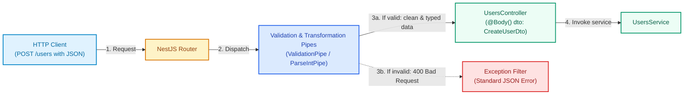

# Pipes and Validators in NestJS

**Pipes** are core architectural components in the request lifecycle of NestJS. They operate on incoming method arguments before the route handler is invoked, fulfilling two critical purposes: **data transformation** and **validation**.

To follow the practical section of this guide, you can base your project on the course repository on GitHub: [Kelocoes/compunet3-20252](https://github.com/Kelocoes/compunet3-20252/tree/nest/intro) on the `nest/intro` branch.

---

## 1. Concepts and Architectural Foundations

### What is a Pipe in NestJS?

A Pipe is a class annotated with `@Injectable()` that implements the `PipeTransform` interface. Unlike standard Express middlewares, pipes run within the NestJS execution context immediately prior to controller method invocation. This gives them access to argument metadata (`ArgumentMetadata`), enabling them to:

1. **Transformation**: Mutate input data to the required format or type (e.g., parsing a URL string `"42"` into an integer `42`, or instantiating a domain entity).
2. **Validation**: Assess whether incoming data complies with schema restrictions and business validation rules. If the data is valid, execution proceeds; if invalid, the pipe halts request handling by throwing an HTTP exception (typically `BadRequestException` 400).



#### Anatomy of the `PipeTransform` Interface

Every custom pipe must implement the `transform(value: any, metadata: ArgumentMetadata)` method:

- **`value`**: The raw incoming parameter value currently being processed (originating from `@Body()`, `@Param()`, or `@Query()`).
- **`metadata`**: Metadata describing the method argument:
  - `type`: Indicates parameter origin (`'body'`, `'query'`, `'param'`, or `'custom'`).
  - `metatype`: The expected TypeScript type/class (e.g., `CreateUserDto` or `Number`).
  - `data`: The string passed to the parameter decorator (e.g., `@Param('id')` yields `data = 'id'`).

---

### Built-in Pipes in NestJS

NestJS ships with ready-to-use pipes exported from `@nestjs/common`:

| Built-in Pipe | Purpose | Example Usage |
| :--- | :--- | :--- |
| `ValidationPipe` | Validates DTO schemas using `class-validator` and transforms payloads via `class-transformer`. | Global or on `@Body()` |
| `ParseIntPipe` | Parses string values to integer primitives (`number`). Throws `400` if invalid. | `@Param('id', ParseIntPipe)` |
| `ParseFloatPipe` | Parses string values to floating-point numbers. | `@Query('price', ParseFloatPipe)` |
| `ParseBoolPipe` | Converts `"true"`, `"false"`, `true`, `false` into boolean values. | `@Query('active', ParseBoolPipe)` |
| `ParseArrayPipe` | Parses comma-separated lists into typed arrays. | `@Query('ids', new ParseArrayPipe(...))` |
| `ParseUUIDPipe` | Validates that a string is a valid UUID (v3, v4, or v5). | `@Param('uuid', new ParseUUIDPipe())` |
| `ParseEnumPipe` | Verifies that the input value matches an allowed TypeScript `enum`. | `@Param('status', new ParseEnumPipe(CatStatus))` |
| `DefaultValuePipe` | Supplies a fallback value when the client omits an optional query parameter. | `@Query('page', new DefaultValuePipe(1))` |
| `ParseFilePipe` | Validates uploaded files (`size`, `mime-type`) when using `@UploadedFile()`. | Multipart file uploads |

#### Using Built-in Pipes on Route Parameters

```typescript title="src/cats/cats.controller.ts" showLineNumbers
import {
  Controller,
  Get,
  Param,
  Query,
  ParseIntPipe,
  ParseUUIDPipe,
  ParseEnumPipe,
  DefaultValuePipe,
} from '@nestjs/common';

export enum CatBreed {
  SIAMESE = 'siamese',
  PERSIAN = 'persian',
  MAINE_COON = 'maine_coon',
}

@Controller('cats')
export class CatsController {
  // Automatically transforms the ID param to a number
  @Get(':id')
  findOne(@Param('id', ParseIntPipe) id: number) {
    return { id, type: typeof id }; // id is guaranteed to be a number
  }

  // Enforces valid UUID v4 format
  @Get('by-uuid/:uuid')
  findByUuid(@Param('uuid', new ParseUUIDPipe({ version: '4' })) uuid: string) {
    return { uuid };
  }

  // Validates against enum values and sets fallback pagination
  @Get('filter/:breed')
  filter(
    @Param('breed', new ParseEnumPipe(CatBreed)) breed: CatBreed,
    @Query('page', new DefaultValuePipe(1), ParseIntPipe) page: number,
  ) {
    return { breed, page };
  }
}
```

---

### Pipe Scopes

Pipes can be scoped at four distinct levels based on design requirements:

1. **Parameter Level**: `@Param('id', ParseIntPipe) id: number`.
2. **Method Level**: `@UsePipes(new ValidationPipe())` above a `@Post()` handler.
3. **Controller Level**: `@UsePipes(new ValidationPipe())` above a `@Controller('users')` class.
4. **Global Level**: Applies across every route in the entire application. Registered in `main.ts` using `app.useGlobalPipes(new ValidationPipe())` or through module dependency injection:

```typescript title="src/main.ts" showLineNumbers
import { NestFactory } from '@nestjs/core';
import { ValidationPipe } from '@nestjs/common';
import { AppModule } from './app.module';

async function bootstrap() {
  const app = await NestFactory.create(AppModule);

  // Global pipe to validate all incoming DTO payloads
  app.useGlobalPipes(
    new ValidationPipe({
      whitelist: true, // Strips properties not declared in the DTO
      forbidNonWhitelisted: true, // Rejects requests containing unrecognized properties
      transform: true, // Automatically converts incoming payloads into DTO instances
    }),
  );

  await app.listen(3000);
}
bootstrap();
```

---

## 2. Practical Guide: Validation with `class-validator` & Custom Pipes

In this section, we will build a comprehensive validation system using `class-validator` and `class-transformer`, accompanied by a custom Pipe that validates positive integers.

<StepByStep>

  <Step number="1" title="Install Validation Dependencies">

Install the official validation libraries needed for decorator-based validation and object transformation in NestJS:

```bash title="Terminal"
npm install class-validator class-transformer
```

  </Step>

  <Step number="2" title="Create a Custom Pipe: PositiveIntPipe">

We build a custom pipe ensuring route parameter numbers are strictly greater than zero:

```typescript title="src/common/pipes/positive-int.pipe.ts" showLineNumbers
import {
  PipeTransform,
  Injectable,
  ArgumentMetadata,
  BadRequestException,
} from '@nestjs/common';

/**
 * Parses string input into an integer and verifies that it is strictly positive (> 0).
 */
@Injectable()
export class PositiveIntPipe implements PipeTransform<string, number> {
  transform(value: string, metadata: ArgumentMetadata): number {
    const val = parseInt(value, 10);

    if (isNaN(val)) {
      throw new BadRequestException(
        `The parameter '${metadata.data ?? 'id'}' must be a valid integer.`,
      );
    }

    if (val <= 0) {
      throw new BadRequestException(
        `The parameter '${metadata.data ?? 'id'}' must be a positive integer greater than 0.`,
      );
    }

    return val;
  }
}
```

  </Step>

  <Step number="3" title="Define Validation Rules in the DTO">

Decorate DTO fields with semantic rules provided by `class-validator`:

```typescript title="src/users/dto/create-user.dto.ts" showLineNumbers
import {
  IsString,
  IsEmail,
  IsNotEmpty,
  MinLength,
  MaxLength,
  IsOptional,
  Matches,
} from 'class-validator';

export class CreateUserDto {
  @IsString({ message: 'Username must be a string' })
  @IsNotEmpty({ message: 'Username is required' })
  @MinLength(3, { message: 'Username must be at least 3 characters long' })
  username: string;

  @IsEmail({}, { message: 'Must provide a valid email address' })
  @IsNotEmpty({ message: 'Email address is required' })
  email: string;

  @IsString()
  @MinLength(8, { message: 'Password must be at least 8 characters long' })
  @Matches(/^(?=.*[a-z])(?=.*[A-Z])(?=.*\d).*$/, {
    message: 'Password must contain at least one uppercase letter, one lowercase letter, and one number',
  })
  password: string;

  @IsOptional()
  @IsString()
  @MaxLength(200, { message: 'Bio cannot exceed 200 characters' })
  bio?: string;

  @IsString({ message: 'Role must be a string' })
  @IsNotEmpty({ message: 'Role name is required' })
  roleName: string;
}
```

  </Step>

  <Step number="4" title="Connect the DTO and Custom Pipe in the Controller">

Apply validation in the controller. `ValidationPipe` validates the request body while `PositiveIntPipe` validates `:id`:

```typescript title="src/users/users.controller.ts" showLineNumbers
import {
  Controller,
  Get,
  Post,
  Body,
  Param,
  HttpCode,
  HttpStatus,
} from '@nestjs/common';
import { UsersService } from './users.service';
import { CreateUserDto } from './dto/create-user.dto';
import { PositiveIntPipe } from '../common/pipes/positive-int.pipe';

@Controller('users')
export class UsersController {
  constructor(private readonly usersService: UsersService) {}

  /**
   * POST /users -> Automatically validates request body with CreateUserDto
   */
  @Post()
  @HttpCode(HttpStatus.CREATED)
  create(@Body() createUserDto: CreateUserDto) {
    return this.usersService.create(createUserDto);
  }

  /**
   * GET /users/:id -> Validates that :id is a positive integer > 0
   */
  @Get(':id')
  @HttpCode(HttpStatus.OK)
  findOne(@Param('id', PositiveIntPipe) id: number) {
    return this.usersService.findOne(id);
  }
}
```

:::info[What happens if input validation fails?]
If a client issues `POST /users` with an invalid email address (`"email": "not-an-email"`), `ValidationPipe` interrupts execution before calling `create()` and responds with:

```json
{
  "message": [
    "Must provide a valid email address"
  ],
  "error": "Bad Request",
  "statusCode": 400
}
```
:::

  </Step>

</StepByStep>

---

## Self-Assessment Quiz

<Quiz id="dedw-semana6-pipes-quiz-en">
  <Question title="What are the two primary purposes of Pipes in NestJS architecture?">
    <Option>Compile TypeScript code and run database schema migrations.</Option>
    <Option correct>Transform input data to the desired format and validate that inputs comply with required constraints.</Option>
    <Option>Manage cookie authentication sessions and issue JWT tokens exclusively.</Option>
    <Option>Replace TypeORM repositories and business services entirely.</Option>
  </Question>

  <Question title="Which TypeScript interface must a class implement to function as a Pipe in NestJS?">
    <Option>NestMiddleware</Option>
    <Option>CanActivate</Option>
    <Option correct>PipeTransform</Option>
    <Option>NestInterceptor</Option>
  </Question>

  <Question title="What HTTP exception is thrown by default by ParseIntPipe when an input cannot be parsed to an integer?">
    <Option>404 NotFoundException</Option>
    <Option>401 UnauthorizedException</Option>
    <Option correct>400 BadRequestException</Option>
    <Option>500 InternalServerErrorException</Option>
  </Question>

  <Question title="Which npm packages are standardly required to enable decorator-based validation in DTOs with ValidationPipe?">
    <Option>express and body-parser</Option>
    <Option correct>class-validator and class-transformer</Option>
    <Option>bcrypt and jsonwebtoken</Option>
    <Option>typeorm and pg</Option>
  </Question>

  <Question title="When configuring ValidationPipe({ whitelist: true }), how does NestJS handle properties not declared in the DTO?">
    <Option>It immediately throws a 500 Internal Server Error exception.</Option>
    <Option correct>It silently strips and removes any properties that are not explicitly defined in the DTO.</Option>
    <Option>It saves unknown properties directly into the database.</Option>
    <Option>It converts unwhitelisted properties into empty strings.</Option>
  </Question>

  <Question title="Which built-in NestJS pipe allows assigning a default value if an optional query parameter is omitted by the client?">
    <Option>ParseIntPipe</Option>
    <Option>ParseBoolPipe</Option>
    <Option correct>DefaultValuePipe</Option>
    <Option>ValidationPipe</Option>
  </Question>

  <Question title="Where should app.useGlobalPipes(new ValidationPipe()) be registered to apply validation to every endpoint across the application?">
    <Option>Inside each .spec.ts unit test file.</Option>
    <Option correct>Inside the bootstrap() function in main.ts.</Option>
    <Option>Inside TypeORM entity definitions.</Option>
    <Option>In the tsconfig.json configuration file.</Option>
  </Question>

  <Question title="What information is conveyed by the 'type' property of the ArgumentMetadata object received in transform()?">
    <Option>The version of the active TypeScript compiler.</Option>
    <Option correct>The origin of the incoming parameter ('body', 'query', 'param', or 'custom').</Option>
    <Option>The name of the connected database driver.</Option>
    <Option>The HTTP request execution time in milliseconds.</Option>
  </Question>

  <Question title="What occurs when a client makes a GET request to an endpoint with ParseEnumPipe(CatBreed) using an invalid value?">
    <Option>The first enum value is automatically substituted silently.</Option>
    <Option>A 200 OK response with null body is returned.</Option>
    <Option correct>The request is rejected with 400 Bad Request indicating the value does not belong to the enum.</Option>
    <Option>The backend server process restarts.</Option>
  </Question>

  <Question title="Why is applying validation in Pipes before reaching controller methods an architectural advantage?">
    <Option>Because it eliminates the need for writing unit tests.</Option>
    <Option correct>Because it guarantees controllers and services always receive validated, clean, and typed data, preventing invalid state early.</Option>
    <Option>Because pipes reduce server memory consumption to zero.</Option>
    <Option>Because NestJS prohibits using if/else conditional blocks inside service methods.</Option>
  </Question>
</Quiz>
