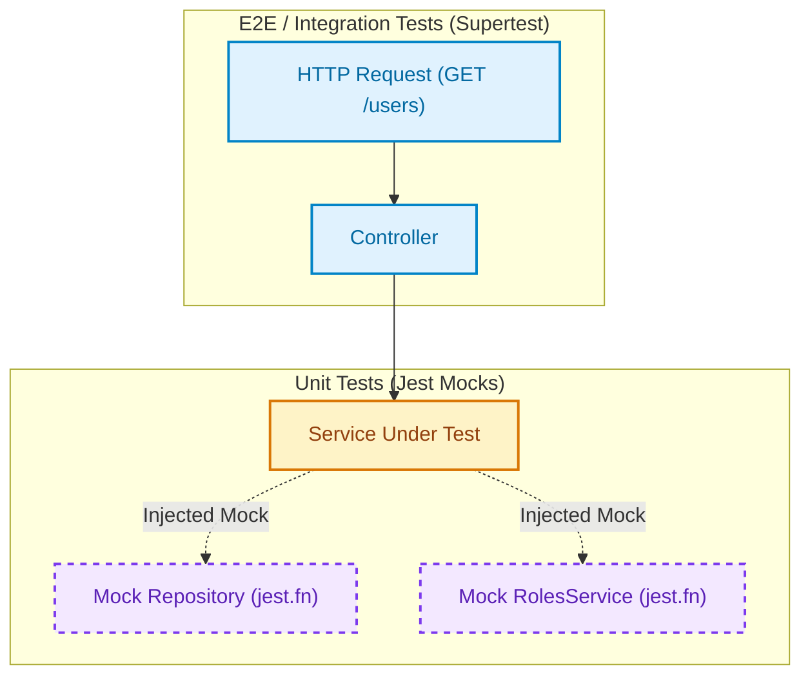

# Testing Guide in NestJS

Automated testing is a core pillar of modern software engineering. In NestJS, its Dependency Injection (DI) based architecture makes isolating, mocking, and verifying components predictable and reproducible.

To follow the practical examples in this guide, you can use the course repository: [Kelocoes/compunet3-20252](https://github.com/Kelocoes/compunet3-20252) on the `main` or `nest/intro` branch.

---

## 1. Foundations and Types of Tests

In the NestJS backend ecosystem, there are two primary test categories:

1. **Unit Tests**: Verify isolated functions, methods, or classes (such as `UsersService` or `UsersController`). All external dependencies (databases, external HTTP services, TypeORM repositories) are replaced with mocks or stubs.
2. **Integration and End-to-End (E2E) Tests**: Evaluate the collaborative execution of multiple application layers (router, interceptors, guards, services, and test database) by emulating real HTTP requests using tools like [Supertest](https://github.com/visionmedia/supertest).



---

## 2. Test Execution Commands with Jest in NestJS

NestJS integrates [Jest](https://jestjs.io/) as its default test runner through scripts preconfigured in `package.json`:

```bash title="Terminal: Key test execution commands"
# 1. Run the entire unit test suite once
npm run test

# 2. Watch mode: automatically re-runs tests on file changes
npm run test:watch

# 3. Run a specific test file or pattern
npm test users.service.spec.ts

# 4. Debug tests with Node inspector
npm run test:debug

# 5. Run the End-to-End integration test suite
npm run test:e2e

# 6. Generate the code coverage report
npm run test:cov
```

---

## 3. Code Coverage Configuration and Metrics

Code coverage measures the proportion of source code executed while running automated test suites.

### Coverage Metrics Reported by Jest

Executing `npm run test:cov` prints a detailed summary table with four key indicators:

- **% Stmts (Statements)**: Percentage of executable programming statements run.
- **% Branch (Branches)**: Percentage of logical conditional paths evaluated (`if`, `else`, ternary operators `? :`, `switch` statements).
- **% Funcs (Functions)**: Percentage of declared functions and class methods invoked.
- **% Lines**: Percentage of physical lines of code traversed.
- **Uncovered Line #s**: Lists exact line numbers or ranges not reached by any test case.

### Jest Configuration and Quality Thresholds (`coverageThreshold`)

Jest configuration is commonly placed in the `"jest"` section of `package.json` or in a dedicated `jest.config.js` file.

To maintain code health and prevent untested code from reaching production, minimum thresholds can be enforced:

```json title="package.json" showLineNumbers
{
  "jest": {
    "moduleFileExtensions": ["js", "json", "ts"],
    "rootDir": "src",
    "testRegex": ".*\\.spec\\.ts$",
    "transform": {
      "^.+\\.(t|j)s$": "ts-jest"
    },
    "collectCoverageFrom": [
      "**/*.(t|j)s",
      "!**/*.module.ts",
      "!main.ts",
      "!**/*.dto.ts",
      "!**/*.entity.ts"
    ],
    "coverageDirectory": "../coverage",
    "testEnvironment": "node",
    "coverageThreshold": {
      "global": {
        "branches": 80,
        "functions": 85,
        "lines": 85,
        "statements": 85
      }
    }
  }
}
```

:::tip[Which files should be excluded from coverage?]
Configuration files, module wiring files (`*.module.ts`), simple DTOs with no executable logic, TypeORM entities, and bootstrap entrypoints (`main.ts`) are typically excluded using negation patterns (`!**/*.entity.ts`) in `collectCoverageFrom`, as they contain no business branching logic and would otherwise skew metrics artificially.
:::

---

## 4. Practical Guide: Unit Testing a Service

In this section, we will implement unit tests for `UsersService`, simulating the TypeORM repository and dependent services using `Test.createTestingModule`.

<StepByStep>

  <Step number="1" title="Configure Test Environment and Mocks">

Create `src/users/users.service.spec.ts`. Define mock objects using Jest mock functions (`jest.fn()`) to emulate database interactions without connecting to a real database engine:

```typescript title="src/users/users.service.spec.ts" showLineNumbers
import { Test, TestingModule } from '@nestjs/testing';
import { getRepositoryToken } from '@nestjs/typeorm';
import { UsersService } from './users.service';
import { RolesService } from '../auth/services/roles.service';
import { User } from './entities/user.entity';

// Mock object simulating TypeORM repository methods
const mockRepository = {
  find: jest.fn(),
  findOne: jest.fn(),
  create: jest.fn(),
  save: jest.fn(),
  update: jest.fn(),
  delete: jest.fn(),
};

// Mock object for auxiliary services
const mockRolesService = {
  findByName: jest.fn(),
};

describe('UsersService', () => {
  let service: UsersService;

  beforeEach(async () => {
    // Reset mock call history before each test case
    jest.clearAllMocks();

    const module: TestingModule = await Test.createTestingModule({
      providers: [
        UsersService,
        {
          provide: RolesService,
          useValue: mockRolesService,
        },
        {
          provide: getRepositoryToken(User),
          useValue: mockRepository,
        },
      ],
    }).compile();

    service = module.get<UsersService>(UsersService);
  });

  it('should be defined and properly instantiated', () => {
    expect(service).toBeDefined();
  });
});
```

  </Step>

  <Step number="2" title="Test User Creation (Success Scenario)">

Verify that when the role exists, the service creates the entity, attaches the role, and persists it via the repository:

```typescript title="src/users/users.service.spec.ts" showLineNumbers
  it('should create a user successfully when role exists', async () => {
    const createUserDto = {
      username: 'kelocoes',
      email: 'kelocoes@icesi.edu.co',
      passwordHash: 'secret_hash_123',
      bio: 'Web Environments Professor',
      roleName: 'admin',
    };

    const mockRole = { id: 1, name: 'admin', description: 'Administrator' };
    const mockCreatedUser = { id: 10, ...createUserDto, role: mockRole };

    // Set expected mock return values
    mockRolesService.findByName.mockResolvedValue(mockRole);
    mockRepository.create.mockReturnValue(mockCreatedUser);
    mockRepository.save.mockResolvedValue(mockCreatedUser);

    const result = await service.create(createUserDto);

    // Interaction assertions
    expect(mockRolesService.findByName).toHaveBeenCalledWith('admin');
    expect(mockRepository.create).toHaveBeenCalledWith({
      ...createUserDto,
      role: mockRole,
    });
    expect(mockRepository.save).toHaveBeenCalledWith(mockCreatedUser);
    expect(result).toEqual(mockCreatedUser);
  });
```

  </Step>

  <Step number="3" title="Test Exception Handling (Failure Scenario)">

Verify that if the specified role does not exist, the service does not persist the user and throws `RoleNotFoundException`:

```typescript title="src/users/users.service.spec.ts" showLineNumbers
  it('should throw RoleNotFoundException if role does not exist', async () => {
    const createUserDto = {
      username: 'invalid_user',
      email: 'user@test.com',
      passwordHash: 'pass123',
      bio: '',
      roleName: 'non_existent_role',
    };

    // Simulate missing role returning null
    mockRolesService.findByName.mockResolvedValue(null);

    // Assert promise rejection with expected exception
    await expect(service.create(createUserDto)).rejects.toThrow();
    expect(mockRepository.save).not.toHaveBeenCalled();
  });
```

  </Step>

  <Step number="4" title="Test Query and Search Methods">

Verify that `findAll()` returns the expected array and that `findOne()` returns the record or throws `UserNotFoundException`:

```typescript title="src/users/users.service.spec.ts" showLineNumbers
  it('should return all registered users', async () => {
    const mockUsers = [
      { id: 1, username: 'user1', email: 'user1@icesi.edu.co' },
      { id: 2, username: 'user2', email: 'user2@icesi.edu.co' },
    ];

    mockRepository.find.mockResolvedValue(mockUsers);

    const result = await service.findAll();

    expect(mockRepository.find).toHaveBeenCalledTimes(1);
    expect(result).toEqual(mockUsers);
  });

  it('should throw UserNotFoundException if user is not found by ID', async () => {
    mockRepository.findOne.mockResolvedValue(null);

    await expect(service.findOne(999)).rejects.toThrow();
    expect(mockRepository.findOne).toHaveBeenCalledWith({ where: { id: 999 } });
  });
```

  </Step>

</StepByStep>

---

## 5. End-to-End (E2E) Integration Testing with Supertest

E2E tests spin up an in-memory NestJS application instance and execute requests against HTTP routes as an external client would.

```typescript title="test/users.e2e-spec.ts" showLineNumbers
import { Test, TestingModule } from '@nestjs/testing';
import { INestApplication } from '@nestjs/common';
import * as request from 'supertest';
import { AppModule } from '../src/app.module';

describe('UsersController (e2e)', () => {
  let app: INestApplication;

  beforeAll(async () => {
    const moduleFixture: TestingModule = await Test.createTestingModule({
      imports: [AppModule],
    }).compile();

    app = moduleFixture.createNestApplication();
    await app.init();
  });

  afterAll(async () => {
    await app.close();
  });

  it('GET /users should return status 200 and an array', async () => {
    const response = await request(app.getHttpServer())
      .get('/users')
      .expect(200);

    expect(Array.isArray(response.body)).toBe(true);
  });

  it('GET /users/:id should return 404 when id does not exist', async () => {
    await request(app.getHttpServer())
      .get('/users/999999')
      .expect(404);
  });
});
```

---

## Self-Assessment Quiz

<Quiz id="dedw-semana6-testing-quiz-en">
  <Question title="What is the main difference between a unit test and an E2E (End-to-End) test?">
    <Option>Unit tests can only be written in JavaScript while E2E tests require TypeScript.</Option>
    <Option correct>Unit tests verify an isolated component by replacing dependencies with mocks, whereas E2E tests verify complete multi-layer flows through real HTTP calls.</Option>
    <Option>Unit tests require a live PostgreSQL database server running.</Option>
    <Option>E2E tests cannot be executed through npm scripts.</Option>
  </Question>

  <Question title="Which NestJS CLI command is used to calculate and display the detailed code coverage report?">
    <Option>npm run test</Option>
    <Option>npm run start:dev</Option>
    <Option correct>npm run test:cov</Option>
    <Option>npm run build</Option>
  </Question>

  <Question title="In a Jest code coverage report, what is measured by the '% Branch' metric?">
    <Option>The number of git branches created in the repository.</Option>
    <Option correct>The percentage of logical decision branches (if, else, switch, ternary operators) evaluated during testing.</Option>
    <Option>The total number of controllers attached to the root module.</Option>
    <Option>The number of dependencies installed under node_modules.</Option>
  </Question>

  <Question title="Which NestJS utility is used to build an in-memory testing module for unit testing?">
    <Option>AppModule.forRoot()</Option>
    <Option>NestFactory.create()</Option>
    <Option correct>Test.createTestingModule()</Option>
    <Option>TypeOrmModule.forFeature()</Option>
  </Question>

  <Question title="How do you obtain the injection token for mocking a TypeORM Repository in Test.createTestingModule?">
    <Option>getToken(Entity)</Option>
    <Option correct>getRepositoryToken(Entity)</Option>
    <Option>provideRepository(Entity)</Option>
    <Option>InjectRepositoryToken()</Option>
  </Question>

  <Question title="Which Jest configuration property in package.json allows setting minimum required coverage thresholds?">
    <Option>coverageDirectory</Option>
    <Option>testMatch</Option>
    <Option correct>coverageThreshold</Option>
    <Option>moduleFileExtensions</Option>
  </Question>

  <Question title="Which library is standardly used with Jest in NestJS for making real HTTP requests during E2E testing?">
    <Option>Axios</Option>
    <Option correct>Supertest</Option>
    <Option>Fetch API</Option>
    <Option>Express Router</Option>
  </Question>

  <Question title="Why is it recommended to exclude files like *.entity.ts or *.dto.ts from Jest coverage collection?">
    <Option>Because Jest does not support files written in TypeScript.</Option>
    <Option>Because they cause tests to fail due to execution timeouts.</Option>
    <Option correct>Because they are declarative schema/type definitions without branching logic that would artificially distort coverage percentages.</Option>
    <Option>Because TypeORM blocks read access to DTO files.</Option>
  </Question>

  <Question title="Which Jest method resets call counts and call histories across all mocks before each test?">
    <Option>jest.resetEnvironment()</Option>
    <Option correct>jest.clearAllMocks()</Option>
    <Option>jest.disableAllMocks()</Option>
    <Option>jest.finish()</Option>
  </Question>

  <Question title="Which npm script executes Jest in interactive watch mode to automatically re-test files on save?">
    <Option>npm run build --watch</Option>
    <Option>npm run test:e2e</Option>
    <Option correct>npm run test:watch</Option>
    <Option>npm run start:prod</Option>
  </Question>
</Quiz>
