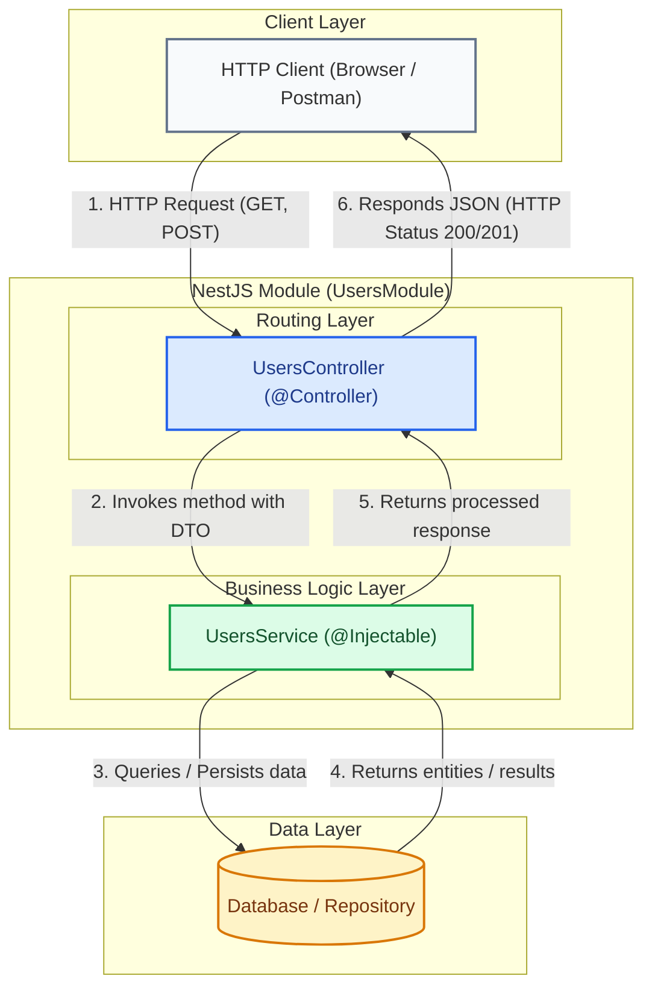

# First Steps with NestJS

NestJS organizes backend applications using a modular structure inspired by enterprise patterns. In this practical guide, you will learn how to install the CLI, instantiate a new project, understand its internal architecture, and build your own modules, controllers, and services.

---

## 1. Architecture and Component Foundations

Before writing code or generating files with the CLI, it is essential to understand how key components interact within a NestJS module:



### Main Component Breakdown:

* **Module (`@Module`)**: The fundamental organizational unit in NestJS. It groups related controllers and providers (services), defining dependency boundaries and enabling a scalable modular architecture.
* **Controller (`@Controller`)**: Responsible for handling external HTTP requests on specific routes (e.g., `/users`), extracting parameters or body payloads, and invoking corresponding service logic.
* **Service (`@Injectable`)**: Contains pure business logic (calculations, transformations, database calls, or third-party service calls). Services are decorated with `@Injectable()` to be automatically injected via NestJS Dependency Injection.

---

## 2. Practical Development Guide (Step-by-Step)

<StepByStep>
  <Step number="1" title="Global installation of NestJS CLI">
    The NestJS CLI (Command Line Interface) automates project creation and component generation following Nest architecture best practices.

    ```bash title="Terminal"
    npm install -g @nestjs/cli
    ```

    :::tip Why use the CLI
    The CLI avoids manual configuration of TypeScript, Webpack/SWC, ESLint, and Jest, while maintaining a clean and standardized structure across projects.
    :::
  </Step>

  <Step number="2" title="Creating the base project">
    Run the `nest new` command to initialize a new project named `my-nest-app`:

    ```bash title="Terminal"
    nest new my-nest-app
    ```

    During execution, the CLI will prompt you to select a package manager. Select `npm` (or `yarn` / `pnpm` based on your preference).
  </Step>

  <Step number="3" title="Inspecting project file structure">
    Navigate to the newly created directory and inspect the generated files:

    ```bash title="Terminal"
    cd my-nest-app
    ```

    The resulting structure is organized as follows:

    ```text title="File structure"
    my-nest-app/
    ├── src/
    │   ├── app.controller.spec.ts  # Unit tests for main controller
    │   ├── app.controller.ts       # Base controller with test route ('/')
    │   ├── app.module.ts           # Root application module
    │   ├── app.service.ts          # Base service with simple methods
    │   └── main.ts                 # Entry point (starts HTTP server)
    ├── test/
    │   └── app.e2e-spec.ts         # End-to-end integration tests
    ├── nest-cli.json               # Nest CLI internal configuration
    ├── package.json                # Dependencies and run scripts
    └── tsconfig.json               # TypeScript compiler configuration
    ```

    Explanation of key files inside `src/`:
    - **`main.ts`**: Uses `NestFactory.create(AppModule)` to instantiate the app and start the server on port 3000 by default.
    - **`app.module.ts`**: Application assembly root where root controllers and providers are registered.
    - **`app.controller.ts`**: Contains basic HTTP handlers (e.g., `GET /`).
    - **`app.service.ts`**: Returns simple responses (such as `"Hello World!"`).
  </Step>

  <Step number="4" title="Running the application in development mode">
    Start the local server in watch mode so it automatically reloads upon saving changes:

    ```bash title="Terminal"
    npm run start:dev
    ```

    Open your browser at `http://localhost:3000` to verify the application responds correctly.

    :::info Changing port in main.ts
    If port 3000 is occupied on your machine, you can modify `src/main.ts`:

    ```typescript title="src/main.ts" showLineNumbers
    import { NestFactory } from '@nestjs/core';
    import { AppModule } from './app.module';

    async function bootstrap() {
      // Instantiate Nest application using root module
      const app = await NestFactory.create(AppModule);
      
      // Set HTTP server listening port (e.g., 3001)
      await app.listen(3001);
    }
    bootstrap();
    ```
    :::
  </Step>

  <Step number="5" title="Modular generation using CLI">
    To build an isolated feature (e.g., user management), generating its three core layers is recommended: Module, Controller, and Service.

    Open a new terminal tab and enter the following commands:

    <Tabs>
      <TabItem value="step-by-step-cmds" label="Individual Commands" default>
        ```bash title="Terminal"
        # 1. Generate users module
        nest generate module users

        # 2. Generate users controller
        nest generate controller users

        # 3. Generate users service
        nest generate service users
        ```
      </TabItem>
      <TabItem value="resource-cmd" label="All-in-One Command (CRUD Resource)">
        ```bash title="Terminal"
        # Generates complete users resource (Module, Controller, Service, DTOs, and Entities)
        nest generate resource users
        ```
      </TabItem>
    </Tabs>

    :::tip CLI Shortcuts
    You can use short command aliases in terminal: `nest g mo users`, `nest g co users`, and `nest g s users`.
    :::
  </Step>

  <Step number="6" title="Implementing Users Code">
    Examine the generated code in `src/users/` and implement basic communication logic between layers:

    ```typescript title="src/users/users.service.ts" showLineNumbers
    import { Injectable } from '@nestjs/common';

    // Decorator marking class as injectable by NestJS IoC container
    @Injectable()
    export class UsersService {
      // Simulated in-memory collection representing data source
      private users = [
        { id: 1, name: 'Alice', email: 'alice@icesi.edu.co' },
        { id: 2, name: 'Bob', email: 'bob@icesi.edu.co' },
      ];

      // Method to return all registered users
      findAll() {
        return this.users;
      }

      // Method to return a specific user by ID
      findOne(id: number) {
        return this.users.find(user => user.id === id);
      }
    }
    ```

    ```typescript title="src/users/users.controller.ts" showLineNumbers
    import { Controller, Get, Param } from '@nestjs/common';
    import { UsersService } from './users.service';

    // Decorator defining base HTTP route '/users' for all requests in this controller
    @Controller('users')
    export class UsersController {
      // Dependency injection: Nest automatically injects UsersService instance
      constructor(private readonly usersService: UsersService) {}

      // Handles HTTP GET requests to '/users'
      @Get()
      getAllUsers() {
        return this.usersService.findAll();
      }

      // Handles HTTP GET requests to '/users/:id'
      @Get(':id')
      getUserById(@Param('id') id: string) {
        // Converts route parameter to number before passing to service
        return this.usersService.findOne(Number(id));
      }
    }
    ```

    ```typescript title="src/users/users.module.ts" showLineNumbers
    import { Module } from '@nestjs/common';
    import { UsersController } from './users.controller';
    import { UsersService } from './users.service';

    // Decorator registering controllers and providers for the module
    @Module({
      controllers: [UsersController],
      providers: [UsersService],
    })
    export class UsersModule {}
    ```
  </Step>
</StepByStep>

---

## 3. Self-Assessment Quiz

<Quiz id="dedw-nest-first-steps-quiz">
  <Question title="What is the main purpose of global command 'npm install -g @nestjs/cli'?">
    <Option>Installing PostgreSQL database locally on your machine.</Option>
    <Option correct>Installing NestJS command-line tool to automate project creation and code generators.</Option>
    <Option>Compiling TypeScript code directly into C++ binary executables.</Option>
    <Option>Creating an Nginx reverse proxy configured with SSL.</Option>
  </Question>
  <Question title="Which CLI command is used to instantiate a new NestJS project named 'my-app'?">
    <Option>nest create my-app</Option>
    <Option>npm init nest-app my-app</Option>
    <Option correct>nest new my-app</Option>
    <Option>nest start my-app --init</Option>
  </Question>
  <Question title="Which file inside 'src/' serves as the entry point and starts the HTTP server?">
    <Option>src/app.module.ts</Option>
    <Option correct>src/main.ts</Option>
    <Option>src/app.controller.ts</Option>
    <Option>src/nest-cli.json</Option>
  </Question>
  <Question title="What is the purpose of 'npm run start:dev' script in a NestJS project?">
    <Option>Running Docker containers in production.</Option>
    <Option correct>Starting application in development mode with automatic reload on code changes.</Option>
    <Option>Compiling application to production without starting the server.</Option>
    <Option>Executing end-to-end integration tests exclusively.</Option>
  </Question>
  <Question title="Which decorator must be added to a service class so NestJS can inject it via Dependency Injection?">
    <Option>@Controller()</Option>
    <Option>@Module()</Option>
    <Option correct>@Injectable()</Option>
    <Option>@Entity()</Option>
  </Question>
  <Question title="What is the short CLI shortcut to generate a users module?">
    <Option>nest g m users</Option>
    <Option correct>nest g mo users</Option>
    <Option>nest make module users</Option>
    <Option>nest add module users</Option>
  </Question>
  <Question title="How is UsersService injected into UsersController?">
    <Option>Making a static import inside HTTP handler method.</Option>
    <Option correct>Declaring a private readonly variable inside controller class constructor.</Option>
    <Option>Using global variable process.env.SERVICE.</Option>
    <Option>Using @InjectService() decorator above class name.</Option>
  </Question>
  <Question title="Which CLI command generates a complete CRUD resource (Module, Controller, Service, DTOs) in a single step?">
    <Option>nest generate crud users</Option>
    <Option correct>nest generate resource users</Option>
    <Option>nest generate api users</Option>
    <Option>nest build resource users</Option>
  </Question>
  <Question title="Which decorator is used on a class to define HTTP routes handled by a controller?">
    <Option>@Route()</Option>
    <Option>@Endpoint()</Option>
    <Option correct>@Controller('route')</Option>
    <Option>@Path()</Option>
  </Question>
  <Question title="What is the role of a Module (@Module) in NestJS architecture?">
    <Option>Executing SQL queries directly to database.</Option>
    <Option correct>Grouping related controllers and providers to structure the application coherently and boundary-defined.</Option>
    <Option>Rendering HTML templates in user browser.</Option>
    <Option>Monitoring RAM usage of virtual machine.</Option>
  </Question>
</Quiz>
