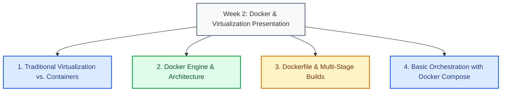

# Presentation Slides of the Week

Official slides for Week 2: **Virtualization vs. Containers, Docker Architecture, Dockerfile (Multi-Stage Builds), Useful Commands, and Introduction to Docker Compose**.

---

## 1. Overview of Slide Contents

The PDF material covers fundamental theoretical and practical concepts discussed during the Week 2 session:

### Key Topics Summary:

* **Traditional Virtualization vs. Containers**: Comparison between Hypervisors (Type 1 and Type 2) and lightweight isolation based on the host OS kernel.
* **Docker Engine Architecture**: Operation of Docker CLI client, Docker Daemon (`dockerd`), and image storage in registries (Docker Hub).
* **Efficient Image Building**: Best practices for creating `Dockerfile` files, cache layer optimization, and using multi-stage builds to minimize final container size.
* **Docker Compose**: Declarative definition of multi-container development environments using `docker-compose.yml` files.

---

## 2. Interactive Presentation Viewer

You can navigate slide-by-slide using the interactive viewer loaded directly from course resources.

<PdfViewer 
  src="/files/computacion-3/semana-1/docker-intro.pdf" 
  totalPages={36} 
  title="Week 2: Virtualization and Containers with Docker"
/>

---

## 3. Self-Assessment Quiz

<Quiz id="dedw-docker-slides-quiz">
  <Question title="What is the primary benefit of using Multi-Stage Builds in a Dockerfile based on the presented material?">
    <Option>Allowing simultaneous execution of multiple Type 1 hypervisors.</Option>
    <Option correct>Separating heavy build environment from final execution environment to achieve much lighter and more secure images.</Option>
    <Option>Replacing docker-compose.yml entirely in production.</Option>
    <Option>Increasing the number of automatically exposed physical network ports.</Option>
  </Question>
  <Question title="Which Docker architecture component listens to CLI requests and manages containers and images?">
    <Option>Bare-metal hypervisor.</Option>
    <Option correct>Docker Daemon (dockerd).</Option>
    <Option>PowerShell/Terminal client.</Option>
    <Option>Docker Hub registry exclusively.</Option>
  </Question>
  <Question title="What does kernel-level isolation used by Docker containers consist of?">
    <Option>Each container virtualizes an independent physical CPU.</Option>
    <Option correct>Containers share the host operating system kernel but use namespaces and cgroups to isolate processes and resources.</Option>
    <Option>Requiring installation of a complete guest OS on every image.</Option>
    <Option>Only possible if host system runs Windows Server 2022.</Option>
  </Question>
  <Question title="Which Dockerfile instruction is used to define intermediate stages in a Multi-Stage build?">
    <Option>FROM &lt;image&gt; BUILDER</Option>
    <Option correct>FROM &lt;image&gt; AS &lt;stage_name&gt;</Option>
    <Option>STAGE &lt;stage_name&gt;</Option>
    <Option>STEP &lt;stage_name&gt;</Option>
  </Question>
  <Question title="What advantage does Docker Compose provide compared to executing manual 'docker run' commands?">
    <Option>Increases physical CPU speed during compilation.</Option>
    <Option correct>Allows defining, configuring, and launching multiple interactive services declaratively using a single YAML file.</Option>
    <Option>Eliminates the need to install Docker Engine on host machine.</Option>
    <Option>Automatically generates NestJS controller source code.</Option>
  </Question>
  <Question title="What happens when an early line in a Dockerfile is modified regarding layer caching?">
    <Option>Cached layers are used without re-compiling anything.</Option>
    <Option correct>Cache is invalidated for that line and all subsequent instructions.</Option>
    <Option>Docker automatically deletes base image from local machine.</Option>
    <Option>All active containers in the system immediately stop.</Option>
  </Question>
  <Question title="Where are official public Docker images like Node.js, Nginx, or PostgreSQL stored and distributed?">
    <Option>On local university server.</Option>
    <Option correct>In a central registry like Docker Hub.</Option>
    <Option>Directly in developer browser.</Option>
    <Option>In project tsconfig.json file.</Option>
  </Question>
  <Question title="Which flag in 'docker run' command maps a host port to a container port?">
    <Option>-v / --volume</Option>
    <Option correct>-p / --publish</Option>
    <Option>-e / --env</Option>
    <Option>-d / --detach</Option>
  </Question>
  <Question title="What is the function of command 'docker compose down'?">
    <Option>Temporarily pausing Docker Daemon execution.</Option>
    <Option correct>Stopping and removing all containers, networks, and volumes created by the application.</Option>
    <Option>Downloading latest version of Docker Desktop.</Option>
    <Option>Compiling TypeScript project into JavaScript source code.</Option>
  </Question>
  <Question title="Why is it recommended to use minimal base images like 'alpine' in production?">
    <Option>Because they contain an integrated Type 2 hypervisor.</Option>
    <Option correct>Because they drastically reduce disk size and security vulnerability surface.</Option>
    <Option>Because they are the only images compatible with macOS operating systems.</Option>
    <Option>Because they prevent containers from requiring RAM memory to run.</Option>
  </Question>
</Quiz>
