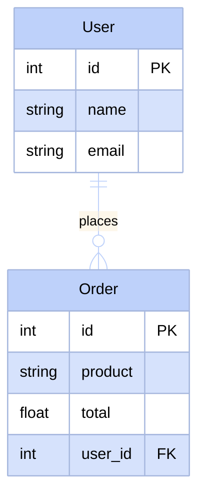
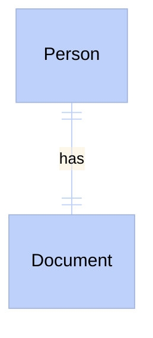
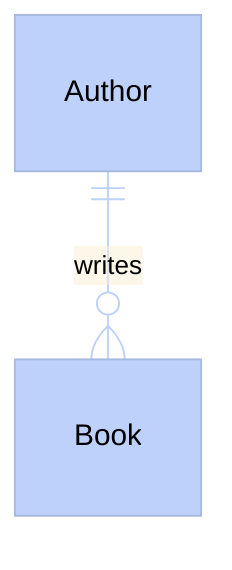
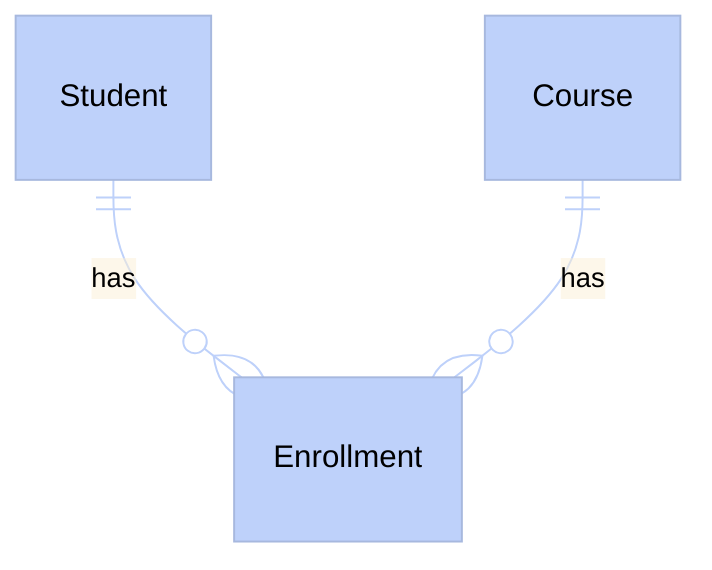

# Relational Databases

A database is the place where web applications store their information so it is not lost when turning off the server. Think of it as a spreadsheet, but much smarter, faster, and with the ability to relate different sheets to each other. This allows us to ask complex questions about the data very efficiently.

## The Table: The Basic Unit

In a relational database, information is organized into **tables**. Each table holds data about a single entity or concept, such as users, products, or orders.

A table is made up of **columns** (the fields or properties) and **rows** (individual records). Each column defines what type of information is saved, while each row represents a specific item.

Look at this example with a users table and an orders table:

**User Table**

| ID | Name | Email |
| -- | ------ | ----- |
| 1 | Ana | ana@mail.com |
| 2 | Luis | luis@mail.com |

**Order Table**

| ID | Product | Total | User_ID |
| -- | -------- | ----- | ---------- |
| 100 | Keyboard | 45.0 | 1 |
| 101 | Mouse | 20.0 | 1 |
| 102 | Monitor | 150.0 | 2 |

## Primary Key and Foreign Key

For tables to relate without confusion, we need a way to uniquely identify each row. This is where keys come in.

:::info
The **Primary Key** (PK) is a unique value that identifies a record within its own table. No two rows can have the same primary key.
:::

:::info
The **Foreign Key** (FK) is a column in a table that references the primary key of another table. It is the bridge connecting the data.
:::

:::tip
Imagine the primary key is like your passport number: it is unique in the world and identifies you. The foreign key is like writing your passport number on a hotel check-in form: the hotel uses that number to refer to you without copying all your personal details.
:::

In our example, Ana has ID 1 in the users table (her primary key). In the orders table, we see that Ana placed orders 100 and 101, because both have a 1 in the `User_ID` column (the foreign key).

## Entity-Relationship (ER) Diagrams

To visualize how our tables connect, we use diagrams. Notice this relationship between User and Order:

In this diagram, the symbols on the line connecting the tables tell the story of their relationship:
- The symbol `||` next to User means "exactly one".
- The symbol `o{` next to Order means "zero or many".
- The entire connection `||--o{` is read as: "a User can place zero or many Orders, but each Order belongs to exactly one User".

## Types of Relationships

Depending on how entities interact in real life, relationships can be of three types:

### 1:1 Relationship (One-to-One)

Occurs when a record in Table A is related to a single record in Table B, and vice versa. A classic example is a person and their national identity document. A person has a single document, and a document belongs to a single person.

### 1:N Relationship (One-to-Many)

This is the most common. A record in Table A can be associated with several in Table B, but those in B only belong to one in A. Like an author writing several books, but each book (in this simple scenario) has a single author.

### N:M Relationship (Many-to-Many)

Occurs when many records in Table A are related to many in Table B. Think of students and courses: a student takes several courses, and a course has several students.

To achieve this in a relational database, we **always** need to create a third table in the middle, known as a bridge or junction table. This new table stores the connections by combining the primary keys of both tables.

## Data Types Supported by Columns

Each column must strictly define what type of information it will store. This helps maintain order and prevent errors. These are the most common types:

- **INT (Integer):** Numbers without decimals. Perfect for ages, quantities, or identifiers.
- **VARCHAR (Variable Text):** Short text strings. Useful for names, last names, or emails.
- **TEXT (Long Text):** For storing large amounts of text, such as blog post content or comments.
- **DATE (Date):** Stores dates. Ideal for birth dates or purchase dates.
- **BOOLEAN (Boolean):** Only accepts true or false. Useful for knowing if a user is active or if an order has been shipped.
- **FLOAT or DECIMAL (Decimals):** Fractional numbers. Essential for product prices or measurements.

## Who Manages All This? RDBMS

Relational databases are managed by specialized programs called Relational Database Management Systems (RDBMS).

There are several popular options in the market. For example, MySQL is very common on the web, and SQLite is great for mobile apps or small projects because it stores everything in a single file.

In this course, we will use **PostgreSQL**. It is a robust, open-source system highly respected in the industry for its reliability and advanced features.

<Quiz id="dedw-relational-dbs-quiz">
  <Question title="What is a Primary Key?">
    <Option>A password to protect the database.</Option>
    <Option correct>A unique value identifying a specific record within its own table.</Option>
    <Option>A column that holds very long text.</Option>
    <Option>The identifier of the server where the database is located.</Option>
  </Question>
  <Question title="What is a Foreign Key?">
    <Option correct>A column that references the primary key of another table to connect data.</Option>
    <Option>A key used by foreign users.</Option>
    <Option>The unique number identifying a row in its own table.</Option>
    <Option>A special data type for decimal numbers.</Option>
  </Question>
  <Question title="In a system where a customer can have multiple addresses, but each address belongs to a single customer, what type of relationship is it?">
    <Option>One-to-One (1:1).</Option>
    <Option correct>One-to-Many (1:N).</Option>
    <Option>Many-to-Many (N:M).</Option>
    <Option>It cannot be related.</Option>
  </Question>
  <Question title="When do you need to create a junction table or bridge table?">
    <Option>When you want to relate two tables in a One-to-One relationship.</Option>
    <Option>To separate long text from integers.</Option>
    <Option>When a table has too many columns.</Option>
    <Option correct>Whenever you need to establish a Many-to-Many relationship between two entities.</Option>
  </Question>
  <Question title="If you need to store the price of a product, which data type is most suitable?">
    <Option>BOOLEAN</Option>
    <Option correct>FLOAT or DECIMAL</Option>
    <Option>INT</Option>
    <Option>VARCHAR</Option>
  </Question>
  <Question title="Which Relational Database Management System (RDBMS) will we primarily use in this course?">
    <Option>MySQL</Option>
    <Option>SQLite</Option>
    <Option correct>PostgreSQL</Option>
    <Option>MongoDB</Option>
  </Question>
  <Question title="What does a row represent in a database table?">
    <Option>The type of data to be saved.</Option>
    <Option>The name of the bridge table.</Option>
    <Option correct>An individual record or specific element of that entity.</Option>
    <Option>The list of all available columns.</Option>
  </Question>
  <Question title="In an ER diagram, what does the symbol ||--o{ between two tables mean?">
    <Option>That no relationship exists between them.</Option>
    <Option correct>That an element in the first table can have zero or many elements in the second.</Option>
    <Option>That exactly one element relates to exactly one other element.</Option>
    <Option>That a junction table is mandatory.</Option>
  </Question>
</Quiz>
